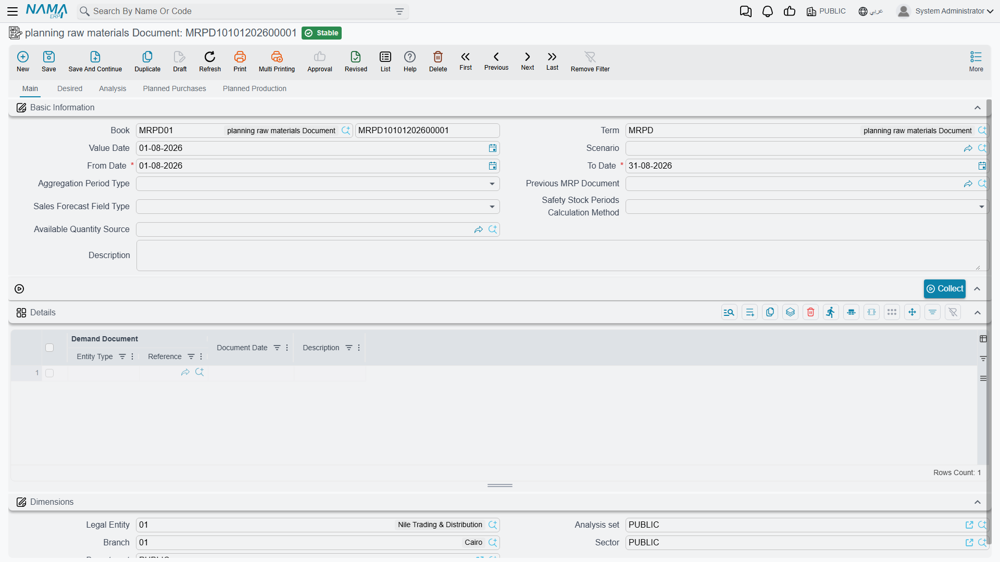

# Material Requirements Planning: Working Out What to Buy and When

## The Question MRP Answers

A customer orders 50 desks for delivery in six weeks. You know what a desk is made of, because the [BOM](/modules/manufacturing/manufacturing-bom) says so: a laminated top panel and a powder-coated steel frame. You also know the panel is made of chipboard and laminate sheet, and the frame of steel tube and powder coat. And you know that steel tube takes three weeks to arrive from your supplier.

So: do you need to order steel tube today, or not? And how much, given that you already have some in the store, some on order, and a safety stock level you would rather not dip below?

That question is easy to get wrong and tedious to get right, and it multiplies. Fifty desks is four component types and one purchase decision. A month's order book across a real product range is thousands of them, each with its own lead time, its own stock position, and its own dependency on something else being made first. **Material Requirements Planning** is the machinery for answering all of them at once.

You'll find the MRP document under **Manufacturing → Material Resource Planning → planning raw materials Document** (التصنيع ← تخطيط موارد ← سند تخطيط).



## How the Calculation Thinks

Underneath all the fields, MRP does one thing repeatedly, and it is worth understanding before you use the screen — because when a result surprises you, it is almost always one of these steps that explains it.

**It starts with demand, and demand comes in two flavours.** *Independent* demand is what the outside world asks for: sales orders, forecasts, manually entered requirements. *Dependent* demand is what the first kind implies — you did not order 200 table legs, but 50 desks means 200 legs, and that is a requirement just as real as the customer's.

**It explodes.** Starting from finished-product demand, it works down the BOM tree level by level, turning each product requirement into component requirements, until it reaches things that are bought rather than made. Fifty desks becomes fifty top panels and fifty frames; fifty frames becomes so many metres of steel tube.

**It nets off what you already have.** A gross requirement for 200 legs is not a purchase order for 200 legs. Subtract what is in stock, subtract what is already on order and due in time, add back whatever safety stock you have decided to protect, and the remainder is the *net* requirement — the amount that genuinely has to be created.

**It works backwards from the date.** This is the part that makes MRP more than a shopping list. If the desks ship in six weeks, the frames must be finished before that, so the steel tube must arrive before *that*, so the purchase order must be raised three weeks earlier still. Lead times turn a quantity into a date, and the date is usually the more actionable half of the answer.

**It rounds to how you actually buy and make.** Net requirements rarely match the sizes the world deals in. Lot sizing applies the real constraints — a fixed batch size, a supplier minimum, or lot-for-lot where you simply take exactly what you need.

::: tip When a result looks wrong, walk the five steps
Nearly every "MRP is telling me nonsense" turns out to be one of these: demand that was not collected, a BOM level that does not explode because a sub-assembly has no BOM, stock netted from a warehouse you did not mean to include, a lead time nobody has maintained, or a lot size rounding a requirement up. Checking them in that order is faster than staring at the result.
:::

## The Pieces in Nama

The **MRP Document** (سند تخطيط) is where all of this happens — one document per planning run, holding the demand it collected, the analysis it performed, and the orders it proposes.

It draws on files you will already recognise, plus a few that exist only for planning:

| Screen | Arabic | What it contributes |
|---|---|---|
| BOM | مكونات منتج | The component structure that gets exploded |
| Routing | عملية تشغيل | The operations, and the manufacturing time they imply |
| Sales Order | أمر بيع | Real customer demand |
| Sales Forecast Document | سند توقعات | Predicted demand, for planning beyond the order book |
| Manual Demand Document | سند طلب يدوي | Requirements entered by hand that no other document carries |

The forecast and manual demand documents deserve a note. Planning only from confirmed sales orders means never ordering anything with a lead time longer than your order visibility — which for most manufacturers means never ordering anything useful in time. Forecasts are how you plan past the edge of what customers have actually committed to, and manual demand is the escape hatch for requirements that are real but have no document of their own.

## Prerequisites

Before using MRP in Nama ERP, ensure the following master data is configured:

### 1. Items Configuration

For each item, configure:
- ✅ **Primary UOM** (Unit of Measure)
- ✅ **Manufacturing Lead Time** (for manufactured items)
- ✅ **Purchase Lead Time** (for purchased items)
- ✅ **Safety Stock** settings
- ✅ **Minimum Order Quantity**
- ✅ **Manufacturable Flag** (check if item can be manufactured)

### 2. Bill of Materials (BOM)

For manufactured items, create BOMs with:
- Component items and quantities
- Batch size (lot size)
- Associated routing
- Specific dimensions (if applicable)
- Default BOM flag

### 3. Routing

For manufactured items, create routings with:
- Operation sequence
- Resources required
- Time estimates
- Associated BOM (optional)

### 4. Warehouses

Configure warehouses with:
- MRP flag enabled (to include in MRP calculations)

### 5. Scenarios (Optional)

Create MRP scenarios for:
- Different planning horizons
- What-if analysis
- Custom available quantity calculations

### 6. Document Terms

Configure MRP document terms with:
- Purchase order book/term
- Production order book/term
- Item request book/term
- MRP purchase request book/term

---

## MRP Document Workflow

The MRP process in Nama ERP follows this workflow:

### Step 1: Create MRP Document

1. Navigate to: **Manufacturing > Material Resource Planning > MRP Document**
2. Click **New** to create a new MRP document
3. Fill in header information:

#### Header Fields

| Field | Arabic Name | Description |
|-------|-------------|-------------|
| **Code** | الكود | Auto-generated document code |
| **Value Date** | التاريخ | Document date |
| **From Date** | من تاريخ | Start date for demand collection |
| **To Date** | إلى تاريخ | End date for demand collection |
| **Aggregation Period Type** | نوع فترة التجميع | How to group requirements (Daily, Weekly, Monthly, Quarterly, Yearly) |
| **Req Qty Method Type** | نوع الحقل المتعامل عليه | For forecasts: use Actual or Forecasted quantities |
| **Scenario** | السيناريو | Optional scenario for what-if analysis |
| **Previous MRP Document** | سند التخطيط السابق | Link to previous MRP run (for rolling planning) |
| **Purchase Doc Type** | نوع مستند الشراء | Type of purchase document to generate (Purchase Order, Item Request, MRP Purchase Request) |
| **Production Doc Type** | نوع مستند الإنتاج | Type of production document to generate (Production Order, Production Order Request) |

::: tip Aggregation Period
The **Aggregation Period Type** determines how demand is grouped:
- **Daily**: Separate requirements for each day
- **Weekly**: Group requirements by week
- **Monthly**: Group requirements by month (recommended for most scenarios)
- **Quarterly**: Group by quarter
- **Yearly**: Group by year
:::

### Step 2: Collect Demand

After filling header information, click the **Collect** button (تجميع).

#### Collect Dialog Parameters

The system will prompt you to select which demand sources to include:

- ☑️ **Include Sales Orders** (تضمين أوامر البيع)
  - Includes confirmed customer orders within the date range

- ☑️ **Include Manual Demands** (تضمين الطلبات اليدوية)
  - Includes manually created demand documents

- ☑️ **Include Forecasts** (تضمين التوقعات)
  - Includes sales forecast documents

::: warning Important
You must select at least one demand source. The system will show an error if none are selected.
:::

#### What Happens During Collection

The system will:
1. Search for demand documents within the specified date range
2. Extract item requirements from each document
3. Populate the **Lines** (التفاصيل) collection with demand sources
4. Create **Required Lines** (الاحتياجات) by aggregating demand according to the aggregation period
5. Calculate available quantities for each item

### Step 3: Review Required Lines

After collection, review the **Required Lines** tab:

#### Required Lines Fields

| Field | Arabic Name | Description |
|-------|-------------|-------------|
| **Item** | الصنف | The item required |
| **Required Qty** | الكمية المطلوبة | Quantity needed |
| **Required On** | مطلوب في | Date when quantity is needed |
| **Dimensions** | الأبعاد | Specific dimensions (warehouse, locator, lot, size, color, etc.) |
| **Total Available** | الإجمالي المتاح | Current inventory quantity |
| **Predicted Purchase** | المشتريات المتوقعة | Expected incoming purchases |
| **Predicted Sales** | المبيعات المتوقعة | Expected outgoing sales |
| **BOM** | مكونات المنتج | Bill of materials to use (if item is manufacturable) |
| **Routing** | عملية التشغيل | Routing to use (if item is manufacturable) |

::: tip Manual Adjustments
You can manually edit:
- **BOM** and **Routing** selections for specific items
- **Edited Net Required** (الاحتياج الصافي المعدل): Override calculated net requirement
- **Edited Batches Count** (عدد الدفعات المعدل): Specify exact number of batches to produce
:::

### Step 4: Analyze Requirements

Click the **Analyze** button (تحليل) to perform MRP explosion.

::: warning Save First
The document must be saved before you can run the analysis.
:::

#### What Happens During Analysis

The system performs these calculations:

1. **For Each Required Line:**
   - Fetches the BOM (if item is manufacturable)
   - Fetches the Routing
   - Calculates available quantity
   - Calculates safety stock
   - Determines net requirement

2. **Net Requirement Calculation:**
   ```
   Net Requirement = Required Qty + Safety Stock - (Available Qty + Potential Available)
   ```

3. **Batch Size Calculation:**
   - If BOM has a batch size, calculates number of batches needed
   - Adjusts net requirement to whole batches
   - Considers minimum order quantities

4. **MRP Explosion:**
   - For manufactured items, explodes BOM to find component requirements
   - Recursively analyzes component requirements (dependent demand)
   - Considers lead times to calculate order dates

5. **Creates Analysis Lines:**
   - One analysis line for each item-period-dimension combination
   - Links parent-child relationships for BOM explosions

### Step 5: Review Analysis Results

After analysis completes, review the **Analysis** (التحليل) tab:

#### Analysis Line Fields

| Field | Arabic Name | Description |
|-------|-------------|-------------|
| **Item** | الصنف | Item being analyzed |
| **Required On** | مطلوب في | Date needed |
| **Order On** | تاريخ الطلب | Date to order (considers lead time) |
| **Required Qty** | الكمية المطلوبة | Gross requirement |
| **Available** | المتاح | Currently available quantity |
| **Potential Available** | المتاح المحتمل | Expected to be available |
| **Safety Stock** | مخزون الأمان | Safety stock requirement |
| **Total Required** | الإجمالي المطلوب | Gross requirement before adjustments |
| **Net Required** | الاحتياج الصافي | Net requirement after considering availability |
| **Net Required After Edit** | الاحتياج الصافي بعد التعديل | Final requirement including manual edits |
| **Batch Size** | حجم الدفعة | Production batch size |
| **Batches Count** | عدد الدفعات | Number of batches to produce |
| **Remaining** | المتبقي | Quantity remaining after fulfilling requirement |
| **BOM** | مكونات المنتج | Bill of materials used |
| **Routing** | عملية التشغيل | Routing used |

::: details Understanding Available Quantities
**Available Quantity** can be calculated from:
- **Current inventory** in MRP-enabled warehouses
- **Previous MRP Document** remaining quantities (for rolling planning)
- **Custom Scenario Query** (if scenario is specified)
- **Available Qty Source Document** (if configured)
:::

### Step 6: Review Planned Orders

The analysis automatically generates planned orders in two tabs:

#### Planned Production Lines (خطوط الإنتاج المخطط)

Contains production orders to be created:

| Field | Description |
|-------|-------------|
| **Selected** | Check to include in document generation |
| **Item** | Item to produce |
| **Quantity** | Quantity to produce |
| **Date** | Production date (considering lead time) |
| **BOM** | Bill of materials to use |
| **Routing** | Routing to use |
| **Warehouse** | Production warehouse |
| **Order Type** | Production Order or Production Order Request |
| **Doc** | Generated document (after generation) |

#### Planned Purchase Lines (خطوط الشراء المخطط)

Contains purchase orders to be created:

| Field | Description |
|-------|-------------|
| **Selected** | Check to include in document generation |
| **Item** | Item to purchase |
| **Quantity** | Quantity to purchase |
| **Date** | Purchase date (considering lead time) |
| **Supplier** | Preferred supplier (if configured) |
| **Warehouse** | Receiving warehouse |
| **Order Type** | Purchase Order, Item Request, or MRP Purchase Request |
| **Doc** | Generated document (after generation) |

::: tip Filtering Planned Lines
Planned lines are separated into:
- **Manufacturable items** → Planned Production Lines
- **Purchased items** → Planned Purchase Lines

Items are classified based on the **Manufacturable** flag on the item master.
:::

### Step 7: Generate Purchase and Production Orders

#### Select Lines to Generate

1. Review planned production and purchase lines
2. Check the **Selected** checkbox for lines you want to generate
3. Use **Select All** buttons to quickly select all lines in a tab

#### Generate Documents

Click one of these action buttons:

- **Generate Production Orders** (إنشاء أوامر إنتاج)
  - Creates production documents from selected production lines
  - One document per line (by default)

- **Generate Purchase Orders** (إنشاء أوامر شراء)
  - Creates purchase documents from selected purchase lines
  - One document per line (by default)

- **Gen Single Purchase Order** (إنشاء أمر شراء واحد)
  - Consolidates all selected purchase lines into one purchase document
  - Groups items by supplier (if configured)

::: warning Document Terms Required
Ensure document terms are properly configured with books for:
- Purchase Order
- Production Order
- Item Request
- MRP Purchase Request
- Production Order Request

The system will show an error if required books/terms are not configured.
:::

#### After Document Generation

- Generated documents are linked in the **Doc** field of each planned line
- Documents are created in draft status (with @ symbol in code)
- You can review and edit generated documents before committing
- The **Selected** checkbox is automatically cleared (if configured)

::: tip Reviewing Generated Documents
Click the document reference in the **Doc** field to open and review the generated document.
:::

---

## Understanding MRP Results

### Reading the Analysis Tab

The analysis tab shows the complete MRP explosion with all levels of BOM:

```
Level 0: Finished Product (from sales orders/forecasts)
    ├─ Level 1: Sub-assembly 1
    │       ├─ Level 2: Component A
    │       └─ Level 2: Component B
    └─ Level 1: Raw Material C
```

**Hierarchical Relationships:**
- **Parent Analysis Line ID**: Links to parent in BOM structure
- **Master Row ID**: Links back to the original required line
- **Parent BOM**: The BOM that generated this requirement

### Net Requirement Calculation Logic

The system calculates net requirements using this logic:

```
1. Start with Gross Requirement (from demand)
2. Add Safety Stock
3. Subtract Available Quantity
4. Subtract Potential Available (incoming purchases/production)
5. Result = Net Requirement (if positive)
```

If the item has a **batch size**:
```
6. Calculate batches needed = CEILING(Net Requirement / Batch Size)
7. Final Net Requirement = Batches Needed × Batch Size
```

If the item has a **minimum order quantity**:
```
8. Final Net Requirement = CEILING(Net Requirement / Min Order Qty) × Min Order Qty
```

### Safety Stock Calculation Methods

Nama ERP supports three safety stock calculation methods:

#### 1. Quantity-Based
- Fixed quantity specified on item master
- Simple and straightforward
- Best for stable demand items

#### 2. Periods Count - Current Period
- Safety stock = Required Qty × Safety Stock Factor
- Example: If required qty = 100 and factor = 1.2, safety stock = 20

#### 3. Periods Count - Next Periods
- Looks ahead at next N periods
- Sums requirements from future periods
- More dynamic, responds to demand patterns

#### 4. Periods Count - Plan Average
- Calculates average demand across all periods
- Multiplies by safety stock factor
- Smooths out demand variability

::: tip Configuring Safety Stock
Configure safety stock method on the Item master:
- **Safety Stock Calculation Type**: Choose the method
- **Safety Stock**: The quantity or factor (depending on method)
- **Order Limit**: Fallback if safety stock is not set
:::

### Understanding Lead Times

Lead times affect the **Order On** date calculation:

```
Order Date = Required Date - Lead Time
```

**For Manufactured Items:**
- Uses **Manufacturing Lead Time** from item master
- Example: Required on March 15, Lead time = 5 days → Order on March 10

**For Purchased Items:**
- Uses **Purchase Lead Time** from item master
- Example: Required on March 15, Lead time = 10 days → Order on March 5

::: warning Lead Time Units
Lead times can be specified in:
- Days
- Weeks
- Months

Ensure the UOM (Unit of Measure) is correctly set on the lead time field.
:::

---

## Generating Production and Purchase Orders

### Document Generation Process

When you click generate buttons, the system:

1. **Validates Configuration**
   - Checks document terms are configured
   - Verifies books have auto-coding enabled
   - Validates required fields

2. **Creates Documents**
   - Instantiates appropriate document type
   - Sets book and term from MRP document term config
   - Copies dimensions from MRP document

3. **Populates Document Lines**
   - For purchase documents: Creates purchase lines from planned lines
   - For production documents: Creates production order with BOM components

4. **Sets Document Details**
   - Value date from planned line date
   - Warehouse from planned line
   - Supplier (for purchase documents)
   - BOM and routing (for production documents)

5. **Commits Documents**
   - Automatically commits documents
   - Links generated documents back to planned lines
   - Updates MRP document status

### Production Order Generation

For each selected production line, the system creates:

**Production Order Header:**
- Item to produce
- Quantity
- BOM and Routing
- Warehouse

**Production Order Components:**
- Exploded from BOM
- Quantities calculated based on production quantity
- Considers yield and potency factors

**Production Order Co-Products:**
- Copied from BOM co-products
- Quantities proportionally calculated

**Production Order Resources:**
- Copied from routing resources
- Time calculated based on quantity

**Production Order Operations:**
- Copied from routing operations
- Sequenced according to routing

### Purchase Order Generation

For each selected purchase line, the system creates:

**Purchase Document Header:**
- Supplier (if specified)
- Warehouse
- Fiscal period

**Purchase Document Lines:**
- Item to purchase
- Quantity
- Value date from planned date
- Price (blank - to be filled manually)

::: tip Consolidating Purchase Orders
Use **Gen Single Purchase Order** to:
- Create one purchase document for multiple items
- Reduce number of purchase orders
- Easier to manage with suppliers

All selected purchase lines will be combined into a single document.
:::

### Handling Generated Documents

After generation:

1. **Review Generated Documents**
   - Click document reference to open
   - Review quantities and dates
   - Add pricing information (for purchases)
   - Verify BOM/routing selection (for production)

2. **Edit if Needed**
   - Documents are created and committed automatically
   - Use "Start Editing" if changes are needed
   - Make adjustments
   - Commit again

3. **Track Generation**
   - Generated documents have **From Doc** pointing to MRP document
   - MRP document tracks generated docs count
   - Can regenerate if needed (previous docs will be deleted if not committed)

::: warning Regeneration Behavior
If you regenerate documents:
- Previously generated documents from this MRP document will be **deleted**
- Only applies to documents that have **From Doc** = this MRP document
- Committed documents in use (with transactions) will cause errors
:::

---

## Advanced Features

### 1. Rolling MRP Planning

Use **Previous MRP Document** to link MRP runs:

**Benefits:**
- Carries forward remaining quantities from previous run
- Supports continuous planning (e.g., monthly MRP runs)
- Avoids double-counting requirements

**Requirements:**
- Previous and current documents must have same **Scenario**
- Previous document's **To Date** must be before current document's **From Date**

**Example:**
```
January MRP: From Date = Jan 1, To Date = Jan 31
February MRP: From Date = Feb 1, To Date = Feb 28, Previous = January MRP

February MRP will start with remaining quantities from January.
```

### 2. Scenario-Based Planning

Create scenarios for:
- Different planning assumptions
- What-if analysis
- Custom availability calculations

**Scenario Features:**
- **Available Quantities Query**: Custom SQL query to calculate available quantities
- **Potential Available Query**: Custom SQL query for potential available
- **Do Not Divide Qty By Batch Size**: Produce entire batch quantity rather than splitting into multiple production orders

::: details Custom Query Format
Scenario queries should return a single numeric value representing the quantity.

Example query:
```sql
SELECT SUM(netQty)
FROM QtyTransLine
WHERE item_id = {itemId}
  AND warehouse_id IN ({warehouseIds})
```

The system will execute this query for each required line, passing item and dimension parameters.
:::

### 3. Available Qty Source Document

Instead of scenario queries, you can create an **MRP Available Qty Source** document:

**Features:**
- Manually specify available quantities per item/warehouse
- Specify whether quantity is "Total Available" or "Predicted Purchase"
- More controlled than scenario queries
- Easier for users to understand and maintain

**Usage:**
1. Create MRP Available Qty Source document
2. Add lines for items with custom available quantities
3. Select this document in MRP Document's **Available Qty Source** field

### 4. Manual Edits to Requirements

Override calculated requirements:

**Edited Net Required** (الاحتياج الصافي المعدل):
- Manually specify exact net requirement
- Overrides all calculations
- Use for special cases or adjustments

**Edited Batches Count** (عدد الدفعات المعدل):
- Specify exact number of batches to produce
- Only works if item has batch size defined
- Cannot be used with Edited Net Required

::: warning Edit Restrictions
- Cannot edit net required if batch size > 0 (use edited batches count instead)
- Cannot edit batches count if batch size = 0 (use edited net required instead)
- Edits are validated on commit
:::

### 5. Merge Planned Lines

Use the **Merge** action to combine planned lines:

**Merging Production Lines:**
1. Select 2 or more planned production lines (same item and order type)
2. Click **Merge** button
3. System combines quantities into first selected line
4. Removes other selected lines

**Requirements:**
- Lines must have same **Item**
- Lines must have same **Order Type**
- At least 2 lines must be selected

::: tip When to Merge
Merge lines when:
- Multiple small requirements for same item
- Consolidating production runs
- Reducing number of production orders
:::

### 6. Dimension Handling in MRP

MRP respects item dimensions during planning:

**Supported Dimensions:**
- Warehouse
- Locator
- Size
- Color
- Lot ID
- Revision ID
- Active Percentage
- Inactive Percentage
- Box/Package
- Measures
- Sub-item
- Serial Number

**Configuration:**
Manufacturing module configuration controls which dimensions are:
- **Considered in BOM/Routing Search**
- **Used as aggregation keys** in MRP planning

Example: If "Size" is enabled in MRP:
- Red chairs and blue chairs are planned separately
- Different BOMs can exist for different sizes
- Requirements are tracked per size

### 7. Period-Based Safety Stock

For items with variable demand:

**Configuration:**
1. Set **Safety Stock Calculation Type** = "Periods Count"
2. Set **Safety Stock** = number of periods or factor
3. Choose calculation method on MRP Document

**Periods Calc Method Options:**

- **Required In Current Period**:
  Safety stock = Current period demand × factor

- **Next Periods**:
  Safety stock = Sum of next N periods' demand

- **Plan Average**:
  Safety stock = (Total demand / Total periods) × factor

::: tip Choosing a Method
- **Current Period**: Best for steady demand
- **Next Periods**: Best for growing demand
- **Plan Average**: Best for fluctuating demand
:::

### 8. Multiple UOM Handling

MRP works with items that have multiple units of measure:

**Unit Used for MRP** (configured in Manufacturing Configuration):
- Base Unit
- Primary UOM
- Secondary UOM

All requirements are converted to this unit for planning, then converted back to item's primary UOM for document generation.

### 9. Handling Recurring Demand

For ongoing production schedules:

**Approach 1: Monthly MRP Runs**
- Run MRP monthly
- Use previous MRP document to carry forward
- Generate orders for next month

**Approach 2: Rolling Forecast**
- Update forecast document regularly
- Rerun MRP with updated forecast
- Adjust planned orders as needed

**Approach 3: Manual Demand**
- Create manual demand documents for regular requirements
- Include in MRP collection
- Suitable for internal consumption patterns

---
## What Makes MRP Work, and What Makes It Fail

MRP has a reputation for being either indispensable or useless depending on the factory, and the difference is not the software. It comes down to a handful of things.

**Master data accuracy is the whole game.** MRP is an amplifier: it takes your BOMs, routings and lead times and multiplies them across every order in the plan. A BOM missing a component does not produce a small error — it produces a confident purchase plan that omits that component every single run, and nobody notices until the line stops. Lead times are the most commonly neglected of the three, because they are entered once at implementation and then never revisited even as suppliers change.

**Demand has to be honest, including the part you cannot confirm.** A plan built only on committed sales orders will always be too late for anything with a long lead time. That is what forecasts are for, and a rough forecast used consistently beats a precise order book used too late.

**Frequency matters more than perfection.** A plan run weekly and reviewed for ten minutes is worth far more than a quarterly plan that somebody agonises over. Rolling planning exists precisely so each run can correct the last one, and the corrections are small when the runs are frequent.

**Review before you generate.** The system proposes orders; it does not know that a supplier is in dispute, that a customer is about to cancel, or that the line is down for maintenance next week. Generating without reading is where MRP earns its bad reputation, and it is entirely avoidable — the analysis lines are there to be read.

Get those right and the eventual test is simple: are you running out of things, and are you sitting on stock you do not need? Both answers should be trending in the right direction. If neither is, the fault will be upstream in the master data, not in the calculation.
