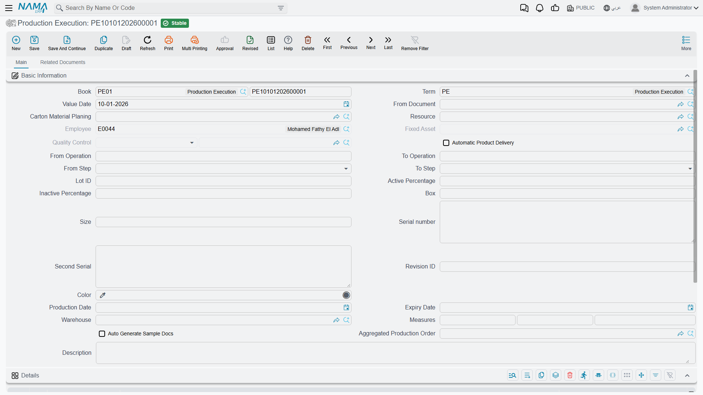

# Production Execution: Recording What Actually Happens

## The Moment of Truth

You've created a production order - that's your plan. Now comes the real work: actually making the products. And as anyone who's worked in manufacturing knows, reality never quite matches the plan. Machines break down, quality finds issues, workers have good days and bad days, materials turn out different than expected.

**Production Execution** (تنفيذ إنتاج) is where you capture what actually happened on the shop floor. It's the truth-telling part of the system - recording the real quantities produced, the actual time taken, the defects found, the materials consumed, and the resources used.

You'll find it under **Manufacturing > Documents > Production Execution** (التصنيع > المستندات > تنفيذ إنتاج).



Think of production execution as the shop floor's voice in the system. It says "here's what we actually accomplished today" - not what the plan said should happen, but what really did happen.

::: info Required license
Production execution is part of the core `manufacturing` license. If the **Manufacturing** menu is missing altogether, that license is not enabled.
:::

## Understanding Operation Steps: The Four States

Before we dive into execution, you need to understand how Nama ERP tracks quantities during manufacturing. This is probably the most important concept to grasp.

At any operation, products can be in one of four states:

### ToMove (للنقل) - The Normal Flow

This is your standard work-in-process. Units are done with this operation and ready to move forward to the next step. Quality has checked them (if required), they passed, and they're good to go.

Most of your production will be in ToMove status - it represents the happy path where everything is going according to plan.

### Rejected (مرفوض) - Needs Rework

Quality found problems. These units didn't pass inspection. But they're not trash - they can be fixed and sent back through earlier operations for rework.

Maybe the paint job is uneven, so they need to go back to sanding and repainting. Maybe a weld is weak and needs to be redone. Rejected status flags these units as "need attention" and tracks them separately from good work-in-process.

### Scrap (تالف) - Beyond Repair

Some defects can't be fixed. The part is cracked, the measurement is way off spec, the material is contaminated. These units move to Scrap status.

Scrap gets written off - it's a loss. The system tracks scrap quantities for cost accounting (you still spent money on those units) and process improvement (high scrap rates indicate problems to investigate).

### Sample (عينة) - Held for Testing

Quality assurance might require you to pull samples for testing - maybe destructive testing, chemical analysis, or long-term performance evaluation. These units move to Sample status.

They're not defective, they're just set aside for testing purposes. Depending on the test results and whether the testing is destructive, they might move back to ToMove (if they can be used after testing) or to Scrap (if the testing destroyed them).

## How Products Move Through Operations

Here's where it gets interesting. Production execution is all about moving quantities from one operation-and-step to another operation-and-step.

### The Normal Forward Flow

Most executions look like this:
```
From: Operation 10, ToMove status, 50 units
To:   Operation 20, ToMove status, 50 units
```

You're saying "I processed 50 units through Operation 10. They passed quality checks. They're now ready to move to Operation 20."

The system updates its tracking: 50 fewer units at Op 10, 50 more units at Op 20. Progress!

### Identifying Defects

Sometimes you find problems at an operation:
```
From: Operation 30, ToMove status, 10 units
To:   Operation 30, Rejected status, 10 units
```

You're not moving forward or backward in operations - you're just changing the status at the current operation. Quality inspector looked at 10 units that were ready to move and said "these have issues." Now they're flagged as rejected.

### Sending Back for Rework

Once units are in Rejected status, you typically send them back to an earlier operation to fix the problem:
```
From: Operation 30, Rejected status, 10 units
To:   Operation 20, ToMove status, 10 units
```

The defective units go back to Operation 20. They'll work through Op 20 and Op 30 again, hopefully coming out good this time.

This is a powerful feature - you can track rework loops, see how much time you're spending on rework, and identify which operations generate the most quality issues.

### Declaring Scrap

When units can't be saved:
```
From: Operation 40, ToMove status, 3 units
To:   Operation 40, Scrap status, 3 units
```

These 3 units are gone. The system will track the scrap cost and generate the appropriate accounting entries.

### Taking Samples

For quality control:
```
From: Operation 50, ToMove status, 5 units
To:   Operation 50, Sample status, 5 units
```

You've pulled 5 units aside for testing. They're still at Operation 50, just flagged differently.

Later, if the samples pass testing and can be used:
```
From: Operation 50, Sample status, 5 units
To:   Operation 50, ToMove status, 5 units
```

Or if the testing was destructive:
```
From: Operation 50, Sample status, 5 units
To:   Operation 50, Scrap status, 5 units
```

## Creating a Production Execution

Let's walk through actually recording shop floor work.

### The Basic Approach

You start a new production execution document and fill in some header information:
- **Book and Term**: Controls numbering and automatic document generation
- **Value Date**: When this work happened
- **From Doc**: If you're executing a single production order, select it here

The moment you select a production order, magic happens. The system looks at where quantities are in that order (using the Production System Entries we mentioned) and creates a first execution line with intelligent defaults.

If you have a default "from operation" and "to operation" set in the header, it uses those. Otherwise, it looks for where work-in-process is waiting and suggests moving it forward.

### Different Ways to Work

There are several ways to create executions, depending on your shop floor workflow:

**Single Order Execution**: Most common. Pick one production order, record work on it. Maybe you're moving units from Operation 10 to Operation 20.

**Batch Work Center Execution**: Your work center processes multiple orders at once. Select an "Aggregated Production Order" that contains multiple production orders. The system creates one execution line per order, all doing the same operation movement. Efficient for batch processing.

**Resource-Based Execution**: Some factories track by resource (machine or work center) rather than by order. Select a resource, and the system helps you find which orders need work at that resource's operations.

**Material Planning Execution**: If you're using Carton Material Planning, you can select the planning document and execute all its orders together.

Pick the approach that matches how your factory operates.

### Filling in the Execution Line Details

Each line in an execution represents work done on one production order. You specify:

**Where you started**:
- From Operation (like "10", "20", "30")
- From Step (ToMove, Rejected, Scrap, or Sample)
- From Date and Time (when work started)

**Where you ended**:
- To Operation (same or different operation number)
- To Step (usually ToMove, but could be any status)
- To Date and Time (when work finished)

**How much**:
- User Quantity (in whatever unit makes sense for this operation - might be pieces, kilograms, meters, etc.)
- The system converts this to the order's base UOM if needed

**Resources used** (optional):
- Which employee or machine did the work

The system is smart about suggestions. When you select "from operation", it queries the Production System Entry to see how many units are available in that operation-and-step. It pre-fills the quantity with what's available. You can accept it or adjust it.

### Time Tracking

You can record start and end times for the work. This serves several purposes:

**Labor costing**: How many hours did workers spend on this order?

**Scheduling**: How long did this operation actually take? Is it matching the standard times in the routing?

**Capacity planning**: Are we running faster or slower than expected?

The system can even help calculate the end time. If the routing says Operation 20 takes 30 minutes per unit and you're processing 10 units, it suggests an end time of 5 hours from the start time (30 min × 10 units = 300 minutes = 5 hours).

Of course, you can override this with actual times if you tracked them more precisely.

### Auto-Delivery: Finishing Production Automatically

Here's a really nice feature. If you set "Auto Delivery" to true in the header, the system watches for executions that complete the final operation.

When it sees an execution moving units from the last operation to ToMove status, it automatically:
1. Creates a Product Delivery document
2. Receives the finished goods into inventory
3. Applies all the lot numbers, serial numbers, and dimensional attributes from the execution
4. Delivers to the warehouse and location you specified
5. Handles co-products if your production order has any

This eliminates a manual step and ensures that as soon as production is done, finished goods are available in inventory.

## What Happens When You Commit an Execution

When you save and commit a production execution, several things happen automatically (depending on your configuration):

### Material Issues are Generated

If components are configured to be issued "Auto with Execution", the system creates Material Issue documents. It looks at which components should be consumed at the operations you just executed and creates issues for them.

For example, if you moved 50 units through Operation 20 and Operation 20 consumes 2 screws per unit, the system issues 100 screws from inventory to the production order.

This keeps materials flowing without manual intervention.

### Resource Vouchers Record Time

The time and resources you recorded get documented in Resource Vouchers. These track labor hours and machine hours for cost accounting.

If you recorded that Employee John worked 4 hours on this execution, a resource voucher captures that, links it to the production order, and feeds it into the costing system.

### Mold Usage is Tracked

If operations use molds or tooling, Mold Vouchers are created to track usage. This helps with mold maintenance scheduling and cost allocation.

### Quality Documents are Created

If operations have quality checklists attached, the system generates Quality Control or Quality Assurance documents. Quality inspectors must fill these out, recording measurements and pass/fail results.

You can even configure that production can't continue until quality approves these documents. The system enforces your quality gates.

### Sample Documents

If "Auto Gen Sample Docs" is enabled and you moved quantities to Sample status, the system creates Sample Documents to track what samples were taken and for what purpose.

### The Big One: Product Deliveries

As mentioned, with Auto Delivery enabled, completing the final operation triggers automatic receipt of finished goods into inventory.

All of this happens automatically because you configured it in the document term settings. You control what gets auto-generated and what you handle manually.

### Production System Entries Update

Behind all these documents, the core tracking updates. The Production System Entry for this production order shows:
- Decreased quantities at the "from" operation-and-step
- Increased quantities at the "to" operation-and-step

This is real-time. Other users looking at the production order immediately see the updated status.

## Common Scenarios

Let's see how this works in practice.

### Scenario 1: Smooth Production

You're making 100 widgets. Everything goes well:

**Execution 1**:
```
From: Op 10 (Cutting), ToMove, 100 units
To:   Op 20 (Assembly), ToMove, 100 units
Time: 8:00 AM to 10:00 AM
Worker: Ahmed
```

System creates material issue for components used in cutting, records 2 hours of labor from Ahmed.

**Execution 2**:
```
From: Op 20 (Assembly), ToMove, 100 units
To:   Op 30 (Painting), ToMove, 100 units
Time: 10:30 AM to 2:00 PM
Worker: Fatima
```

Material issue for assembly components, 3.5 hours of labor from Fatima.

**Execution 3**:
```
From: Op 30 (Painting), ToMove, 100 units
To:   Op 40 (Final QC), ToMove, 100 units
Time: 2:30 PM to 4:00 PM
Worker: Mohammed
```

**Execution 4**:
```
From: Op 40 (Final QC), ToMove, 100 units
To:   [Last operation complete, ToMove status]
Time: 4:15 PM to 5:00 PM
Worker: Sara
```

Since this is the last operation and Auto Delivery is enabled, the system automatically creates a Product Delivery, receiving all 100 widgets into finished goods inventory.

Done! Clean production run with full traceability of who did what, when, and with which materials.

### Scenario 2: Quality Issues and Rework

You're making 100 widgets, but quality finds problems:

**Execution 1**: Cut 100 units successfully
```
From: Op 10 (Cutting), ToMove, 100 units
To:   Op 20 (Assembly), ToMove, 100 units
```

**Execution 2**: Assemble units
```
From: Op 20 (Assembly), ToMove, 100 units
To:   Op 30 (Painting), ToMove, 100 units
```

**Execution 3**: Paint inspection finds 15 units with defects
```
From: Op 30 (Painting), ToMove, 15 units
To:   Op 30 (Painting), Rejected, 15 units
```

**Execution 4**: Good units continue
```
From: Op 30 (Painting), ToMove, 85 units
To:   Op 40 (Final QC), ToMove, 85 units
```

**Execution 5**: Send defective units back for rework
```
From: Op 30 (Painting), Rejected, 15 units
To:   Op 20 (Assembly), ToMove, 15 units
```

The 15 units go back to assembly (maybe the paint didn't stick because assembly left residue on the surface).

**Execution 6**: Rework the 15 units through assembly
```
From: Op 20 (Assembly), ToMove, 15 units
To:   Op 30 (Painting), ToMove, 15 units
```

**Execution 7**: Repaint them
```
From: Op 30 (Painting), ToMove, 15 units
To:   Op 40 (Final QC), ToMove, 15 units
```

Now all 100 units are at Op 40. The rework loop is visible in the system - you can see that 15 units went through assembly and painting twice. Great data for process improvement.

### Scenario 3: Partial Scrap and Samples

Production with complications:

**Execution 1**: Start production of 100 units
```
From: Op 10 (Machining), ToMove, 100 units
To:   Op 20 (Grinding), ToMove, 100 units
```

**Execution 2**: At grinding, 3 units crack (material defect)
```
From: Op 20 (Grinding), ToMove, 3 units
To:   Op 20 (Grinding), Scrap, 3 units
```

**Execution 3**: Take 2 samples for destructive testing
```
From: Op 20 (Grinding), ToMove, 2 units
To:   Op 20 (Grinding), Sample, 2 units
```

**Execution 4**: Move the good 95 units forward
```
From: Op 20 (Grinding), ToMove, 95 units
To:   Op 30 (Heat Treatment), ToMove, 95 units
```

**Execution 5**: Samples are tested (destructive)
```
From: Op 20 (Grinding), Sample, 2 units
To:   Op 20 (Grinding), Scrap, 2 units
```

**Execution 6**: Continue with the 95 units through remaining operations

Final result: 95 good units delivered, 5 units scrapped (3 from defects, 2 from testing). System tracked exactly what happened and why.

### Scenario 4: Over-Production

Sometimes yields are better than expected:

Your order is for 100 units. Because you expect some scrap, you started with 110 units of raw material.

**Execution 1**: Cut 110 pieces (permitted over-completion at first operation)
```
From: Op 10 (Cutting), ToMove, 110 units
To:   Op 20 (Assembly), ToMove, 110 units
```

**Execution 2**: Assembly goes surprisingly well, only 2 scrapped
```
From: Op 20 (Assembly), ToMove, 2 units
To:   Op 20 (Assembly), Scrap, 2 units

From: Op 20 (Assembly), ToMove, 108 units
To:   Op 30 (Finishing), ToMove, 108 units
```

**Execution 3**: Finishing also goes well, no losses
```
From: Op 30 (Finishing), ToMove, 108 units
To:   [Last operation]
```

The order was for 100, but you produced 108. If your permitted percentage allows this (say, 10% over-completion), the system accepts it. You deliver 108 units.

Now you have extra inventory - bonus! The costing system will account for this properly when you close the order.

### Scenario 5: One Step Keeps Producing Past the Order

Some lines do not produce in one neat pass. A corrugator is the classic case: the order says 1,000 sheets, but the machine runs the order several times through the shift, and nobody knows the final count until the last run is over. Each run is its own production execution, and together they end up well above 1,000.

Every execution moves quantity *out of* one operation-and-step and *into* another, and a step can only give what it holds. Operation 1 starts with the order quantity (1,000) and nothing more. After the first execution moves all 1,000 to operation 10, operation 1 holds zero, and the next execution out of it is refused, even for 10 sheets:

*The quantity of operation {0} step {4} in production order {1} does not have enough quantity, you are trying to move {2} while the available is {3}*

With **Use Production Movement System Entry** switched on, the same situation reads:

*The document {0} will lead to negative quantity for order {1}, operation {2}*

Neither message has an Arabic translation, so both appear in English on Arabic screens too.

::: warning The tolerance fields do not lift this limit
**Permitted Percentage** and **Unlimited Overcompletion** only compare a line's **To Qty** with its own quantity: move 1,000 out, report 1,300 arriving. They say nothing about how much the "from" step holds, so ticking them does not help a second execution that has nothing left to move.
:::

There are two ways to record the extra output:

1. **One execution, with the real output in To Qty.** If the whole run is recorded in one execution, move the 1,000 and enter the real figure in **To Qty**. With **Unlimited Overcompletion For Operation 1** ticked on the order, any figure is accepted. **To Qty** only appears on the execution when **Use To Quantity In Execution** is on in the manufacturing configuration.
2. **Several executions against a step that may run dry.** Tick **Allow Negative Quantity For Operation 1** on the production order, or **Allow Negative Quantity** on the order's routing line for a later step. That step then lets executions move out more than it holds. Its balance stops at zero instead of going negative, so it never shows a quantity that does not exist, and the steps downstream receive everything that was recorded.

The flag covers every state of the step (to move, rejected, scrap and sample), and it only works with **Use Production Movement System Entry** switched on. Saving an order with either flag ticked while that setting is off is refused (see [Production Orders](/modules/manufacturing/production-orders#Messages-you-may-see)).

::: tip Switching the setting on for orders already in progress
**Use Production Movement System Entry** records one movement per document and rebuilds each step's balance from them. Orders that were already running before the switch have no movements yet. Select their executions in the Production Execution list and use **More → Recreate Quantity Movements**, which rebuilds the movements of every order those executions touch. The same **Recreate Quantity Movements** (إعادة إنشاء حركات الكميات) sits in the **More** menu of the Production Order, Product Delivery, Product Return, Scrap Receipt and Production Sample Document screens and lists, and works the same way from any of them: it takes the selected documents (or the open one), skips any that were never saved and committed, and rebuilds the movements of every production order they belong to.
:::

The flags are copied down like the tolerance fields: set **Allow Negative Quantity** on a standard operation or a routing line, and **Allow Negative Quantity For Operation 1** on a routing, and orders built from them start with the flags already ticked.

## Configuration That Matters

A few settings control how execution works:

### Document Term Configuration

The term you select on the execution controls:
- Which documents get auto-generated (material issues, resource vouchers, product deliveries, etc.)
- Whether approvals are required for those generated documents
- Default "Auto Delivery" setting
- Whether to delete auto-generated documents when you delete the execution

Get these settings right, and the system does a lot of heavy lifting for you.

### Manufacturing Configuration

Module-wide settings like:
- **Subtract Lines Quantities From Operation Calculated Quantities**: When suggesting quantities to move, should the system subtract quantities already entered in other lines of the same execution? Useful to prevent accidentally moving the same units twice in one document.

- **Do Not Suggest From Time**: Some shops don't want the system pre-filling start times - they want to enter them manually for accuracy.

- **Use Production Movement System Entry**: Records every quantity movement as its own entry and rebuilds each step's balance from them in date order. Needed for **Allow Negative Quantity** (see Scenario 5).

### Production Order Term Configuration

Settings on the production order itself affect execution:
- **Cost Per Batch**: If enabled, costs are tracked separately for each lot/batch. Execution must specify lot numbers.

## Getting Good Results From Execution

The single most useful habit is recording work **as it happens**, or at least operation by operation, rather than saving it all for the end of a shift. Real-time execution data is what lets a manager see where an order is without walking the floor, and it is what makes a problem traceable to the step and the hour it occurred.

Where a final operation delivers finished goods, let **Automatic Product Delivery** do it. A manual delivery document for something the system can raise by itself is data entry with no informational content, and every hand-keyed document is a chance to key it wrong.

Quality steps deserve the same seriousness. If an operation carries a checklist, filling it in is the point — skipped inspections do not make problems go away, they move them downstream to where they cost more. And the rejection data those checks produce is worth reading: an operation that consistently rejects 15% is telling you something specific about tooling, training or incoming material quality, and the execution record is what points at which.

Actual times are worth capturing for the same reason. Routing estimates only improve if somebody knows how long operations really take.

Finally, execution is only as good as the people entering it. The four states — ToMove, Rejected, Scrap and Sample — are the concepts that matter most, and a shop floor that is fuzzy about which one applies produces data nobody can trust.

::: warning Quality gates can block execution
Where the document term requires quality approval and the operation carries a checklist, execution may be held until the quality documents are approved. Plan the approval step into the flow rather than discovering it mid-shift.
:::

::: tip Next step: closing
Once production is complete and executions are recorded, closing the order finalises its costs. See [Production Costing and Order Closing](/modules/manufacturing/production-costing).
:::
