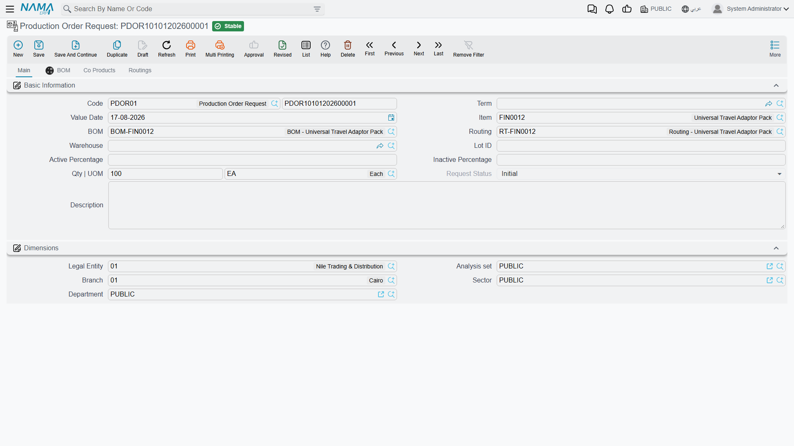

# Production Order Requests: Asking for Something to Be Made

## Who Gets to Start a Job

In a small workshop the person who decides what to make is the person who makes it, and a [production order](/modules/manufacturing/production-orders) raised directly is the whole story.

Most factories are not like that. Sales wants 100 travel adaptor packs for a customer who has just committed. The warehouse notices a finished-goods line running thin. Planning is the department that decides whether either of those becomes a job, when, and in what quantity — because planning is the one that knows what the line is already committed to.

The **Production Order Request** (طلب أمر إنتاج) is how that separation is expressed. It lets anyone ask for something to be made without letting everyone create work for the factory.

You'll find it under **Manufacturing → Documents → Production Order Request** (التصنيع ← المستندات ← طلب أمر إنتاج).

## The Screen Is Deliberately Small

Compare this screen to a production order and the difference is the point. The order has ten attachment slots, planned and actual dates, cost reallocation, QC checklists, lot tracking. The request has barely a dozen fields.

That is because a request is not a small production order — it is a *question*. What, how many, and by when. The answers that turn it into a job are planning's to give, not the requester's.

**Code** carries the book (`PDOR01`) and the document number. **Term** and **Value Date** work as on any document.

**Item** is what is being asked for — the Universal Travel Adaptor Pack in the example.

**Qty | UOM** is how many: 100 EA.

**BOM** and **Routing** name which recipe and which method should be used. Both default from the item, and in the ordinary case you leave them alone. They are there for the situation where the requester knows something the default does not — a customer who has specified the reduced-material variant, say.

**Warehouse** is where the finished units should end up. **Lot ID**, **Active Percentage** and **Inactive Percentage** carry item dimensions where they apply. **Description** is where a requester explains *why*, and it is the field most worth filling in — planning is about to make a judgement call, and context is what makes that call a good one.

The **Dimensions** section places the request in the organisation.

## Request Status

**Request Status** shows `Initial` in the example, and the field is not editable on the screen. That is deliberate: the status reflects what has happened to the request, and it is moved by the act of processing the request rather than by someone typing into it.

A request starts at Initial — asked for, not yet acted on. It moves on as production orders get created against it. What you get from that is a straightforward answer to a question that is otherwise surprisingly hard to answer in a busy factory: *what has been asked for that nobody has started yet?* Filter the list view by status and you have your backlog.

::: tip The request list is a planning queue, not an archive
The value of this document is almost entirely in the list view rather than the individual record. A request sitting at Initial for three weeks is a signal — either the factory is overcommitted or somebody asked for something nobody intends to make. Both are worth knowing, and neither shows up if you only ever open requests one at a time.
:::

## The BOM, Co Products and Routings Tabs

Three tabs sit alongside **Main**, and they mirror the same tabs on the production order:

- **BOM** shows the components the request would consume, exploded from the named bill of materials.
- **Co Products** covers products that come out of the same run — the joint outputs where making one thing inevitably makes another.
- **Routings** shows the operations the product would go through.

On a request these are informational: they let the requester and the planner see what the ask actually implies before anyone commits the factory to it. A request for 100 units that turns out to need a component with a six-week lead time is much better discovered here than on the shop floor.

## From Request to Order

When planning decides to go ahead, a production order is created against the request. The order carries a **Production Order Request** field in its header that points back — so the job knows what prompted it, and the request knows what became of it.

That two-way link is what makes the request worth raising at all. Without it you have a job with no stated reason and a request with no visible outcome; with it, you can walk from a customer's demand through to the units that satisfied it, and back again when someone asks why the line spent a fortnight on travel adaptors.
