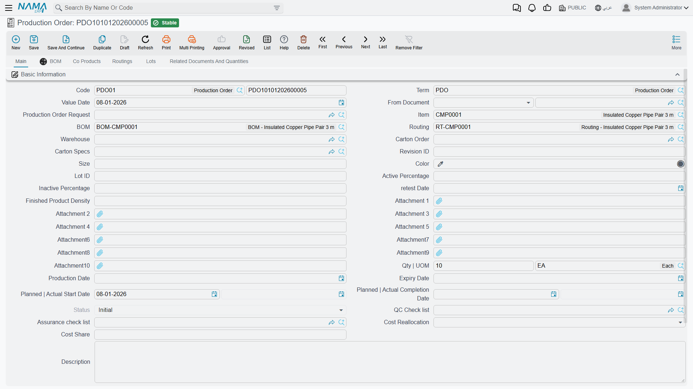
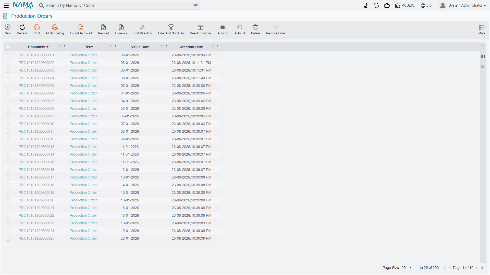
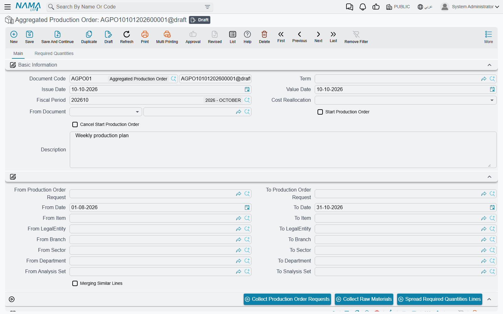

# Production Orders: Planning What to Make

## What is a Production Order?

A Production Order (أمر إنتاج) is your formal instruction to the factory: "Make this product, in this quantity, by this date." It's the bridge between planning and execution - where you take all your preparation (BOMs, routings, work centers) and turn them into a concrete plan that the shop floor can work from.

You'll find production orders under **Manufacturing > Documents > Production Order** (التصنيع > المستندات > أمر إنتاج).

The list view is where you see the whole picture — every order, its status and its quantities in one place.

Think of a production order as a work packet that contains everything needed for manufacturing:
- What product to make
- How many units
- Which materials to use (from the BOM)
- Which steps to follow (from the routing)
- When to start and finish
- Who can do the work
- Quality standards to meet

The beauty is that most of this information is automatically filled in based on your master data. You select a product and quantity, and the system does the heavy lifting of calculating materials, operations, and resources.

::: info Required license
Production orders and aggregated production orders are part of the core `manufacturing` license. If the **Manufacturing** menu is missing altogether, that license is not enabled.
:::

## Creating Your First Production Order

Let's walk through actually creating a production order to see how it all comes together.

### The Basics

You start by opening a new production order and filling in the essentials:
- **Book and Term**: These control document numbering and behavior (like which documents get auto-generated)
- **Product (Item)**: What you're going to make
- **Quantity**: How many units
- **Dates**: When you plan to start and when it should be done

The moment you select a product, something interesting happens. The system looks for the product's default BOM and Routing. If they exist, it automatically loads them into the order. You can always change to a different BOM or routing if needed - maybe you have multiple recipes for the same product, or different production methods.

### The Magic of Auto-Population

Once you've selected your BOM and routing, the system springs into action. It:

**Calculates all component quantities**. If your BOM says you need 2 screws per widget and you're making 100 widgets, you need 200 screws. But it gets smarter - if the BOM accounts for 5% scrap during production, it adds that in. If you have a yield factor (maybe only 95% of components make it through successfully), it adjusts for that too.

**Copies all routing operations**. Every operation from the routing becomes a line in your production order, with sequence numbers (10, 20, 30...). Each operation knows which work center to use, how long it should take, and what resources (labor or machines) are needed.

**Brings in resource requirements**. If an operation needs a specific machine or skilled worker, that gets added to the order automatically.

**Includes any molds or tooling** needed for the operations.

The calculation is based on the actual order quantity versus the BOM base quantity. So if your BOM is defined for making 1 unit but you're making 100, everything scales proportionally.

### Before You Start Production

At this stage, your production order is in "Initial" status. It's a plan, not yet an instruction to begin work. This gives you time to:

**Review the component list**. Maybe you need to substitute a material because the preferred one isn't available. You can change component items, quantities, or specify which lots to use.

**Adjust operation sequences**. In rare cases, you might need to modify the routing for this specific order - maybe skip an operation, or change the work center.

**Check resource availability**. If a critical machine is down for maintenance, you might need to reschedule.

**Verify dates**. The system can help calculate realistic completion dates based on operation durations and the quantity you're making.

When you're satisfied with the plan, you **Start** the production order. This changes its status from "Initial" to "In Progress" and locks down the BOM and routing structure. You can still adjust some things (like dates or dimensional attributes), but the fundamental structure is fixed. This ensures traceability - you can always look back and see exactly what the order called for.

## Understanding the Production Order Structure

A production order isn't just a simple document - it's actually quite rich with information across several areas. Let's break down what's in there.

### The Header

The header contains overall order information:

**Product Definition**: Which item you're making, how many, and any specific attributes like lot numbers, serial numbers, colors, sizes, or revisions. If you're making a blue widget size Large with lot number 2024-001, all that gets tracked here.

**BOM and Routing References**: Links to the master BOM and routing you're using. The system makes copies of these into the order details, but maintains the reference to the originals for reporting.

**Schedule**: Planned start and finish dates, plus actual start and finish dates (filled in as production progresses).

**Status**: Initial, In Progress, Closed, or Terminated. This drives what you can and can't do with the order.

**Quality**: References to quality checklists and assurance requirements.

**Source**: If this order came from somewhere else (like an MRP run or a production request), that link is maintained.

### Component Details

This collection shows every material you need to consume. Each line includes:

- Which component item
- How much you need
- At which operation it gets consumed (important for operation-by-operation material issuing)
- How it should be issued (manually, automatically with the BOM, or automatically as operations are executed)
- Specific dimensional details (lot, serial, location in warehouse)
- Any yield or potency adjustments

When materials are actually issued during production, the system creates Material Issue documents and links them back to these component lines.

### Co-Products

Some manufacturing processes create multiple outputs. When you process crude oil, you get gasoline, diesel, and other products. When you butcher meat, you get various cuts and by-products.

The co-products collection tracks these secondary outputs. Each co-product line includes:
- The item being produced
- Expected quantity
- Whether it's a valuable co-product or just a by-product
- What percentage of the total cost it should bear
- Where to deliver it (warehouse and location)

### Routing Operations

This is your step-by-step manufacturing process. Each operation line has:

**Operation Sequence**: Usually numbered 10, 20, 30, 40... (leaving gaps makes it easy to insert new operations if needed).

**Operation Description**: What work gets done - "Cut material", "Weld joints", "Paint finish", "Quality inspection".

**Work Center**: Where it happens - maybe "Cutting Machine 1" or "Assembly Line B".

**Time Estimates**: How long the operation takes. This can be split into setup time (one-time prep) and run time (time per unit). The system uses this for scheduling and capacity planning.

**Quantity Flow**: How many units pass through this operation. Sometimes you lose a few units along the way due to scrap or samples.

**Over-Production Controls**: You can set limits on how much over-production is allowed. Maybe the final operation can only produce 5% more than ordered, but the first operation (cutting raw materials) can have unlimited over-completion because you want to account for downstream losses.

**Quality Requirements**: Links to inspection checklists. Quality staff must complete these before the operation is considered done.

**Parallel Manufacturing**: A flag indicating if multiple work centers can do this operation simultaneously to increase throughput.

### Resource Requirements

For each operation, you might need various resources - people or machines. Each resource line specifies:

- Which resource (Labor Class A, CNC Machine #3, Forklift, etc.)
- How much (maybe 2 workers, or 1 machine)
- The basis (fixed time regardless of quantity, time per unit, or time per batch)
- Whether it's automatically charged to the order or needs manual confirmation

This data feeds into capacity planning (are we overloading any resources?) and cost accounting (how much labor and machine time did this order consume?).

### Molds and Tooling

Some manufacturing - like injection molding or die casting - requires special tooling. The molds collection tracks which molds are needed for which operations. This helps with:
- Ensuring molds are available before starting production
- Tracking mold usage for maintenance scheduling
- Costing mold usage charges to products

## The Production Order Lifecycle

Let's follow a production order from birth to completion.

### Creation

Production orders can come into existence several ways:

**Manual Creation**: You simply create a new order, pick a product, enter a quantity. This is common for make-to-order scenarios or when responding to specific customer requests.

**From MRP**: If you're running Material Requirements Planning, the system analyzes demand (from sales orders, forecasts, etc.) and automatically generates proposed production orders. You review these proposals and convert them to actual orders.

**From Production Requests**: Some companies like a two-step process - planners create Production Order Requests (proposals), they go through an approval workflow, then approved requests are converted to actual Production Orders.

**From Aggregated Orders**: You might collect multiple small requirements and batch them into an aggregated order, then generate individual production orders from it.

However they're created, they all follow the same lifecycle after that.

### BOM Explosion

When you select a BOM, the system performs "BOM explosion" - it breaks down the product structure into actual material requirements.

For a simple product, this is straightforward. For complex assemblies with sub-assemblies, it gets interesting. The system can explode multiple levels. If you're making a car:
- The car needs an engine (level 1)
- The engine needs a crankshaft (level 2)
- The crankshaft needs special steel (level 3)

The system cascades through all levels, calculating total raw material needs.

It also handles tricky scenarios like:
- **Scrap factors**: If you expect to waste 10% of material during cutting, it adds 10% more to the requirement.
- **Yield factors**: If only 95% of components pass quality control, it adjusts quantities to ensure you end up with the right amount of good parts.
- **Phantoms**: Sometimes you have "phantom" sub-assemblies that exist in the BOM for engineering purposes but are never actually stocked - they're assembled and immediately used. The system handles these seamlessly.

### Lot Collection and Material Staging

Before production can start, you need to identify which actual inventory you'll use. If you track by lot numbers (common in food, pharma, chemicals), this is critical for traceability.

The components tab carries two buttons for this. **Collect Lots** (تجميع الشحنات) fills in lot numbers on the component lines from the stock available in the header's warehouse and locator; it first asks whether to clear the lots already on the lines. **Create Reservation Document For Quantities** (إنشاء سند حجز للكميات) opens a new **Reservation Document** in a pop-up, already filled with one line per component — item, quantity, dimensions and dates — so you can save it and hold that stock for this order. The order must be saved before this second button works.

You might also create Material Issues at this stage to physically move materials from the warehouse to the shop floor, ready for production. Or you might wait and issue materials as each operation needs them. It depends on your factory's workflow.

### Starting the Order

When everything's ready, press **Start Production Order** (بدء أمر الإنتاج). The button sets the order's status to **In Progress** on screen; **save** the order to make it stick. A closed or terminated order refuses with *This order is closed or terminated* — «هذا الأمر انتهي او تم اغلاقة».

From then on, unless the production order term allows it with **Allow Editing Routing And Bom After Starting Production Order**, saving the order with changed component, routing or routing-resource lines is refused with one of:

- *Can not modify component lines* — «لا يمكن تغير سطور مكونات المنتج»
- *Can not modify routing lines* — «لا يمكن تغيير سطور سطور عمليات التشغيل»
- *Can not modify routing resource lines* — «لا يمكن تععديل سطور موارد التشغيل»

To go back, use **More → Cancel Start Production Order** (إلغاء بدء أمر الإنتاج) and save. It is refused with *Can not revert to initial, there are documents depend on it* — «لا يمكن لهذا الأمر أن يرجع لحاله بإنتظار المعالجة لأن هناك مستندات تعتمد عليه» — as soon as any document has been raised against the order: an execution, an issue, a delivery.

### Production Execution

Now the real work begins. As operations are performed on the shop floor, workers (or supervisors) record what happened using Production Execution documents.

These executions might say:
- "Moved 50 units from Operation 10 to Operation 20"
- "Found 5 defective units at Operation 30, moving them to Rejected status"
- "Took 2 samples at Operation 40 for quality testing"

Each execution can automatically trigger other documents:
- **Material Issues**: If you configured components to be issued automatically during execution, the system creates these as operations consume materials.
- **Resource Vouchers**: Recording actual labor and machine hours used.
- **Quality Documents**: If operations have quality checklists, the system can generate quality control documents that must be filled out.
- **Product Deliveries**: When the final operation is completed, the system can automatically receive finished goods into inventory.

We'll cover execution in detail in its own guide, but the key point is that production orders and production executions are tightly linked. The order is the plan; execution is the reality.

### Tracking Progress

Behind the scenes, Nama ERP maintains something called **Production System Entries**. These track exactly where quantities are at any moment.

For each operation in your order, the system knows:
- How many units are waiting to move forward (ToMove status)
- How many were rejected for rework
- How many were scrapped
- How many are held as samples

This gives you real-time visibility. You can open a production order and immediately see: "Operation 20 has 75 units ready to move forward, Operation 30 has 60 units in progress, we've scrapped 3 units so far."

Production managers love this because they don't have to walk the factory floor to know the status - it's right there in the system.

### Handling the Unexpected

Manufacturing rarely goes perfectly to plan. Nama ERP handles the reality:

**Rework**: When quality finds problems, units move to Rejected status. They can then be sent back to an earlier operation for rework, fixed, and sent through the process again.

**Scrap**: Sometimes units are damaged beyond repair. They move to Scrap status. The system tracks scrap quantities for cost accounting and process improvement.

**Over-production or Under-production**: Maybe your yields are better than expected and you're producing more units than planned. Or maybe a problem caused you to produce less. The system allows this (within configured limits) and tracks the actual quantities.

**Parallel Paths**: Some products can have operations that run in parallel. Maybe units can go through Paint Line A or Paint Line B simultaneously. The system supports this with parallel operation flags and handles the complexity.

### Completion

Eventually, the final operation is complete, and all your finished goods are delivered to inventory. The order is functionally done, but it's still "In Progress" status.

To truly finalize the order, you create an **Order Close Voucher**. This:
- Calculates the total actual costs (materials, labor, overhead)
- Compares to standard costs if you have them
- Updates finished goods inventory values
- Generates accounting entries
- Changes the order status to "Closed"

Once closed, the order is locked. No more executions, no more changes. It's history.

(There's also an option to **Terminate** an order if you're cancelling it without completion - maybe the customer cancelled, or you discovered a design flaw, or raw materials are unavailable.)

## Special Features Worth Knowing About

### Permitted Percentages and Over-Completion

In a perfect world, you'd order 100 units and produce exactly 100 units. Reality is messier.

You can set **Permitted Percentages** on operations. If Operation 50 has a 5% permitted percentage and you ordered 100 units, workers can produce up to 105 units without errors or warnings.

Why allow this? Sometimes you need over-production at early operations to account for losses downstream. You might cut 110 pieces knowing that 5 will fail inspection and 5 will be damaged during finishing. End result: 100 good units.

For the first operation, there's even an **Unlimited Over-Completion** flag. This lets you produce as much as needed at that stage, accounting for all downstream losses.

Tolerances govern how much a single execution line may report arriving compared with what it moved. They do not let a step give away more than it holds. For a step that runs the order several times and keeps producing past the order quantity (a corrugator is the usual example), tick **Allow Negative Quantity For Operation 1** in the header, or **Allow Negative Quantity** on the routing line of a later step. Executions may then move more out of that step than it has; its balance stops at zero instead of going negative. Both flags need **Use Production Movement System Entry** switched on in the manufacturing configuration. [Production Execution](/modules/manufacturing/production-execution#Scenario-5-One-Step-Keeps-Producing-Past-the-Order) walks through a full example.

### Multi-Level BOMs and Sub-Assemblies

Nama ERP shines with complex products. You can have a finished product made from sub-assemblies, which are themselves made from components.

The system can handle this in two ways:

**Full Explosion**: Explode all levels of the BOM down to raw materials. Create one production order for the top-level product, and the component list includes everything down to the lowest level. This works for products where sub-assemblies aren't stocked separately.

**Nested Production Orders**: Create separate production orders for sub-assemblies. Make the sub-assemblies first, receive them to inventory, then consume them when making the final product. This works when sub-assemblies are standard items used in multiple products.

You choose the approach based on your business needs.

### Co-Products and By-Products

Some manufacturing inherently creates multiple products. The classic example is petroleum refining - you don't just make gasoline, you also get diesel, jet fuel, and various petrochemicals.

The co-products collection lets you track all outputs. Each co-product can have:
- Its own quantity
- Its own destination (warehouse and location)
- Its own cost share (what percentage of the total production cost it bears)

When you close the production order, costs are allocated across the main product and co-products based on the percentages you set.

### Quality Integration

Quality is built into the process, not bolted on.

Operations can have **Quality Control Checklists** or **Quality Assurance Checklists** attached. When a production execution reaches that operation, the system automatically generates a Quality Control document with all the check items from the checklist.

Quality inspectors fill out the document, answering questions and recording measurements. The document might need approval before production can continue - you configure this based on your quality requirements.

This ensures quality gates are actually enforced, not skipped.

### Cost Tracking Throughout Production

Even before you close the order, the system is tracking costs. Fields on the production order header accumulate:
- **Material Issue Cost**: Every material issued to the order
- **Material Return Cost**: If materials are returned (maybe you over-issued)
- **Resources Cost**: Labor and machine time
- **Molds Cost**: Tooling usage
- **Scrap Cost**: Value of scrapped units
- **Delivered Product Cost**: Value of finished goods delivered
- **Returned Product Cost**: If finished goods are returned for rework

You can check these anytime to see how much you've spent on the order so far.

### Production Order Requests and Approval Workflows

Some organizations want a formal approval process before manufacturing can begin. Production Order Requests serve this purpose.

The flow is:
1. Planner creates a Production Order Request (a proposed order)
2. Request goes through approval workflow (maybe production manager, then materials manager)
3. Approved requests are converted to actual Production Orders
4. Production begins

This separates planning from authorization, giving management control over what gets produced.

### Aggregated Production Orders for Batch Planning

If you're running a weekly planning cycle and have dozens or hundreds of small requirements, creating individual production orders for each is tedious.

**Aggregated Production Orders** let you:
1. Create one aggregated order
2. Add multiple lines (different products, different quantities, different due dates)
3. Review and adjust the whole batch
4. Generate individual production orders from each line with one click

It's a time-saver for high-volume, make-to-stock environments.

The system can even merge similar lines. If you have three separate requirements for the same product in the same week, it can combine them into one larger production order.

The aggregated order's own buttons, under **Manufacturing → Documents → Aggregated Production Order**:

- **Collect Production Order Requests** (تجميع طلبات أوامر الإنتاج) adds to the **Details** grid every production order request that has not yet become a production order and falls inside the ranges in the header — request code, value date, item, legal entity, branch, sector, department and analysis set. Requests already on the grid are skipped. With **Merging Similar Lines** ticked, requests that describe the same line are combined into one.
- **Spread Required Quantities Lines** (فرد سطور الكميات المطلوبة) works the other way round: it reads the **Required Quantities** tab, adds the quantities up per item and rewrites the **Details** grid with one line per item.
- **Collect Raw Materials** (تجميع الخامات الخاصة بأوامر الإنتاج) needs a saved document. For every item on the Details grid it walks down the item's default BOM, level by level, and fills two grids: **Manufactured Materials** for intermediate items that have a BOM of their own, and **Final Raw Materials** for the purchased materials at the bottom. It saves the document when it finishes.

To take started orders back to Initial in bulk, select the aggregated orders in their list and use **More → Cancel Start Aggregated Production Order** (إلغاء بدء أمر الإنتاج المجمع).

## Common Workflows

Let's look at a few typical scenarios.

### Scenario: Make-to-Order Manufacturing

A customer orders 50 custom widgets. Here's how it flows:

1. Sales creates a Sales Order for 50 widgets
2. Planner creates a Production Order linked to that sales order
3. Selects product, quantity 50, desired delivery date
4. System populates BOM and routing automatically
5. Planner reviews, adjusts if needed (maybe customer wants a different color)
6. Starts the production order
7. Materials are issued to the shop floor
8. Shop floor executes production operation by operation
9. Finished goods are delivered to inventory
10. Order is closed, costs are finalized
11. Widgets are shipped to customer

The production order ties everything together - you can trace from the customer order to the materials consumed to the shop floor work to the finished goods to the shipment.

### Scenario: MRP-Driven Make-to-Stock

You manufacture standard products to keep inventory stocked. MRP helps automate the planning:

1. System looks at sales forecasts, current inventory, and open sales orders
2. Calculates net requirements (what you need to make)
3. Generates proposed production orders to meet those requirements
4. Planner reviews the proposals, adjusts quantities or dates if needed
5. Converts approved proposals to actual production orders
6. Starts the orders
7. Production executes
8. Finished goods replenish inventory
9. Orders are closed

This can run weekly or even daily, constantly adjusting production plans based on changing demand.

### Scenario: Rework and Quality Issues

You're producing a batch of 100 units. At Operation 30 (painting), quality inspection finds that 10 units have defects.

1. Production Execution moves 90 units from Op30-ToMove to Op40-ToMove (they passed inspection)
2. Another execution moves 10 units from Op30-ToMove to Op30-Rejected (they failed)
3. Units in Rejected status are sent back: move 10 units from Op30-Rejected to Op20-ToMove (re-do sanding before re-painting)
4. Those 10 units work through Op20 and Op30 again
5. This time they pass inspection and move forward with the rest

The system tracks all this. Reports can show you how much rework you're doing, where defects are occurring, which operations have the highest failure rates - valuable data for continuous improvement.

## What You Can and Can't Do

Understanding the constraints helps avoid frustration:

### When the Order is "Initial"

✅ You can change anything - BOM, routing, components, operations, quantities, dates
✅ You can delete the order
✅ You can start the order

❌ You can't execute production (must be In Progress first)

### When the Order is "In Progress"

✅ You can execute production
✅ You can adjust dates
✅ You can modify component quantities or specify lots
✅ You can adjust operation parameters like permitted percentages
✅ You can close or terminate the order

❌ You can't add or remove components (the BOM is locked)
❌ You can't add or remove operations (the routing is locked)
❌ You can't delete the order (if any work has been done)

### When the Order is "Closed"

✅ You can view everything for historical reference
✅ You can run cost reports and variance analysis

❌ You can't change anything (it's locked)
❌ You can't execute more production
❌ You can't re-open it (closed is final)

This lifecycle ensures data integrity. Once you've started production and are consuming materials and recording labor, you can't go back and change what the order was supposed to be. What you see is what actually happened.

## Getting Good Results From Production Orders

A production order is only ever as good as the master data underneath it. Time spent making [BOMs](/modules/manufacturing/manufacturing-bom) accurate — right quantities, honest scrap factors, realistic yields — and [routings](/modules/manufacturing/manufacturing-routing) realistic pays back on every order that uses them. The alternative is a shop that manually adjusts every order it creates, which is both slower and less reliable than fixing the master file once.

The same argument applies to overriding component quantities on the order itself. The calculated figures already account for yield, scrap and order-quantity scaling. Overriding them is sometimes right, but it should be a decision with a reason behind it rather than a habit, because a manual figure stops responding to changes in the recipe and quietly becomes wrong.

Timing matters too. **In Progress** is meant for orders that are actually being worked on, so starting an order months ahead of production leaves you with a list of open orders that tells you nothing about what the factory is really doing. Closing promptly has the same logic in reverse: a week or two after production finishes, close it. The record stays available, but it stops cluttering the picture of live work.

And where you find yourself creating dozens of similar orders by hand, stop and use the tools built for it — [production order requests](/modules/manufacturing/production-order-request) for the request-to-order route, or aggregated orders for batch planning.

::: warning Locked after starting
Once you start a production order, its BOM and routing structure is locked. Check both before starting rather than after.
:::

::: tip Next step: execution
Creating the order is planning. [Production Execution](/modules/manufacturing/production-execution) is where the work gets recorded.
:::

## Messages you may see

| Message | Why | What to do |
|---|---|---|
| *Option {0} in details {1} only one line must activate this option* — «بالنسبة للأوبشن {0} في سطور{1} - سطر واحد فقط يمكنه تفعيل هذا الأوبشن» | More than one component line on the order has **Weight Supplement** ticked. One component takes up the weight difference, not several. | Untick it on all but one component. |
| *Production Term or Production Book from term config Can not be Empty* — «توجية و دفتر أمر الإنتاج الموجودين في التوجيه لا يمكن ان يكونا فارغين» | An **Aggregated Production Order** is saved while its own term does not say which term and book the individual production orders should be created under. | Fill the production order term and book in the aggregated order's term, then save again. |
| *Production Order {0} Status is not Initial You can not change it* — «أمر الإنتاج {0} حالته ليست إبتدائية لا يمكنك تعديله» | A line of the aggregated order was changed, and the production order behind it has already left the *Initial* status. It is raised both for the order you are pointing at now and for the one you are pointing away from. | Leave started orders alone and change the shop floor documents instead. The same refusal is raised in English when it is the new line that is checked, because only one of the two wordings carries an Arabic translation. |
| *You can not choose option {0} and {1} together* — «لا يمكنك اختيار الحقل {0} و{1} معًا» | **Start Prod Order** and **Cancel Start Prod Order** are both ticked on the aggregated order, which asks it to start and unstart the same orders in one save. | Tick one of the two and save; tick the other on a later save if you then want the opposite. |
| *You must enable the option {0} in manufacturing configuration to be able to use {1}* | **Allow Negative Quantity For Operation 1**, or **Allow Negative Quantity** on a routing line, is ticked while **Use Production Movement System Entry** is off in the manufacturing configuration. The flags only work on top of movement entries. The message has no Arabic translation. | Switch the setting on (then use **Recreate Quantity Movements** for orders already in progress), or untick the flags. |
