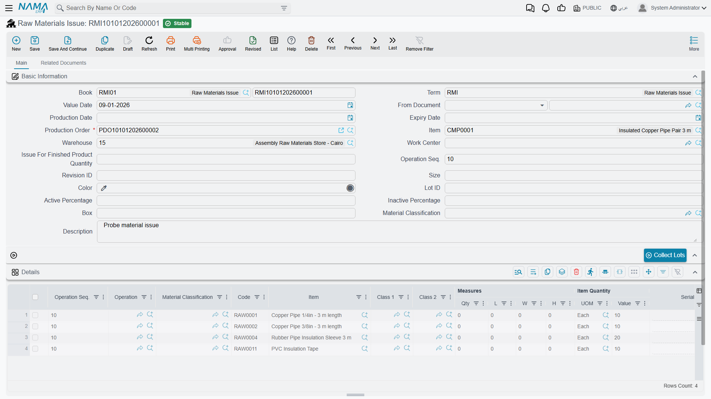
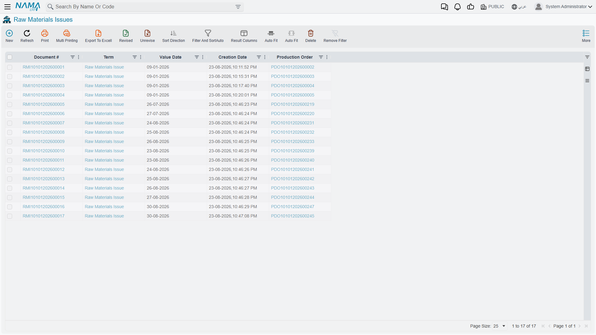
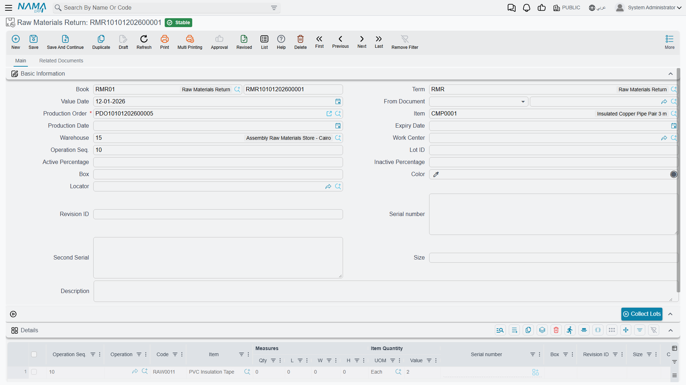

# Issuing and Returning Raw Materials

## The Document That Actually Moves the Material

A production order plans what a job will consume. A [BOM](/modules/manufacturing/manufacturing-bom) says what the recipe calls for. Neither of them takes anything off a shelf. The document that does — that reduces stock in the store, puts the material into the hands of the job, and makes it part of the product's cost — is the **Raw Materials Issue** (صرف مواد خام).

This is the workhorse of the module. It is the point where a plan stops being a plan.

You'll find it under **Manufacturing → Documents → Raw Materials Issue** (التصنيع ← المستندات ← صرف مواد خام).

The list view shows what has been drawn against which orders.

## The Header

**Book** and **Term** are the document's book and its term configuration — the settings that decide how this kind of document behaves and what it does to stock and to the ledger. **Value Date** is the date the movement takes effect.

**Production Order** is the only required field on the screen, and it is required for a reason. A raw materials issue is not a general-purpose stock withdrawal; it exists to charge material *to a job*. Without an order, the cost has nowhere to land. Naming the order is what lets the system propose the right components, check them against the plan, and eventually compare planned consumption against actual when the order closes.

**Item** shows the finished product the order is making — filled in from the order, not typed.

**Warehouse** is where the material comes from. In the example above that's the Assembly Raw Materials Store in Cairo. Set it in the header and every line inherits it; override on a line where a component lives somewhere else.

**Work Center** and **Operation Seq.** attribute the issue to a place and a step. The example carries `10` — these materials go in at the first operation. Filling this in is what makes work-in-process meaningful: material consumed at step 10 is sitting in a different place in the process from material consumed at step 30.

**Issue For Finished Product Quantity** is a convenience worth knowing about. Rather than working out component quantities yourself, enter the number of finished units you are issuing *for*, and let the system scale the BOM. Issuing for 10 pipe pairs fills the lines with the components ten units need.

**Production Date** and **Expiry Date** apply where the material carries them. **Material Classification** groups the issue for reporting. **Lot ID**, **Size**, **Color**, **Box**, **Revision ID** and the **Active / Inactive Percentage** pair carry item dimensions where the components use them. **Description** is free text — "Probe material issue" in the example.

### Collect Lots

The **Collect Lots** button sitting above the grid does the tedious part of lot-tracked issuing. Rather than naming lot numbers by hand for every line, it gathers the available lots for the components and allocates them according to the rules in force — normally oldest-first. On a store holding six lots of the same copper pipe, this is the difference between a thirty-second document and a five-minute one.

## The Details Grid

Each row is one component being issued.

**Operation Seq.** and **Operation** place the line in the process, defaulting from the header.

**Item** and **Code** identify the component. **Material Classification**, **Class 1** and **Class 2** classify it.

**Measures** (**Qty**, **L**, **W**, **H**) and **Item Quantity** (**UOM**, **Value**) carry the quantity. The four measure columns matter for materials bought by dimension — sheet, pipe, cable — where a length and a width are the honest description and a piece count is not.

**Serial** applies to serial-tracked components.

::: tip Let the order fill the grid
The fastest way to raise an issue is to name the production order, set the finished-product quantity, and let the system populate the lines from the BOM — then adjust the two or three rows where reality differs. Typing every line by hand is not just slower; it is how components that should have been consumed quietly get left off a job.
:::

## Raw Materials Return

Material goes out to the floor and some of it comes back. A run finishes early, an order is cancelled, more was drawn than the job needed. The **Raw Materials Return** (إرتجاع مواد خام) puts it back — into stock, and out of the job's cost.

You'll find it under **Manufacturing → Documents → Raw Materials Return** (التصنيع ← المستندات ← إرتجاع مواد خام).

The screen deliberately mirrors the issue, field for field: the same required **Production Order**, the same **Warehouse**, **Work Center** and **Operation Seq.**, the same **Collect Lots** button, the same grid. If you can raise an issue you can raise a return, which is the point of making them look alike.

Two fields appear here that the issue screen does not show: **Locator**, for stores that track position within the warehouse, and **Second Serial**, for components carrying two serial identifiers.

::: warning A return is not a correction
If you issued the wrong material, returning it and issuing the right one leaves both movements on the record — which is usually what an auditor wants to see. But if you simply issued the wrong *quantity* on a document raised minutes ago and nothing has been processed against it, correcting the original is cleaner than layering a return on top of it. Decide which story the record should tell before reaching for a return.
:::

## Raw Material Change

There is a third document in this family, for a situation the other two handle awkwardly: the job needs a *different* material from the one the BOM specified. The approved pipe is out of stock and the equivalent from another supplier will do. The **Raw Material Change** (تغيير خامة) records that substitution against the order, under **Manufacturing → Documents → Raw Material Change** (التصنيع ← المستندات ← تغيير خامة).

You could achieve the same movement with a return and a fresh issue. What you would lose is the reason. A change document says *this material stood in for that one on this job*, and that is the record you want when someone later asks why a product's cost that month came out different from every other month.

## What Happens After You Save

Saving does not block while stock and ledger effects are worked out. The document is stored immediately and its effects are raised as business requests processed in the background — which is why saving is instant even on a long document.

Normally you will never think about this. When something does go wrong — a closed period, a stock rule that rejects the movement — the document will be saved but its effects will not have completed, and the place to see that is the **Business Requests** list view. Filter by failed status, select the rows, and use **More → Reprocess** once the underlying problem is fixed.

## Where This Sits in the Cycle

Materials issued here are one of the three cost streams that meet at [order close](/modules/manufacturing/production-costing). The other two are the resources consumed — recorded on a [resource voucher](/modules/manufacturing/manufacturing-resource-voucher) or charged automatically — and overheads.

When the order closes, what was actually issued gets measured against what the BOM said should have been. The gap is the material variance, and it is the single most useful number the module produces about how a job really went.
