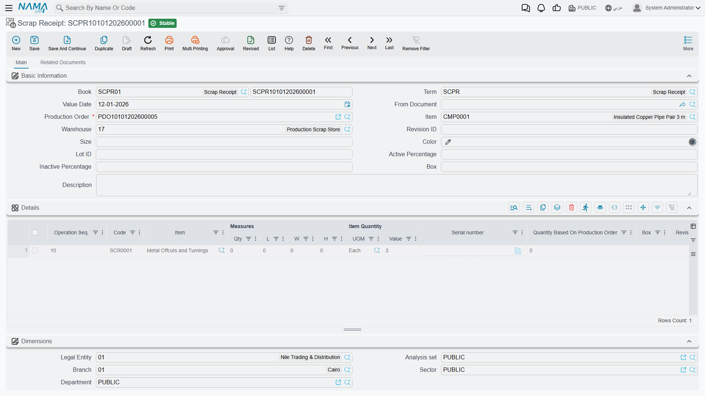

# Scrap Receipts: Booking Waste Back Into Stock

## Why Scrap Is a Receipt, Not a Loss

Cut a 3-metre copper pipe into the lengths a job needs and you are left with offcuts. Turn a steel bar on a lathe and you produce a pile of swarf. None of it was the point of the exercise, but none of it is worthless either — the scrap merchant pays by the kilo, and a factory that generates a tonne of metal offcuts a month is sitting on real money.

That is why Nama treats scrap as a **receipt** rather than a write-off. The **Scrap Receipt** (إستلام تالف) takes the waste that came off a production order and books it *into* a store as an item you own, can value, and can sell.

You'll find it under **Manufacturing → Documents → Scrap Receipt** (التصنيع ← المستندات ← إستلام تالف).

::: warning Scrap output is not the same as scrapped production
Two different things get called "scrap" on a shop floor, and they are recorded in different places. **This document** is for the by-product of making something — offcuts, trimmings, turnings — material that was never going to be the product. **Units that failed quality** are a different matter: those are recorded as defects on [production execution](/modules/manufacturing/production-execution), against the operation where they failed, because the interesting question there is which step is producing the failures.
:::

## The Header

**Book**, **Term** and **Value Date** work as on any document.

**Production Order** is required. Scrap belongs to the job that produced it — that link is what lets you ask which products generate the most waste, and what the scrap recovered is worth against what the job cost.

**Item** shows the finished product the order was making, from the order itself.

**Warehouse** is where the scrap goes, and it should generally be a store kept for the purpose — the example books to a Production Scrap Store. Keeping scrap in its own store rather than mixing it into raw materials is what stops someone issuing metal turnings to a job by accident, and it makes the stock figure you quote the scrap merchant a number you can actually read off the system.

**Lot ID**, **Size**, **Color**, **Box**, **Revision ID** and the **Active / Inactive Percentage** pair carry item dimensions where the scrap item uses them. **Description** is free text.

The **Dimensions** section — **Legal Entity**, **Branch**, **Department**, **Analysis set**, **Sector** — places the receipt in the organisation for reporting.

## The Details Grid

Each row is one kind of scrap coming back.

**Operation Seq.** is the step that generated it. This is more useful than it looks: knowing that most of your waste appears at operation 10 rather than spread evenly across the routing points straight at the cutting step as the place to look for a better nesting plan.

**Code** and **Item** identify the scrap item — `SCR0001`, Metal Offcuts and Turnings, in the example. Note that scrap items are ordinary items in the item file. They need to exist before you can receive them, which is a setup step people miss on their first scrap receipt.

**Measures** (**Qty**, **L**, **W**, **H**) and **Item Quantity** (**UOM**, **Value**) carry the amount — 3 units in the example. For scrap sold by weight, the sensible unit is the one the merchant pays in, not the one the parent material was issued in.

**Quantity Based On Production Order** relates the scrap back to the order's own quantity, which is what turns a raw figure into a rate — 3 kilos of offcut from an order for 10 units is a number you can compare across jobs, where "3 kilos" on its own is not.

**Serial number** and **Box** apply where the scrap item is tracked that way.

## What It Does to Cost

A scrap receipt puts value into stock, and that value has to come from somewhere. It comes off the production order — which is the correct treatment, and worth stating plainly because it surprises people: **recovering scrap reduces the cost of the units the order produced.**

The logic holds up. If a job consumed 100 kg of steel and 8 kg came back as saleable turnings, the good units did not really consume 100 kg of steel value; they consumed 100 kg less whatever the turnings are worth. Booking the scrap is what stops that recovery being silently absorbed into product cost.

Which is also the argument for actually raising these documents. A factory that skips scrap receipts is not merely losing track of a small revenue line — it is systematically overstating the cost of everything it makes.
