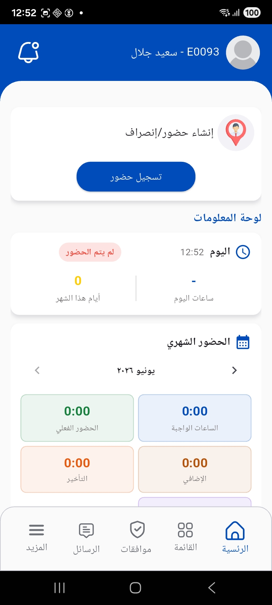

---
# Handcrafted mobile landing — GenNamaDocsIndex skips this file because of the
# .custom-index marker in this folder (see hasHandcraftedHomePage in GenNamaDocsIndex.java)
layout: home
title: Mobile Applications
hero:
  name: Nama Mobile
  text: The ERP in your pocket
  tagline: Clock in, issue invoices, count stock and follow up customer visits — from the phone, in Arabic and English, and it works even offline
  image:
    src: /hero.svg
    alt: Nama Mobile
  actions:
    - theme: brand
      text: Start here
      link: /modules/mobile/mobile-application-guide
    - theme: alt
      text: FAQ
      link: /modules/mobile/mobile-apps-faq
features:
  - icon: 🧭
    title: Overview, Navigation & Settings
    details: Login and branding, the home screen and navigation bar, menus and module groups, settings, printer and sync
    link: /modules/mobile/mobile-application-guide
  - icon: 🕐
    title: Employee Self-Service
    details: Check-in/out and attendance zones, attendance logs, vacations, permissions, missions and loans, plus HR and Gulf documents
    link: /modules/mobile/mobile-hr-self-service
  - icon: 🛒
    title: Sales & Inventory
    details: Sales orders, invoices, quotations and returns, item inquiry, stock transfers, and barcode-driven electronic stock taking
    link: /modules/mobile/mobile-sales-inventory
  - icon: 🚚
    title: Customer Service, Delivery & Receipts
    details: Customer visits, maintenance and questionnaires, delivery vouchers and driver tools, and field electronic receipts
    link: /modules/mobile/mobile-crm-delivery
  - icon: 🔳
    title: Mobile QR Integrator
    details: The system's response to scanned QR codes to create and update entities and run custom actions dynamically
    link: /modules/mobile/mobile-qr-integrator
  - icon: ❓
    title: Frequently Asked Questions
    details: Quick answers about mobile apps in Nama ERP — such as printing support on Sunmi devices
    link: /modules/mobile/mobile-apps-faq
---

## One app for every field team

**Nama Mobile** is the mobile front end for the Nama ERP system. It connects to the same ERP server the back-office team uses, putting in each employee's hands what they need in the field: the employee clocks in and tracks their leave balance, the rep writes invoices at the customer's site, the warehouse keeper pulls items by barcode, the maintenance technician documents their visits, and the driver executes the delivery and captures the customer's signature.

<figure style="text-align:center; margin: 2rem auto; max-width: 320px;">
  
  <figcaption style="color: var(--vp-c-text-2); font-size: 0.85rem; margin-top: 0.6rem;">The home screen: check-in, the information panel, and the monthly summary</figcaption>
</figure>

## What sets it apart?

- **Offline-first** — the app downloads the data it needs locally on login and syncs documents when the network is available, so work in the field never stalls.
- **Adapts to your license** — modules and screens appear in the menu according to what your organization has licensed and the user's permissions.
- **Configured centrally** — the administrator controls the app's behavior entirely from the Mobile App configuration screen on the server: books, criteria, print templates and permissions.
- **Bilingual and white-labelable** — Arabic and English, and it ships under multiple brands for Nama's customers.

## Where do I start?

Start with the [Overview, Navigation & Settings](./mobile-application-guide.md) page to understand login, the home screen and navigation, then move to the page that fits your role from the cards above.
