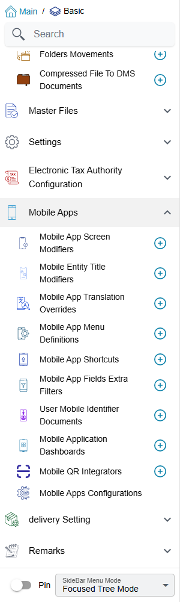
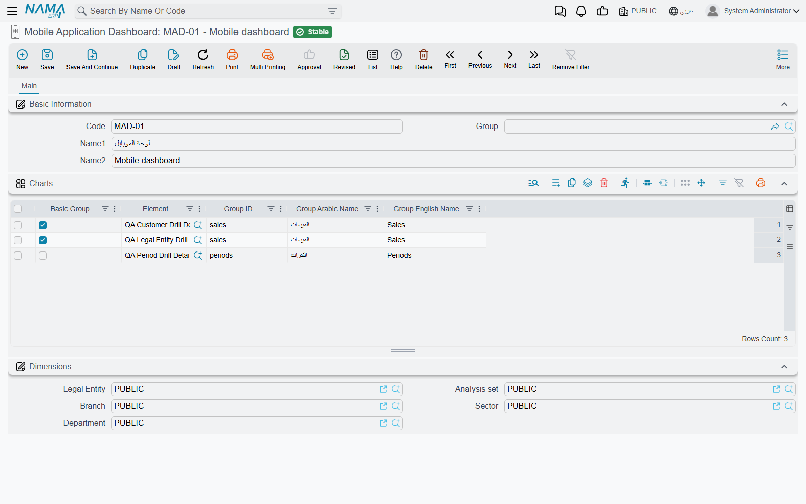

# Administering Nama Mobile from the ERP

Nothing about Nama Mobile is configured on the phone beyond the server address and the printer. Which screens a user sees, which fields those screens show, what a list card says, which records a lookup offers, which phone is allowed to save, and what the dashboard draws — all of it is decided in the ERP, by an administrator, under **Basic → Mobile Apps**. This page is the map of that menu: what each screen is for, where it is explained, and when a change actually reaches the phone. It also covers the one screen that has no other home, the **Mobile Application Dashboard**.

## The Mobile Apps menu, screen by screen

| Screen (menu name) | Arabic | What it decides | Explained in |
|---|---|---|---|
| **Mobile App Screen Modifier** | تعديل شاشة التطبيق | Which fields a document screen shows, in which order, and which are required | [Shaping the app's screens](./mobile-screen-customisation.md) |
| **Mobile Entity Title Modifier** | طريقة عرض بيانات المستند فى التطبيق | The lines of text shown on each card in a list or a search result | [Shaping the app's screens](./mobile-screen-customisation.md) |
| **Mobile App Translation Override** | ترجمة حقول تطبيق المحمول | Your own wording for any label the app shows | [Shaping the app's screens](./mobile-screen-customisation.md) |
| **Mobile App Fields Extra Filter** | معايير إضافية لفلتر حقول تطبيق المحمول | Which records a lookup field in the app offers | [Shaping the app's screens](./mobile-screen-customisation.md) |
| **Mobile App Menu Definition** | تعريف قائمة التطبيق | The groups and screens in the Menu and More tabs | [Overview, Navigation & Settings](./mobile-application-guide.md#Customizing-the-home-screen-and-the-menu) |
| **Mobile App Shortcut** | تعريف اختصارات التطبيق | The shortcut cards that can replace the home page | [Overview, Navigation & Settings](./mobile-application-guide.md#Replacing-the-home-page-with-shortcut-cards) |
| **User Mobile Identifier Document** | سند تعريف هاتف مستخدِم | Which phone each user may save documents from | [Binding users to their phones](./mobile-device-binding.md) |
| **Mobile Application Dashboard** | لوحة تطبيق الموبايل | The charts on the app's dashboard screen | [Below](#The-Mobile-Application-Dashboard) |
| **Mobile QR Integrator** | Mobile QR Integrator | What happens when the app scans a QR code | [Mobile QR Integrator](./mobile-qr-integrator.md) |
| Mobile apps module settings (last item in the menu) | إعدادات تطبيقات الجوال | Books, print templates, draft saving, attendance rules and the rest of the app's behaviour | [Overview, Navigation & Settings](./mobile-application-guide.md#Server-settings-that-control-the-apps-behavior) |

All of these screens come with the basic licence, except the Mobile Application Dashboard, which needs `basic-mobile-ess`.

## When a change reaches the phone

The app does not ask the server about its configuration every time it opens a screen. It downloads the user's settings when the user **logs in**, and again when the user presses **Reload app data** in the app's Settings screen, and works from that copy. So after you change a screen modifier, a translation override, a menu definition or a shortcut, the user sees the change only after logging in again or reloading the app data. When you are testing a change, reload on the test phone before concluding that it did not work.

Three things are different, because the server applies them at the moment the app asks for data:

- **Mobile Entity Title Modifier** — the server writes the card titles into every list it sends, so the next time the user opens or refreshes the list, the new titles are there.
- **Mobile App Fields Extra Filter** — the server adds the filter to the search each time the user opens a lookup, so a changed criteria applies to the very next lookup.
- **User Mobile Identifier Document** — where the phone check is switched on, the server checks it on every save, so accepting or rejecting a phone takes effect on that phone's very next save.

::: tip One record per screen
For the screen modifier and the entity title modifier, keep a single active record (or a single line) for each app screen. When two active ones apply to the same screen, only one of them is used, and which one is not something you can rely on. Untick **Inactive** on the one you want and tick it on the others.
:::

## The Mobile Application Dashboard

The app's **Dashboard** screen draws charts. Which charts is decided by a **Mobile Application Dashboard** record, and which record a user gets is decided on the **user's own record**, in its **Mobile Application Dashboard** field. A user with no dashboard on their record sees an empty dashboard screen.

The charts themselves are not built here. Each one is a **DashBoard Widget** (Administration → DashBoards → DashBoard Widget) — the same widgets the ERP's own dashboards use, see [the BI module guide](/platform/bi/bi-module-guide.md). The mobile dashboard record only picks widgets and arranges them into groups, one line per chart in its **Charts** grid:

| Column | What it does |
|---|---|
| **Element** | The DashBoard Widget to draw. |
| **Group ID** | A short code. Lines with the same group ID are shown together as one group. Required. |
| **Group Arabic Name** / **Group English Name** | The group's title. Fill one and the other is copied from it when you save. |
| **Basic Group** | Marks the group the dashboard opens on. Tick it on the lines of one group only. |

The app can draw only some kinds of widget: **PieChart**, **3D Pie Chart**, **Table**, **ColumnWithRotatedLabels**, **Column With Categories And Labels** and **HTML**. A widget of any other kind is refused when you save the dashboard.

A widget the user has no right to view is skipped silently: the rest of the dashboard still draws. If one user is missing a chart that a colleague sees, check that user's view rights on the widget before anything else.

### Messages you may see

| Message | Why | What to do |
|---|---|---|
| *Element Type {0} is not supported* — «نوع العنصر {0} غير مدعم» | A line's widget is of a kind the app cannot draw. | Pick a widget of one of the six supported kinds, or change the widget's type. |
| *Only One Group Can be Main Group* — «مجموعة واحدة فقط يمكن ان تكون المجموعة الرئيسية» | **Basic Group** is ticked on lines that belong to two different groups. | Untick it everywhere except on the lines of the group the dashboard should open on. |
