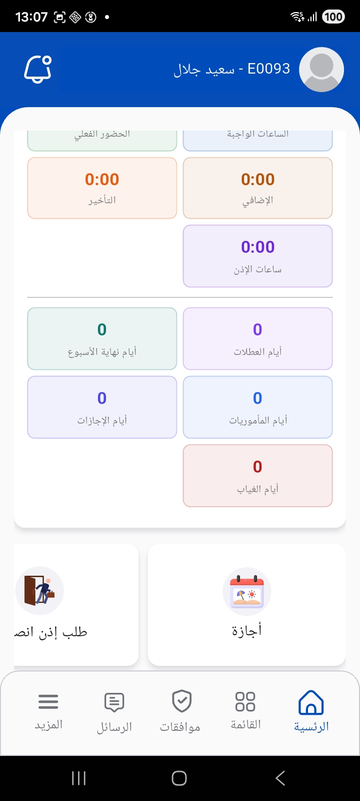
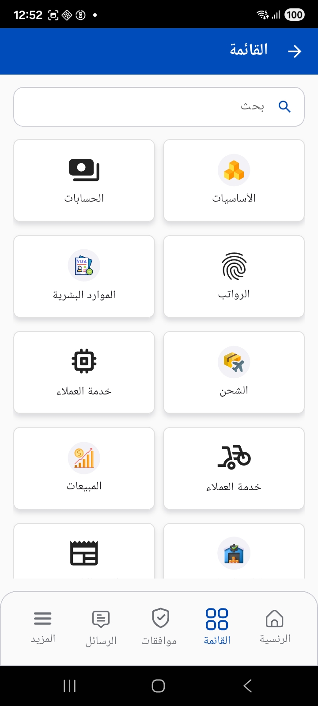
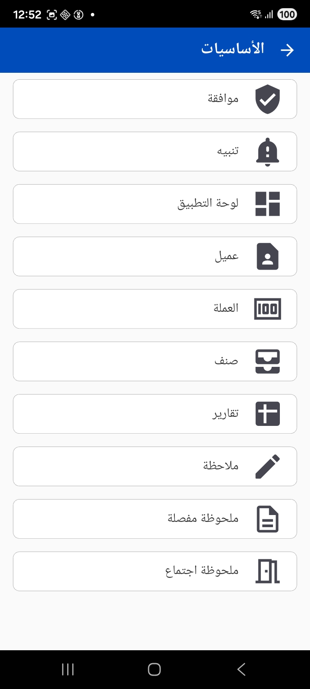

# Nama Mobile App — Overview, Navigation & Settings

**Nama Mobile** is the mobile front end for the Nama ERP system. It puts a connected endpoint in the hands of the employee, the sales rep, the warehouse keeper and the maintenance technician — all talking to the same ERP server the back-office team uses. From the phone they can clock in, issue invoices, count stock and follow up customer visits.

::: tip The big picture before we start
The app works **offline-first**: when you log in it downloads a copy of the data it needs (customers, items, currencies, vacation types… depending on the licensed modules) and stores it locally on the device, then syncs documents back to the server whenever a connection is available. That means a field rep can keep working even on a weak network.
:::

The app supports Arabic and English, and ships under different brands (white labeling) for Nama's various customers — such as **NAMASOFT**, **SoftVision**, **Exceed**, **Capital** and **Cleopatra**. Each build carries its own name and icon but shares the same features described in this guide.

## What this guide covers

We split the app documentation into pages by the kind of work involved:

- **This page** — logging in, the home screen, navigating between modules, and settings (language, printer, sync).
- [Employee Self-Service — Attendance & Leaves](./mobile-hr-self-service.md) — electronic attendance, vacations, permissions, missions, loans and HR documents.
- [Sales, Inventory & Item Inquiry](./mobile-sales-inventory.md) — sales documents, stock transfers, electronic stock taking and item inquiry.
- [Customer Service, Delivery & Receipts](./mobile-crm-delivery.md) — customer visits, maintenance, questionnaires, delivery vouchers and electronic receipts.
- [Mobile QR Integrator Guide](./mobile-qr-integrator.md) — responding to scanned QR codes to create/update entities.
- [Frequently Asked Questions](./mobile-apps-faq.md).

## Logging in and connecting to the server

The first time you open the app the login screen appears, and you need:

- **Server URL** — the link to your organization's ERP server. You can type it in, or **scan a QR code** that holds the link to save the trouble.
- **Username and password** — the same Nama user credentials.

::: details Advanced login options
- **NTLM/HTTP authentication**: for environments that use Windows authentication, you can enable separate NTLM credentials.
- **Skip SSL verification**: for development environments or servers with self-signed certificates only.
:::

After a successful login the app fetches the **user settings and licensed modules** from the server and builds the menus and shortcuts accordingly — so what each user sees differs by their permissions and the modules enabled for their organization.

### Biometric login

The app can ask for a **fingerprint or face scan** on every launch as an extra layer of protection. This is controlled by a server-side setting, and biometric login can be **disabled** or made mandatory from the mobile app configuration (see the last section of this page).

## The home screen

The home screen is the employee's daily launch point. At the top it shows the user's name, employee number and the notifications bell, then come the cards:

- **Check-in card** — a quick "Check In / Check Out" button without opening the payroll menu.
- **Information panel** — a summary of the current workday (today's hours, whether you've checked in, days attended this month).
- **Monthly attendance** — colored cards summarizing the month: actual attendance, required hours, lateness, overtime, permission hours, and days of holidays, vacations, missions and absence.

Below the summary are **quick shortcuts** for the most frequent actions, such as requesting a vacation or a permission. The administrator can customize the shortcut cards shown here from server settings.

### The bottom navigation bar

The bottom of the screen has five fixed tabs:

| Tab | Purpose |
|-----|---------|
| **Home** | The home screen and attendance panel |
| **Menu** | All modules and documents available to the user |
| **Approvals** | Documents awaiting the user's approval (with a counter) |
| **Chats** | Internal messaging (with an unread counter) |
| **More** | Settings and utilities |

## The menu and module groups

The **Menu** tab shows the licensed modules as grouped cards, with a search box for quick access to any screen.

The groups shown change with your organization's license and your permissions; examples include Accounts, Basics, Human Resources, Payroll, Customer Service, Shipping, Sales and Warehouse Management. Opening any group reveals its detailed screens:

The **Basics** group, for example, gathers the shared screens: approvals, notifications, the Dashboard, customer/currency/item data, reports, plus the note types (remark, detailed remark, meeting remark).

::: info The menu order is customizable
The administrator can completely redefine the structure of menus and groups on the server side, and can choose the four items shown in the bottom app bar. So your order may differ from the screenshots.
:::

## Approvals, notifications and messages

- **Approvals**: the list of documents awaiting your approval (vacations, permissions, requests…). You can review each document's summary and approve or reject it from the device directly.
- **Notifications** (the bell at the top): a list of alerts from the system, with the ability to open the document linked to an alert directly, mark all as read, or delete them.
- **Messages**: internal chat between system users supporting text, images, video and voice messages, working in real time over a persistent connection to the server.

## More and Settings

The **More** tab gathers settings and utilities:

- **Settings** — which may be protected by an administrator PIN if the organization enables it.
- **Create Device ID document** — to register the device fingerprint when linking it to the system.
- **Additional items** defined by the administrator on the server side.

### The Settings screen

Settings are divided into several tabs:

**General settings**
- **Language**: Arabic or English.
- **Server URL**, email and device code.

**Printer settings** — the app supports a wide range of thermal printers including Bluetooth printers, **Sunmi** devices, C75 and others. You can set:
- Printer type, paper width (mm or pixels) and height.
- Paper size (80/72/58 mm) and the print command (ESC/TSC/CPCL) depending on the printer type.
- The wait time before printing.

**Other settings**
- **Save server logs**: to enable logging server calls and review them later when diagnosing an issue.
- **Fetch logo**: to download the company logo used in printing documents.
- **Reload app data**: to force the app to re-sync all settings and data from the server.

::: tip Changing the password and admin PIN
From the profile screen the user can change their password, and the administrator can change the **Admin PIN** that protects access to the Settings screen.
:::

## Syncing and working offline

On login — or when you use **Reload app data** — the app fetches the reference data and stores it locally. Documents created in the field can be **saved as drafts** on the device and then synced to the server later, depending on the organization's settings. When settings change on the server the app can be notified in real time and reload the settings automatically.

## Server settings that control the app's behavior

Most of the app's behavior is configured centrally from the **Mobile App configuration** screen in the ERP (the mobile apps module configuration), not from the phone. This screen is the administrator's reference for everything related to the app, including for example:

- Specifying the **books** allowed for each document type (attendance, vacations, permissions, stock taking, receipts, delivery…).
- Controlling **biometric login**, showing/hiding the save-as-draft option, and the number of decimal places for quantities.
- Setting the **criteria** that determine which customers or items are allowed to be sent to the app.
- Authoring the **print templates** for documents and receipts, and the terms and conditions shown to the customer.
- Restricting the creation of some documents (attendance, vacations, stock taking, receipts) to the app only, or allowing their editing for authorized users only.

Your organization's **license** also determines which modules appear in the app at all (Human Resources, Sales, Maintenance, Warehouse Management/WMS, Stock Taking, Delivery…); if a module is not licensed, its screens will not appear in the menu.
