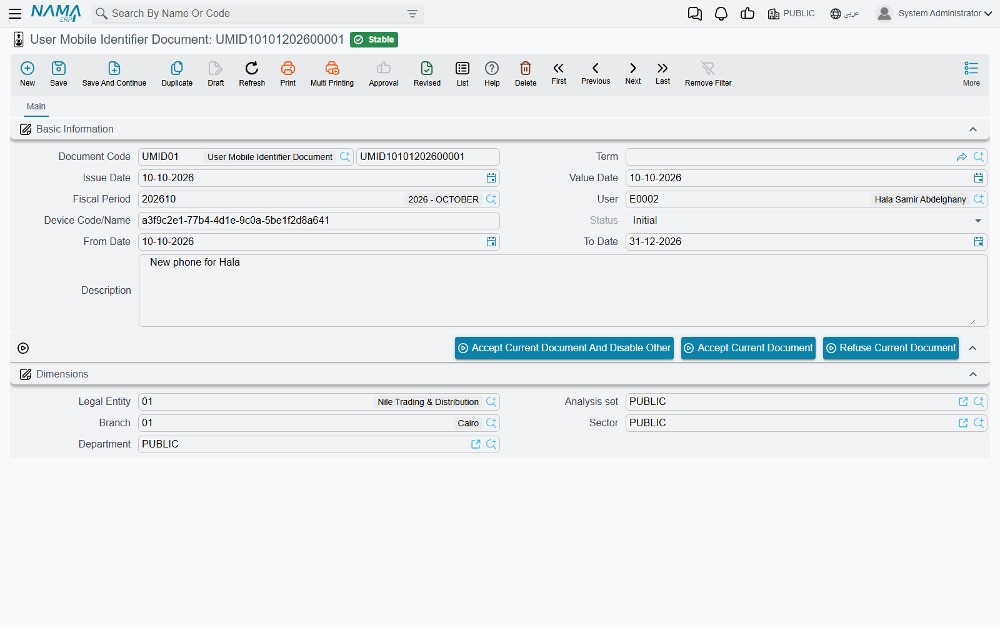

# Binding Users to Their Phones

A user name and a password travel easily. An employee can log in to Nama Mobile on a colleague's phone and check in for them, or a rep can hand their login to someone else in the field. When attendance, leave requests or field documents must come from the employee's **own** phone, Nama lets you bind each user to the phones you have approved. Once the check is on, a document saved from any other phone is refused.

The binding is a small document, the **User Mobile Identifier Document** (سند تعريف هاتف مستخدِم): one user, one phone, a status, and an optional date range. The user requests it from the phone; an administrator accepts or refuses it in the ERP.

## How it works, start to finish

1. **The administrator decides which documents need an approved phone** (see [Switching the check on](#Switching-the-check-on) below).
2. **The user asks for their phone to be registered.** In the app, on the **More** tab, the user presses **Request Device fingerPrint Document** — «طلب إنشاء سند معرف لهذا الجهاز» on an Arabic phone. The app reads the phone's identifier and sends it; the server saves a User Mobile Identifier Document for that user, with that identifier and the status **Initial**.
3. **The administrator reviews the request** in the ERP, under **Basic → Mobile Apps → User Mobile Identifier Document**, and presses one of the buttons on it (see [Accepting or refusing a phone](#Accepting-or-refusing-a-phone)).
4. **From then on, every save is checked.** When the user saves one of the checked documents, the server looks for an **Accepted** identifier document for that same user and that same phone, whose dates cover today. If there is none, the save is refused.

## The identifier document

| Field | Meaning |
|---|---|
| **User** | The user the phone belongs to. Filled with the user who sent the request. |
| **Device Code/Name** | The phone's identifier, as the app sent it. Do not edit it: the check compares it letter for letter with what the phone sends on every save. |
| **Status** | **Initial** when the request arrives, then **Accepted**, **Rejected** or **Disabled**, set by the buttons. Only **Accepted** lets the phone save. |
| **From Date** / **To Date** | Optional. When filled, the phone is accepted only between these dates. Leave both empty for a binding with no end. A temporary phone for a two-week project is a **To Date** away from switching itself off. |

The book the request is saved in is set in the mobile apps module settings: either the **User Mobile Identifier Document Book** field, or — taking precedence — a line for the *User Mobile Identifier Document* entity type in the **Documents Or Files Creation Configurations** grid.

## Accepting or refusing a phone

The identifier document has three buttons:

| Button | Effect |
|---|---|
| **Accept Current Document And Disable Other** | Accepts this phone and sets every other identifier document of the same user to **Disabled**. Use it when the user has changed phones: the old phone stops working at once. |
| **Accept Current Document** | Accepts this phone and leaves the user's other phones as they are. Use it for a user who really works from two phones. |
| **Refuse Current Document** | Sets the status to **Rejected**. The phone cannot save the checked documents. |

The buttons work on a saved document, and the person pressing them needs the **Edit After Commit** right on the User Mobile Identifier Document. To take a phone away later, open its accepted document and refuse it, or give it a **To Date**.

## Switching the check on

The check is off until you switch it on, and you switch it on per kind of document, in the mobile apps module settings (the last item of the **Basic → Mobile Apps** menu):

- In the **Documents Or Files Creation Configurations** grid, tick **Check Mobile Identifier Document Before Save** on the line of each document type that must come from an approved phone — a sales invoice, an electronic receipt, a form document, and so on.
- For **electronic attendance**, **vacations** and **permissions**, there is also a general switch: **Check Mobile Identifier Document Before Save** in the **Electronic Attendance Configurations** group on the **NAMA ESS App Configurations** page. It applies whenever the grid has no line for that document. When a grid line does match, the line's own box decides, whether it is ticked or not.

::: info Only saves from the app are checked
The check concerns the phone the document comes from, so it applies only to documents saved from Nama Mobile. The same documents created or edited in the browser are never checked.
:::

## Messages you may see

| Message | Why | What to do |
|---|---|---|
| *There is no accepted Identifier Document For the device identifier {0} - User {1}* — «لا يوجد سند تعريف هاتف مقبول للمعرف {0} -والمستخدم {1}» | The user saved a checked document from a phone that has no **Accepted** identifier document for that user, or whose document's dates do not cover today. `{0}` is the phone's identifier, `{1}` the user. | Search the identifier documents for that device code. If there is none, ask the user to send the request from the phone. If it is **Initial**, accept it. If it is **Rejected** or **Disabled**, or its **To Date** has passed, decide whether the phone should be allowed again. |
