# Employee Self-Service — Attendance & Leaves

One of the most common uses of the Nama app is as the **employee self-service (ESS)** gateway: the employee clocks in and out, tracks their leave balance, and submits requests (vacation, permission, mission, loan…) without going through the HR department. These screens are usually gathered under the **Payroll** group in the menu.

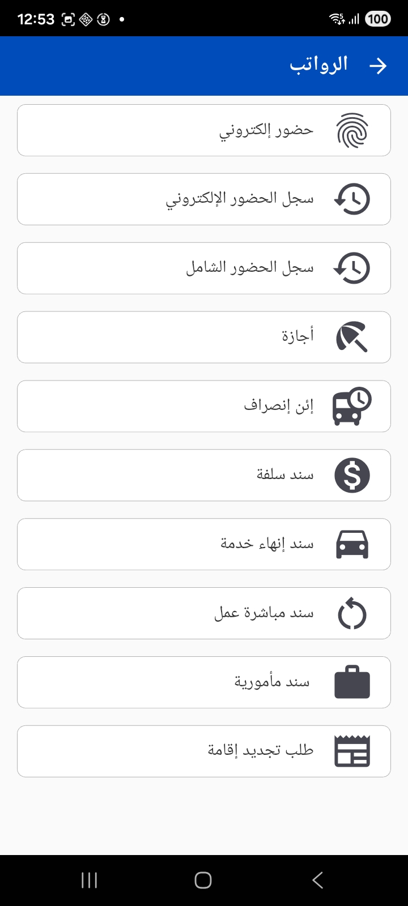

## Clocking in and out

The simplest way to clock in is the **"Check In"** button on the [home screen](./mobile-application-guide.md); when leaving, the same button becomes **"Check Out"**. The app captures the check-in and check-out times, and can capture the **GPS location** and its accuracy, plus device data to prevent tampering.

::: tip Advanced attendance features
Depending on the organization's settings you can enable:
- **Attendance zones**: preventing a check-in being saved if the employee is outside the allowed zone, and requiring the check-out to be from the same zone as the check-in.
- **Biometric verification** before saving the attendance.
- Linking attendance to a **customer, lead or project** (useful for visiting reps).
- A time limit on the number of hours allowed before check-out is blocked.
:::

### The attendance log

There are two logs for reviewing attendance:

- **Electronic attendance log** — a list of the check-in/check-out documents the employee recorded through the app, with pagination. The cloud icon indicates the document has synced to the server.

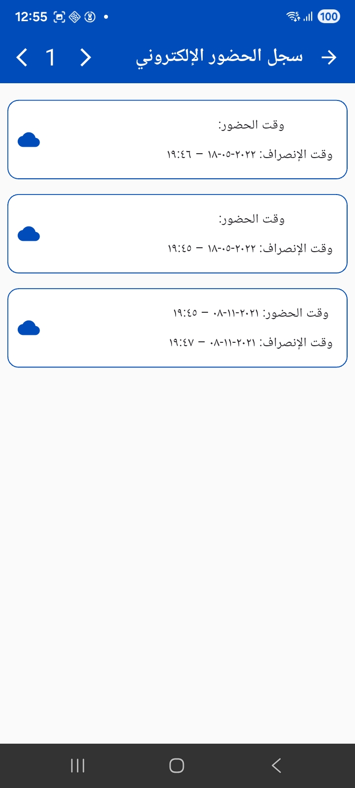

- **Comprehensive attendance log** — a complete daily view that puts each day in a card showing its status (**Present**, **Absent**, **Weekly holiday**), the entry and exit times, and the required, actual, overtime and lateness hours. From the card itself the employee can start a **vacation**, **mission** or **permission** request to justify a particular day.

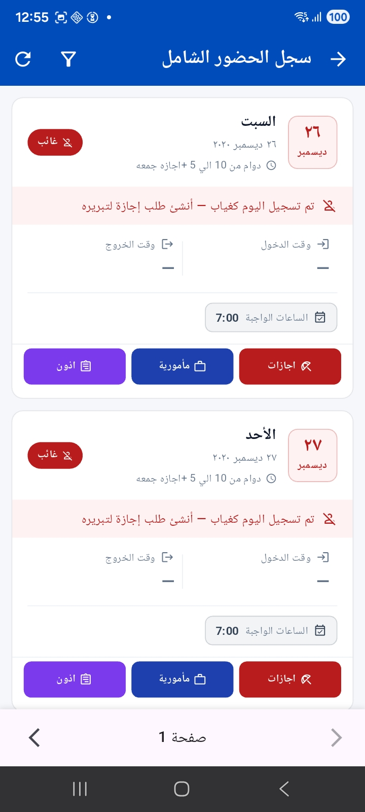

When browsing the days the employee was present, the card shows precise details of working hours, early arrival and early departure:

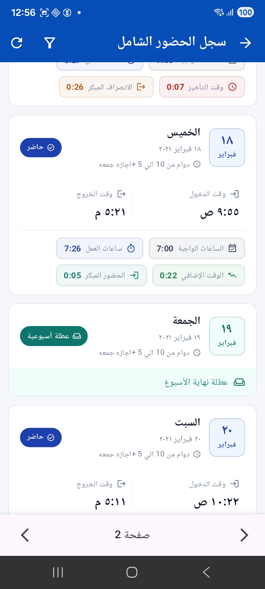

## Vacation request

The **Create vacation request** screen shows the **leave balance** at the top as a pie chart (consumed during the year and remaining), then the employee chooses:

- **Vacation type** and **leave/departure reason**.
- A **vacation less than a day** option when needed.
- **Start date** and **return date**, with a **notes** field.

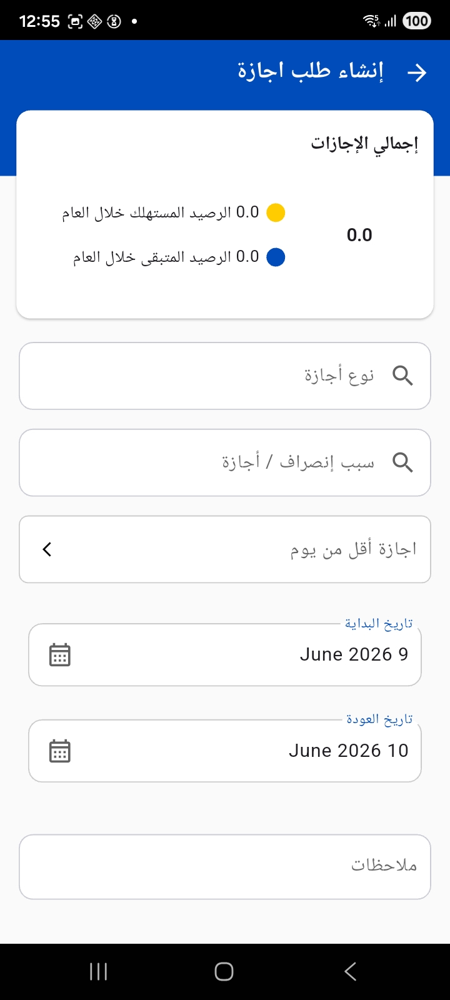

## Permission request

The **permission request** is used for intra-day permissions (early leave, lateness, leaving during work hours…). The employee specifies the date, the time range **(from / to)**, the **permission type** and the **reason**, and can **attach a file** before submitting.

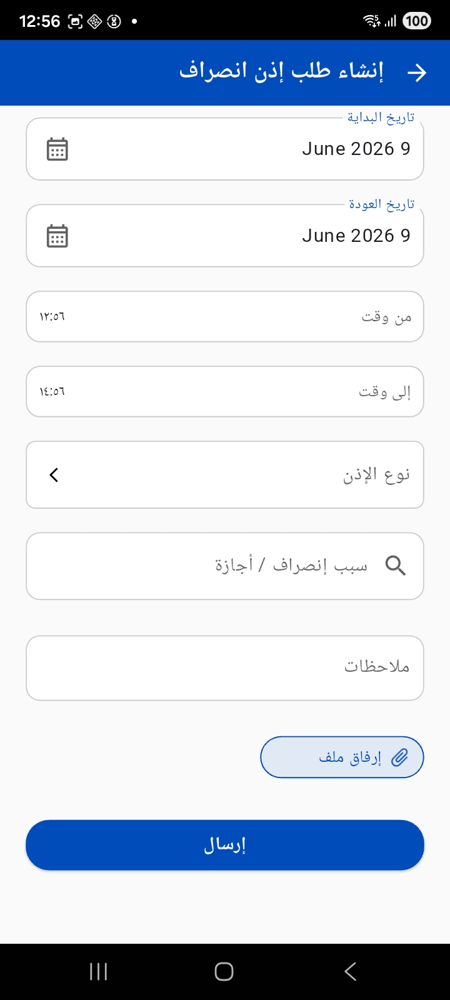

## Mission voucher

When traveling on an external work assignment the employee creates a **mission voucher** specifying the start and return dates, the time range, the **reason**, and the **allowance value** due, with the ability to attach a file.

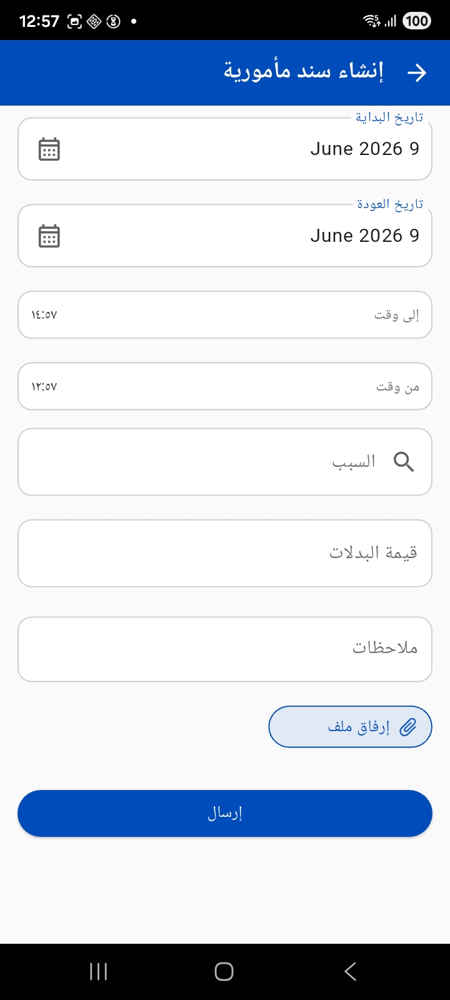

## Loan voucher

The employee submits a **loan request** specifying the loan type, currency, **loan amount**, **installment amount**, **number of installments**, installment period type and start date.

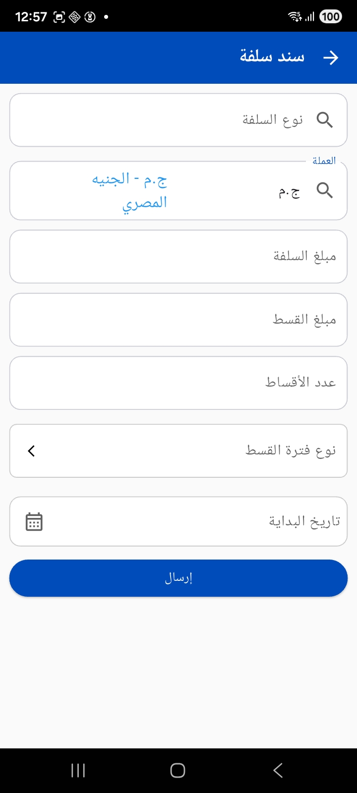

## Other HR documents

The app provides a set of HR documents that follow the same simple pattern (a few fields then a **Send** button):

- **Work-starting voucher** — to document the start of work, and it can be created **based on** a prior vacation voucher.

  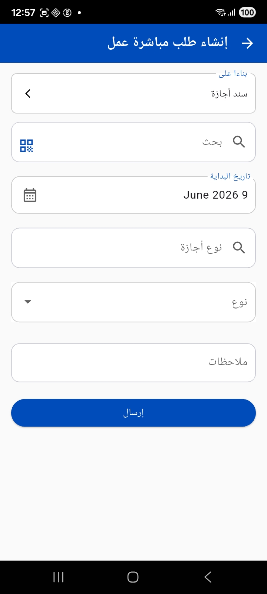

- **Termination voucher** — the termination date, the **termination reason** and notes.

  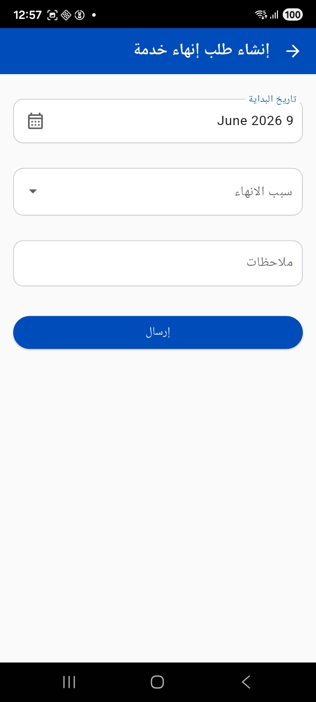

### Gulf documents (residence and visas)

For organizations in the Gulf there are additional documents usually gathered under **Human Resources**:

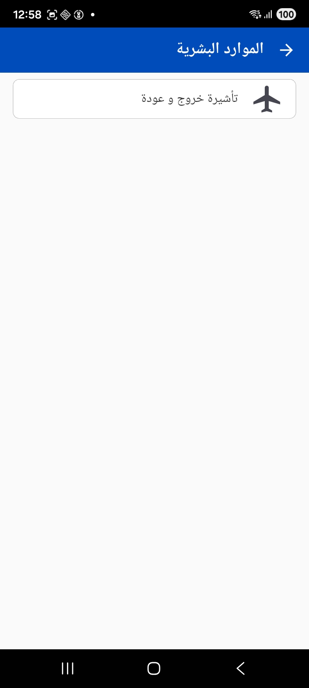

- **Exit/return visa request** — the residence expiry date, the residence period in days, and notes.

  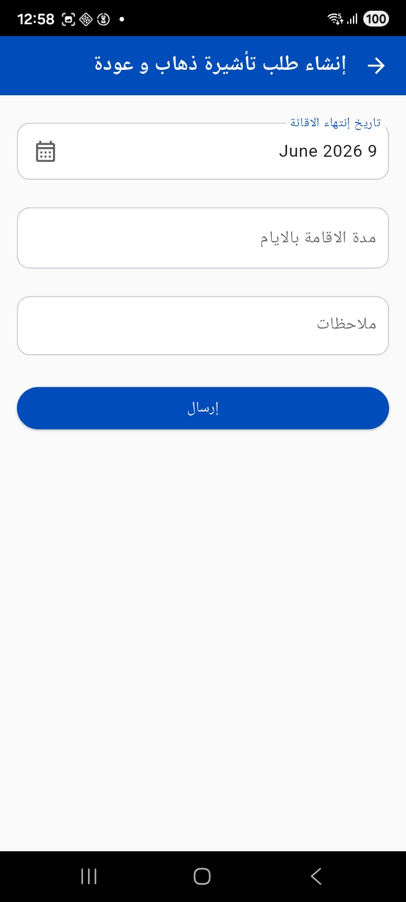

- **Residence renewal request** — reference fields and notes with the ability to attach a file.

  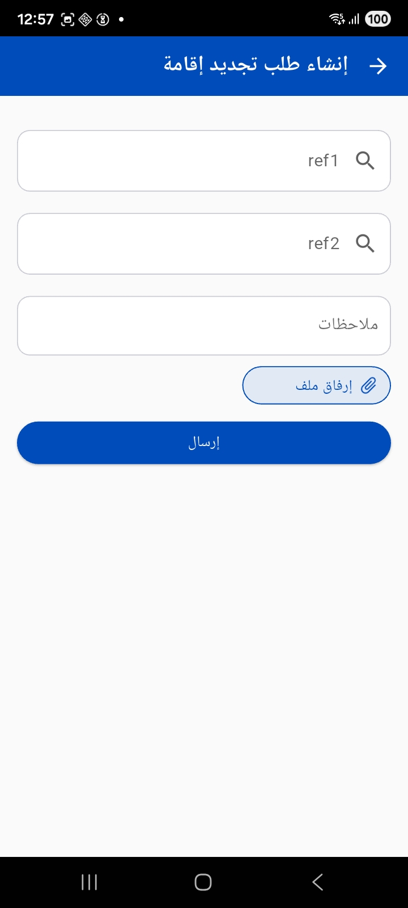

## Notes for the administrator

The books used for each type (attendance, vacations, permissions…) and their working criteria are configured from the [Mobile App configuration](./mobile-application-guide.md) screen. You can also **restrict the creation of attendance, vacation and permission documents to the app only**, or allow editing for authorized users only, and customize the **attendance summary** cards shown on the home screen. These screens appear in the menu only if the employee self-service module is licensed for your organization.
