# Sales, Inventory & Item Inquiry

Nama Mobile turns the phone into a mobile point of sale and inventory tool: the rep writes sales orders and invoices at the customer's site, the warehouse keeper pulls items by barcode, and stock transfers and counts are done from inside the warehouse directly. These screens appear under the **Sales** and **Warehouse Management** groups depending on the licensed modules.

## Sales documents

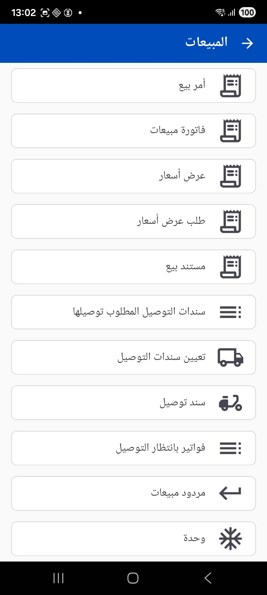

The Sales group contains the usual document chain: **Sales Order**, **Sales Invoice**, **Quotation**, **Quotation Request**, **Sales Document** and **Sales Return** — in addition to the delivery screens (see the [Customer Service & Delivery](./mobile-crm-delivery.md) page).

The sales documents share the same screen layout, which makes moving between them easy:

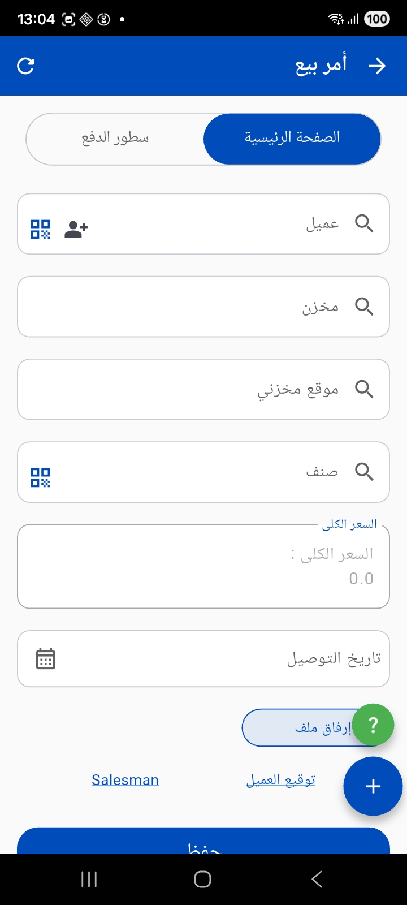

- Two tabs: **Main page** and **Payment lines** (to record the collection accompanying the document).
- Choosing the **customer** — with a **scan QR** icon for quick access, and an **add new customer** icon if they don't exist yet.
- **Warehouse**, **locator** and **item** — all supporting search and barcode/QR scanning to add items quickly.
- **Total price** and **delivery date**.
- A **(+)** button to add a new item line, **attach file**, and **customer signature** and **rep signature**, then **Save**. After saving you can **print** the document to the configured printer.

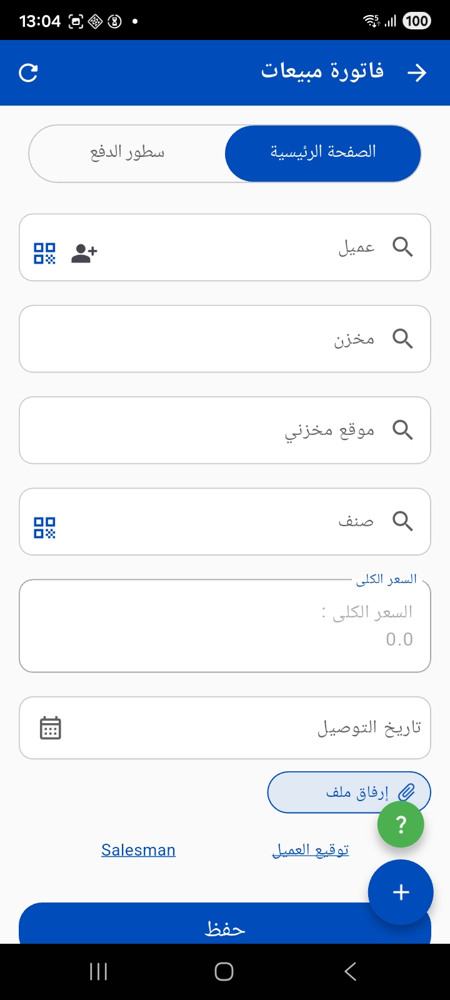

::: info The help button (?)
The green **(?)** button shown on the document screens opens contextual guidance that helps the user fill in the screen.
:::

## Item inquiry

The **Item Data** screen lets you query an item by scanning a barcode/QR or entering the code manually, choosing the warehouse and locator, then it displays the item data using **Tempo** templates.

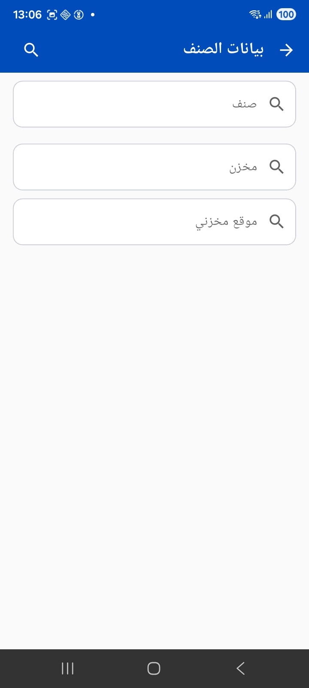

**Available data in the template:**
- **`barcode`** - The scanned or manually entered code
- **`invItemCode`** - Color, size, and unit details ([details](https://dm.namasoft.com/#InvItemCode))
- **`item`** - Item data ([details](https://dm.namasoft.com/#InvItem))
- **`dimensions`** - Current entry dimensions

**Simple example:**
```
Name1: {item.name1} {enter}
Name2: {item.name2} {enter}
Color: {invItemCode.color}{enter}
Size: {invItemCode.size}{enter}
Price: {itemprice(itemIdOrCode=item,colorCode=invItemCode.color,sizeCode=invItemCode.size,legalEntityCodeOrId="01",fieldToDisplay=unitPrice)}{enter}
Price Including Tax: {itemprice(itemIdOrCode=item,colorCode=invItemCode.color,sizeCode=invItemCode.size,legalEntityCodeOrId="01",fieldToDisplay=netValue)}{enter}
```
You can learn more about the `itemprice` pricing function from the Tempo usage guide:
[Sales Price Tempo Function](../../admin/tempo.md#Getting-the-Sales-Price-of-an-Item)

You can also write custom SQL queries to fetch additional data and display it in the template.

**Example query to calculate quantities per warehouse:**
```sql
select w.code, w.name1, net qty from ItemDimensionsQty Q
left join Warehouse w on w.id = q.warehouse_id
where item_id = {item.id}
```

And when you open the items list a quick search appears, showing codes and names:

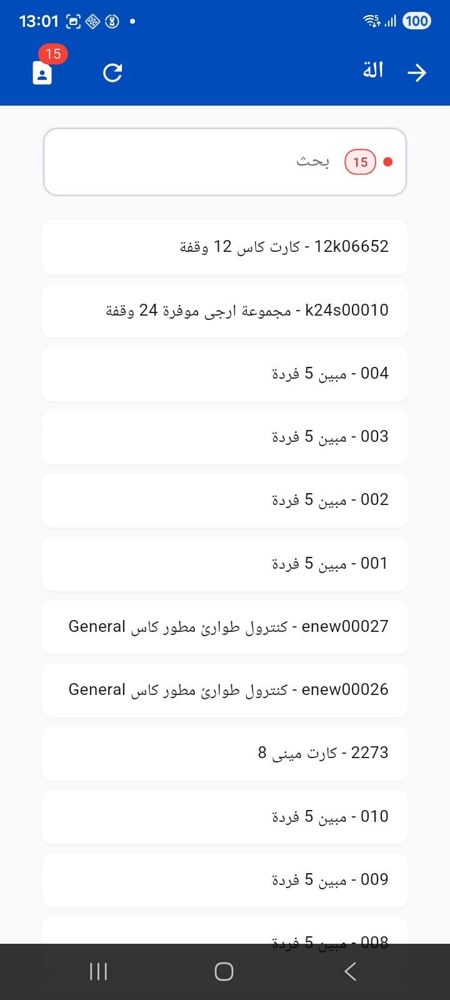

## Warehouse management

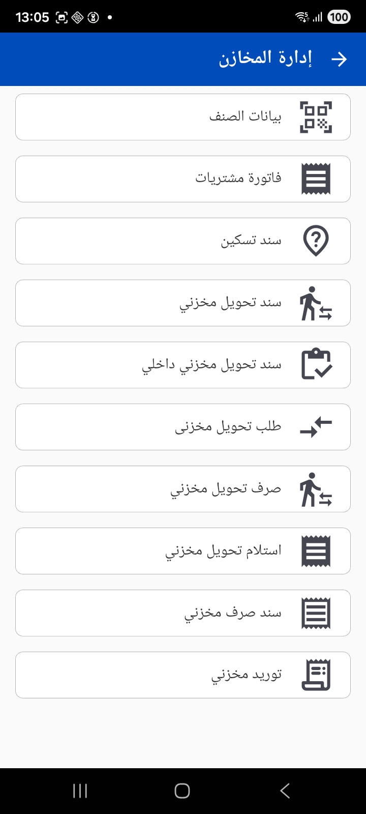

The **Warehouse Management** group gathers the full range of stock movement operations: item data, purchase invoice, allocation file, stock transfer vouchers and their requests, stock issue and receipt, plus electronic stock taking.

### Stock receipt and issue

- **Stock receipt** — to receive goods, and it can be created **based on** a purchase invoice. You specify the customer/supplier, warehouse, locator, quantity and item, with barcode scanning supported in each field.

  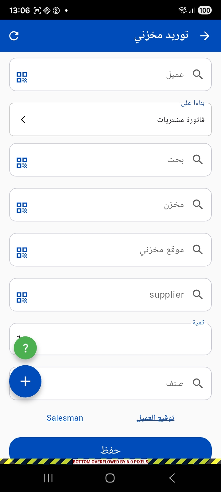

- **Stock issue voucher** — to issue items from the warehouse, and it can be linked to an invoice or sales document.

### Stock transfers

- **Stock transfer voucher** and **internal stock transfer voucher** (movement between locators within the same warehouse).
- **Stock transfer request** — specifies the **from** and **to** warehouse and locator, the item and quantity, and can be created **based on** a sales order.

  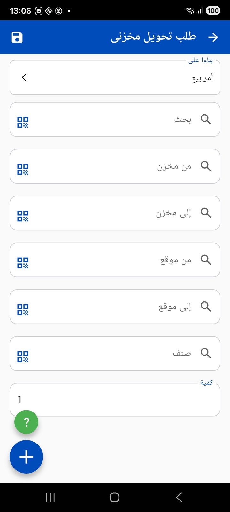

- **Issue stock transfer** and **receipt stock transfer** — to execute the transfer in two stages (issue from the sending warehouse, then receipt at the receiving warehouse); the receipt voucher is created **based on** the issue voucher.

  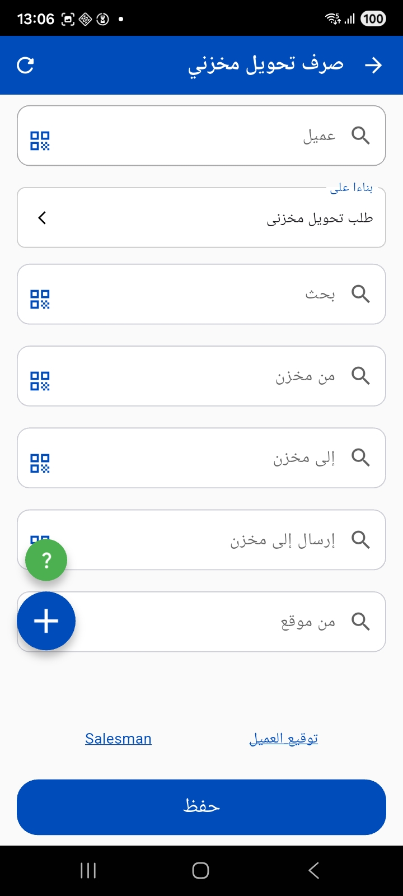

  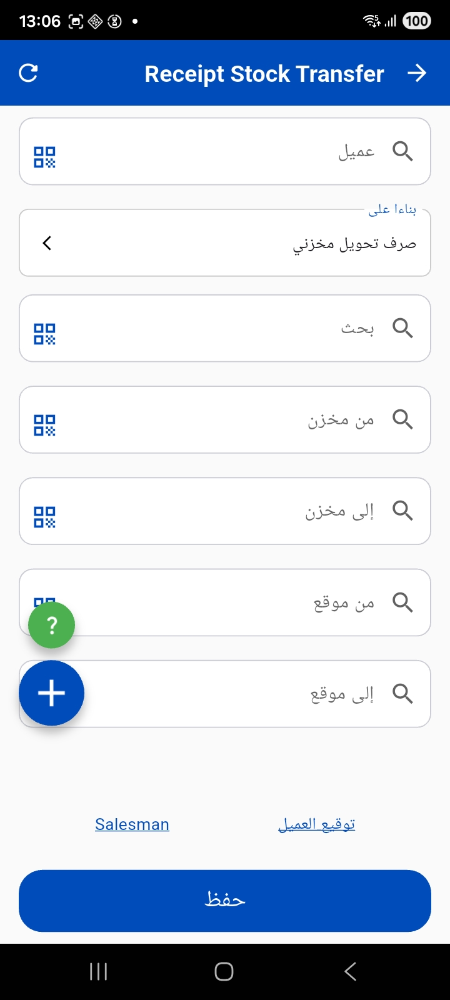

## Electronic stock taking

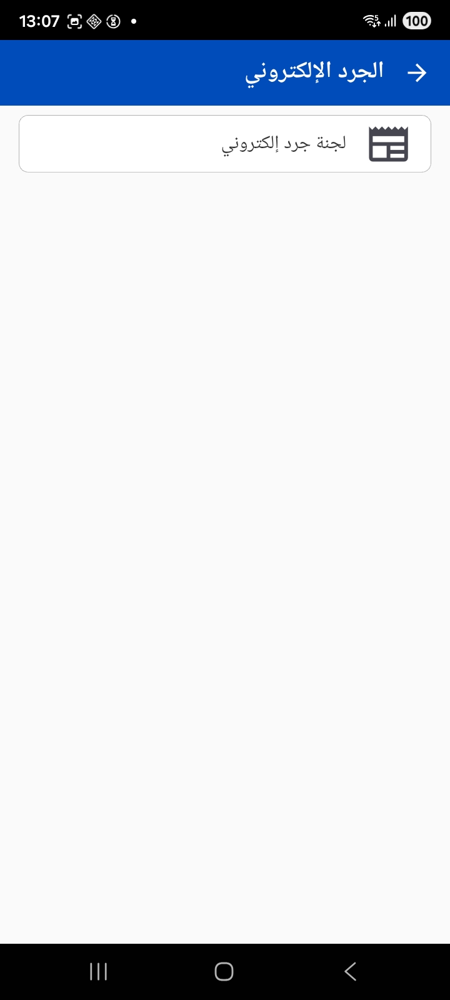

**Electronic stock taking** lets you count inventory from the phone: the warehouse keeper opens the stock-taking document, scans each item's barcode to add it, and records the actual quantity for each item/locator. The app supports **adding lines automatically** on scan and **auto-saving as a draft** at intervals, so the count data is never lost.

::: tip Tuning barcode behavior in stock taking
The administrator can set a regular expression to validate the barcode, prevent item repetition, hide the quantity, and prevent editing an item's color, size or unit during the count when using the barcode.
:::

## Notes for the administrator

- The administrator decides from the [Mobile App configuration](./mobile-application-guide.md) how requests coming from the app are imported (sales order, invoice, issue, receipt, transfer…), the allowed books and warehouses, and the **criteria** that determine which customers and items are sent to the app.
- Options such as auto-adding a line, saving as a draft, and the print templates for documents and receipts are also configured on the server side.
- The stock-taking and warehouse management (WMS) screens appear only if the corresponding modules are licensed for your organization.
