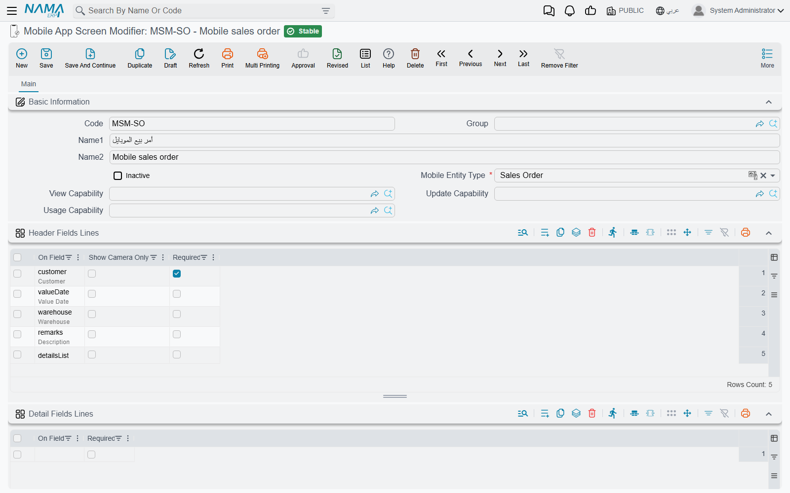
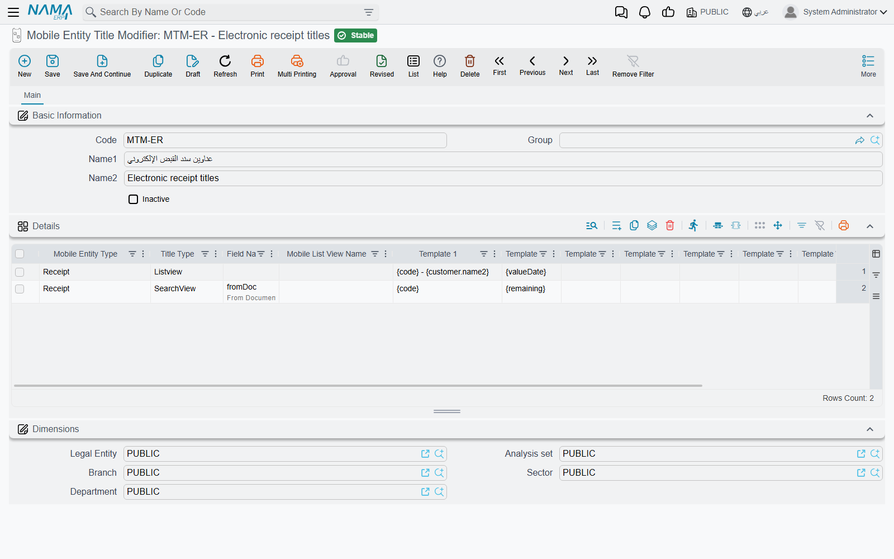
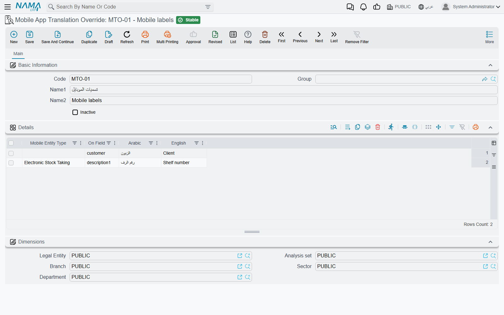
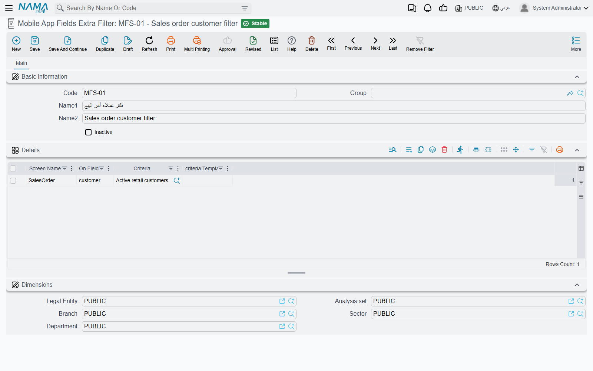

# Shaping the App's Screens: Fields, Card Titles, Labels and Lookups

Every screen in Nama Mobile comes with a sensible default: the sales order shows customer, warehouse and lines; the vacation request shows the vacation type, the dates and the balance. Real companies rarely want exactly that. A distributor wants its reps to see only three fields and to be forced to photograph the shelf; a contractor wants its list of form documents to show the project name rather than the code; an HR team calls the field "Leave reason" rather than "Reason". Four screens under **Basic → Mobile Apps** cover these needs without a new version of the app:

| Screen | Arabic | Changes |
|---|---|---|
| **Mobile App Screen Modifier** | تعديل شاشة التطبيق | Which fields a document screen shows, in which order, which are required |
| **Mobile Entity Title Modifier** | طريقة عرض بيانات المستند فى التطبيق | What each card says in a list, or in the result list of a lookup |
| **Mobile App Translation Override** | ترجمة حقول تطبيق المحمول | The wording of any label in the app |
| **Mobile App Fields Extra Filter** | معايير إضافية لفلتر حقول تطبيق المحمول | Which records a lookup field offers |

All four have an **Inactive** box: tick it to switch a record off without deleting it. To see when each change reaches the phone, read [When a change reaches the phone](./mobile-administration.md#When-a-change-reaches-the-phone).

## Choosing the fields on a screen — Mobile App Screen Modifier

A screen modifier rewrites one app screen. Pick the screen in **Mobile Entity Type** — *Sales Order*, *Vacation*, *Electronic Stock Taking*, *Form Document 1*, and so on — and then list the fields you want in the grids below it.

**Header Fields Lines** is the main grid. As soon as it has at least one line, the app stops using its built-in layout for that screen and shows **only** the fields you listed, **in the order you listed them**. Each line has three columns:

| Column | What it does |
|---|---|
| **On Field** | The field to show. The drop-down suggests exactly the fields the app knows how to draw on that screen. |
| **Required** | The app refuses to save the document until the user fills this field. |
| **Show Camera Only** | On a lookup field: the user can fill it only by scanning a code with the camera; typing and searching are switched off. Useful when the rep must physically scan the item or the customer card. |

::: warning The lines are a field too
On document screens the suggestions include `detailsList` — the block that holds the document's lines. It is a field like any other here: if you build a header list and leave it out, the screen has no lines at all. Add it where you want the lines to appear.
:::

Leave **Header Fields Lines** empty and the header keeps its built-in layout.

The other grids work the same way for the document lines, each on its own — you can rewrite the line form and keep the built-in header, or the other way round:

| Grid | Changes |
|---|---|
| **Detail Fields Lines** | The fields on the form the user fills for one line, in order, with the **Required** box. Empty means the built-in line form. |
| **Grid Card Lines** | The fields printed on each line's card in the lines list. **Reference Show Type** decides how a lookup value is printed: **Code Only**, **Name1** (Arabic name), **Name2** (English name) or **Local Name** (the name in the language the app is running in). Empty means the built-in card. |
| **Detail Fields Lines(2)**, **Grid Card Lines(2)**, **Detail Fields Lines(3)**, **Grid Card Lines(3)** | The same, for the second and third line grids. Only the form documents (Form Document 1 to 4) have them. |

A field that the app does not know for that screen is ignored rather than refused, so a typed field that does not appear on the phone is almost always a field the screen cannot draw. Pick from the suggestions.

::: tip Different layouts for different branches
The server only uses the screen modifiers the user is allowed to see by their legal entity, branch and other dimensions. To give one branch a different layout, put that branch on its own screen modifier. For any one user, though, keep a single active modifier per screen: when two apply, only one is used, and which one is not predictable.
:::

## Changing what a card says — Mobile Entity Title Modifier

In a list, the app prints a few default facts about each record, chosen by the app for that screen. A title modifier replaces those lines with text you write. Each line of the **Details** grid is one rule:

| Column | What it does |
|---|---|
| **Mobile Entity Type** | The app screen whose cards you are rewriting — for **SearchView**, the screen that holds the lookup field. Required. |
| **Title Type** | **Listview** — the screen's own list of records. **SearchView** — the result list that opens when the user searches in a lookup field. Required. |
| **Field Name** | Only for **SearchView**: the lookup field the rule applies to — for example `fromDoc`, the document an electronic receipt is created from. Must be empty for **Listview**. |
| **Mobile List View Name** | Only for the *Delivery Document* screen in **Listview** mode, which has two lists: **AssignDeliveryDocs** (deliveries waiting to be taken) and **PendingOrders** (deliveries to carry out). Leave it empty everywhere else. |
| **Template 1** … **Template 10** | The text of the card, one template per line, written in Tempo — for example `{code} - {customer.name1}`. |

The templates are filled in on the server with the record's own values, using the same Tempo language as the rest of the system — see the [Tempo manual](/admin/tempo.md). So the card can show any field of the record, including fields of the records it refers to, and not only the few the app downloads.

### Messages you may see

These four refusals all come from the same rule — which columns go with which **Title Type**. The product has no Arabic text for them, so they appear in English on Arabic screens too.

| Message | Why | What to do |
|---|---|---|
| *Field name is required when title type is search view in line {0}* | A **SearchView** rule has no **Field Name**. | Name the lookup field whose results you are rewriting. |
| *Field name must be empty when title type is list view in line {0}* | A **Listview** rule has a **Field Name**. | Clear it. A list view has no field. |
| *Mobile list view name must be empty when title type is search view in line {0}* | A **SearchView** rule has a **Mobile List View Name**. | Clear it. |
| *Mobile list view name must be empty when mobile entity type is not Delivery Document in line {0}* | **Mobile List View Name** is filled for a screen other than the delivery document. | Clear it; only the delivery document has more than one list. |

## Your own wording for the app's labels — Mobile App Translation Override

Every label the app shows comes from its own built-in dictionary, in Arabic and in English. A translation override replaces entries in that dictionary for everyone. Each line of the **Details** grid replaces one entry:

| Column | What it does |
|---|---|
| **Mobile Entity Type** | Optional. Leave it empty to change the label everywhere in the app. Fill it to change the label on that one screen only — for example to call `description1` "Shelf number" on the stock taking screen while it keeps its usual name elsewhere. |
| **On Field** | The dictionary entry to replace. The drop-down suggests the entries the app uses, such as `description1`, `customer` or `Settings`. Required. |
| **Arabic** / **English** | The new wording for each language. Fill one or both: an empty one leaves that language's label as it was. |

The override is merged into the app's dictionary when the user logs in or reloads the app data, and it stays in force until you make the line inactive.

## Narrowing what a lookup offers — Mobile App Fields Extra Filter

When the user taps a lookup field in the app — the customer on a sales order, the vacation type on a vacation request, the warehouse on a stock taking — the app asks the server for the records to offer. A fields extra filter adds a condition to that request, so the rep sees only *their* customers, or only the vacation types that apply. Each line of the **Details** grid filters one field on one screen:

| Column | What it does |
|---|---|
| **Screen Name** | The app screen, chosen from the suggestions (*SalesOrder*, *Vacation*, *ElectronicStockTaking*…). |
| **On Field** | The lookup field on that screen. The suggestions list the fields of the chosen screen that can be filtered. |
| **Criteria** | A fixed condition, picked from the [Criteria Definitions](/platform/automation-and-rules/criteria-definitions.md) — for example "customers whose salesman is the current user". |
| **criteria Template** | A condition written in Tempo that is worked out from the document the user is filling at that moment — for example, offering only the items of the warehouse already chosen on the document. See the [Tempo manual](/admin/tempo.md) for writing dynamic criteria. |

When both **Criteria** and **criteria Template** are filled, a record has to pass both. A line with no screen name or no field is ignored.

The lines apply only to lookups made from the app. For the browser screens, the same job is done by [Field Filter with Criteria](/platform/field-filtering/field-filter-with-criteria.md).

