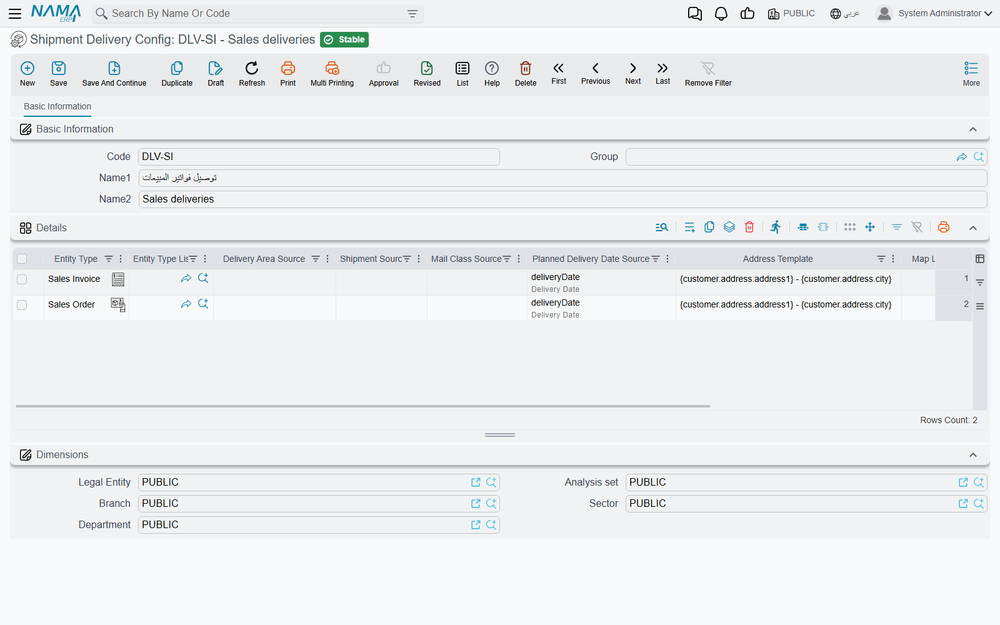
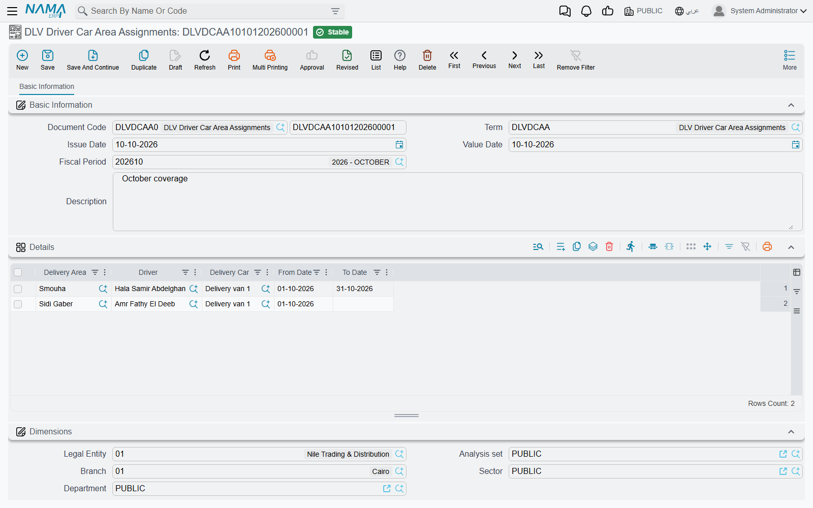
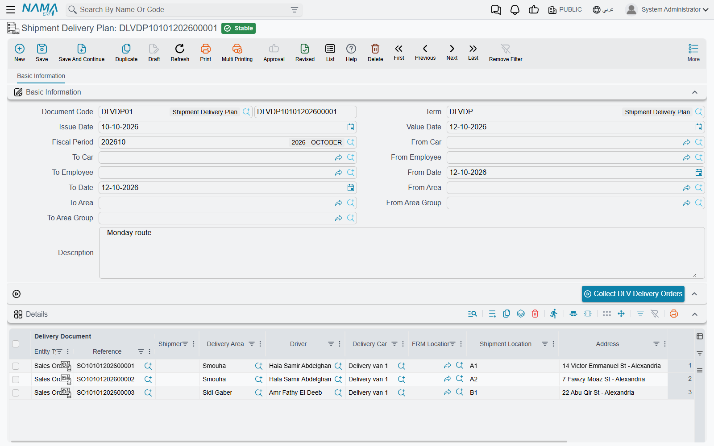
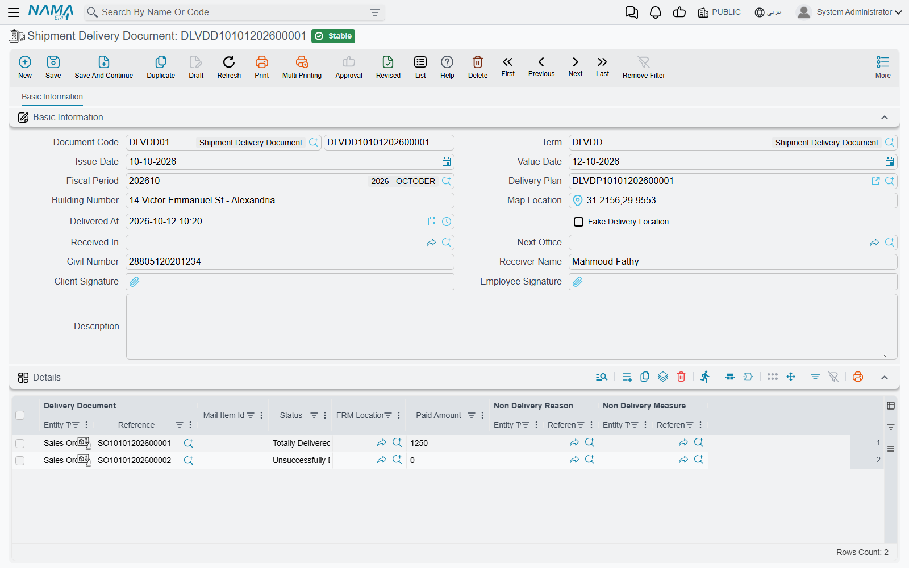
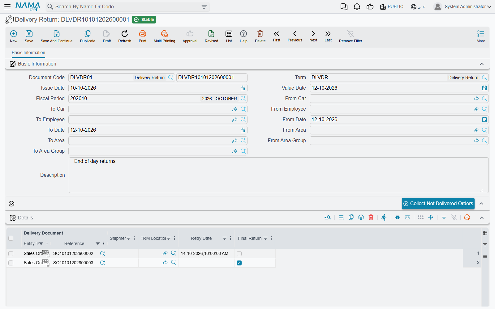

# Shipment Delivery: Plan, Deliver, Return

The driver app's **Shipment delivery voucher** and **Delivery orders** screens (see [Customer Service, Delivery & Receipts](/modules/mobile/mobile-crm-delivery.md)) are only the front end. Behind them sit seven screens under **Basic → delivery Setting** that decide which shipments exist, which driver and car take them, and what happens to a shipment that did not reach its customer. This page walks through all seven in the order you set them up and use them.

::: info Required licence
`basic-mobile-shipment-delivery`. Six of the seven screens are gated behind it; **Delivery Car** is part of the base installation.
:::

::: warning Not the same as Mobile Delivery in Service Center
Service Center has its own courier route sheet, the [Mobile Delivery Document](/modules/servicecenter/mobile-delivery/servicecenter-mobile-delivery-overview.md). It is a separate feature with separate screens. Nothing on this page applies to it.
:::

## The idea in one paragraph

Every time a document you want delivered is saved — a sales invoice, say — the system quietly writes one **shipment** record for it (or one per shipment number, if the document carries several). That record holds the customer, phone number, address, map location, delivery area and planned delivery date, and it has a delivery state. Three documents then move that state forward: the **Shipment Delivery Plan** hands shipments to a driver and car, the **Shipment Delivery Document** records whether each one was delivered, and the **Delivery Return** sends the failures back for another try or closes them for good. The shipment records themselves have no screen of their own; you see them through the **Collect** buttons and through the driver app.

| Screen (menu name) | Arabic | What it is |
|---|---|---|
| **Shipment Delivery Config** | إعدادات توصيل شحنات | Which document types create shipments, and where each shipment detail is read from. |
| **Shipment Delivery Area** | منطقة توصيل شحنات | The delivery zones a city is divided into. |
| **Delivery Car** | سيارة توصيل | The vans, with their numbered storage spots. |
| **DLV Driver Car Area Assignments** | مستند تسكين سائق و سيارة توصيل على منطقة توصيل | Which driver and car cover which area, and for which dates. |
| **Shipment Delivery Plan** | خطة توصيل شحنات | The day's loading sheet: shipments assigned to drivers and cars. |
| **Shipment Delivery  Document** | سند توصيل شحنات | The proof of delivery, normally created from the driver app. |
| **Delivery Return** | مستند مرتجع توصيل | Shipments that came back: retry later, or return for good. |

None of these documents posts anything to the ledger or moves stock.

## Setting up

### 1. The delivery configuration

Open **Shipment Delivery Config** and add one line per kind of document that should produce shipments. In the **Entity Type** column pick the document type (for example *Sales Invoice*), or use **Entity Type List** to cover several types in one line. The remaining columns say where each piece of shipment information comes from on that document:

| Column | What it fills | If you leave it empty |
|---|---|---|
| **Shipment Source** | The shipment number. If it points at a grid column, the document produces one shipment per value. | One shipment with no number. |
| **Delivered To Source** | The receiving party. | For invoice-type documents, the customer. |
| **Phone Number Source** | The phone the driver calls. | For invoice-type documents, the customer's mobile. |
| **Map Location Source** | The point on the map. | For invoice-type documents, the map location on the customer's address. |
| **Planned Delivery Date Source** | When the shipment is due. | The document's value date. |
| **Delivery Area Source** | The delivery area. | Fill it — see the tip below. |
| **Mail Class Source** | A mail class, used only by the postal module. | Nothing. |
| **Address Template** | The address text the driver reads, built from the document's fields. | — |

The configuration does nothing on its own. Open the **Document Term** (Basic → Settings → Document Term) of each document that should produce shipments and pick it in the **DLV Delivery Configuration** field. From then on, every save of a document with that توجيه writes or refreshes its shipments; deleting the document deletes them.

::: tip Always fill the Delivery Area Source
The plan matches shipments to drivers and cars **by delivery area**. A shipment without an area still appears when you collect, but it never receives a driver or car automatically, so you end up assigning it by hand.
:::

### 2. Areas, cars and who covers what

- **Shipment Delivery Area** is a plain master file — code and name. Give the areas groups if you want to plan a whole district at once; the plan can filter by area group.
- **Delivery Car** records the van. Its **Order Location In Car** grid lists the numbered spots in the van (shelf A1, A2, …) in loading order; the plan uses that list to tell the driver where each shipment sits.
- **DLV Driver Car Area Assignments** is a document whose grid says, line by line: this **Delivery Area** is covered by this **Driver** in this **Delivery Car**, from **From Date** to **To Date**. Leave a date empty for an open-ended assignment. The plan uses the assignment that is valid **today** — the day you press the button, not the plan's date.

## The daily cycle

A worked example: a spare-parts shop issues 40 sales invoices on Sunday, all due for delivery on Monday. The sales invoice's توجيه points at a delivery configuration, so 40 shipments now exist, each waiting with its customer's phone, location and area.

### Step 1 — Plan: who takes what

On Monday morning the dispatcher opens a new **Shipment Delivery Plan**, sets **From Date** and **To Date** to Monday, optionally narrows by **From Area / To Area**, **From Area Group / To Area Group**, **From Car / To Car** or **From Employee / To Employee**, and presses **Collect DLV Delivery Orders**. The grid fills with every shipment due in that date range that is still waiting or has been sent back for a retry. For each one it shows the source document (the **Delivery Document** column), the **Shipment**, the **Delivery Area**, the **Address** and **Location**, the **Delivery Date**, and:

- **Driver** and **Delivery Car**, taken from the driver-car-area assignment that covers the shipment's area today;
- **Shipment Location**, the spot in the van: the first shipment for a car gets the car's first **Order Location In Car**, the second gets the second, and so on.

How the car and employee filters behave is worth knowing: they do not filter shipments directly. They limit which **assignments** are considered, and once you fill any of them, a shipment whose area has no matching assignment is dropped. A shipment that has **no area at all** is kept whatever the filters say.

The dispatcher can still edit any line — change a driver, add or delete a shipment — and then saves the plan. Saving moves each shipment to *planned* under that driver and car. Only now do the shipments appear in the driver's **Delivery orders** screen in the app, grouped by phone number.

::: tip When the button fills nothing
**Collect DLV Delivery Orders** replaces the grid silently. An empty grid means no waiting shipment falls in the date range and filters — check the dates first, then that the source documents' توجيه carries the delivery configuration.
:::

### Step 2 — Deliver: the proof

At each customer the driver opens the **Shipment delivery voucher** in the app, marks each shipment *delivered* or *failed*, takes the customer's and the driver's signatures, and saves. The app creates a **Shipment Delivery  Document** in the ERP with:

- the arrival address and map point, the **Delivered At** time, and a **Fake Delivery Location** tick when the app flagged the reported position as fake;
- **Receiver Name**, **Civil Number**, **Client Signature** and **Employee Signature**;
- one grid line per shipment: the source document (**Delivery Document**), the shipment number (**Mail Item Id**), the **Status** — *Totally Delivered* or *Unsuccessfully Delivered* — and, for a failed drop, **Non Delivery Reason** and **Non Delivery Measure**. **Paid Amount** records cash collected on delivery.

You can also enter a delivery document by hand in the ERP; when a barcode scanner is used, scanning into **Mail Item Id** jumps to the next line. Saving moves each shipment to *delivered* or *not delivered*, under the driver on the line. The document has no checks of its own beyond the usual required fields.

### Step 3 — Return: try again or give up

At the end of the day the dispatcher opens a **Delivery Return**, sets the dates and, if needed, the area, area group and employee filters (here **From Employee / To Employee** filter shipments directly, by the driver who last handled them), and presses **Collect Not Delivered Orders**. The grid fills with the shipments that failed — plus any that are still waiting and were never planned in that range. For each line:

- set **Retry Date** to the date and time of the next attempt — the shipment will be collected again by any plan whose date range covers that retry date; or
- tick **Final Return** to close the shipment for good — no plan will ever collect it again.

Save the return. If you type a shipment number on a line by hand and leave **Delivery Document** empty, the system fills the source document in for you on save.

### What decides a shipment's state

A shipment's state is always the state set by the **latest** plan, delivery document or return that mentions it, ordered by value date and then by creation time. Cancelling or deleting any of those documents removes its contribution and the shipment falls back to the previous one — so cancelling a delivery document puts its shipments back to *planned*, and cancelling the only plan puts them back to *waiting*.

| Last document that touched the shipment | State | Collected by the plan? | Collected by the return? | In the driver's Delivery orders? |
|---|---|---|---|---|
| none (source document just saved) | waiting | yes | yes | no |
| Shipment Delivery Plan | planned | no | no | yes |
| Shipment Delivery Document — *Totally Delivered* | delivered | no | no | no |
| Shipment Delivery Document — *Unsuccessfully Delivered* | not delivered | no | yes | yes |
| Delivery Return — Final Return unticked | returned | yes, on the retry date | no | no |
| Delivery Return — Final Return ticked | finally returned | no | no | no |

The driver app's search box (shipment number or phone number) is wider than the list: it finds any shipment that is not yet delivered, whatever its state.

## Buttons on these screens

| Screen | Button | What it does |
|---|---|---|
| Shipment Delivery Plan | **Collect DLV Delivery Orders** (in the page) | Fills the grid from waiting and returned shipments, with driver, car and van spot. |
| Delivery Return | **Collect Not Delivered Orders** (in the page) | Fills the grid from failed and waiting shipments. |
| Shipment Delivery  Document | **Resend IPS Events** (More menu) | Postal installations only — see below. |

The other screens carry only the standard toolbar.

## With the postal module

On installations that also run the Freight Management postal service, the same screens carry a few extra things: the **FRM Location** column on the plan, delivery-document and return grids, the **Received In** and **Next Office** fields on the delivery document, and a status-to-event grid on the delivery document's توجيه. A saved delivery document then updates the receiver response on the postal [delivery request](/modules/freight/ips-delivery.md) it points at and queues the matching tracking events for the postal system; **Resend IPS Events** queues them again for the selected documents. The plan also refuses a shipment that the postal storage records show as no longer held at any location. Outside a postal installation, ignore those columns.

## Messages you may see

| Message | Why | What to do |
|---|---|---|
| *There is No (Not Delivered) Orders to collect* — «لا يوجد طلبات غير موصلة ليتم تجميعها» | **Collect Not Delivered Orders** found no failed or waiting shipment in the range. | Widen the dates or clear the employee and area filters. |
| *You can not use shipment {0} because it does not belong to any location* — «لا يمكنك استخدام الشحنة {0} حيث أنها لا تنتمي إلى أي موقع» | Postal installations only: saving a plan whose line names a shipment that the postal storage records show has already left every location. | Remove the line, or correct the **FRM Location**. |
