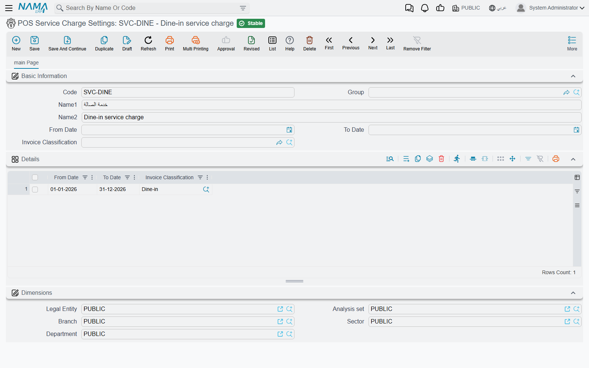
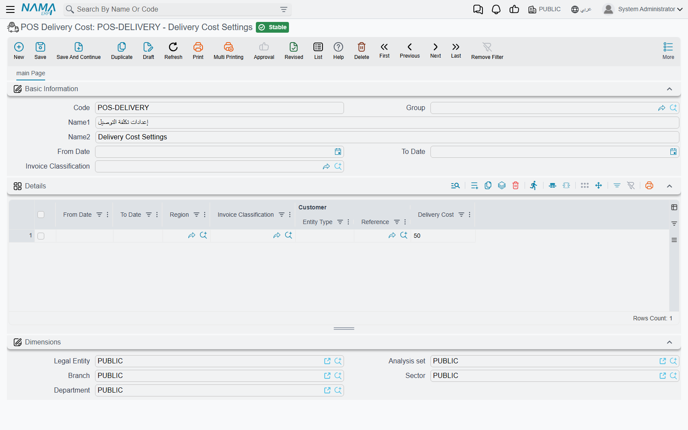
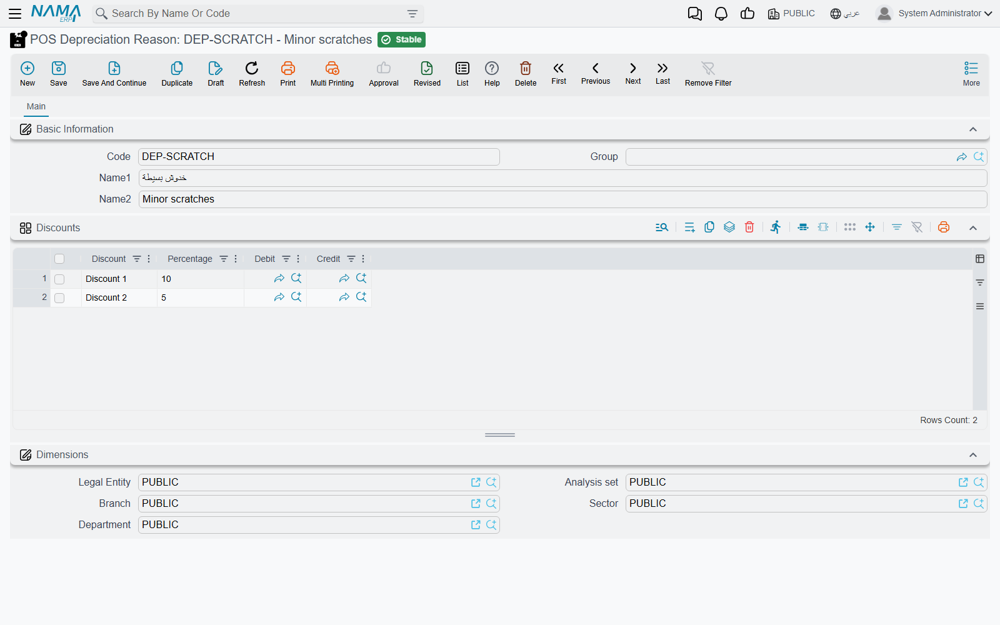

# Service Charge, Minimum Charge, Delivery & Return Reasons

Restaurants and cafés often add something to the bill that is not a dish: a service charge, a delivery fee, or a top-up when a table spends less than the minimum. The register handles all three the same way — it adds a **special item line** to the invoice and prices it for you. This page explains how to set those up on the server, plus the two lists cashiers pick from when goods come back: return reasons and depreciation reasons.

## How the three charges work

Each charge needs two things:

1. **An item.** A service item for each charge — for example `SRV` "Service charge", `DLV` "Delivery", `MIN` "Minimum charge top-up". The item is what appears as a line on the invoice and what the sales accounts see. Pick it in **Service Charge Item**, **Delivery Item** and **Minimum Charge Item**.
2. **A settings record** that says *when* the charge applies — between which dates and for which invoice classification. These are the three settings screens below.

Both are chosen on **POS Settings** (**Point of sale → Settings → POS Settings**) for every register, and can be chosen again on an individual **Register**, which then wins for that register.

A register adds each special item **once**; scanning it again is refused (*Service item is already added* — «تمت إضافة صنف الخدمة السياحية بالفعل», *Delivery item is already added* — «تمت إضافة صنف التوصيل بالفعل»).

### Service charge

**POS Service Charge Settings** (**Point of sale → Settings → POS Service Charge Settings**) has a grid of lines, each with **From Date**, **To Date** and **Invoice Classification**. A line matches when the invoice's date falls in its range and its classification is the invoice's (an empty cell matches anything).

The amount is a percentage, set with the item:

- **Service Charge Percentage** (*نسبة الخدمة السياحية*) — e.g. 12%.
- **Service Charge Calculated From** (*الخدمة السياحية تحسب من*) — which figure of the other lines the percentage is applied to: **Base Price**, **After Discount 1** … **After Discount 8**, after tax 1 or 2, or **Net Value**. Empty means after discount 8.

**Example.** A table orders two mains at 100 each and a dessert at 50, with no discounts: 250 in total. With 12% calculated from Base Price, the service line is priced at 30. If the waiter later adds a 40 drink, the register recalculates the line to 34.80 (*Service charge recalculated* — «تم اعادة احتساب تكلفة الخدمة السياحية»).

When the service item is added depends on three options (each on POS Settings, and on the register with an extra **Inherited** choice that follows POS Settings):

| Option | On screen (Arabic) | Effect |
|---|---|---|
| Add Service Item Automatically In Invoice | إضافة صنف الخدمة السياحية تِلْقائيًا في الفاتورة | Every new invoice starts with the service line. |
| Automatically Add Service Item When Selecting Table | إضافة صنف الخدمة السياحية تلقائياً عند اختيار طاولة | The line is added when the cashier picks a table — dine-in pays service, take-away does not. |
| Automatically Add Service Item When Selecting Invoice Classification | إضافة صنف الخدمة السياحية تلقائياً عند اختيار تصنيف الفاتورة | When the classification changes, the line is added if a settings line matches and removed if none does. |

### Delivery charge

**POS Delivery Cost** (**Point of sale → Settings → POS Delivery Cost**) is a price list for delivery. Each line has **From Date**, **To Date**, **Region**, **Invoice Classification**, **Customer** (a customer or a customer class) and **Delivery Cost**. The register takes the **first line that matches** the invoice's date, classification, delivery region and customer, so put specific lines (a VIP customer, a far region) above general ones.

**Example.** Lines: Region "Downtown" → 15; Region "Suburbs" → 30; customer class "Corporate" → 0. A customer from the Suburbs gets a 30 delivery line; change the region on the invoice to Downtown and the line is re-priced to 15.

The delivery line is added:

| Option | On screen (Arabic) | Effect |
|---|---|---|
| Add Delivery Item Automatically In Invoice | إضافة صنف خدمة التوصيل تِلْقائيًا في الفاتورة | Every new invoice starts with the delivery line. |
| Add Delivery Item When Selecting Customer | إضافة صنف خدمة التوصيل مع اختيار عميل | Selecting a customer adds the line if a cost line matches, removes it if none does. |
| Automatically Add Delivery Item When Selecting Invoice Classification | إضافة صنف التوصيل تلقائياً عند اختيار تصنيف الفاتورة | The same, triggered by the invoice classification — e.g. a "Delivery" classification. |

Changing the invoice's region always re-checks the delivery line.

### Minimum charge

**Pos Minimum Charge Settings** (**Point of sale → Settings → Pos Minimum Charge Settings**) has lines with **From Date**, **To Date**, **Invoice Classification** and **Minimum Charge Value**. When a line matches, the register adds the minimum-charge item priced at **the minimum minus what the table has ordered** (measured at **Minimum Charge Calculation Type** — *الحد الأدنى للطلب يحسب من* — after discount 8 if empty).

**Example.** A lounge has a 300 minimum on Friday nights. A table orders 220; the register adds a top-up line of 80. Before the invoice is saved the register checks the top-up is still right; if the table has ordered more since, it recalculates the line and stops the save so the cashier sees the new figure (*Minimum charge item has been recalculated*).

**Automatically Add Minimum Charge Item When Selecting Invoice Classification** (*إضافة صنف الحد الأدنى تلقائياً عند اختيار تصنيف الفاتورة*) adds or removes the line as the classification changes.

### Reservations

By default none of the three charges is added to an **order reservation** or its cancellation. Turn them on separately on POS Settings: **Enable Service Charge In POS Reservation Document**, **Enable Delivery Cost In POS Reservation Document**, **Enable Minimum Charge In POS Reservation Document**.

## Return reasons

**Nama POS Return Reason** (*سبب الإرجاع*, **Point of sale → Settings → Nama POS Return Reason**) is a simple list — code and name — that the cashier picks from on a sales return ("Wrong size", "Damaged", "Changed mind"). It carries no calculation; it is there so returns can be reported by reason. To force cashiers to explain every return in words as well, turn on **Remarks Required In Sales Return** (*الملحوظه مطلوبه في مردود نقاط البيع*) on POS Settings.

## Depreciation reasons

A **POS Depreciation Reason** (*سبب الهالك*, **Point of sale → Master Files → POS Depreciation Reason**) is a preset deduction a cashier applies to a sales line with the line's **Depreciate** button (*تحويل إلى هالك*) — see [Returns & Replacements](../pos-returns-and-replacements.md) for the cashier's side. The button appears when the register has screen settings and **Do Not Add Sales Line Depreciate Button** is not ticked.

The reason's **Discounts** grid says which of the line's eight discount slots receive the deduction:

| Column | Arabic on screen | Meaning |
|---|---|---|
| Discount | التخفيض | Which discount slot (Discount 1 … Discount 8). |
| Percentage | النسبة | The deduction, as a percentage of the **original** price. |
| Debit / Credit | مدين / دائن | Optional accounting sides for this deduction. |

The percentages add up: a reason with 10% in Discount 1 and 5% in Discount 2 takes 15% off the original price in total (the register converts the second slot so it is 5% of the original, not of what remains). The total cannot exceed 100%: *Total of Discounts percentages {0} must be less than or equal to 100%* — «المجموع الكلي لنسب التخفيضات {0} يجب أن يكون أقل من أو يساوي 100%».

When both **Debit** and **Credit** are filled on a line, a POS sales invoice carrying that depreciation gets an extra pair of ledger lines for the deducted value — useful for moving the loss to a "damaged goods" account instead of leaving it as an ordinary discount.

## Messages you may see

| Message | Why | What to do |
|---|---|---|
| *No service item defined* | A service line was due but no **Service Charge Item** is set on the register or POS Settings. Shown in English on Arabic screens too. | Choose the item. |
| *No delivery item defined* | The same for **Delivery Item**. Shown in English on Arabic screens too. | Choose the item. |
| *No min charge item defined* | The same for **Minimum Charge Item**. Shown in English on Arabic screens too. | Choose the item. |
| *Service item is already added* — «تمت إضافة صنف الخدمة السياحية بالفعل» | The cashier tried to add the service item a second time. | Leave the existing line; the register prices it. |
| *Delivery item is already added* — «تمت إضافة صنف التوصيل بالفعل» | The same for the delivery item. | None. |
| *Minimum charge item has been recalculated* | The order changed after the top-up line was priced. Shown in English on Arabic screens too. | Check the new amount and save again. |
| *Total of Discounts percentages {0} must be less than or equal to 100%* — «المجموع الكلي لنسب التخفيضات {0} يجب أن يكون أقل من أو يساوي 100%» | A depreciation reason's percentages add up to more than 100%. | Lower the percentages. |
