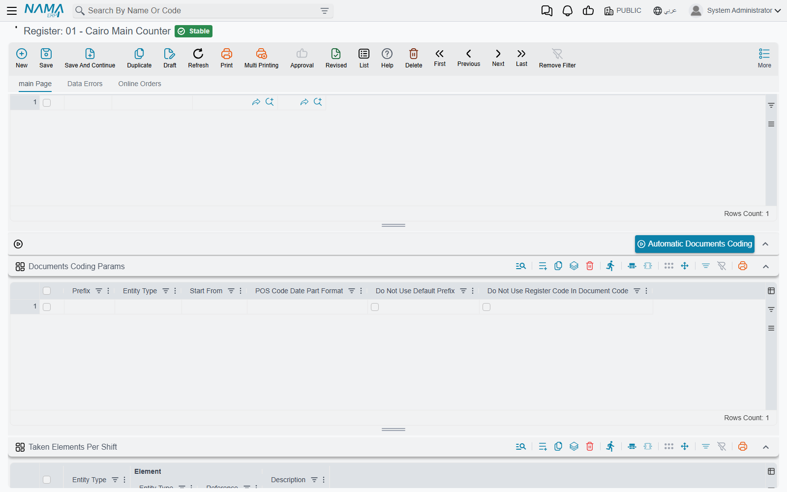

# Numbering POS Documents

Registers work offline, so they cannot ask the server for the next invoice number the way a screen in the ERP does. Each register **numbers its own documents**, and the numbers are built so that two registers can never produce the same code. This page explains how a code is put together and which settings change it — the prefix, the number of digits, a date part, and where a sequence starts.

## How a code is built

Every code a register produces is made of up to five parts, in this order:

| Part | Where it comes from | Example |
|---|---|---|
| 1. Prefix | The **Prefix** column of the register's coding grid (see below), if filled | `BR1-` |
| 2. Document-type prefix | Fixed per document type — `1` for a sales invoice, `2` for a return, and so on (table below) | `1` |
| 3. Register code | The register's own **Code** | `R01` |
| 4. Date part | A date pattern such as `yyMMdd`, if one is set | `261010` |
| 5. Serial | A running number, left-padded with zeros to a fixed length (8 digits unless you change it) | `00000001` |

With no settings at all, register `R01`'s first sales invoice is `1R0100000001` and its first return is `2R0100000001`. Add the date part `yyMMdd` and the invoice issued on 10 October 2026 becomes `1R0126101000000001`.

The serial counts **per document type and per prefix**. Because the date part is part of the prefix, a register that uses one starts again from `00000001` every day — the date keeps the codes unique.

The document-type prefixes are:

| Document | Prefix |
|---|---|
| POS Sales Invoice | `1` |
| POS Sales Return | `2` |
| POS Sales Replacement | `3` |
| POS Credit Note | `4` |
| POS Internal Message | `5` |
| POS Stock Transfer Request | `6` |
| POS Payment | `7` |
| POS Receipt | `8` |
| Point of Sale StockTaking Details Document | `9` |
| POS Order Reservation | `r` |
| POS Cancel Reservation | `c` |
| POS Stock Receipt | `rcpt` |
| Scrap Document | `sc` |
| Shortfalls Document | `sf` |

Shift codes and cash-count codes have no document-type prefix and never take a date part — they are the register code followed by the serial. A shift's closing carries the same **Shift Code** as its opening.

## Where the settings live

Three places control numbering, from the broadest to the most specific.

**POS Settings** (**Point of sale → Settings → POS Settings**) holds the company-wide defaults:

- **Pos Code Suffix Length** (*طول لاحقة كود مستندات نقاط البيع*) — how many digits the serial has. Empty means 8.
- **POS Code Date Part Format** (*نمط جزء التاريخ الخاص بكود نقطة البيع*) — the date pattern for every register that does not set its own.

**The register** (**Point of sale → Register → Register**) can set its own **POS Code Date Part Format** in its header; when filled, it replaces the one in POS Settings for that register.

**The register's coding grid**, **Documents Coding Params** (*تكويد مستندات نقاط البيع*), fine-tunes one document type at a time. Each line has:

| Column | Arabic on screen | What it does |
|---|---|---|
| Entity Type | النوع | The document the line applies to. Each type can appear only once. |
| Prefix | بادئة التكويد | Text added at the very start of the code. |
| Start From | يبدأ | The lowest serial the next document may take (see below). |
| POS Code Date Part Format | نمط جزء التاريخ الخاص بكود نقطة البيع | A date pattern for this type only; it beats the register's and the settings' pattern. |
| Do Not Use Default Prefix | عدم استخدام بادئة التكويد الافتراضية | Drops the document-type prefix (`1`, `2`, …). |
| Do Not Use Register Code In Document Code | عدم استخدام كود الماكينة في التكويد | Drops the register code. |

The date-part fields offer two ready patterns, `yyyyMMdd` and `yyMMdd`; any standard date pattern works.

The grid accepts these document types: sales invoice, return, replacement, credit note, internal message, stock transfer request, payment, receipt, stock-taking details, shift opening, cash drawer, order reservation, cancel reservation and stock receipt. Scrap and shortfalls documents always use the default scheme.

::: warning Drop a part only when the rest keeps codes unique
The register code is what keeps two registers' codes apart. Ticking **Do Not Use Register Code In Document Code** on two registers that share the same prefix lets both of them issue `1…00000001`. Remove the register code only when the **Prefix** you give each register already tells them apart.
:::

## Where a sequence starts

When a register needs a new code it takes the **highest** of three numbers and adds one:

1. the highest serial it already has locally for that type and prefix;
2. **Start From** minus one, from the coding grid;
3. the highest serial the server already holds for that register, type and prefix — fetched in the background each time the register starts.

So **Start From** is a floor, not a reset: it can push numbering forward (for example, to begin at `5001` after migrating from an older system) but it can never take numbering back below a code that already exists. The server check is what keeps a freshly reinstalled register — whose local database is empty — from reissuing codes it already sent.

Changing the prefix, the date part or the number of digits starts a **new** sequence, because the register only continues codes that have exactly the same prefix and length.

### Filling the grid automatically

The **Automatic Documents Coding** button (*تكويد مستندات نقاط البيع آليا*) above the grid asks for a prefix, looks up the last code the server holds for each document type of this register, and adds one grid line per type with **Start From** set to the next serial. Lines that already had the same prefix are replaced. Use it after reinstalling a register, or before giving it a new prefix, then save the register so the machine receives the new lines with its next sync.

## A worked example

A chain wants each branch's invoices to read `BR1-…`, `BR2-…` and so on, with the date, and wants branch 1 to continue from invoice 5,000 of its old system.

1. On **POS Settings**, set **Pos Code Suffix Length** to `6`.
2. On branch 1's register (code `R01`), add a grid line: **Entity Type** = POS Sales Invoice, **Prefix** = `BR1-`, **POS Code Date Part Format** = `yyMMdd`, **Start From** = `5001`.
3. Save the register. Once the machine has synced, its next invoice is `BR1-1R01261010005001`.

Because the date part makes every day a new sequence, and **Start From** is the floor of every sequence, the next day's first invoice is `BR1-1R01261011005001`: each day starts again at 5001. If the chain wants one unbroken running number instead, it should leave the date part empty — then the invoice after `BR1-1R01005001` is `BR1-1R01005002`, day after day.

## Messages you may see

| Message | Why | What to do |
|---|---|---|
| *Repeated entity type* — «نوع مكرر» | The register's **Documents Coding Params** grid has two lines for the same document type. | Keep one line per type. |
