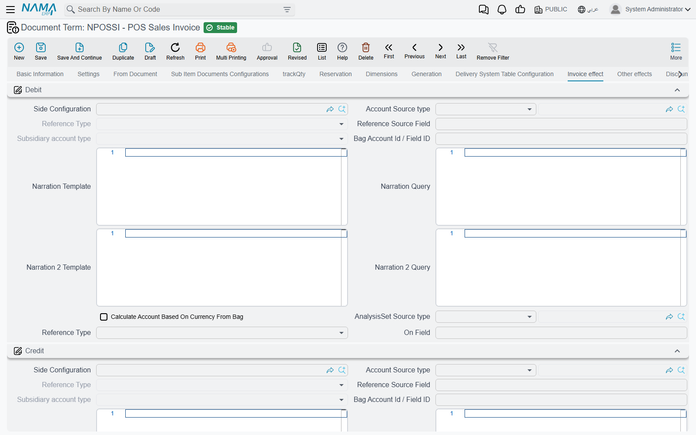

# POS Document Terms

A cashier never picks a book or a term — the register screen has no such field. Yet every document a register sends becomes a normal document on the server, and like any other document it needs a **book** (*دفتر*) and a **term** (*توجيه*): the term is what turns it into accounting entries and stock movements. This page explains how the server chooses them, and what each POS term screen controls.

## Where the book and term come from

Everything starts from the register (**Point of sale → Register → Register**). Its **Books And Terms** grid (*الدفاتر والتوجيهات*) has one line per document type:

| Column | Arabic on screen | What it does |
|---|---|---|
| Entity Type | النوع | The POS document the line is for. |
| Book | الدفتر | The book the document is saved in on the server. Required. |
| Term | توجيه المستند | The default term for that document type. |
| Term In Case Of Error | التوجيه في حالة حدوث خطأ | A fallback term for sales documents (see below). |
| Sub Type | النوع الفرعى | Only for **POS Sales Invoice**: *Normal* or *Service* (see below). |

For most documents that is the whole story: the **book and term on the grid line** are used as they are. This applies to the POS Order Reservation, Held Invoice, Scrap Document, Shortfalls Document, Stock Receipt, Stock Transfer Request, StockTaking Details, Shift Opening, Shift Closing and Cash Drawer.

Four documents can pick a **different term** depending on what happened at the till, using the term grids on the register — or, when the register's grid is empty, the same grid on **POS Settings**:

### Sales invoices — the Sales Terms grid

The **Sales Terms** grid (*توجيهات المبيعات*) has **Type** (*Customer Required* / *Customer Not Required*), **With Subsidiary** (Yes / No), **Record Category** and **Term**. For each invoice the server takes the **first** line that fits:

- **Type** — *Customer Required* fits an invoice that has a customer; *Customer Not Required* fits one without. Empty fits both.
- **With Subsidiary** — *Yes* fits an invoice sold on account to a subsidiary (ذمة); *No* fits one without. Empty fits both.
- **Record Category** — fits when it equals the invoice's document category. Empty fits any category.

If no line fits, the term of the **Books And Terms** line is used. Put the most specific lines at the top: a line with everything empty fits every invoice, so any line below it is never reached.

**Service invoices.** If the register's **Books And Terms** grid has a POS Sales Invoice line with **Sub Type** = *Service*, an invoice that contains only service items takes that line's term, before the Sales Terms grid is consulted.

### Sales returns — the Sales Return Terms grid

The **Sales Return Terms** grid (*توجيهات المردودات*) works the same way, with a different **Type**: *Cash* fits a return refunded in money, *To Credit Note* fits a return refunded as a credit note, and empty fits both. **With Subsidiary** and **Record Category** behave as for invoices. No match falls back to the Books And Terms line.

### Pay-outs and pay-ins — the Payment Terms and Receipt Terms grids

- **Receipt Terms** (*توجيهات المقبوضات*) — the first line whose **Record Category** matches the pay-in's category (or is empty) gives the term.
- **Payment Terms** (*توجيهات المصروفات*) — the first line whose **Type** matches the kind of pay-out (*From Register*, *From Current Employee* or *To Credit Note*) **or** whose **Record Category** matches the pay-out's category is used. Because either match is enough, list the lines in the order you want them tried. (On POS Settings this grid has no category column.)

No match falls back to the Books And Terms line, as above.

::: tip Making the category choose the term
To book pay-outs for "electricity", "cleaning" and "petty purchases" to different accounts, create a document category for each, give each its own term in **Payment Terms**, and turn on **Document Category Is Required In POS Payment Screen** in [POS Settings](./pos-settings-screen.md) so the cashier must choose one.
:::

### The error term

When a sales document arrives at the server and cannot be saved with its normal term **because there is not enough stock**, the server tries again with the **Term In Case Of Error** from the Books And Terms grid. Set this term up the way your business wants such sales recorded, so the sale reaches the server and the stock shortage is dealt with afterwards instead of the document staying unsent. Leave it empty and the document is refused as usual.

## The POS term screens

POS documents have their own term types. Open a term from **Document Term** with the POS document as its type; which tabs you see depends on the document.

| Document | Arabic name | Tabs on the term |
|---|---|---|
| POS Sales Invoice | فاتورة مبيعات نقاط البيع | General settings, **Invoice effect**, **Other effects**, **Discount Effects**, **External Effects** |
| POS Sales Return | مردود نقاط البيع | Same as the invoice |
| POS Order Reservation | سند حجز اوردر نقاط بيع | Same as the invoice |
| POS Cancel Reservation | سند إلغاء حجز اوردر نقاط بيع | Same as the invoice |
| POS Stock Receipt | توريد نقاط البيع | General settings with a **Generation** group, **Invoice effect** |
| POS Payment | مصروف نقاط البيع | **Settings**, **Effect** |
| POS Receipt | مقبوض نقاط البيع | **Settings**, **Effect** |
| POS Shift Opening | فتح ورديه | **Effect** |
| POS Shift Closing | غلق وردية | **Effect**, **Cash** |
| POS Cash Drawer | جرد | **Effect** |
| Held Invoice | فاتورة معلقة | General settings only |
| Scrap Document | مستند الهوالك | General settings only |
| Shortfalls Document | مستند النواقص | General settings only |
| POS Stock Transfer Request | طلب تحويل مخزني نقاط البيع | General settings only |

### Sales, returns and reservations

These four terms look like the supply chain's sales terms, and their general settings tab works the same way — see [Document Terms](/modules/supplychain/document-terms/) for those options. The tabs specific to them:

- **Invoice effect** (*تأثير الفاتوره*) — the **Debit** and **Credit** sides of the sale itself (typically the customer or cash against revenue), the **Shorten Ledger** option (*إختصار القيود*), and the **Approximation Discount** side (*خصم التقريب*) for rounding discounts.
- **Other effects** (*تأثيرات أخرى*) — the **Cash** side and the sides for **Tax 1** to **Tax 4**.
- **Discount Effects** (*تأثير الخصومات*) — one side per discount: **Discount 1** to **Discount 8** and **Invoice Discount**.
- **External Effects** (*تأثير سندات الدفع*) — extra entries for invoices paid through external payment documents.

### Stock receipt

Besides the debit and credit of the receipt, the **Generation** group (*الإنشاء التلقائي*) names the **Generation Book** and **Generation Term** of the inventory receipt the server creates from it, which is what puts the received goods into stock.

### Pay-outs and pay-ins

The **Effect** tab holds the **Debit** and **Credit** sides of the payment. On the **Settings** tab, **Expand Payment Method Effect** (*عدم إختصار قيود مصروفات طرق الدفع*) writes the payment-method entries line by line instead of shortening them.

### Shifts and cash count

The shift opening, shift closing and cash drawer terms post the **differences** between the counted and expected amounts (**Increase** and **Decrease** sides). The shift closing also has the **Cash** tab used when the cash is reset at close. Both are explained, with examples, in [Shift Opening, Closing & Cash-Reset Settings](./pos-shift-close-settings.md#How-differences-are-posted).

## When a document arrives with the wrong term

1. Check which document category, customer and subsidiary the document had, and walk the register's term grid from the top: the first fitting line wins.
2. If the register's grid is empty, the grid on **POS Settings** is the one in use.
3. If no line fits, it is the term on the **Books And Terms** line — check that line exists for the document type.
