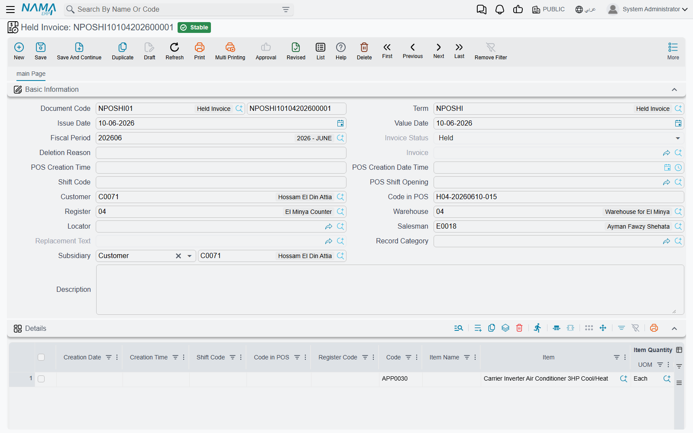
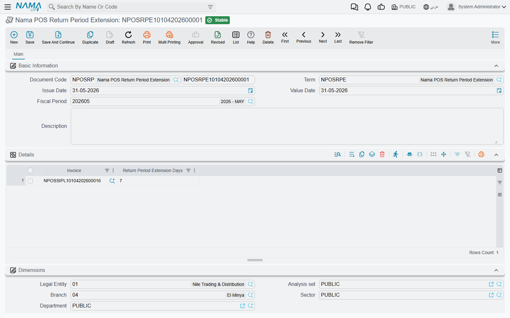

# POS Documents on the Server

Everything a cashier does at the register — a sale, a refund, a pay-out, a stock count — is saved on the register first and then synced up to Nama ERP as a document (see [How POS Data Syncs with the Server](../pos-data-sync.md)). This page is a tour of those documents from the server's side: where to find each one, what it produces, and what support staff can and cannot do with it. Shift openings, closings and cash counts have their own page: [Shift Opening, Closing & Cash-Reset Settings](./pos-shift-close-settings.md).

## The golden rule: register documents are read-only on the server

Almost every document that comes up from a register is a **system document**. It can be opened, printed and reported on, but it cannot be created by hand, edited or deleted on the server. Trying to is refused with:

*System document, You cannot create, update or delete it* — «مستند نظامي لا يمكنك انشاؤة أو التعديل فيه أو مسحه»

This applies to the sales invoice, return, replacement, held invoice, order reservation, cancel reservation, scrap and shortfalls documents, POS payment and POS receipt, stock transfer request, stock taking details, stock receipt, credit note and internal message.

The register keeps its own document code; on the server you find it in **Code in POS** (*الكود بنقطة البيع*) along with the **Shift Code**, the **Register** and **POS Creation Date Time** (*تاريخ ووقت الإنشاء بنقاط البيع*). Search by those when a customer reads you a receipt number. How register codes are built is explained in [Numbering POS Documents](./pos-document-numbering.md).

## Selling

All under **Point of sale → Documents**.

| Screen | Arabic name on screen | What it is |
|---|---|---|
| POS Sales Invoice | فاتورة مبيعات نقاط البيع | A sale. Its document term produces the accounting entry and the stock issue. |
| Held Invoice | فاتورة معلقة | A copy of an invoice the cashier put on hold. Sent up only when **Send Held Invoices On Shift Closing and On Deleting Held Invoices** is on in POS Settings. |
| POS Order Reservation | سند حجز اوردر نقاط بيع | An order taken now and delivered or collected later. Like a sale, its document term produces the accounting entry and the stock issue. |
| POS Cancel Reservation | سند إلغاء حجز اوردر نقاط بيع | Cancels a reservation. Its document term produces the accounting entry. |

**POS Sales Invoice.** The main page shows the header the register filled — customer, salesman, warehouse, invoice classification, **Order Reservation** if the sale completed a reservation, **From Captain Order** (*من تطبيق كابتن أوردر*) if a waiter's phone created it — and the item lines. The **Payment Methods** page lists how the customer paid. Its **More** menu has **Installment Payments** (*سندات سداد الدفعات*) for invoices sold on instalments.

::: info One server invoice can hold many receipts
When **Point Of Sale - Collection Method** (*طريقة تجميع فواتير نقاط البيع*) on POS Settings is **Collect Invoices** (*تجميع الفواتير*), the server adds each new cash receipt to an existing POS sales invoice of the same shift, customer, salesman and user, until **Maximum Invoice Lines** is reached. Each line still carries its own **Code in POS**, so search the lines, not just the header. Invoices with a credit part, a header discount, or that belong to a replacement are never merged. See [The POS Settings Screen](./pos-settings-screen.md).
:::

**Held Invoice.** Its **Invoice Status** (*حالة الفاتورة*) is **Held** (*معلقة*) while the cashier still has it, **Deleted** (*حذف*) when the cashier deleted it (with the **Deletion Reason** they gave), and **Invoiced** (*مفوتر كلياً*) once it was paid — the **Invoice** field then points to the POS sales invoice. Use it to answer "what happened to the order that was on hold?".

## Returns and replacements

| Screen | Arabic name on screen | What it is |
|---|---|---|
| POS Sales Return | مردود نقاط البيع | A refund. Its document term produces the reversing accounting entry and the stock receipt. |
| POS Sales Replacement | إستبدال مبيعات نقاط البيع | An exchange. Links a POS sales return (what came back) and a POS sales invoice (what went out). |
| Nama POS Return Period Extension | سند تمديد فترة إرجاع مبيعات نقاط البيع | Gives particular invoices extra days to be returned. |

**POS Sales Replacement.** The replacement itself carries no entry: the register sends the returned part as a POS sales return and the new part as a POS sales invoice, and the replacement links the two. If the replacement is cancelled on the server, its linked invoice and return are deleted with it.

The return and the replacement, like the invoice, have **Installment Payments** (*سندات سداد الدفعات*) in their **More** menu: it opens, in a pop-up list, the payment documents that have settled the document's instalments.

**Return Period Extension.** A register only accepts a return within **Return Invoices With In (In days)** (*ارتجاع الفواتير في خلال (بالأيام)*) of the invoice date (set on the [register](./pos-register-setup.md)). When the manager agrees to take something back later, create a **Nama POS Return Period Extension** on the server — this one is an ordinary document you create yourself — and add a line per invoice with **Return Period Extension Days** (*عدد أيام تمديد فترة الإرجاع*).

At the register, a cashier whose security profile has **Allow Return After Allowed Period** (*إمكانية عمل مردود بعد تجاوز مدة المردود المسموح بها*) uses **Return After Allowed Period** (*عمل مردود بعد تجاوز مدة المردود المسموح بها*) and types the invoice code; the register asks the server how many extension days that invoice has (all extension lines for it are added up) and adds them to the normal period. The register must be online for this.

**Example.** The return period is 14 days. A customer comes back on day 20 with a faulty kettle. The manager creates an extension with the invoice and 10 days; the cashier uses Return After Allowed Period, and the return is accepted because 20 is within 14 + 10.

## Cash in and out of the drawer

| Screen | Arabic name on screen | What it is |
|---|---|---|
| POS Payment | مصروف نقاط البيع | Cash taken out of the drawer (a pay-out). |
| POS Receipt | مقبوض نقاط البيع | Cash put into the drawer (a pay-in). |

Both produce an accounting entry from their document term, against the party the cashier chose. Which term a register uses is set in its term grids — see [POS Document Terms](./pos-document-terms.md).

## Stock

| Screen | Arabic name on screen | What it is |
|---|---|---|
| POS Stock Receipt | توريد نقاط البيع | Goods received at the store. Its document term decides whether a stock receipt is generated for it. |
| POS Stock Transfer Request | طلب تحويل مخزني نقاط البيع | A request to move stock between the store and another warehouse. |
| Point of Sale StockTaking Details Document | لجنة جرد نقط بيع | A physical count made at the register. |
| Shortfalls Document | مستند النواقص | Items the store reports as missing or running out. |
| Scrap Document | مستند الهوالك | Items the store wrote off as damaged or unusable. |

**Stock Transfer Request.** The warehouse that sends or receives the goods completes the move with an ordinary **Stock Transfer** (*سند تحويل مخزني*) that names the POS request as its source document.

**StockTaking Details.** The count arrives with the register, shift and **Pos Stock Taking Code**. To use it in the supply-chain stock-taking cycle, press **Create StockTaking Details Document** (*تحويل إلى لجنة جرد*) on the main page: it opens a new **Stock Taking** (*لجنة جرد مخزني*) record with the warehouse, locator and counted lines copied in, ready to review and save. The POS document must be saved first.

Scrap and shortfalls documents are covered from the cashier's side in [Inventory Operations at the Register](../pos-inventory-operations.md); on the server their document term decides any stock effect.

## Master files the registers create

Under **Point of sale → Master Files**.

| Screen | Arabic name on screen | What it is |
|---|---|---|
| POS Credit Note | إشعار دائن نقاط البيع | Store credit a register issued — usually from a return — that the customer can spend later. |
| POS Internal Message | رسالة نقاط بيع داخليه | A message a cashier sent from the register to up to five employees. |

**POS Credit Note.** Shows the amount, the **Customer**, **Created From** (*منشأة من*, the document that issued it), the **Remaining** (*المتبقي*) balance and a grid of the invoices it has paid so far. This is where you look when a customer says their credit note "has no balance".

**POS Internal Message.** Holds the recipients (**To Employee 1** … **5**), the register, the date and the **Message Body** (*نص الرساله*). How cashiers send and read them is in [Reports & Tools](../pos-reports-and-tools.md).

## Generic references: making any record pickable at the register

Some register screens let the cashier pick "any" record — for example, the other party of a pay-out may be an employee, a supplier or a treasury. The register cannot hold every record of the ERP, so you choose which ones it receives:

- **POS Generic Reference** (*المرجع العام لنقاط البيع*, **Point of sale → Master Files**) — one record per thing to send: give it a code and name and pick the **Reference** (*مرجع*) it stands for.
- **POS Aggregated Generic Reference** (*المرجع العام المجمع لنقاط البيع*) — the same in bulk: one line per record (code, names, reference and optional dimensions). Saving it creates or updates one POS generic reference per line, and deletes the ones whose lines you removed. Each generated record takes the line's dimensions, or the header's where the line has none.

Both are ordinary master files you maintain on the server.
