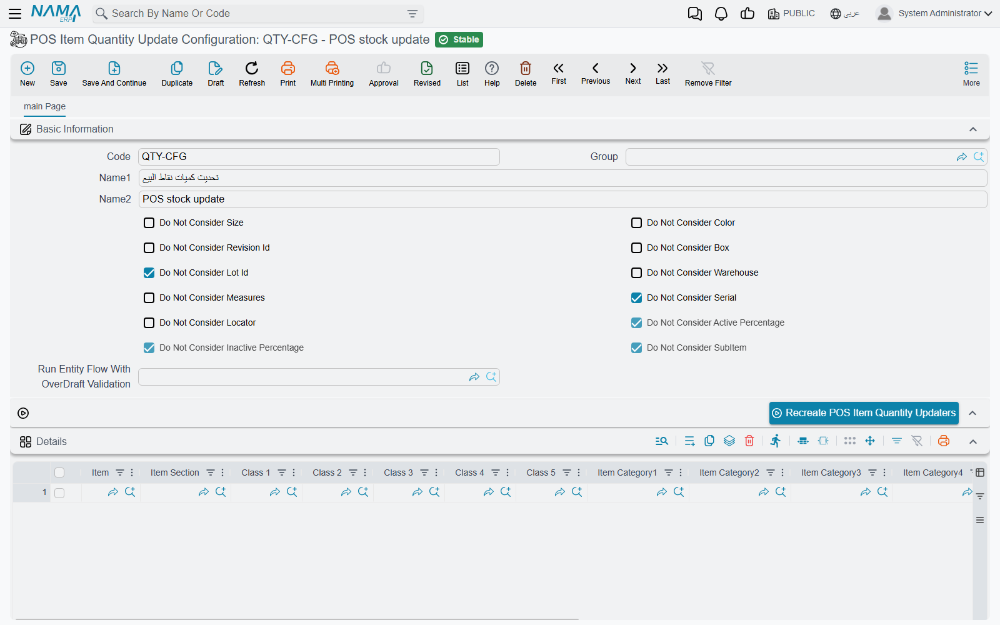
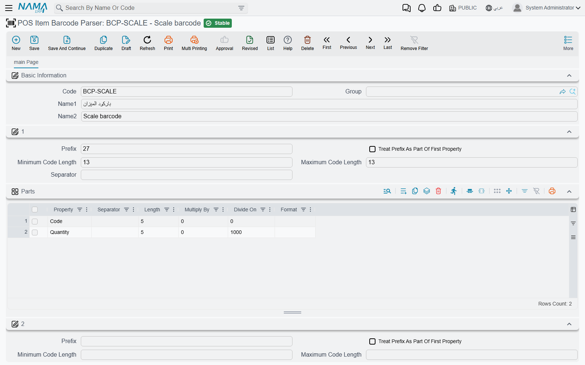
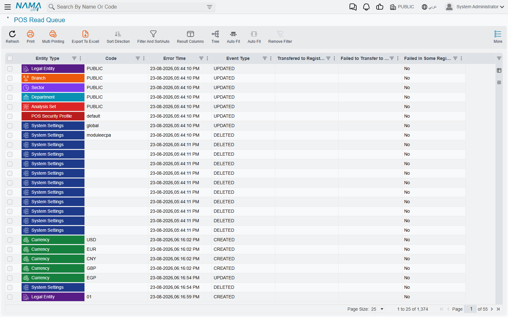

# What a Register Receives: Items, Barcodes & Sync Settings

A register only knows what the server sends it. Items, prices, customers and settings travel down through the data sync described in [How POS Data Syncs with the Server](../pos-data-sync.md); this page is about the screens that shape that traffic — which items a register gets at all, how it reads a scale or GS1 barcode, how it checks stock it cannot see, which documents must reach the server before they are saved, and how to watch or reorder what is waiting to go down.

All of these screens are under **Point of sale → Settings**, except the barcode parser, which is under **Point of sale → Master Files**. Each of them is picked in a field on **POS Settings** (for every register) and again on the **Register** — when the register's own field is filled, it wins for that register.

## Which items a register gets

A chain rarely wants every item on every till. The bakery counter does not need the hardware catalogue; a branch that does not sell alcohol should never see it. Two files of the same kind control this:

- **Pos Items To Send** (*الأصناف المرسلة لنقاط البيع*) — if a register has one, it receives **only** the items that match it.
- **Pos Items To Not Send** (*الأصناف الغير مرسله لنقاط البيع*) — items that match it are **never** sent, even if they also match the list above.

Both fields point at the same kind of record, **Pos Items To Send** (**Point of sale → Settings → Pos Items To Send**). Its grid matches items by **Item**, or by any combination of **Item Section**, **Item Brand**, **Item Category1**–**5** and **Class 1**–**10** — a line with only "Section = Bakery" matches every bakery item. The same filter is applied to the lines of price lists and offers, so a register never receives prices for items it does not have.

Separately, any item with **Do Not Move To POS** (*عدم النقل الي نقاط البيع*) ticked on the item file never reaches any register, and such an item cannot be put on an items-to-send list.

When you save the list, the items that were added to it or removed from it are re-saved in the background, so that the change actually reaches the registers. On a large catalogue that can take a while; tick **Do Not Recommit Items With Save** (*عدم إعادة حفظ الأصناف مع الحفظ*) to skip it.

A sales price list can also maintain the list for you: set its **Add Items To "POS Items To Send"** field, and every time the price list is saved its items replace the lines of that file. A file maintained that way cannot be edited by hand, and two price lists cannot feed the same file.

## Checking stock at the register

A register has no stock balance of its own. If you want it to refuse a sale that would take an item below zero, give it a **POS Item Quantity Update Configuration** (*إعدادات تحديث كميات الماكينة*, **Point of sale → Settings → POS Item Quantity Update Configuration**). Without one, the register does not check stock when it saves an invoice.

With a configuration in place:

1. The server keeps an up-to-date available quantity for every item and warehouse the configuration covers, and the register downloads those quantities in the background.
2. When an invoice is saved (not held), the register asks the server whether the quantities are available — adding the quantities of invoices still **held** on that register, since they are about to leave the shelf too. If the server says no, the save is refused with the server's own stock message.
3. If the server cannot be reached, the register checks against the last quantities it downloaded, minus the invoices it has issued since.

The configuration's fields:

| Field | Arabic on screen | What it does |
|---|---|---|
| Do Not Consider Size / Color / Revision Id / Box / Lot Id / Serial / Measures / Locator / SubItem / Warehouse | عدم اعتبار المقاس / اللون / … | Adds quantities up across that dimension. A shoe shop that only cares whether *any* size is left ticks **Do Not Consider Size**. |
| Do Not Consider Active Percentage / Inactive Percentage | عدم إعتبار النسبة الغير الفعالة / عدم إعتبار النسبة الفعالة | The same for the active-percentage dimensions. |
| Run Entity Flow With OverDraft Validation | تشغيل مسار الكيان مع التحقق على المكشوف | A manual entity flow (مسار كيان) the server runs on the check, for custom rules. Every line of the flow must be a manual action. |
| Details grid | التفاصيل | Which items and warehouses are tracked: by item, section, classes 1–10, categories 1–5 and up to 20 warehouses. An empty grid tracks everything. |
| Allowed Over Draft Items grid | الأصناف المسموح بالسحب على المكشوف منها | Items (same columns) that may be sold below zero — they are left out of the check. |

After creating a configuration, or after changing what it covers, press **Recreate POS Item Quantity Updaters** (the button has no Arabic label and shows in English on Arabic screens too). It builds the tracked quantities for every current non-zero balance, so registers do not have to wait for each item to move before they know its stock.

**Example.** A pharmacy tracks everything except its services, and lets pharmacists sell plastic bags without stock. It leaves the details grid empty, puts the item "Plastic bag" in **Allowed Over Draft Items**, ticks **Do Not Consider Lot Id** so that a medicine's batches count together, and presses the button. A cashier who scans six boxes of an item with four left is stopped; the bags are never checked.

## Reading barcodes: the item barcode parser

Scale labels and many supplier barcodes carry more than an item code: a weight, a price, an expiry date. A **POS Item Barcode Parser** (*مواصفات باركود أصناف نقاط البيع*, **Point of sale → Master Files → POS Item Barcode Parser**) tells the register how to split them. Choose it in **Item Barcode Parser** on POS Settings or on the register.

The parser has up to five layouts, numbered **1** to **5**. Each layout has:

- **Prefix** (*بادئة التكويد*), **Minimum Code Length** (*اقل طول للكود*) and **Maximum Code Length** (*أقصى طول للكود*) — the layout is used only for scanned codes that start with that prefix and fall within that length.
- **Treat Prefix As Part Of First Property** (*معاملة البادئة على انها جزء من اول خاصية*) — keep the prefix as the start of the first part instead of throwing it away.
- A **Parts** grid (*اجزاء العرض*), read left to right. Each part has a **Property** (*الخاصية*) — Code, Quantity, Unit Price, Total, Lot, Expiry Date, Size, Color and others — and either a fixed **Length** (*عدد الحروف*) or a **Separator** (*الفاصل*) that ends it. **Multiply By** and **Divide On** scale a number, and **Format** (*النسق*) gives a date or number pattern.

The register tries the layouts in order and uses the first that fits. If none fits, the scanned text is looked up as an ordinary item code or barcode. GS1 DataMatrix codes are recognised automatically before any layout is tried.

**Example — a weighing scale.** The deli scale prints 13-digit labels: `2`, a 5-digit item code, a 5-digit weight in grams, and a check digit. `2 12345 01250 7` is 1.250 kg of item `12345`. Layout 1:

- **Prefix** `2`, **Minimum Code Length** `13`, **Maximum Code Length** `13`.
- Parts: **Code**, length `5`; **Quantity**, length `5`, **Divide On** `1000`.

The register reads item `12345` with a quantity of 1.25. The check digit is simply left over and ignored. If the scale printed the price instead of the weight, the second part would be **Total** with **Divide On** `100` for a price in piastres or halalas.

## Documents that must reach the server first

Normally a register saves locally and syncs later. For some documents you want the server's say before the sale is final — a credit sale to an account customer, where the server checks the credit limit, for example. A **POS Saving Settings** record (*إعدادات الحفظ في نقاط البيع*, **Point of sale → Settings → POS Saving Settings**), chosen in **Saving Setting** on the register or POS Settings, lists those cases.

Each line of its **POS Saving Conditions** grid (*شروط إرسال الملف للنظام قبل الحفظ في نقاط البيع*) can set **POS Document Type**, **Invoice Classification**, **Subsidiary Type**, **Customer** and **Subsidiary**; empty cells match anything. A document that matches any line is sent to the server first and saved on the register only after the server accepts it — so it needs a working connection at that moment.

Returns and replacements made against an invoice that lives on the server always go to the server first, whatever this file says.

## Narrowing search dialogs: extra filters

**Nama POS Extra Filters** (*Filters إضافية لنقطة البيع*, **Point of sale → Settings → Nama POS Extra Filters**), chosen in **Extra Filters** on the register or POS Settings, adds a condition to a search dialog on the register. Each line names a **Document Type** (the register screen), an **On Field** (the field whose search dialog is narrowed) and a **Filter**.

The filter is a condition on the register's own database. Inside it, `{fieldPath}` is replaced by the value of that field on the document being entered, and `{uuid(…)}` by a fixed record id. Because it is written against the register's tables, it is usually prepared by the implementation team.

## Watching what goes down: the read queue

Every change the server makes to something registers need is placed on a queue that the registers read from. **POS Read Queue** (*رسائل بيانات نما*, under **Point of sale → Settings**) lists that queue: **Entity Type**, **Code**, **Time**, **Event Type**, **Transfered to Registers**, **Failed to Transfer to Registers** and **Failed In Some Registers**.

Use it when one register is missing a price or an item: filter by the item's code and look at the two register columns. A register listed under **Failed to Transfer to Registers** received the change but could not apply it — its error is on the register's **Data Errors** page.

To make the registers take a change again — once the cause of the failure is fixed, say — select its rows and use **More → Advance** (the action has no Arabic label and shows in English on Arabic screens too). It stamps the selected entries with the current time, so every register sees them as new and reads them on its next sync.

### Which changes go first

When many changes pile up — a new price list with 20,000 lines, say — registers receive them in the order the server queued them. A **POS Read Queue Priority Configuration** (*إعدادات أولوية نقل البيانات للماكينة*, **Point of sale → Settings → POS Read Queue Priority Configuration**) changes that order: each line gives an **Entity Type** a **Priority** (*الأولوية*), and **lower numbers are queued first**. Types not listed get 10000. Keep a single record; the server uses only one.

**Example.** Give customers priority `1` and price lists `20000`. A new customer created at head office then reaches the tills before the price-list update has finished trickling down.

## Correcting a register's database: the update statement runner

Very occasionally support needs to fix a value directly in registers' local databases — a flag that a bad release left wrong, say. **POS DB Update Statement Runner** (**Point of sale → Settings → POS DB Update Statement Runner**) ships one SQL statement to the registers, which run it on their own database.

| Field | Arabic on screen | Meaning |
|---|---|---|
| Update Statement | جملة التحديث | The statement to run. |
| Execution Serial | مسلسل التنفيذ | A register runs the statement once per serial. To run it again, raise the serial and save. |
| Valid until | صالح حتي | After this date and time registers refuse to run it. Must be in the future when you save. |
| Target Registers | الماكينات المستهدفة | The registers that receive it. Empty means all of them. |

The statement is checked on the server when you save and again on each register before it runs. It must be a single `UPDATE … SET … WHERE …` on one of the register's own tables; deletes, inserts, schema changes, procedure calls, comments and multiple statements are all refused. The register logs the result in its sync statistics and, on failure, reports the error to the server as a data error of the register.

## Messages you may see

| Message | Why | What to do |
|---|---|---|
| *Insufficient quantity for item {0} {1},Available Quantity is {2}, Reserved quantity is {3}* — «الكمية من الصنف {0} {1} لا تكفي. الكمية المتاحه {2} . الكميه المحجوزه {3}» | The register asked the server and there is not enough stock. On the register the message ends with *, Hold quantity:* («، الكمية المعلقة:») and the quantity held in suspended invoices. | Sell less, finish or delete held invoices, or add the item to **Allowed Over Draft Items**. |
| *Item … does not have  any available quantities* — «لا يوجد كمية للصنف …» | Offline check: the register has never received a quantity for the item. | Reconnect the register, or press **Recreate POS Item Quantity Updaters**. |
| *Option do not move to pos in item {0} in line {1} is true* — «اوبشن عدم النقل الي نقاط البيع في الصنف {0} في السطر {1} متفعل» | An item with **Do Not Move To POS** is on an items-to-send list. | Remove the line, or untick the option on the item. |
| *You can not manually edit the file {0} because it is used in the price list {1}, please change the price list instead* | The list is maintained by a price list. No Arabic translation; shown in English on Arabic screens too. | Change the price list. |
| *Another sales price list ({0}) is using the same POS Items To Send File {1}* | Two price lists point at the same file. Shown in English on Arabic screens too. | Give each price list its own file. |
| *Entity flow {0} line {1} target action must be manual* — «مسار الكيان {0} السطر {1} يجب ان يكون نوع يدوي» | The overdraft-validation entity flow has a non-manual line. | Make every line of the flow manual. |
| *Valid For Execution Until must be a future date and time* | The update statement's **Valid until** is in the past. Shown in English on Arabic screens too. | Set a future date and time. |
| *The statement must contain a WHERE clause* | The update statement would change every row. Shown in English on Arabic screens too (as are the other statement checks). | Add a `WHERE` condition. |
