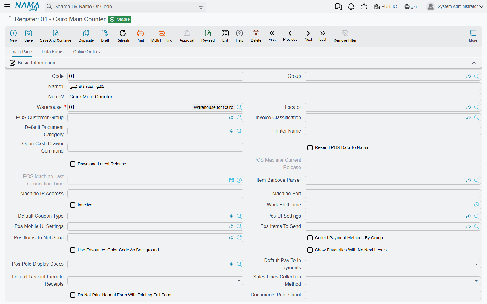
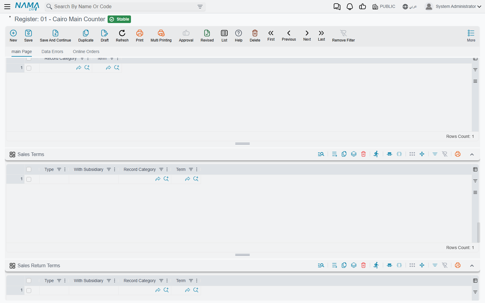
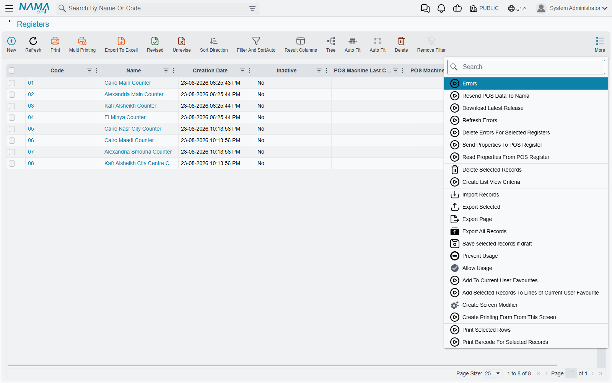

# Setting Up a Register

Every machine that runs Nama POS is described on the server by one **Register** record (*ماكينة*). The machine's own settings dialog only says *which* register it is (its **Machine code**, see [Installing a New Register](../pos-installation.md)); everything else — the warehouse it sells from, the payment methods it accepts, the terms its documents are processed with, how it prints — lives on this record and reaches the machine with the data sync. This page walks through the screen, group by group.

Open it from **Point of sale → Register → Register**.

## Register record vs POS Settings

Most of what a register needs can be set in two places: once for the company on **POS Settings** (**Point of sale → Settings → POS Settings**), and per machine on the register. The rule is simple: **the register's value wins when it is filled; otherwise the POS Settings value applies.** This holds for the term grids, the payment methods, the replacement conditions, the work shift time, the fixed favourites and the fraction-discount cap.

When you create a new register, its replacement conditions, currencies, payment methods, payment, sales and return term grids, and favourite items are pre-filled from POS Settings, so a new machine starts out like the others and you only change what is different.

## The basics

| Field | Arabic on screen | What it is for |
|---|---|---|
| Warehouse | المخزن | **Required.** The warehouse the register sells from and receives into. |
| Locator | الموقع | The default locator inside that warehouse. |
| POS Customer Group | مجموعة عميل نقاط البيع | Customers created at the register are saved on the server in this group. It must be a customer group with no automatic coding — the register codes its own customers. |
| Invoice Classification | تصنيف الفاتورة | The classification a new invoice starts with. |
| Default Document Category | تصنيف المستند الأفتراضي | The record category a new document starts with. |
| Inactive | غير نشط | Switches the register off. An inactive register cannot sync, and does not count towards the licence. |
| Work Shift Time | وقت وردية العمل | When a shift is expected to end (see [shift settings](./pos-shift-close-settings.md)). |
| Register Logo / Register Login Title | لوجو الماكينة / عنوان الدخول للماكينه | The picture and title shown on the register's sign-in screen. |
| Available In Mobile Application | متاح للاستخدام في تطبيق الموبايل | Lets the Captain Order mobile app connect to this register. |
| Subordinate Register For Captain Order | ماكينة فرعية لكابتن أوردر | Marks the record as a sub-register used by Captain Order devices; these are counted against their own licence limit. |
| Call Center Mode / Read Orders From Call Center | وضع خدمة العملاء / قراءة الطلبات من مركز خدمة العملاء | The two ends of the call-center flow described in [Tables, Reservations & Captain Order](../pos-tables-and-restaurant.md). A register can be one or the other, not both. |
| Stop Taxes | تعطيل الضرائب | The register calculates no taxes. |

The **Dimensions** group must carry a real legal entity — a register cannot be saved on the "general" one — and the **Accounts** group holds the register's own accounts and currency, used wherever a term takes an account "from the register".

### Printing

| Field | Arabic on screen | What it is for |
|---|---|---|
| Printer Name | إسم الطابعه | The printer the register prints to. |
| Open Cash Drawer Command | أمر فتح الدرج | The command sent to open the cash drawer. |
| Documents Print Count | عدد مرات طباعه المستندات في كل أمر طباعه | How many copies each print produces. |
| Always Print Full Invoice | طباعة الفاتورة الكامله دائماً | The "print full invoice" box in the payment window starts ticked. |
| Do Not Print Normal Form With Printing Full Form | عدم طباعه النموذج العادي في حالة طباعه النموذج الكامل | When the full form is printed, the normal receipt is skipped. |
| Print Preparation Form With Payment / With Hold / With Payment Delay | طباعة فورمة تحضير الاوردر مع الدفع / مع تعليق الفاتوره / مع تأجيل الدفع | When the kitchen (preparation) slip prints. |

### Charges added to an invoice

Service charge, delivery and minimum charge are set here or on POS Settings: **Service Charge Item**, **Service Charge Percentage**, **Service Charge Calculated From**, **POS Service Charge Settings** and the "add automatically" options; **Delivery Item**, **Delivery Cost** and their options; **Pos Minimum Charge Settings**, **Minimum Charge Calculation Type** and **Minimum Charge Item**. Each "add automatically…" option has three choices — yes, no, or inherit the POS Settings value.

### Links to other settings screens

Several fields simply point at a settings record that is shared between registers: **Pos UI Settings**, **Pos Mobile UI Settings**, **Pos Items To Send** and **Pos Items To Not Send**, **Pos Pole Display Specs**, **Item Barcode Parser**, **POS Item Quantity Update Configuration**, **Default Values Template**, **Saving Setting**, **Extra Filters**, **ShortCuts**, **Customer Phone Country Codes**, **Payment Methods Settings**, **Payment Terminal**, **Reward Points Configuration**, and the discount coupon book and group. Each of those is a separate record with its own screen, so one set-up can serve many registers.

### Keeping the machine in step

| Field | Arabic on screen | What it does |
|---|---|---|
| POS Machine Current Release / POS Machine Last Connection Time | رقم اصدار نقاط البيع الحالي / اخر وقت اتصال مع نقاط البيع | Filled by the machine: which version it runs and when it last talked to the server. The quickest health check for a register. |
| Resend POS Data To Nama | إعادة إرسال بيانات نقاط البيع الي نما | When the machine next receives the register record, it resets its retry counters and sends all its unsent documents again, then clears the box. |
| Download Latest Release | تحميل اخر اصدار | The machine downloads the latest version and starts the update without asking, then clears the box. |
| Sales Lines Screen Properties / Connection Properties | خصائص أعمدة المبيعات / خصائص الأتصال | Text you want written into the machine's own screen-settings and connection-settings files. |
| Send Properties To POS Register | ارسال الخصائص الي ماكينة نقاط البيع | The machine writes the two fields above into its files, then clears the box. |
| Read Properties From POS Register | قراءة الخصائص من ماكينة نقاط البيع | The machine uploads its current files into **Screen Properties From Register** and **Connection Properties From Register**, so you can read them without visiting the shop. |
| Remove Documents From POS After (In Days) | حذف المستندات من نقطة البيع بعد مرور (بالأيام) | Keeps the machine's local database small: documents already sent to the server and older than this are deleted from the machine. |

These flags act only when the machine receives the updated register record — a machine that is switched off acts on them the next time it syncs.

## Replacement Conditions And Policy

**Return Invoices With In (In days)** and **Replace WithIn (In Days)** limit how old an invoice may be for a return or a replacement; **Text Condition 1–5** are the policy lines printed for the customer. Empty values fall back to POS Settings. A cashier whose security profile has **Allow Return After Allowed Period** can still return an older invoice (see [POS Security Profiles](./pos-security-profiles.md)).

## The grids

### Books And Terms

One line per document type tells the server which **Book** and **Term** (*توجيه المستند*) to give the documents this register sends up. The book must be for the same document type and may not be a system book; the term is required (except for stock-taking details).

- **Term In Case Of Error** — for sales documents: if the server cannot save the document because of an insufficient-quantity failure, it saves it again with this term instead of leaving it in error. A typical use is a term that allows overdraft.
- **Sub Type** — only for POS Sales Invoice: *Normal* or *Service*. A *Service* line gives invoices made entirely of service items their own term.

### Payment Methods and Currencies

**Currencies** lists the currencies the register accepts. **Payment Methods** lists the methods its payment window offers:

| Column | Arabic on screen | Meaning |
|---|---|---|
| Payment Method | طريقة الدفع | The method. Each may appear once. |
| Appearance order in Point Of Sale | ترتيب الظهور في برنامج نقاط البيع | Its position in the payment window. No two lines may share an order. |
| Cash Payment Method | طريقة الدفع النقدي | The method that counts as **cash** — for change, the drawer and the cash reset at shift close. Only one line may be ticked. |
| Default Payment Method | طريقة الدفع الافتراضية | The method the payment window starts on. |
| Show In Additional Methods | عرض في طرق الدفع الإضافية | Shows the method under the additional methods rather than among the main buttons. |

If the register has no payment methods of its own, the **Payment Methods** grid on POS Settings is used, including which one is the cash method.

### Which term each document gets

Four grids choose the term per situation, before the **Books And Terms** term is used as the fallback. Each is read from the register when it has lines, otherwise from POS Settings; the **first matching line** wins.

| Grid | Arabic on screen | A line matches when… |
|---|---|---|
| Sales Terms | توجيهات المبيعات | **Type** is *Customer Required* when the invoice has a customer (*Customer Not Required* when it does not), **With Subsidiary** matches whether the invoice carries a subsidiary (an on-account party), and the **Record Category** is empty or equals the invoice's. |
| Sales Return Terms | توجيهات المردودات | **Type** is *Cash* or *To Credit Note* as the refund was made, **With Subsidiary** matches, and the **Record Category** is empty or equal. |
| Payment Terms | توجيهات المصروفات | **Type** (*From Register*, *From Current Employee*, *To Credit Note*) matches the kind of payment, or the **Record Category** matches. |
| Receipt Terms | توجيهات المقبوضات | The **Record Category** is empty or equals the receipt's. |

So a chain can process cash sales to walk-in customers and on-account sales to companies with two different terms, without the cashier choosing anything.

### Favourites

**Favourite Items** places items on up to five levels of favourite buttons; **Fixed Favourite Items** pins items or groups permanently on the sales screen (the register's list replaces POS Settings' list when it has lines); **Favourite Documents** adds toolbar buttons that open a document type with its own Arabic and English caption and record category.

### Tables

When **Use Tables** is ticked on POS Settings, a **Tables** grid appears listing the **POS Hall** and **Table** records this register serves. Halls (**Point of sale → Register → POS Hall**) are simple code-and-name records; each **Table** (**Point of sale → Register → Table**) belongs to one hall. How the floor is used at the counter is described in [Tables, Reservations & Captain Order](../pos-tables-and-restaurant.md).

### Other grids

- **Documents Coding Params** and the **Automatic Documents Coding** button above it — see [Numbering POS Documents](./pos-document-numbering.md).
- **Taken Elements Per Shift** — see [shift settings](./pos-shift-close-settings.md).
- **Allowed Users** — when it has lines, only the users listed may sign in on this machine. Empty means anyone.

## e-Receipt Configuration (Egypt)

For the Egyptian e-receipt system, each register is a registered POS device. The group holds the **Electronic Tax Authority Configuration** and the device's **POS Serial Number**, **POS Client ID**, **POS Client Secret**, **POS OS Version**, **POS Model Framework** and **Syndicate License Number**. After saving, press **Activate e-Receipt POS** (*تفعيل نقطة البيع على بوابة الإيصال الإلكتروني*) to register the device with the portal. The wider set-up is in [Egyptian e-Invoice and e-Receipt](../../invoicing/egypt-einvoice-guide.md).

## The Data Errors and Online Orders tabs

**Data Errors** lists the documents from this register that the server could not save — type, code, value date, the time the error arrived and the failure message. From its **More** menu you can **Delete Selected Errors** once dealt with, or **Refresh Errors**. **Refresh Errors** (*تحديث الأخطاء*), also on the register's own **More** menu, removes error lines whose documents have since been saved successfully on a later attempt, and reports *{0} error line(s) were removed*. What to do with a document that keeps failing is covered in [How POS Data Syncs with the Server](../pos-data-sync.md).

**Online Orders** lists the call-center and online orders addressed to this register, with the customer, status and last update.

## Actions on the register list

Select one or more registers in the list and use **More**:

| Action | Arabic on screen | What it does |
|---|---|---|
| Resend POS Data To Nama | إعادة إرسال بيانات نقاط البيع الي نما | Ticks the resend flag on every selected register (see above). |
| Download Latest Release | تحميل اخر اصدار | Ticks the update flag on every selected register. |
| Send Properties To POS Register | ارسال الخصائص الي ماكينة نقاط البيع | Ticks the send-properties flag. |
| Read Properties From POS Register | قراءة الخصائص من ماكينة نقاط البيع | Ticks the read-properties flag. |
| Refresh Errors | تحديث الأخطاء | Clears resolved error lines, for all registers. |
| Delete Errors For Selected Registers | حذف الاخطاء للماكينات المختاره | Deletes every error line of the selected registers. |

The list also shows **Inactive**, **POS Machine Last Connection Time**, **POS Machine Current Release**, **Download Latest Release** and **Warehouse**, so one glance at it shows which machines are behind or have stopped syncing.

## Messages you may see

| Message | Why | What to do |
|---|---|---|
| *Cannot save, available count of registers is {0}* — «لا يمكن الحفظ , عدد الماكينات لا يمكن ان يتخطي {0}» | Saving this active register would exceed the number of registers the licence allows. | Make an unused register **Inactive**, or extend the licence. |
| *Cannot save, available count of sub-registers is {0}* — «لا يمكن الحفظ , عدد الماكينات الفرعية الخاصة بكابتن أوردر لا يمكن ان يتخطي {0}» | The same, for Captain Order sub-registers. | As above. |
| *More than one cash method* — «اكثر من طريقة دفع إفتراضيه» | Two payment-method lines are ticked **Cash Payment Method**. | Tick only one. |
| *More than one method has the same order* — «اكثر من طريقة دفع لهم نفس الترتيب» | Two lines share an **Appearance order**. | Give each a different number. |
| *Repeated payment method* — «طريقة دفع مكرره» | A payment method appears twice. | Remove the duplicate. |
| *Can not be saved on null legal entity* — «لا يمكن الحفظ علي الشركة عام» | No legal entity in the dimensions. | Choose the register's legal entity. |
| *This group is not for customer* — «هذه المجموعة ليست لعميل» | **POS Customer Group** is not a customer group. | Choose a customer group. |
| *POS customer group must not have auto coding* — «مجموعة عملاء نقاط البيع يجب الا يكون بها تكويد آلي» | The chosen group codes customers automatically. | Use a group without automatic coding. |
| *Book {0} at line {1} is a system book* — «الدفتر {0} فى السطر {1} نظامى» | A system book was chosen in **Books And Terms**. | Choose a normal book. |
| *Book {0} is for the type {1}, while you selected type {2} on the line number {3}* — «الدفتر {0} للنوع {1}، بينما النوع المختار {2} فى السطر {3}» | The book belongs to another document type. | Choose a book of the line's type. |
| *Term {0} is for the type {1}, while you selected type {2} on the line number {3}* — «التوجيه {0} للنوع {1}، بينما النوع المختار {2} فى السطر {3}» | The term belongs to another document type. | Choose a term of the line's type. |
| *The entity type {0} at line {1} is repeated with line {2}, sub type is {3}* — «النوع {0} فى السطر {1} مكرر للسطر {2}، للنوع الفرعى {3}» | Two **Books And Terms** lines for the same type and sub type. | Keep one. |
| *Subtype must be Normal or empty for type {0}* — «النوع الفرعى يجب أن يكون عادى أو فارغ للنوع {0}» | A sub type was set on a type other than the sales invoice. | Clear it. |
| *The register {0} is inactive* | A list action or a sync call was made for an inactive register. This message has no Arabic translation and appears in English on Arabic screens too. | Untick **Inactive** first, if the register is back in use. |
| *User ({0}) can not access this register ({1})* — «المستخدم ({0}) لا يمكنه الدخول على هذه الماكينة ({1})» | Shown at the machine: the user is not in **Allowed Users**. | Add the user, or sign in on a machine they are allowed on. |
| *Please Select Tax Payer Configuration* — «من فضلك قم باختيار إعدادات مصلحة الضرائب» | **Activate e-Receipt POS** was pressed with no tax-authority configuration. | Fill **Electronic Tax Authority Configuration** and save first. |
