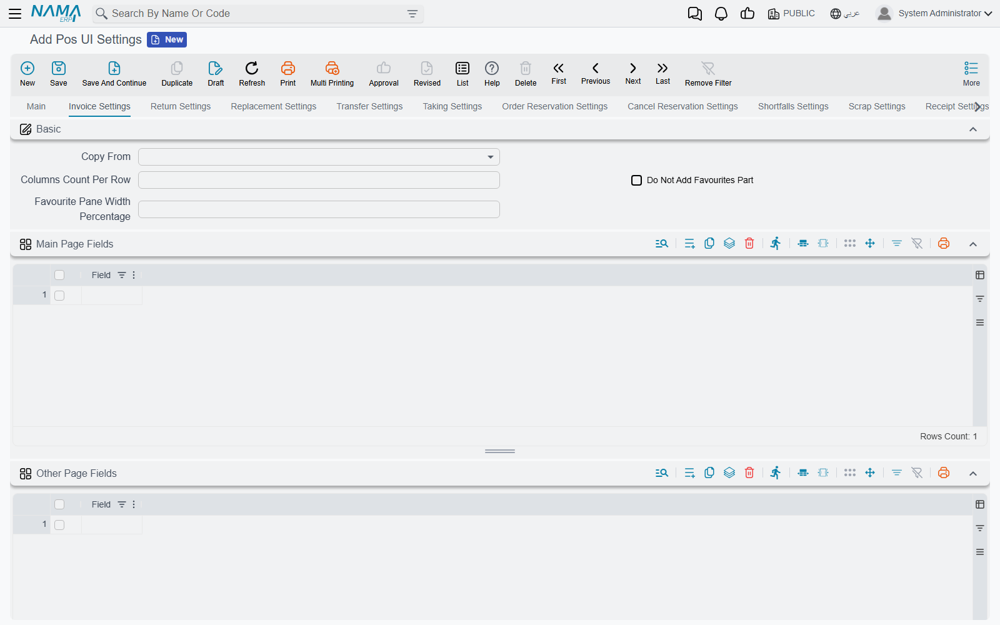
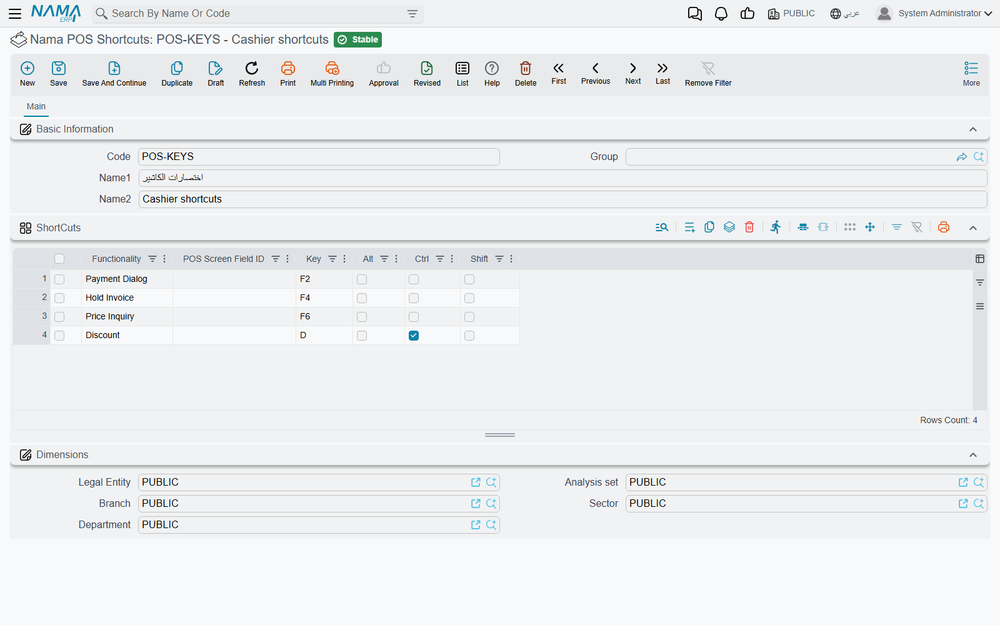
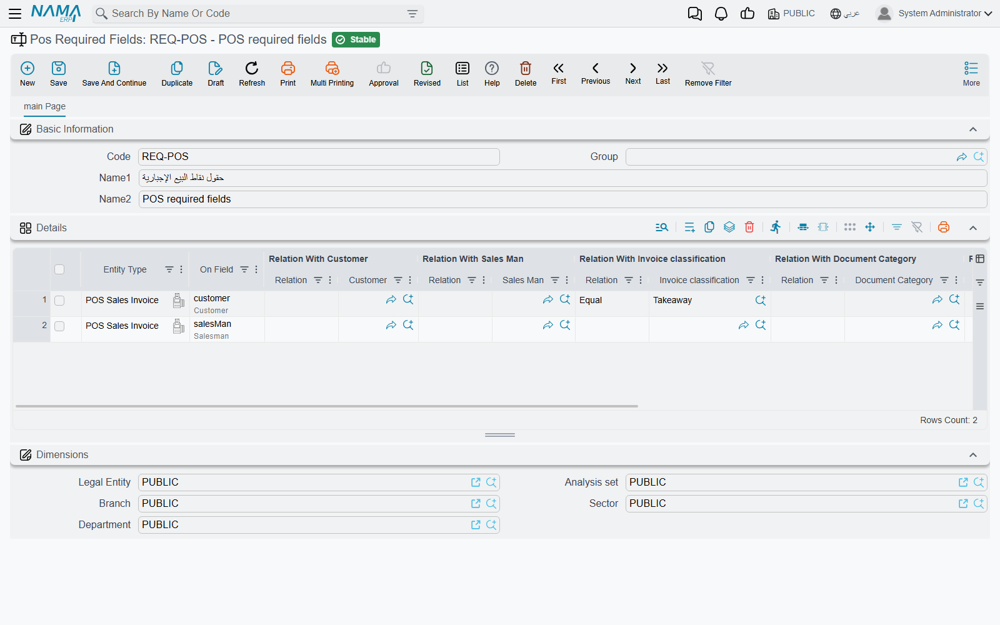

# Screen, Keyboard & Device Settings

A register in a supermarket and a register in a café should not look the same. The supermarket wants a big item grid with barcode, unit and expiry columns; the café wants large favourite buttons and table buttons. This page covers the settings records that shape what the cashier sees and types: screen layouts, the waiter's phone, keyboard shortcuts, the customer pole display, default values, required fields, phone country codes and which payment methods appear. All of them live under **Point of sale → Settings**.

## How a register finds its settings

Most of these records are **attached**: you create one or more, then pick one on the **Register** or on **POS Settings**. A record picked on the register wins for that register; otherwise the one on POS Settings applies to every register. A few are attached to the register only, and two apply everywhere without being attached at all.

| Settings record | Arabic name on screen | Where it is picked |
|---|---|---|
| Pos UI Settings | إعدادات واجهة نقاط البيع الجديده | Register, else POS Settings (else the built-in layout) |
| Pos Mobile UI Settings | إعدادات واجهة نقاط البيع للموبايل | Register, else POS Settings |
| Nama POS Shortcuts | اختصارات نقطة البيع | Register, else POS Settings |
| POS Customer Phone Country Codes | أكواد الدول لأرقام عملاء نقاط البيع | Register, else POS Settings |
| Nama POS Payment Methods Settings | إعدادات طرق دفع نقاط البيع | Register, else POS Settings |
| Pos Defaults Template | قالب قيم افتراضيه لنقاط البيع | Register only (**Default Values Template**) |
| Pos Pole Display Specs | خصائص ال Pole Display لنقاط البيع | Register only |
| Pos Required Fields | الحقول المطلوبه لنقاط البيع | Not attached — every record applies to every register |
| Payment From Pos Settings | إعدادات دفع من خلال نقاط البيع | Not attached — applies to server documents |

Like every setting, a change reaches a register with its next data sync ([How POS Data Syncs with the Server](../pos-data-sync.md)).

## Screen layout: Pos UI Settings

**Pos UI Settings** is the big one. Its first page holds switches for the whole register, then one page per screen.

**Main page.** Switches that add or remove parts of the sales screen — for example **Add Item Code Column In Sales Table** (*إضافة عمود كود الصنف في جدول المبيعات*), **Add UOM Column to Sales Grid**, **Add Color And Size**, **Add Production And Expiry Dates To Sales**, **Add Discount1 Fields** … **Add Discount8 Fields**, **Add Tax 1 Fields**, **Add Warehouse And Locator**, **Add Currency Rate Field**; sizes for favourite-item and table buttons (**Favourite Items Count Per Line**, **Tables Buttons Per Row**, **Table Button Height**); **Full Screen Search Dialogs** and **Full Screen Payment Dialogs**; **Totals Pane Color**; and **Jasper Fonts** for printed forms. The **Sales Line Buttons** group (*زرائر سطور المبيعات*) hides the small buttons on each sales line: duplicate, remove, increase quantity, decrease quantity and depreciate.

**One page per screen** — **Invoice Settings**, **Return Settings**, **Replacement Settings**, **Transfer Settings**, **Taking Settings**, **Order Reservation Settings**, **Cancel Reservation Settings**, **Shortfalls Settings**, **Scrap Settings** and **Receipt Settings**. Each has:

- **Columns Count Per Row** (*عدد الأعمده في الصف الواحد*), **Do Not Add Favourites Part** and **Favourite Pane Width Percentage** — how the header is laid out and whether the favourites panel shows;
- **Main Page Fields** (*حقول الصفحة الرئيسيه*) — the header fields shown on the screen itself;
- **Other Page Fields** (*حقول الشاشة الفرعيه*) — fields moved to the secondary page;
- **Sales Grid Fields** (*حقول جدول المبيعات*) — the columns of the item grid, in order, each with a **Width Size**;
- **Copy From** (*نسخ من*) — pick another screen and, on save, this page's fields are replaced by that screen's. A page you leave completely empty copies the invoice page automatically.

**Other Screens** sets the fields of the customer dialog (**Customer Fields**, each optionally required) and of the payment and receipt screens. **POS Search Dialogue Columns Settings** chooses the columns, filters, page size and sort order of each search dialog. **POS Favourite Procedures** lists the menu actions to pin as favourites.

**Customer Display Window** (*نافذة العميل*) defines what the customer-facing second screen shows — header fields, line columns and footer fields per document type. The **Default Settings** button (*الإعدادات الافتراضية*) fills the three grids with a ready set for invoices, returns and replacements, which you can then trim.

For column widths in particular, see also [Nama POS — Technical Points of Use Guide](../nama-pos.md).

## The waiter's phone: Pos Mobile UI Settings

Controls the Captain Order app (see [Tables, Reservations & Captain Order](../pos-tables-and-restaurant.md)). Switches remove buttons from the app — **Do Not Add Pay Button**, **Do Not Add Save Button**, **Do Not Add Send Button**, **Do Not Add Add-Item Button**, **Do Not Add Edit Item Button**, **Do Not Add Delete Button**, **Do Not Add Favourite Items Button** — so, for example, waiters can send orders to the kitchen but cannot take payment. **Header Fields** lists the order header fields shown on the phone, each with a **Display Method** (*Code And Name* or *Name Only*) and a **Field Size** (*Whole Line* or *Half Line*); **Line Fields** lists the fields shown per item.

## Keyboard: Nama POS Shortcuts

Each line binds a key combination either to a **Functionality** (*الإجراء*) — new sale, hold invoice, price inquiry, lock screen, reprint and about fifty more — or to a **POS Screen Field ID**, which jumps the cursor to that header field. Pick the **Key** (F1–F12, letters, arrows, Enter, Esc …) and tick **Ctrl**, **Alt** and/or **Shift**.

The record is checked when saved: a line needs a functionality or a field (not both), a key, and **Ctrl** or **Alt** with any letter; and no two lines may use the same combination. The register's built-in shortcuts are listed in [Getting Started at the Register](../pos-getting-started.md).

## The customer pole display: Pos Pole Display Specs

Chooses how the register talks to the pole display — **Communication Type** (*CommPort* or *Printer*) and **Printer Name Or Port Number** — and the text templates shown when idle, when a line is added or deleted, for the total and for the change. Pick the record in the register's **Pos Pole Display Specs** field. The template syntax is documented in [Nama POS — Technical Points of Use Guide](../nama-pos.md#POS-Pole-Display-Setup).

## Pre-filled values: Pos Defaults Template

Each line says: for documents of **For Type** (sales invoice, return, replacement, stock receipt, transfer request, stock taking, reservation, cancel reservation, payment, receipt), set header **Field** to this **Reference**, **Text** or **Date Value**. A register with this template in its **Default Values Template** field opens every new document of that type with the values already filled — say, the "Walk-in" customer on invoices, or a fixed document category on pay-outs.

## Making fields mandatory: Pos Required Fields

Each line names a document type and a field (**On Field**) and a **Field Type**: **Required** (*إجبارى*) or **Must Be Empty** (*يجب تركه فارغا*). The rule can be made conditional on the customer, salesman, invoice classification, record category, warehouse and locator: for each, choose a relation — **Equal**, **Not Equal**, **Empty** (*بدون*) or **Without Relation** — and the value to compare with. **Do Not Apply On Hold** (*عدم التطبيق مع التعليق*) lets the cashier hold the document without the field.

**Example.** "Salesman is required on POS sales invoices whose invoice classification is *Delivery*": document type POS Sales Invoice, field Salesman, Field Type Required, relation with classification **Equal**, classification *Delivery*.

Every Pos Required Fields record reaches every register; there is nothing to attach. When the rule fails, the register names the field and refuses to save.

## Customer phone numbers: POS Customer Phone Country Codes

A list of **Country Code** lines with Arabic and English names, offered to the cashier when entering a new customer's phone number — useful in a tourist area where customers come from several countries.

## Which payment methods appear: Nama POS Payment Methods Settings

Each line names a **Payment Method** and the conditions under which it is **hidden** from the payment screen: a **Record Category**, an **Invoice Classification** and/or a **Customer** (a customer, customer category or customer class). When every condition filled on a line matches the current document, that method is not offered. Lines with no condition at all are ignored.

**Example.** Hide "Credit (on account)" for the "Walk-in" customer class, so only known customers can buy on account.

## Paying server documents at the register: Payment From Pos Settings

This one works the other way round: it lets a cashier collect payment for documents **created on the server** — for example a service invoice — from the register's payment or receipt screen. Each line chooses the server documents (**Entity Type** or **Entity Type List**, optionally narrowed by **Document Book**, **Document Term** and **Criteria**), the field holding the amount due (**Payment Source Field**), a **Description Template**, and **Payment Not Receipt** (*صرف وليس قبض*) for documents the store pays out rather than collects. Every matching document saved on the server then becomes available to pick at the register.

If part of a document has already been paid at the register, its amount cannot be lowered below what was paid: *value of {0} cannot be less than paid amount from pos is {1}* (shown in English on Arabic screens too).

## Messages you may see

| Message | Why | What to do |
|---|---|---|
| *You must select key* — «يجب اختيار مفتاح» | A shortcut line has no key. | Pick the key. |
| *You must use Ctrl/Alt with alphabetic letters* — «يجب استخدام Ctrl/Alt مع الحروف الأبجدية» | A letter key was chosen without Ctrl or Alt. | Tick Ctrl or Alt. |
| *Shortcut in line {0} repeated in line {1}* — «الاختصار في سطر رقم {0} متكرر في سطر رقم {1}» | Two lines use the same combination. | Change one of them. |
| *You must select functionality or field ID* | A shortcut line has neither a functionality nor a field. | Choose one. |
| *You must select functionality or field ID, Not both* | A shortcut line has both. | Keep one. |
| *value of {0} cannot be less than paid amount from pos is {1}* | A server document's amount was lowered below what the register already collected for it. Shown in English on Arabic screens too. | Keep the amount at or above what was paid. |
