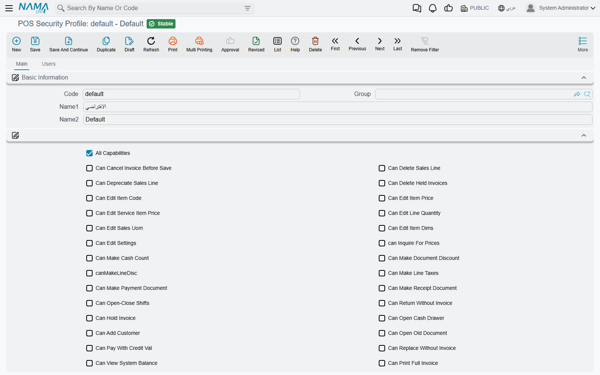

# POS Security Profiles

What a cashier may do at the register — change a price, give a discount, return without an invoice, close someone else's shift — is not controlled by the ERP's ordinary roles and capabilities. It is controlled by a **POS Security Profile** (*صلاحيات نقاط البيع*): one record per kind of user ("Cashier", "Shift Supervisor", "Branch Manager"), each a long list of yes/no permissions. The register reads the profile of whoever signs in and enables or refuses each action accordingly.

## Giving a user a profile

A profile does nothing until users are attached to it:

1. Create the profile under **Point of sale → Settings → POS Security Profile** and tick what that kind of user may do.
2. Open each **User** and set its **POS Security Profile** field.
3. The profile's **Users** tab lists every user that currently points at it — the quickest way to check who a change will affect.

Profiles and users reach the register through the normal data sync, like any other master data (see [How POS Data Syncs with the Server](../pos-data-sync.md)). A user with no profile can sign in but is refused every action that needs a permission.

## Two ways to grant a permission

The **main** tab has two places that grant permissions, and the register accepts either:

- **The checkboxes** in the header — one per common permission.
- **The Capabilities grid** (*الصلاحيات*) — each line picks one permission from a list. The list contains every checkbox permission *and* about twenty more that have no checkbox (they are marked "grid only" below). A permission is granted if its checkbox is ticked **or** it has a line in the grid.

**All Capabilities** (*كل الصلاحيات*) at the top grants everything at once. It is meant for managers and support users.

::: warning Restrictions and "All Capabilities"
Some options *restrict* rather than grant — **Prevent View Notifications**, **Deactivate Shortcuts**, **Show Current Shift Invoices Only** and similar. Ticking **All Capabilities** on the same profile cancels those header restrictions. The grid-only restrictions (**Prevent Payment**, **Prevent Opening Old Invoices**, **Prevent Opening Old Returns**, **Read Item Code Using Scanner Only**, **Read Sales Invoice Code In Returns Using Scanner Only**) are the exception: they apply even to a profile with **All Capabilities**.
:::

## Asking a supervisor instead of refusing

By default, a cashier who tries something their profile does not allow is simply refused with *This user has not this capability* — «ليست لديك هذة الصلاحية», followed by the name of the missing permission.

On **POS Settings** (**Point of sale → Settings → POS Settings**), the grid **Request Authorization From Another User When User Does Not Have Capability** (*طلب تفويض من مستخدم آخر عند عدم وجود الصلاحيات التالية*) turns chosen refusals into a supervisor override. For every permission listed there, the register opens a sign-in box instead of refusing; a supervisor whose own profile has the permission types their user name and password, and the action goes ahead. The register records which supervisor authorised which action on which document.

A typical setup gives cashiers no discount permission, and lists **Can Make Document Discount** in that grid, so every invoice discount needs a supervisor's password at the counter.

## The permissions

The tables group the permissions by what they control. The **Arabic** column is the label exactly as it appears on the Arabic screen.

### Selling and the sales lines

| Permission | Arabic on screen | What it allows |
|---|---|---|
| Can Edit Item Code | إمكانية تعديل كود الصنف | Changing the item on a line already entered. |
| Can Delete Sales Line | إمكانية حذف سطر المبيعات | Removing a line from the invoice. |
| Can Depreciate Sales Line | إمكانية تحويل سطر إلى هالك | Marking a line as depreciated (damaged goods). |
| Can Edit Item Price | إمكانية تعديل سعر الصنف | Typing a different unit price. |
| Can Edit Service Item Price | إمكانية تعديل سعر صنف الخدمة | Changing the price of a service item, such as the service charge. |
| Can Edit Delivery Cost *(grid only)* | إمكانية تعديل تكلفة خدمة التوصيل | Changing the delivery charge. |
| Can Edit Line Quantity | إمكانية تعديل الكمية على سطر المبيعات | Changing a line's quantity. |
| Can Edit Sales Uom | إمكانية تعديل وحدة المبيعات | Selling in a different unit of measure. |
| Can Edit Item Dims | إمكانية تعديل محددات الصنف | Changing the item's size, colour and similar properties on the line. |
| Make Line Discount 1 … 8 *(grid; discount 1 also has a checkbox)* | إمكانية إعطاء تخفيض 1 على السطر … 8 | Entering line discount 1 to 8. Each discount column is controlled separately. |
| Can Make Document Discount | إمكانية إعطاء تخفيض كلي على الفاتورة | Entering an invoice-level discount. |
| Can Make Line Taxes | إمكانية إعطاء ضريبة على السطر | Editing the taxes on a line. |
| Can Cancel Taxes | إمكانية إلغاء الضرائب | Removing taxes from the invoice. |
| Can Give Free Items | إمكانية أعطاء أصناف مجانية | Adding items free of charge. |
| Can Edit Invoice Classification | إمكانية تعديل تصنيف الفاتورة | Changing the invoice classification (dine-in, take-away, delivery…). |
| Can Edit Sales Man | إمكانية تعديل مندوب المبيعات | Choosing the salesman on a new invoice. |
| Allow Salesman Update | السماح بتعديل المندوب في الفاتورة التي تم صدورها بالفعل | Changing the salesman on an invoice that was already saved. |
| Allow Hide Offers Dialog | السماح بإخفاء Dialog العروض | Closing the offers window without choosing. |
| Can Make Negative Duplicate *(grid only)* | إمكانية تكرار أخر سطر بكمية سالبة | Pressing the minus key to repeat the last line with a negative quantity. |
| Read Item Code Using Scanner Only *(grid only, restriction)* | قراءة كود الصنف من خلال قارئ الباركود فقط | The cashier can add items only by scanning, not by typing a code. |

### The invoice as a whole

| Permission | Arabic on screen | What it allows |
|---|---|---|
| Can Cancel Invoice Before Save | إمكانية إلغاء فاتورة قبل الحفظ | Abandoning an invoice in progress. |
| Can Hold Invoice | إمكانية تعليق فاتورة | Holding (parking) an invoice to recall later. |
| Can Delete Held Invoices | إمكانية حذف الفواتير المعلقة | Deleting a held invoice. |
| Can Print Held Invoice | إمكانية طباعة فاتورة معلقة | Printing an invoice that is still held. |
| Can Open Old Document | إمكانية فتح مستند قديم | Opening an already-saved document. |
| Prevent Opening Old Invoices *(grid only, restriction)* | منع عرض فواتير نقاط البيع القديمة | Blocks opening saved invoices. |
| Prevent Opening Old Returns *(grid only, restriction)* | منع عرض مردودات نقاط البيع القديمة | Blocks opening saved returns. |
| Show Current Shift Invoices Only *(restriction)* | عرض فواتير الوردية الحالية فقط | Searches for old invoices list only the current shift's. |
| Can Print Full Invoice | إمكانية طباعة الفاتورة الكامله | Printing the full (A4) invoice form. |
| Can RePrint Documents | إمكانية إعادة طباعة المستندات | Reprinting a saved document. |
| Can Prevent Printing Invoices *(grid only)* | إمكانية منع طباعة الفواتير | Ticking "do not print" in the payment window. |

### Payment and the cash drawer

| Permission | Arabic on screen | What it allows |
|---|---|---|
| Can Pay With Credit Val | إمكانية الدفع آجل | Leaving part of the invoice on the customer's account. |
| Can Delay Invoice Payment | إمكانية تأجيل دفع الفاتوره | Saving an invoice now and taking payment later. |
| Can Show Payments Details | إمكانية الإطلاع على تفاصيل الدفع في المبيعات | Seeing the payment breakdown of a sale. |
| Prevent Using Critical Methods *(restriction)* | منع استعمال طرق الدفع الحرجه بنقاط البيع | Payment methods marked **Critical Pos Payment Method** on the Payment Method screen cannot be chosen. |
| Prevent Fraction Discount *(restriction)* | منع خصم الكسر | Blocks the small "round-off" discount (capped by **Max Fraction Discount Value** on the register or POS Settings). |
| Can Not Modify Credit Note Value In Payment *(grid only, restriction)* | منع تعديل قيمة إشعار الدائن في الدفع | Locks the amount of a credit note used as payment. A supervisor can unlock it from the button next to the field (Alt+F2). Note that **All Capabilities** also switches this lock on. |
| Prevent Payment *(grid only, restriction)* | منع إمكانية الدفع | The user cannot take payment at all — useful for an order-taking user who passes invoices to a cashier. |
| Can Open Cash Drawer | إمكانية فتح - غلق الدرج | The open-drawer button on the register's toolbar. |

### Customers

| Permission | Arabic on screen | What it allows |
|---|---|---|
| Can Add Customer | إمكانية إضافة عميل | Creating a new customer at the register. |
| Can Edit Customer | إمكانية تعديل العميل | Editing an existing customer. |
| Can Search On Customers | إمكانية البحث عن عميل | Searching the customer list. Ticked by default on a new profile. |

### Returns and replacements

| Permission | Arabic on screen | What it allows |
|---|---|---|
| Can Make Return | إمكانية عمل مردود مبيعات | Making a sales return. |
| Can Make Replacement | إمكانية عمل إستبدال مبيعات | Making a replacement (exchange). |
| Can Return Without Invoice | إمكانية عمل مردود بدون فاتورة | A return that does not refer to an original invoice. |
| Can Replace Without Invoice | يمكن الإستبدال بدون أصل الفاتورة | A replacement that does not refer to an original invoice. |
| Can Search On Invoice In Return And Replacement | إمكانية البحث في كود الفاتورة في المردود والاستبدال | Searching for the original invoice from a return or replacement. |
| Can Search By Invoice Code Part in return and replacement | إمكانية البحث بجزء من كود الفاتورة في المردود و الاستبدال | Finding the original invoice by typing only part of its code. |
| Can Select Sales Invoice In Returns *(grid only)* | إمكانية اختيار فاتورة المبيعات في المردود | Picking the original invoice in a return. |
| Read Sales Invoice Code In Returns Using Scanner Only *(grid only, restriction)* | قراءة كود فاتورة المبيعات في المردود من خلال قارئ الباركود فقط | The original invoice must be scanned from its receipt, not typed. |
| Can Display Lines When Selecting Invoice In Sales Return *(grid only)* | إمكانية عرض السطور عند اختيار الفاتورة في مردود المبيعات | Seeing the invoice's lines when choosing it in a return. |
| Allow Return After Allowed Period *(grid only)* | إمكانية عمل مردود بعد تجاوز مدة المردود المسموح بها | Returning an invoice older than the register's **Return Invoices With In (In days)**. |
| Can Edit Return Unit Price | يمكن تعديل سعر الوحده في المردود | Changing the refunded unit price. |
| Can Edit Return Discount or Tax | يمكن تعديل التخفيض أو الضريبة في المردود | Changing discounts or taxes on a return. |
| Can Remove Sales Return Free Items | إمكانية حذف أصناف مجانية من مردود المبيعات موجودة في الفاتورة الأصلية | Leaving out free items of the original invoice when returning. |
| Can Return In Other User Shift | إمكانية عمل مردود بوردية مستخدم اخر | Saving a return in a shift another user opened. |
| Can Replace In Other User Shift | إمكانية عمل استبدال بوردية مستخدم اخر | Saving a replacement in a shift another user opened. |

### Shifts and cash documents

| Permission | Arabic on screen | What it allows |
|---|---|---|
| Can Open-Close Shifts | إمكانية فتح - غلق وردية | Opening and closing shifts. |
| Can Open Shift *(grid only)* | إمكانية فتح وردية | Opening a shift only — for a user who should not close. |
| Can Close Shift *(grid only)* | إمكانية غلق وردية | Closing a shift only. |
| Can Close Another User Shift | إمكانية غلق وردية مستخدم آخر | Closing a shift someone else opened. |
| Can Use Another User Shift | إمكانية استخدام وردية مستخدم أخر | Selling in a shift someone else opened (see [shift settings](./pos-shift-close-settings.md)). |
| Can View System Balance | يمكن مراجعه الرصيد الدفتري | Seeing what the system expects in the drawer while counting. Leave it off for a blind count. |
| Can Print Shift Closing Document *(grid only)* | إمكانية طباعة مستند غلق وردية | Printing the shift-closing slip. |
| Can Make Cash Count | إمكانية عمل جرد | A cash count in the middle of a shift. |
| Can Make Payment Document | إمكانية عمل سند مدفوعات | Paying money out of the drawer. |
| Can Make Receipt Document | إمكانية عمل سند مقبوضات | Receiving money into the drawer. |
| Show Current Shift Payments Only *(restriction)* | عرض مصروفات الوردية الحالية فقط | Searches for payments list only the current shift's. |
| Show Current Shift Receipts Only *(restriction)* | عرض مقبوضات الوردية الحالية فقط | Searches for receipts list only the current shift's. |

### Stock at the register

| Permission | Arabic on screen | What it allows |
|---|---|---|
| Can Make Stock Transfer Request | إمكانية عمل طلب تحويل مخزني | Requesting stock from another warehouse. |
| Can Receipt From Stock Transfer | إمكانية عمل توريد مخزني من التحويل المخزني | Receiving stock against a transfer. |
| Can Receipt From Purchase Invoice | إمكانية عمل توريد مخزني من فاتورة المشتريات | Receiving stock against a purchase invoice. |
| Can Make Shortfalls Document | إمكانية عمل سند نواقص | Recording shortfalls. |
| Can Make Scrap Document | إمكانية عمل سند هوالك | Recording scrap. |
| can Inquire For Prices | إمكانية إستعلام عن سعر | Using the price checker. |
| Can Search On Item Code | إمكانية البحث في كود الصنف | Searching items by code. |

### Screen and tools

| Permission | Arabic on screen | What it allows |
|---|---|---|
| Can Edit Settings | إمكانية تعديل الإعدادات | Opening the register's settings from the toolbar or the slide menu. |
| Can Show Data Transfer Errors | إمكانية الإطلاع على أخطاء نقل البيانات | Seeing documents that failed to sync. |
| Can Show Field Ids | إمكانية الأطلاع على معرف الحقول | Seeing the technical field names (used when designing screens). |
| Can Use Calculator | إمكانية استعمال الآلة الحاسبة | The on-screen calculator. |
| Can Use KeyBoard | إمكانية استعمال لوحة المفاتيح | The on-screen keyboard. |
| Can Enroll Fingerprints *(grid only)* | إمكانية تسجيل بصمة إصبع الموظفين | Enrolling users' fingerprints (see [Fingerprint Login](../pos-fingerprint-login.md)). |
| Prevent View Notifications *(restriction)* | عدم إمكانية الاطلاع على التنبيهات | Hides notifications. |
| Deactivate Shortcuts *(restriction)* | تعطيل الاختصارات | Keyboard shortcuts do nothing for this user. |
| Prevent Reorder Columns *(restriction, Advanced group)* | منع تغيير ترتيب اعمدة الجداول | The user cannot drag grid columns into a new order. |
| Prevent Resize Columns *(restriction, Advanced group)* | منع تغيير حجم اعمده الجداول | The user cannot resize grid columns. |

### Force Minimum Price With Discounts

The **Advanced** group also holds **Force Minimum Price With Discounts** (*الإلتزام بأدني سعر مع التخفيضات*). It is not a permission but a check: for this user, a line's price after all its discounts may not fall below the **minimum price** of the price-list line it was priced from. It applies even to a profile with **All Capabilities**.

## Messages you may see

| Message | Why | What to do |
|---|---|---|
| *This user has not this capability* — «ليست لديك هذة الصلاحية» | The signed-in user's profile lacks the permission named after the message. | Grant it on the profile, or list it under **Request Authorization From Another User…** so a supervisor can approve it. |
| *User prevented from this action, please review security profile* — «المتسخدم ممنوع من اتخاذ هذا الإجراء. يرجى مراجعة الصلاحيات» | The profile carries a grid-only restriction such as **Prevent Opening Old Invoices**. | Remove the restriction line if the user should be allowed. |
| *You do not have permission to make payments* — «ليس لديك صلاحية الدفع» | The profile has **Prevent Payment**. | Hand the invoice to a user who can take payment. |
| *line {0} price after discounts {1} less than minimum price {2}* — «السطر {0} السعر بعد التخفيضات {1} اقل من ادني سعر {2}» | **Force Minimum Price With Discounts** is on and the discounts take the line below the price list's minimum price. | Reduce the discount. |
