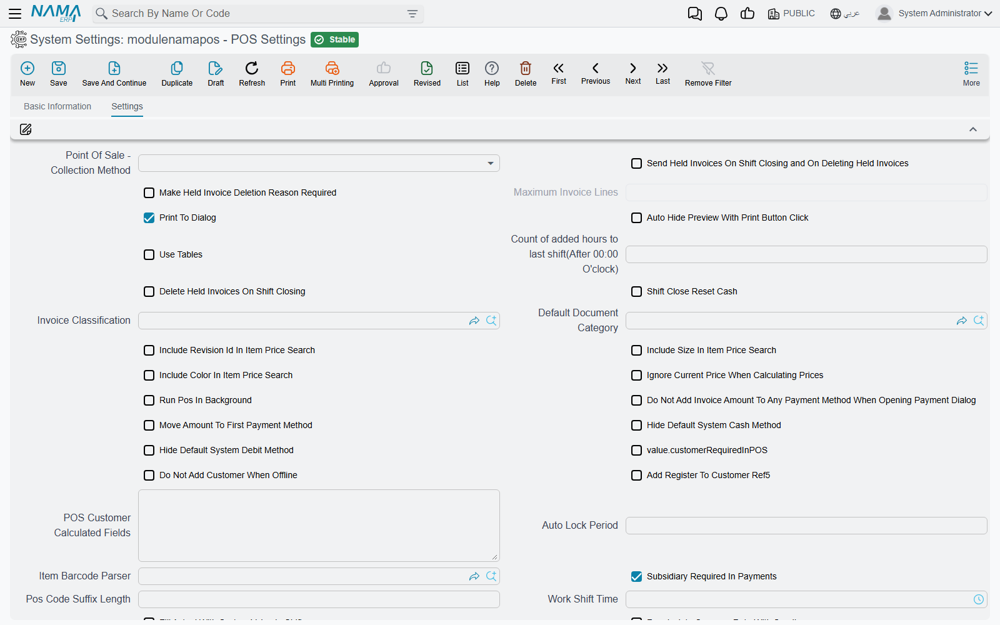
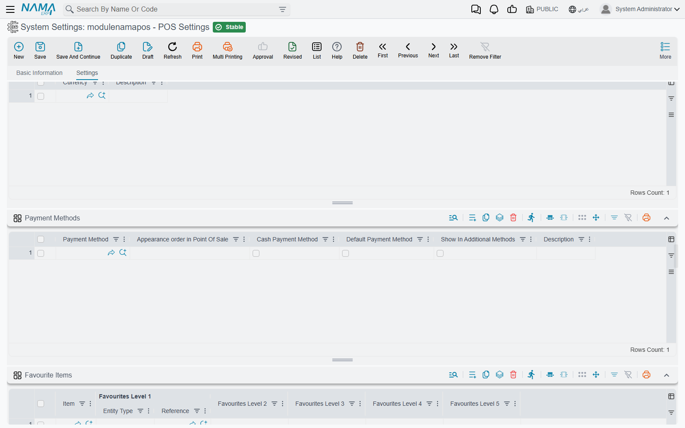
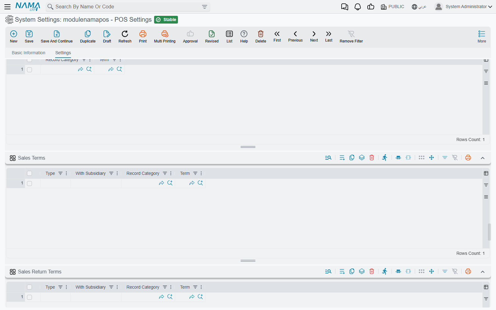

# The POS Settings Screen

**POS Settings** (*إعدادات نقاط البيع*) is where the behaviour of every register in the company is decided: how prices are found, what the payment dialog does, which documents a cashier may save without a connection, how sales reach the server. It is one long page with well over a hundred options, which is why customers tend to search it by the exact wording on screen. This page walks through it by workflow, so you can find an option from the problem it solves.

Open it from **Point of sale → Settings → POS Settings**.

## How the screen works

- **One screen for the whole company.** There is a single POS Settings record; it is not per branch or per register.
- **A register can override many of these options.** The **Register** screen repeats a good part of them — invoice classification, document category, work shift time, price and favourite queries, service, delivery and minimum-charge items, the linked settings screens, and the currency, payment-method, term and favourites grids. When the register's own field is filled, the register's value is used; when it is empty (or set to *Inherited*), POS Settings applies. Fields that exist only here apply to every register.
- **A new register starts from these grids.** When you create a register, its **Currencies**, **Payment Methods**, **Payment Terms**, **Sales Terms**, **Sales Return Terms**, **Favourite Items** and the replacement policy are copied from POS Settings. Later changes here are not copied again into existing registers.
- **Changes reach the registers through sync.** A register picks up a change with its normal data sync, like any other master data. A register that is offline or stuck keeps working with the old values — see [How POS Data Syncs with the Server](../pos-data-sync.md).

Two families of options have their own pages:

- shift opening, closing and cash reset — [Shift Opening, Closing & Cash-Reset Settings](./pos-shift-close-settings.md);
- the number of digits and the date part of document codes — [Numbering POS Documents](./pos-document-numbering.md).

## Prices and discounts

| Setting (English) | On screen (Arabic) | What it does |
|---|---|---|
| Prices in Units Grid has Priority over Price Lists | الأسعار بجدول الوحدات بالصنف لها أولوية عن قوائم الأسعار | Looks for the price in the item's units grid before the price lists. Off, the price lists are searched first. |
| Force Price Lists | الالتزام بقوائم الأسعار | Refuses to sell an item that has no price in the price lists. |
| Do Not Check Items Without Price List (With Force Price Lists Option) | السماح بالحفظ مع وجود أصناف ليس لها سعر (مع الالتزام بقوائم الأسعار) | Relaxes the option above so such items can still be saved. |
| Ignore Force Price List With Free Item | تجاهل الالتزام بقوائم الأسعار مع الصنف المجانى | Free items are not refused for lacking a price-list price. |
| Force Item Prices From Units | الألتزام بالأسعار في جدول الوحدات للصنف | Refuses items whose price is not in the item's units grid. |
| Include Revision Id / Size / Color In Item Price Search | إعتبار رقم الإصدار / المقاس / اللون في البحث عن سعر صنف | Makes the revision, size or colour part of the price lookup, for price lists that price them separately. |
| Ignore Current Price When Calculating Prices | تجاهل السعر الحالي عند حساب الأسعار | When prices are recalculated, the line's current price is not kept as a candidate. |
| Price List Default Price | السعر الافتراضي في قائمة الأسعار | Which price of the price list is taken by default. |
| Custom Price Query | استعلام حساب السعر (الوعاء) المخصص | A query that returns the price instead of the normal lookup. Also on the register. |
| Do Not Calculate Price If It Exists In Barcode | عدم حساب السعر إذا وجد في الباركود | For weighed or priced barcodes: the price read from the barcode is kept as it is. |
| Do Not Update Price With Customer / Invoice Classification / Price Classifier 1–5 / Subsidiary Selection | عدم تحديث الأسعار مع اختيار العميل / تصنيف الفاتورة / محدد السعر 1–5 / الذمه | Choosing that field on an open invoice no longer re-prices the lines. |
| Do Not Update Prices When There is Sales Doc In From Doc | عدم تحديث الأسعار عند وجود سند بيع في بناء على | A document built from a sales document keeps that document's prices. |
| Consider Value Date From From Document In Pricing And Offers | اعتبار التاريخ الفعلي من بناءا علي في حساب الأسعار والعروض | Prices and offers are calculated at the date of the source document, not today. On by default. |
| Do Not Consider Current Discount 1 … 8 Value When Recalculating Prices and Discounts | تجاهل قيمة الخصم 1 … 8 الحالية عند إعادة حساب الخصومات و الأسعار | One option per discount: on recalculation, that discount is recalculated from scratch instead of keeping the value already on the line. |
| Consider Max Discount From Discount Applier | إعتبار أقصى خصم من مطبق الخصم | When a supervisor authorises a discount, that supervisor's maximum discount applies, not the cashier's. |
| Max Fraction Discount Value | اقصي قيمة مسموحه لخصم الكسور | The largest rounding ("fraction") discount a cashier may give. Also on the register. |
| Use From Hour To Hour In Item Discounts | استخدام من ساعه - الي ساعه في خصومات الأصناف | Adds *from hour / to hour* to item discounts, for happy-hour pricing. |
| Copy Invoice Discount To | نسخ تخفيض الفاتورة إلي | Which line discount (3 to 8) receives the invoice-level discount. |
| Add Header Discount 2 Field To Sales / Header Discount 2 Location | إضافة حقل تخفيض الكسور للمبيعات / نسخ تخفيض الكسور إلي | Shows the rounding-discount field on the sales screen, and which line discount receives it. |
| Allow Save With Zero Item Price | السماح بالحفظ في وجود أصناف سعرها صفر | Lets a document be saved with a zero-priced line. |
| Do Not Insert Items With No Defined Price | عدم ادراج الأصناف التي ليس لها سعر في قوائم الأسعار أو الوحدات | An item with no price anywhere cannot be added. |
| Do Not Add Item If Price Is Zero | عدم إدراج الصنف بسعر صفر | An item whose price comes out as zero cannot be added (free lines excepted). |
| Tax Plan | سياسة الضريبة | The tax plan the registers apply. |
| Calculate Price From Purchase Price List In Stock Receipt | احتساب السعر من قائمة أسعار المشتريات في سند التوريد | The register's stock receipt is priced from the purchase price list. |
| Dont Auto-Add Free Items (Claim By Scan Or Resolve At Payment) / Must Add Item Free Items Before Payment | عدم إضافة الأصناف المجانية تلقائياً (مطالبة عند المسح أو تسوية عند الدفع) / يجب إضافة الأصناف المجانية للصنف قبل الدفع | How promotional free items are handled — see [Free Items in POS](../pos-free-items-claim-and-reconciliation.md). |

## The sales screen

| Setting (English) | On screen (Arabic) | What it does |
|---|---|---|
| Invoice Classification | تصنيف الفاتورة | The classification a new invoice starts with. Also on the register. |
| Default Document Category | تصنيف المستند الأفتراضي | The document category a new document starts with. Also on the register. |
| Add Document Category Field | إضافة حقل تصنيف المستند | Shows the document-category field on the sales screen. |
| Sales Lines Collection Method | طريقة تجميع كميات سطور المبيعات | *Collect By Item* adds to the quantity of an existing line when the same item is scanned again; *Without Collection* adds a new line every time. Also on the register. |
| Use User As Sales Man / SalesMan Is Required | إستخدام المستخدم الحالي كمندوب مبيعات / مندوب المبيعات مطلوب | Fills the salesman from the signed-in user (when the user is linked to an employee); makes a salesman mandatory. |
| Add Price Column To Item Search | إضافة عمود السعر في البحث عن صنف | Shows prices in the item search dialog. |
| UOM / Size / Color Display Type | طريقة عرض وحدة المبيعات / المقاس / اللون | Show the code, the name, or both. |
| Favourite Item Display Method | طريقة عرض زر الصنف المفضل | Favourite buttons show the name, the image, or both. |
| Favourite Items Query | استعلام الأصناف المفضله | A query that supplies the favourite items. Also on the register. |
| Do Not Use Items Image | عدم استخدام صور الأصناف | Item images are not loaded on the register. |
| Payment Sound Path / Item Not Found Alert Path | مسار المقطع الصوتي للدفع / مسار المقطع الصوتي للصنف غير الموجود | Sound files played on payment and when a scanned item is not found. |
| Open Drawer With Payment | فتح الدرج مع الدفع | Opens the cash drawer when a payment is saved. |
| Print To Dialog | إظهار نافذة الطباعة عند الطباعة | Shows the print dialog instead of printing straight away. On by default. |
| Auto Hide Preview With Print Button Click | اغلاق نافذة الطباعه تلقائيا عند الضغط على زر الطباعه | Closes the print preview after Print is pressed. |
| Print Last Document If No Current Open Document | طباعة اخر مستند في حالة عدم وجود مستند مفتوح | The print button on an empty screen reprints the last document. |
| DO Not Save Last Invoice / Return / Replacement / Stock Transfer / Stock Taking Screen | عدم الاحتفاظ باخر شاشة فاتورة مبيعات / مردود / استبدال / تحويل مخزني / جرد مخزني | The register does not reopen an unfinished document of that kind after a restart. |
| Temporal Automatic Save Current Document | حفظ مؤقت تلقائي للمستند الحالي | Keeps a temporary copy of the document being entered, so it survives a crash. |
| Merge Held Invoices With Go To Held Invoice Field | دمج الفواتير المعلقة مع حقل الذهاب إلى  فاتورة معلقة | Combines the held-invoices list with the "go to held invoice" field. |
| Make Held Invoice Deletion Reason Required | جعل سبب حذف الفاتورة المعلقة إجباري | A reason must be given to delete a held invoice. |
| Main Color / Sales Return Color / Sales Replacement Color | اللون الأساسي / لون المردود / لون الاستبدال | Screen colours, so a cashier can tell at a glance whether a return or a replacement is open. |
| Run Pos In Background | إستمرار نقاط البيع في الخلفيه | Closing the window leaves POS running in the system tray. |
| Use Domain Server For Release | استخدام السيرفر لتحديث الإصدار | Registers download new POS releases from your Nama server. |
| Do Not Validate On Locator In Sales | عدم التحقق من الموقع في المبيعات | Sales lines are not checked against the locator. |
| Stock transfer Document Category Is Required | تصنيف المستند مطلوب في التحويل المخزني | A stock transfer request needs a document category. |
| Do Not Validate RSD Fields In Sales Invoices / Sales Returns | عدم التحقق من بيانات تتبع الأدوية في فواتير المبيعات / مردودات المبيعات | Skips the drug-tracking checks. Also on the register. |

## Customers

| Setting (English) | On screen (Arabic) | What it does |
|---|---|---|
| Do Not Add Customer When Offline | عدم إنشاء عملاء في حاله فقد الاتصال | New customers can only be created while the register is connected. |
| Replace POSCustomer With Server Customer If Code Repeated | استبدال عميل نقطة البيع ب عميل الخادم عند تكرار الكود | When a customer created at the register has the code of an existing server customer, the server customer is used. |
| Add Register To Customer Ref5 | إضافة كود المكينة في المرجع 5 في مستند العميل | Stores the creating register in the customer's Reference 5. |
| POS Customer Calculated Fields | الحقول المحسوبه عند نقل عميل نقاط البيع | Fields to calculate when a register customer is transferred to the server. Also on the register. |
| Validate Customer Tax Info If Taxable | التحقق من البيانات الضريبية للعميل إذا كان خاضعاً للضريبة | A taxable customer must have complete tax information. |
| Customer Car Number Field ID | حقل رقم سيارة العميل | Which customer field holds the car number, for car-service businesses. |

## Payment, credit notes, coupons and gift cards

| Setting (English) | On screen (Arabic) | What it does |
|---|---|---|
| Do Not Add Invoice Amount To Any Payment Method When Opening Payment Dialog | عدم إضافة قيمة الفاتورة لأي طريقة دفع عند فتح شاشة الدفع | The payment dialog opens empty, so the cashier types every amount. |
| Move Amount To First Payment Method | تحريك القيمة لأول طريقة دفع (في حاله الدفع المتعدد) | In split payments, the remaining amount moves to the first method. |
| Prevent Cash Amount Auto Update | منع التعديل التلقائي لقيمة الدفع النقدي بشاشة الدفع | The cash amount is not recalculated when another method's amount changes. |
| Hide Default System Cash Method / Hide Default System Debit Method | إخفاء طريقة النظام النقدي الأفتراضيه / إخفاء طريقة الدفع الآجل الافتراضية للنظام | Hides the built-in cash or credit (deferred) method when you use your own payment methods. |
| Allow Customer To Overpay Invoice By Non-Cash Methods | السماح للعميل بالدفع بأكثر من صافي الفاتورة بطرق دفع غير نقدية | Accepts a card payment above the invoice total. Also on the register. |
| Use Credit Notes | استخدام الإشعارات الدائنة | Returns can be refunded as a credit note, and credit notes accepted as payment. |
| Use Coupons / Discount Coupon Code Length | إستخدام قسائم الخصومات (الكوبونات) / طول كود قسيمة الخصومات (الكوبون) | Enables discount coupons, and the length of a coupon code. |
| Deduct Coupon Value From Non-Cash Payments | خصم قيمة القسيمة من المدفوعات غير النقدية | A coupon reduces the non-cash part of the payment. |
| Discount Coupon Group / Discount Coupon Book | مجموعة قسيمة خصومات / دفتر قسيمة خصومات | The group and book used for coupons issued at the register. Also on the register. |
| Reward Points Configuration | إعدادات نقاط المكافأة | The loyalty-points setup the registers use. Also on the register. |
| Payment Terminal | Payment Terminal | The card terminal the registers talk to. Also on the register. |
| Automatic Save Invoice After Terminal Payment | الحفظ التلقائي للفاتوره بعد الدفع بال terminal | Saves the invoice as soon as the terminal approves the card. |

## Pay-ins and pay-outs at the register

| Setting (English) | On screen (Arabic) | What it does |
|---|---|---|
| Subsidiary Required In Payments | الذمة مطلوبه في المصروفات | A pay-out must name who the money went to. On by default. |
| Default Pay To In Payments / Default Receipt From In Receipts | صرف الي الافتراضي بسند المصروف / قبض من الافتراضي بسند المقبوض | The party type a pay-out or pay-in starts with. Also on the register. |
| Hide Default Types In Payments And Receipts | اخفاء الذمم الافتراضية في سندات الصرف والقبض | Hides the built-in party types, leaving only the ones in the two grids below. |
| Allow Payment From Current Employee | السماح بعمل مصروف من الموظف الحالي | Adds the option to record a pay-out as paid by the cashier personally. |
| Allow Payment From Treasury | السماح بالدفع من الخزينة | Adds the option to record a pay-out as paid from the treasury. |
| Document Category Is Required In POS Payment Screen / Receipt Screen | تصنيف السجل مطلوب في شاشة مصروفات / مقبوضات نقاط البيع | A pay-out or pay-in needs a document category — useful when the category picks the term (see [POS Document Terms](./pos-document-terms.md)). |

## Returns and replacements

| Setting (English) | On screen (Arabic) | What it does |
|---|---|---|
| Return or replace invoices from server | السماح بعمل مردود او استبدال للفواتير من سيرفر نما | A register can return or replace an invoice issued by another register, by fetching it from the server. |
| Allow Sales Return / Replacement If Connection Is Down | السماح بعمل مردود و استبدال في حالة عدم وجود إتصال بالخادم | Lets a return or replacement go ahead on local data when the server cannot be reached. |
| Remarks Required In Sales Return | الملحوظه مطلوبه في مردود نقاط البيع | A return cannot be saved without a remark. |
| Do Not Display Returned Lines When Selecting Invoice | عدم عرض السطور المردودة عند أختيار الفاتورة | Lines already returned are hidden when an invoice is picked for return. Also on the register. |
| Do Not Consider Box / LotId / RevisionId / Size / Color / Serial Number With Replacement Or Return | عدم اعتبار الصندوق / الشحنة / الإصدار / المقاس / اللون / رقم المسلسل مع الاستبدال و المردود | When matching a returned line to the original invoice, that attribute is ignored. |
| Replacement Conditions And Policy — Replace WithIn (In Days), Text Condition 1–5 | شروط و سياسة الإستبدال — إستبدال خلال (بالأيام)، شرط نصي 1–5 | The replacement window and the policy text. Copied to each new register, which also has **Return Invoices With In (In days)**. |

Return and replacement reasons, depreciation reasons and return-period extensions are separate screens.

## Restaurants, reservations and delivery

| Setting (English) | On screen (Arabic) | What it does |
|---|---|---|
| Use Tables | إستخدام الطاولات | Turns on halls and tables, and shows the **Tables** grid on the register. |
| Use Reservation Document | استخدام سند حجز نقاط البيع | Enables order reservations at the register. |
| Do Not Show Payment Dialog In Reservation | عدم عرض شاشة الدفع مع سند الحجز | Saving a reservation does not open the payment dialog. |
| Do Not Validate Reservation Date And Time | عدم التأكد من صحة تاريخ و وقت الحجز | Skips the reservation date and time check. |
| Service Charge Item / Percentage / Service Charge Calculated From | صنف الخدمة السياحية / نسبة الخدمة السياحية / الخدمة السياحية تحسب من | The service-charge item, its rate, and what it is calculated on. Also on the register. |
| POS Service Charge Settings | إعدادات الخدمة السياحية في نقاط البيع | A separate service-charge settings record, for rules by classification. |
| Automatically Add Service Item When Selecting Invoice Classification / Table | إضافة صنف الخدمة السياحية تلقائياً عند اختيار تصنيف الفاتورة | Adds the service item when the classification, or the table, is chosen. |
| Add Service Item Automatically In Invoice | إضافة صنف الخدمة السياحية تِلْقائيًا في الفاتورة | Adds it to every invoice. |
| Delivery Item / Delivery Cost | صنف خدمة التوصيل / تكلفة التوصيل | The delivery item and the delivery-cost record that prices it. |
| Automatically Add Delivery Item When Selecting Invoice Classification / Add Delivery Item When Selecting Customer / Add Delivery Item Automatically In Invoice | إضافة صنف التوصيل تلقائياً عند اختيار تصنيف الفاتورة / إضافة صنف خدمة التوصيل مع اختيار عميل / إضافة صنف خدمة التوصيل تِلْقائيًا في الفاتورة | When the delivery item is added. |
| Pos Minimum Charge Settings / Minimum Charge Calculation Type / Minimum Charge Item / Automatically Add Minimum Charge Item When Selecting Invoice Classification | إعدادات الحد الأدنى للطلب في نقاط البيع / الحد الأدنى للطلب يحسب من / صنف الحد الأدنى للطلب / إضافة صنف الحد الأدنى تلقائياً عند اختيار تصنيف الفاتورة | A minimum order value, topped up with the minimum-charge item. |
| Enable Delivery Cost / Service Charge / Minimum Charge In POS Reservation Document | استخدام تكلفة التوصيل / صنف الخدمة / صنف الحد الأدنى مع مستند حجز | Applies the same extra items to reservations. |
| Print Preparation Form With Payment / With Hold / With Payment Delay | طباعة فورمة تحضير الاوردر مع الدفع / مع تعليق الفاتوره / مع تأجيل الدفع | When the kitchen preparation slip prints. Also on the register. |
| Print Captain Order Invoices | طباعة فواتير كابتن أوردر | Whether Captain Order invoices print from Captain Order, from the register, or both. |

These features are described from the cashier's side in [Tables, Reservations & Captain Order](../pos-tables-and-restaurant.md).

## Sending documents to the server

| Setting (English) | On screen (Arabic) | What it does |
|---|---|---|
| Point Of Sale - Collection Method | طريقة تجميع فواتير نقاط البيع | *One By One* creates one server invoice per register invoice. *Collect Invoices* merges the invoices of the same shift into one server invoice when they share the customer, salesman, user, date, currency and price classifiers and have no invoice discount. |
| Maximum Invoice Lines | أقصي عدد لسطور الفاتورة | With *Collect Invoices*, the most lines one merged server invoice may hold. |
| Recalculate Currency Rate With Sending | إعادة احتساب معدل العملة مع الحفظ و الإرسال | The currency rate of an incoming document is recalculated on the server from its exchange rates, instead of keeping the register's rate; invoices are then merged without comparing rates. |
| Do Not Merge Sales Lines | عدم تجميع سطور المبيعات | Lines of the same item are sent as they are, not combined. |
| Save Documents With Errors As Draft | حفظ المستندات التي بها اخطاء كمسودm | A document the server cannot accept is kept there as a draft instead of being refused. |
| Number Of Times For Resending Failed Invoice | عدد مرات إعادة إرسال الفاتورة في حالة فشل الإرسال | How many times a failed document is retried before it waits for manual action. Empty means 25. |
| Transfer With Save Documents | المستندات التي يجب نقلها بمجرد الحفظ | Document types sent the moment they are saved instead of waiting for the next sync. |
| Sending Configurations | إعدادات ارسال البيانات لنقاط البيع | Per data type, criteria for what is sent down to the registers and what is never sent. |
| Filter Dimensions On Sending | فلترة المحددات عند الارسال | Sends each register only the records of its own legal entity, branch, sector, department or analysis set — see [Filtering by machine dimensions](../nama-pos.md#Filtering-Search-Screens-in-POS-Using-Machine-Dimensions). |
| Remove Documents From POS After (In Days) | حذف المستندات من نقطة البيع بعد مرور (بالأيام) | How long the register keeps its log of errors already reported to the server. Also on the register. |
| Connection Timeout / Receive Timeout | Connection Timeout / Receive Timeout | How long, in milliseconds, a register waits to connect to and hear back from the server (defaults 5000 and 30000). |
| Notification Content | محتوى التنبيه | What a transfer-error notification shows. |

## Security and sign-in

| Setting (English) | On screen (Arabic) | What it does |
|---|---|---|
| Auto Lock Period | مدة اللإقفال التلقائي | The register locks after this much inactivity. |
| Request Authorization From Another User When User Does Not Have Capability | طلب تفويض من مستخدم آخر عند عدم وجود الصلاحيات التالية | A grid of capabilities. When a cashier lacks one of them, the register asks a supervisor to sign in and authorise the action instead of just refusing. |
| Do Not Hide Fields If User Has Not Capability | عدم اخفاء الحقول في حالة عدم وجود صلاحية بها للمستخدم | Menu entries the user may not use stay visible (disabled) rather than hidden. |
| Enable Fingerprint | تفعيل البصمة | Turns on fingerprint sign-in — see [Fingerprint Login](../pos-fingerprint-login.md). |
| Allow Modifying "Modifiable Tax" Field in POS Terms | السماح بتعديل حقل "يمكن تعديل الضريبة" في توجيهات سندات نقاط البيع | While it is off, the POS sales, reservation and cancel-reservation terms always save with **Modifiable Tax** ticked. Turn it on to be able to untick it. |

## Linked settings records

Several options simply point at a record kept on its own settings screen under **Point of sale → Settings**. Each is also on the register, whose choice wins.

| Setting | On screen (Arabic) |
|---|---|
| Pos UI Settings | إعدادات واجهة نقاط البيع الجديده |
| Pos Mobile UI Settings | إعدادات واجهة نقاط البيع للموبايل |
| Pos Items To Send / Pos Items To Not Send | الأصناف المرسلة لنقاط البيع / الأصناف الغير مرسله لنقاط البيع |
| Item Barcode Parser | مواصفات باركود الأصناف |
| POS Item Quantity Update Configuration | إعدادات تحديث كميات الماكينة |
| Saving Setting | إعدادات الحفظ في نقاط البيع |
| Extra Filters | Extra Filters |
| ShortCuts | الاختصارات |
| Customer Phone Country Codes | أكواد الدول لأرقام العملاء |
| Payment Methods Settings | إعدادات طرق الدفع |

**Track Invoice Removed Lines** (*حفظ السطور المحذوفة من الفاتورة*) keeps the lines a cashier deletes from an invoice, so they can be reviewed later; it is also on the register.

## The grids

| Grid | On screen (Arabic) | What it holds |
|---|---|---|
| Currencies | العملات | The currencies the registers accept. |
| Payment Methods | طرق الدفع | The methods offered at payment, their **Appearance order in Point Of Sale**, which one is the **Cash Payment Method** and which the **Default Payment Method**, and whether each shows in the additional methods. |
| Favourite Items / Fixed Favourite Items | الأصناف المفضلة / الأصناف المفضلة الثابتة | The favourite buttons, in up to five levels. |
| Favourite Documents | المستندات المفضله | Shortcut buttons that open a document type with a given category. |
| Payment Terms / Receipt Terms / Sales Terms / Sales Return Terms | توجيهات المصروفات / المقبوضات / المبيعات / المردودات | Which term each document gets on the server — see [POS Document Terms](./pos-document-terms.md). |
| Payment Subsidiary Types / Receipt Subsidiary Types | ذمم مصروفات / مقبوضات نقاط البيع الافتراضية | The party types offered on pay-outs and pay-ins. |
| Taken Elements Per Shift | العناصر المجرودة مع كل وردية | Extra things counted at each shift — see the [shift settings](./pos-shift-close-settings.md). |
| Gift Cards | بطاقات الهدايا | Gift-card items and how their codes are generated (prefix, **Suffix Length**, **Suffix First Number**), and whether each card can be **Used Once**. |
| Filtered Held Invoices Buttons | أزرار الفواتير المعلقة المفلترة | Extra buttons on the register that list only the held invoices matching a **Filter Condition** — for example, one button per delivery channel. |

