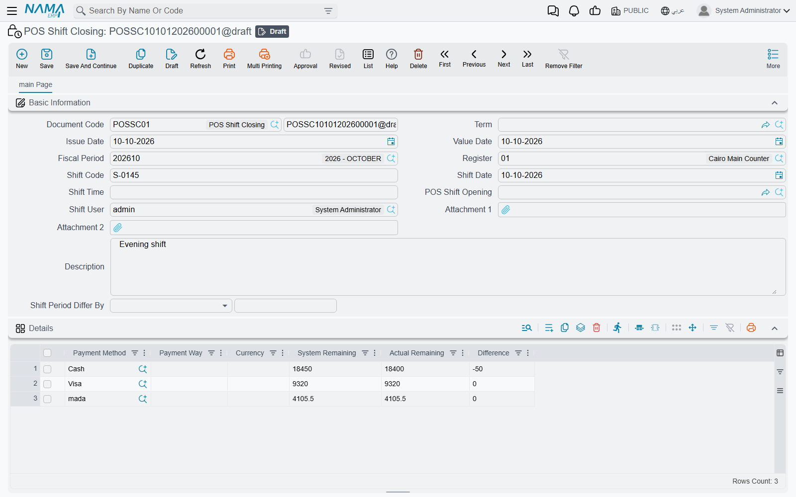
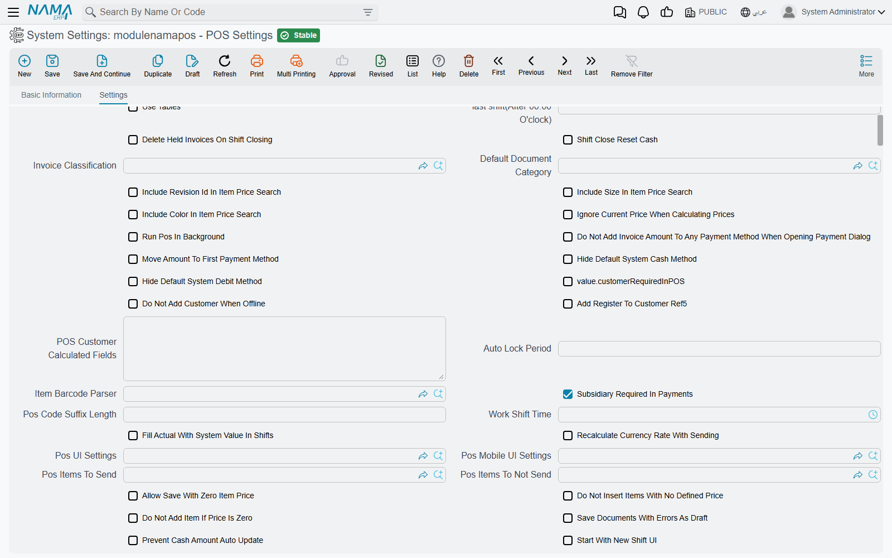
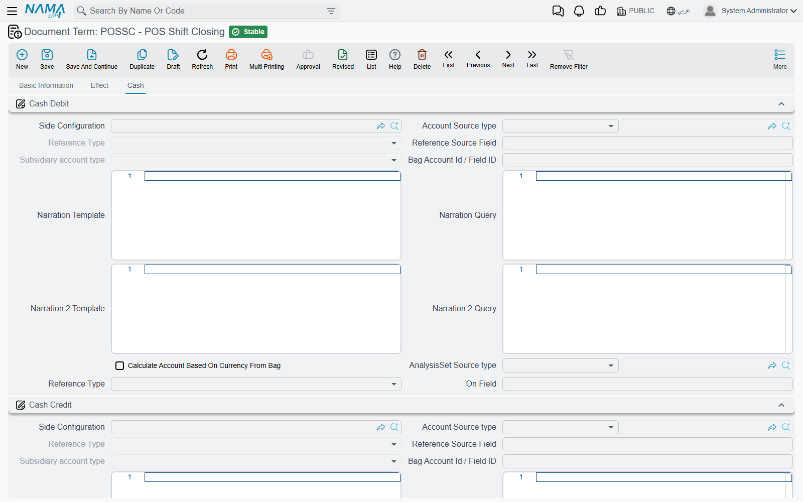

# Shift Opening, Closing & Cash-Reset Settings

A cashier opens and closes shifts at the register (see [Shifts & Cash](../pos-shifts-and-cash.md)). This page is the other half of the story: what those shifts become on the Nama server, which settings decide how the close behaves, and how a close turns into accounting. It is the page to read when a customer says *"the shift is not being reset when it closes"* or *"the cashier cannot close the shift"*.

## What arrives on the server

Every shift a register opens or closes is synced to the server as a document:

| Screen | Arabic name on screen | What it holds |
|---|---|---|
| **POS Shift Opening** | فتح ورديه | The opening count, per payment method and currency |
| **POS Shift Closing** | غلق وردية | The closing count: what the system expected, what the cashier counted, and the difference |
| **POS Cash Drawer** | جرد | A cash count taken in the middle of a shift, without closing it |

Find them under **Point of sale → Documents** (the cash drawer is under **Point of sale → Master Files**). The grid on each one has the same columns: **Payment Method**, **Payment Way**, **Currency**, **System Remaining** (what the register expected), **Actual Remaining** (what the cashier counted) and **Difference** (actual minus system). The header carries the register, the **Shift Code** shared by the opening and its closing, the **Shift User**, and links between the opening and the closing.

These are **system documents**. They are created by the register and cannot be created, edited or deleted on the server; trying to do so is refused with *System document, You cannot create, update or delete it* — «مستند نظامي لا يمكنك انشاؤة أو التعديل فيه أو مسحه». A wrong count is corrected by an accounting adjustment, not by editing the closing.

## Resetting the cash at close

The setting customers ask about most is **Shift Close Reset Cash** (*تصفير النقديه مع غلق الورديه*) on the **POS Settings** screen (**Point of sale → Settings → POS Settings**). It decides what happens to the cash in the drawer once a shift closes.

**When it is off**, the counted cash stays in the drawer's books. Say the system expected 5,000 and the cashier counted 4,980: the shift closes with a difference of −20, and the next shift starts with the drawer's cash balance at 4,980. This suits a shop where the float stays in the till from one shift to the next.

**When it is on**, the cash balance goes back to zero at every close. The 4,980 is treated as handed over, and the next shift starts from nothing (plus whatever the cashier enters as the new opening count). This suits a shop where the cashier empties the till to the safe or a supervisor at the end of every shift.

Non-cash payment methods — cards, vouchers and the like — are **always** cleared at close, whichever way the setting is. The setting only changes how the cash line behaves.

### Which line counts as "cash"

Only one line in the closing is the cash line:

- the system's default cash line, or
- the payment method ticked **Cash Payment Method** in the **Payment Methods** grid of the [register](./pos-register-setup.md) — or, when the register has no payment methods of its own, in the same grid on **POS Settings**.

If the shop's cash is collected through a payment method that is not ticked as the cash method, that line is treated like any other non-cash method.

### What the reset does in the accounts

With the setting on, the closing also produces an entry that **moves the counted cash** out of the register. The accounts come from the **Cash** tab of the POS Shift Closing document term (*توجيه* — the term's **Cash Debit** and **Cash Credit** groups). A typical setup debits the main treasury and credits the register's cash account. Both groups have to be filled; if either is empty, the register still resets its own balance but the server writes no cash-transfer lines.

### When the reset does not seem to happen

Work through these in order:

1. **Is the setting on?** Open **POS Settings** and check **Shift Close Reset Cash**. There is a single POS Settings screen for the whole company; registers do not have their own copy of this option.
2. **Has the register received the change?** Settings reach a register through the same data sync as items and prices. A register that is offline, or whose sync is stuck, is still working with the old value. See [How POS Data Syncs with the Server](../pos-data-sync.md).
3. **Is the cash really the cash method?** Check that the payment method used for cash is ticked **Cash Payment Method** on the register (see above).
4. **Is the Cash tab of the term filled?** If the register resets but no transfer entry appears on the server, the shift-closing term's **Cash Debit** and **Cash Credit** are missing.

::: warning Not the same option as on the Payment Method
The **Payment Method** screen has an option with a similar name, **Reset Balance With Shift Close** (*تصفير الرصيد مع غلق الوردية*). It belongs to the accounting module's own **Open Shift** / **Close Shift** documents, not to the POS. Ticking it has no effect on POS shifts.
:::

## How differences are posted

When a closing (or opening) line has a difference, the server processes it through the document term's **Effect** tab:

- an **overage** (counted more than expected) uses **Increase Debit** and **Increase Credit**;
- a **shortage** (counted less) uses **Decrease Debit** and **Decrease Credit**.

A payment method can override this with its own **Shift Difference Debit Side** and **Shift Difference Credit Side** (on the **Payment Method** screen); for a shortage those two are applied the other way round. Lines with no difference produce no entry at all.

## Settings that shape the close

All of these are on **POS Settings**. Where a register has its own field with the same name, the register's value wins.

| Setting (English) | On screen (Arabic) | What it does |
|---|---|---|
| Shift Close Reset Cash | تصفير النقديه مع غلق الورديه | Clears the cash balance at every close (above). |
| Delete Held Invoices On Shift Closing | مسح الفواتير المعلقه مع غلق الورديه | Deletes held invoices, returns and replacements on the register when the shift closes. |
| Send Held Invoices On Shift Closing and On Deleting Held Invoices | إرسال الفواتير المعلقة عند غلق الوردية أو حذف الفاتورة المعلقة | Sends held invoices up to the server (as **Held Invoice** records) when the shift closes, so they are not lost. |
| Prevent Close If Hold Documents Exist | منع الاغلاق في وجود مستندات معلقة | Refuses the close while any invoice, return or replacement is held. |
| Prevent Shift Close On Held Invoices | منع إغلاق الوردية عند وجود فواتير معلقة | The same, but only held invoices block the close. |
| Prevent Shift Close On Unused Credit Notes | منع إغلاق الوردية عند وجود إشعارات دائنة غير مستخدمة تم إنشاؤها أثناء الوردية | Refuses the close while a credit note issued in this shift still has an unused balance. |
| Prevent Login Except For Shift Opener Or Users With Can-Use-Another-User-Shift Capability | منع تسجيل الدخول إلا لمنشئ الوردية أو من لديه صلاحية استخدام وردية مستخدم أخر | While a shift is open, only the user who opened it — or a user whose POS security profile has **Can Use Another User Shift** — can sign in. |
| Count of added hours to last shift (After 00:00 O'clock) | عدد الساعات المضافه لاخر ورديه (بعد الساعه 00:00) | For businesses that close after midnight. Set it to 3 and a document saved at 01:30 is dated the previous day at 23:59, so the night's takings stay on one business day. |
| Work Shift Time | وقت وردية العمل | The time a shift is expected to end. A shift opened before this time cannot keep selling after it — the cashier is told to close and open a new shift. Also on the register; the register's value wins. |
| Shift Period | مدة الورديه | The expected length of a shift. Each POS Shift Closing then shows **Shift Period Differ By** — how much longer or shorter the shift ran, in hours. |
| Fill Actual With System Value In Shifts | ملئ القيم الفعلية بالقيم الدفتريه في الورديات | Pre-fills each **Actual Remaining** with the system figure, so the cashier only changes the lines that differ. Leave it off if you want a blind count. |
| Prevent Saving Shift By F2 Shortcut | منع حفظ سند الوردية باختصار F2 | The shift screen can only be saved with its button, not with F2. |
| Cash Denominations (CSV) | الفئات النقدية (CSV) | The notes and coins shown in the denominations box on the closing screen, comma-separated, e.g. `200,100,50,20,10,5,1,0.5`. |
| Taken Elements Per Shift | العناصر المجرودة مع كل وردية | Extra things to count with each opening or closing — keys, vouchers, a stock of gift cards. Each line names the document (opening or closing) and the element; the cashier enters a value for it, and it is saved in the **Taken Elements Per Shift Lines** grid of the document. Also on the register. |
| Update Invoices Without ShiftOpening On Shift Save | تحديث الفواتير التي لا تحتوي على فتح وردية مع حفظ الوردية | When a shift opening reaches the server after its invoices, links the already-received invoices of that shift to it. |
| Start With New Shift UI | البدء بالشكل الجديد لشاشة الورديات | Uses the newer shift-screen layout for the mid-shift cash count too. |

A delayed-payment invoice always blocks the close, whatever the settings.

### Payment-method options that affect the close

Three options on the **Payment Method** screen change how that method's line behaves on the closing screen:

- **Hide In Shifts** (*اخفاء في شاشة الورديات*) — the method does not appear on the shift screen at all.
- **Disable Actual Balance In POS** (*تعطيل الرصيد الفعلي في نقطة البيع*) — the cashier cannot type an actual figure for it.
- **Actual Balance Is Required In POS** (*الرصيد الفعلي في نقطة البيع إجباري*) — the close is refused if the method has a system balance and the cashier left its actual figure empty.

## Messages you may see

The register raises these when a cashier tries to close a shift or sell.

| Message | Why | What to do |
|---|---|---|
| *You can not close shift if there is any held invoices* — «لا يمكن غلق الوردية و هناك فواتير مبيعات معلقة» | **Prevent Shift Close On Held Invoices** is on and an invoice is held. | Recall and finish or delete the held invoice, then close. |
| *You can not close shift if there is any held documents (invoices, returns or replacements)* — «لا يمكن غلق الوردية و هناك مستندات معلقة (فواتير او مردودات او استبدالات)» | **Prevent Close If Hold Documents Exist** is on. | Finish or delete every held document. |
| *You can not close shift if there is any unused credit notes* — «لا يمكن غلق الوردية و هناك إشعارات دائنة غير مستخدمة» | **Prevent Shift Close On Unused Credit Notes** is on and a credit note from this shift still has a balance. | Use the credit note, or ask the manager whether the setting should stay on. |
| *You can not close shift if there is any delayed payment invoices* — «لا يمكن غلق الورديه في وجود فواتير مؤجلة الدفع» | An invoice in this register is waiting for payment. | Take the payment for it first. |
| *Actual balance is required for payment method {0}* — «الرصيد الفعلي إجباري لطريقة الدفع {0}» | The method is marked **Actual Balance Is Required In POS** and its count is empty. | Enter the counted amount. |
| *Negative actual value* — «قيمه فعليه سالبه» | A negative amount was typed as the counted cash. | Correct the count. |
| *You should close current shift, And open new one* — «يجب إغلاق الوردية الحالية لتخطى وقت الوردية المسموح به وفتح وردية جديدة» | The shift has passed its **Work Shift Time**. | Close the shift and open a new one. |
| *Another user has an open shift, you cannot login* | **Prevent Login Except For Shift Opener…** is on and someone else opened the current shift. The message has no Arabic translation and appears in English on Arabic screens too. | Sign in as the shift's user, close the shift, or give the user **Can Use Another User Shift**. |
| *Another user shift. User: {0} opened shift at: {1} {2}* — «وردية مستخدم أخر. المستخدم: {0} قام بفتح وردية في: {1} {2}» | The cashier is saving a document in a shift another user opened, without **Can Use Another User Shift**. | Close that shift and open one under the cashier's own user, or grant the capability. |
| *System document, You cannot create, update or delete it* — «مستند نظامي لا يمكنك انشاؤة أو التعديل فيه أو مسحه» | Someone tried to create or edit a shift document on the server. | Shift documents come only from the register; correct a mistake with an accounting adjustment. |
