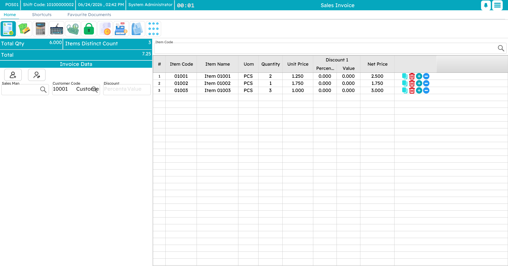

# Point of Sale

Most of Nama ERP runs in a web browser. **Nama POS** is the exception: a dedicated **desktop application** that runs right on the cash register, with a companion **Captain Order** mobile app for waiters. It is built this way for one simple reason — a point of sale cannot stop selling just because the internet went down.

## Offline-first by design

A shop floor is a demanding place: the connection drops, a busy night brings a queue to the counter, and the customer in front of you still expects a receipt in seconds. So every register keeps its own **local database**, records every sale, return, payment and shift **locally first**, and **syncs** in the background up to the central Nama ERP — flushing any queued documents automatically once the connection returns.

This is the single most important idea about Nama POS, and it has its own page below.

## How this guide is organized

This guide is a tour of the register, roughly in the order you meet each part.

### Start here

<LandingGrid>
  <LandingCard icon="🗺️" title="Nama POS — Overview" link="/modules/pos/pos-overview.md" details="What the system is, its pieces (register, Captain Order, server, peripherals), and who uses each." />
  <LandingCard icon="💿" title="Installing a New Register" link="/modules/pos/pos-installation.md" details="First-time setup: SQL Server, the local database, the installer, the settings dialog, and the first sync with the server." />
  <LandingCard icon="🚀" title="Getting Started at the Register" link="/modules/pos/pos-getting-started.md" details="Launching, signing in, the slide menu, keyboard shortcuts, locking the screen, supervisor authorization, language & theme." />
</LandingGrid>

### Selling

<LandingGrid>
  <LandingCard icon="🛒" title="The Sales Invoice" link="/modules/pos/pos-sales-invoice.md" details="The main selling screen: adding items, the customer, discounts, holding and recalling a sale." />
  <LandingCard icon="💳" title="Payment & Tender" link="/modules/pos/pos-payment-and-tender.md" details="Taking the money: cash, card, split payments, coupons, credit notes, reward points." />
  <LandingCard icon="↩️" title="Returns & Replacements" link="/modules/pos/pos-returns-and-replacements.md" details="Refunds, exchanges, credit notes, and depreciation on returned goods." />
</LandingGrid>

### Running the register

<LandingGrid>
  <LandingCard icon="💵" title="Shifts & Cash" link="/modules/pos/pos-shifts-and-cash.md" details="Opening and closing a shift, counting the drawer, pay-ins and pay-outs." />
  <LandingCard icon="🍽️" title="Tables, Reservations & Captain Order" link="/modules/pos/pos-tables-and-restaurant.md" details="Halls and tables, reservations, suspended orders, the call-center flow, and the waiter's mobile app." />
  <LandingCard icon="☕" title="Item Add-ons" link="/modules/pos/pos-item-addons.md" details="Sizes, colours, and extras (like sugar and milk for a coffee)." />
  <LandingCard icon="📦" title="Inventory Operations at the Register" link="/modules/pos/pos-inventory-operations.md" details="Receiving, transferring, counting, and scrapping stock from the register." />
  <LandingCard icon="📊" title="Reports & Tools" link="/modules/pos/pos-reports-and-tools.md" details="Running reports, internal messages, the price checker, and maintenance utilities." />
</LandingGrid>

### Behind the scenes

<LandingGrid>
  <LandingCard icon="🔄" title="How POS Data Syncs with the Server" link="/modules/pos/pos-data-sync.md" details="What “sent” and “unsent” mean, and what to do when a document won't go up." />
</LandingGrid>

### Setting it up on the server

<LandingGrid>
  <LandingCard icon="🛠️" title="POS — Server-Side Setup" link="/modules/pos/erp-setup/" details="The register file, POS Settings, document numbering, shift-close and cash-reset settings, document terms, security profiles and the other screens under the Point of sale menu." />
</LandingGrid>

### Technical & reference

<LandingGrid>
  <LandingCard icon="🔧" title="Nama POS — Technical Points of Use Guide" link="/modules/pos/nama-pos.md" details="Pole display, dimension filtering, API-key login, column widths, reset counter, and other technical tips." />
  <LandingCard icon="🎁" title="Free Items in POS: Claim at Scan and Reconciliation at Payment" link="/modules/pos/pos-free-items-claim-and-reconciliation.md" details="How promotional free items are claimed and reconciled." />
  <LandingCard icon="👆" title="Fingerprint Login in Point of Sale" link="/modules/pos/pos-fingerprint-login.md" details="Signing in with a fingerprint reader." />
  <LandingCard icon="❓" title="Point of Sale FAQ" link="/modules/pos/pos-faq.md" details="Quick answers to common questions." />
</LandingGrid>

::: tip Configuration is a separate topic
This guide is about **using** Nama POS day to day. Setting it up — defining registers, payment methods, security profiles, screen layouts, and the many POS settings — is covered in [POS — Server-Side Setup](./erp-setup/).
:::
