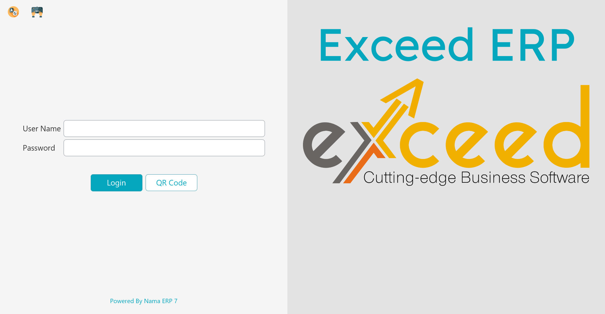
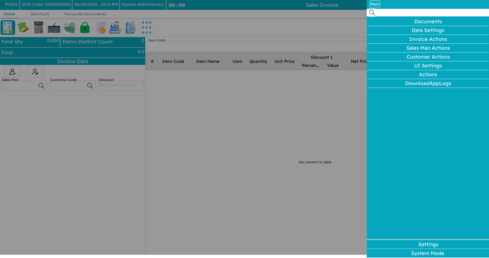
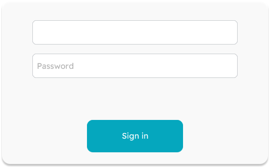
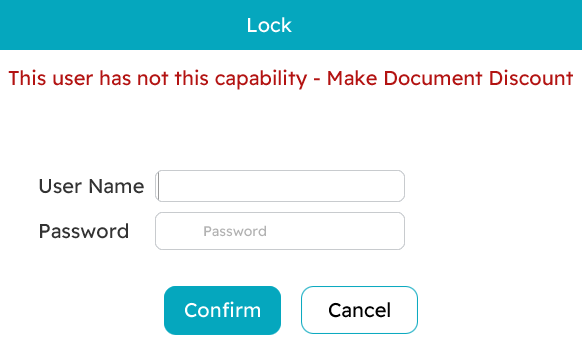

# Getting Started at the Register

This page walks through the everyday basics: starting the application, signing in, finding your way around the menu, locking the screen when you step away, and switching language or theme.

## Starting the application

When you launch Nama POS you first see a **splash screen** with a progress bar while the register wakes up.

Behind that splash, the register is doing a few things: opening its **local database**, applying its saved language and theme, loading its configuration and prices from cache, and — if it can reach the server — pulling down any fresh data and pushing up anything left over from last time. If the server cannot be reached, the register simply carries on in offline mode; you can still sell.

## Signing in

Once the register is ready, the **login screen** appears.

There are three ways to sign in, and they can all be used at the same register:

**Username and password.** The classic way. Type your user name, then your password, and press Enter. Your **security profile** loads with you — that is what decides which actions you are allowed to perform (see [Lock and security](#Lock-and-security) below).

**Fingerprint.** If your fingerprint has been enrolled, just place your finger on the reader — no typing at all. The reader is listening in the background on the login screen, the unlock screen, and the supervisor-authorization prompt. Enrolment and setup are covered in [Fingerprint login](./pos-fingerprint-login.md).

**API key.** Instead of storing a password on the machine, a register can sign in with an **API key** tied to a user. This keeps working even after that user's password changes, and avoids keeping a password (even encrypted) in the register's files. You can paste the key into the initial-settings window in place of the user name and password. The detailed setup lives in the [technical points guide](./nama-pos.md#Logging-In-Using-an-API-Key-in-POS).

## Finding your way around

### The slide menu

The main menu slides in from the side of the screen. It holds buttons for the common actions — new sale, payment, returns, shifts, held invoices, reports, lock, and so on. Click an action to go to its screen.

### Keyboard shortcuts

A busy counter runs on the keyboard, not the mouse. Nama POS ships with sensible default shortcuts (your administrator can change any of them on the server, so yours may differ):

| Shortcut | Action | Shortcut | Action |
|---|---|---|---|
| `Alt+F1` | New sale | `F6` | Hold (suspend) the invoice |
| `F1` | Move between the line grid and header | `Ctrl+F6` | Show held invoices |
| `Ctrl+F1` | Sales return | `Shift+F6` | Delete all held invoices |
| `Shift+F1` | Sales replacement (exchange) | `Ctrl+Shift+F6` | Show call-center held orders |
| `F2` | Shift screen (open/close) | `F7` | Choose the customer |
| `Ctrl+F2` | Inventory screen | `Shift+F7` | Add a new customer |
| `F3` | Item / record search | `Ctrl+F7` | Remove the customer |
| `Ctrl+F3` | Open an existing invoice | `F8` | Choose the salesman |
| `F4` | Change font size | `Ctrl+F8` | Remove the salesman |
| `F5` | Payment / tender | `Ctrl+F9` | Price inquiry |
| `F10` | Invoice discount | `Alt+1` … `Alt+8` | Line discount levels 1–8 |
| `Ctrl+F10` | Remove the invoice discount | `Ctrl+Q` | Edit the selected line's quantity |
| `F11` | Lock the screen | `Ctrl+Del` | Delete the selected line |
| `Ctrl+F11` | Show all notifications | `+` | Duplicate the selected line |
| `F12` | Help | `Alt+P` | Reprint |
| `Alt+R` | Pay using reward points | `Ctrl+O` | Online-order inquiry |
| `Page Up` | Jump to the header fields | `Page Down` | Jump to the line grid |
| `Alt+F4` | Close the application | `Ctrl+I` | Open a held invoice by code |

::: tip
You do not need to memorize these. The slide menu shows the shortcut next to each action, and the most-used ones (new sale, payment, hold, discount) become second nature within a day.
:::

## Lock and security

### Locking the screen

Whenever you step away from the register — even for a moment — **lock the screen** with `F11`. The screen is then covered by a prompt, and someone must sign in to use the register again. This keeps sales from being rung up under your name while you are not there, and the lock/unlock is recorded for auditing.

To unlock, sign in again (your own credentials, or another authorized user's, or a fingerprint). Whoever unlocks becomes the active operator.

### Supervisor authorization

Some actions are deliberately restricted — a large discount, a return after the allowed period, cancelling an invoice. When a cashier without that permission tries one, Nama POS does not just refuse. Instead it pops up a small **authorization window** asking for the credentials of someone who *does* have the permission.

The supervisor types their user name and password (or uses their fingerprint), the action goes through, and the cashier carries on — no logging out and back in. Every such authorization is logged.

### Users and security profiles

Two ideas work together here:

- A **POS user** is a login account, tied to an employee.
- A **security profile** is a named bundle of permissions — "Cashier", "Supervisor", "Manager" and so on. Each user is assigned one profile, and many users can share the same profile.

A profile is what answers questions like: *Can this person give a discount? Process a return? See the expected cash total when closing a shift? Open the cash drawer?* These are all set up centrally on the server and pushed down to every register, so changing a profile updates everyone who has it.

## Language & theme

Nama POS can run in more than one language. From the settings area you can switch the interface language; the choice is remembered on that register.

You can also switch between a **light** and a **dark** theme — dark is easier on the eyes in a dim shop, light is clearer under bright lights.

Individual text labels can also be **overridden** per register — for example a café might prefer the word "Bill" to "Invoice". These overrides are set up centrally and pushed to the register, so the wording you see may be tailored to your business.
