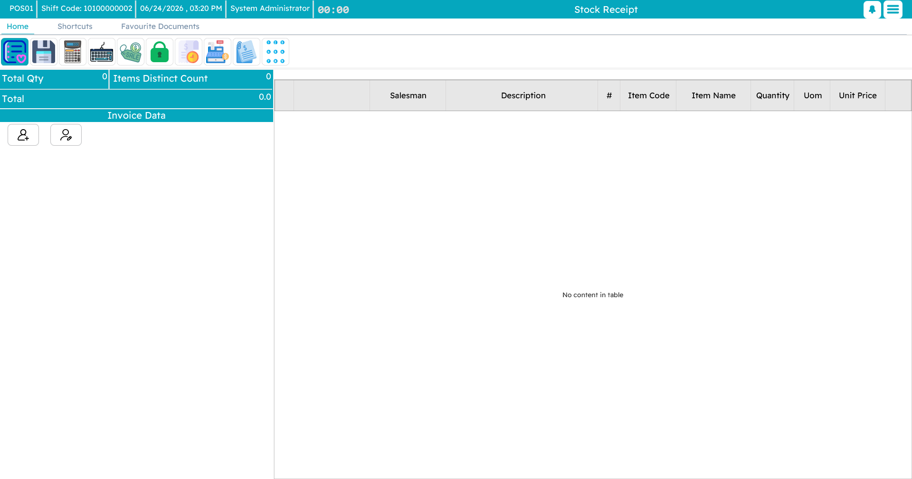
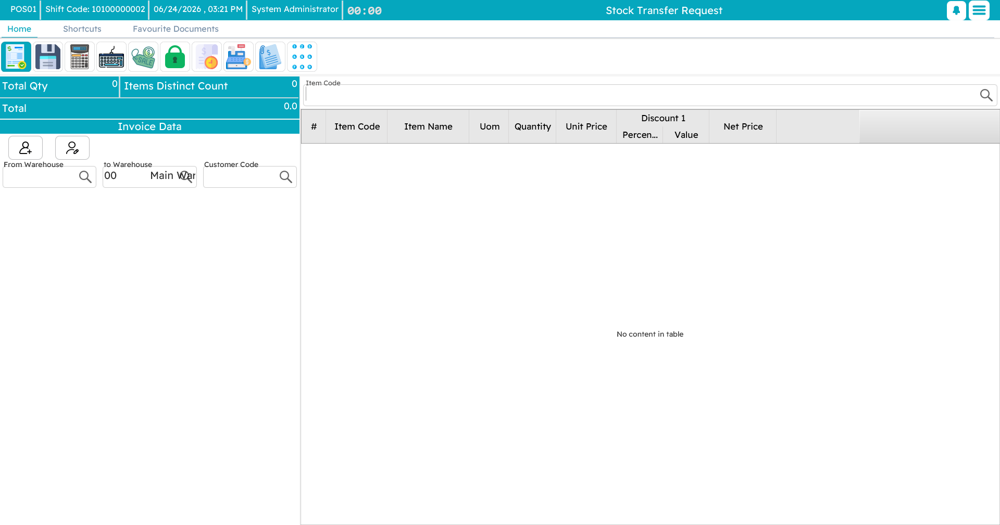
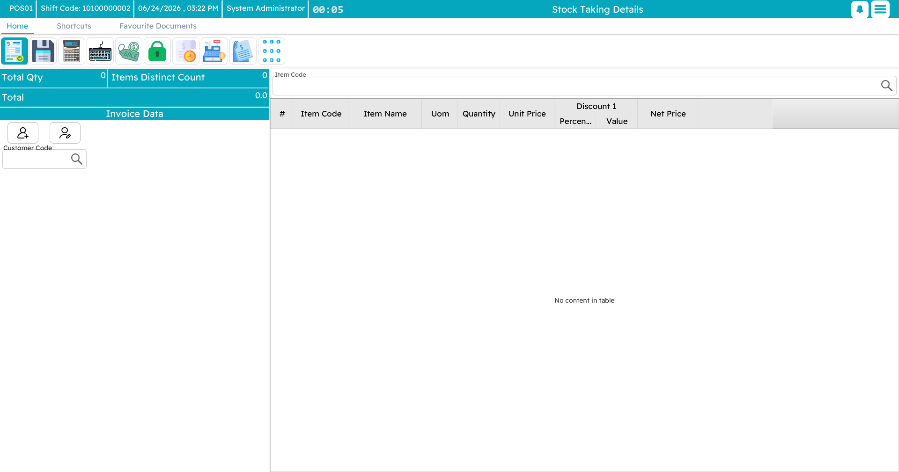
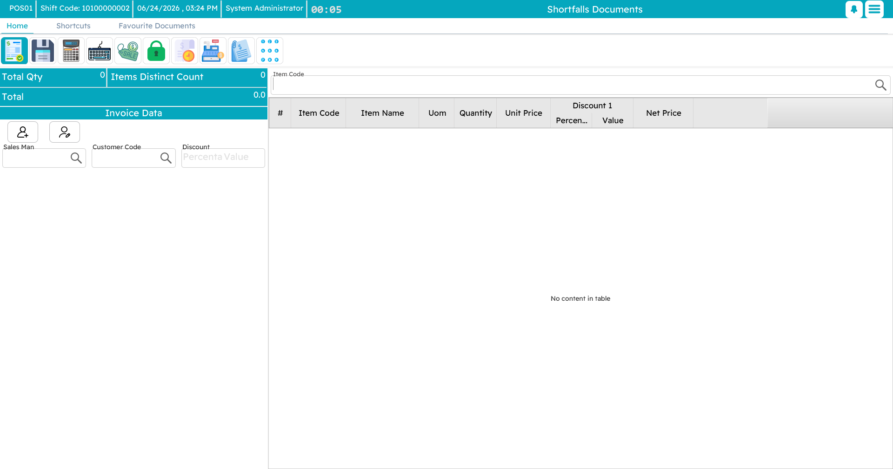

# Inventory Operations at the Register

A point of sale is not only a till — it is also the front line of the store's stock. From the **inventory screen** (`Ctrl+F2`) a shop user can receive goods, move them to another branch, count them, and write off what is damaged or missing, all without leaving the register. Each of these is a document that syncs up to the central system like everything else.

## Receiving stock

When goods arrive — from a supplier, head office, or another branch — a **stock receipt** records them into the store's warehouse. Add each item and the quantity received, add a note if needed, and save. The receipt updates the store's stock and is sent up to the central system.

## Transferring stock

When stock needs to move to another warehouse or branch, a **stock transfer request** records it leaving here and heading there. Your own warehouse is filled in as the source; choose the destination, list the items and quantities, and save. The receiving location confirms it on their side to complete the move.

## Counting stock

A **stock-taking** document is a physical count — the periodic check that what is on the shelf matches what the system thinks. Choose the warehouse and location, scan or enter each item with the quantity actually on hand, and save. The counts go up to the central system, where they are compared against the records to surface any shortfall or surplus.

## Writing off damaged or missing stock

Two documents handle the stock that should no longer be on the books:

- A **scrap document** is for goods that are damaged, expired, or otherwise unusable — they are removed from stock with a reason and an audit trail.
- A **shortfalls document** records stock that is missing or unaccounted for — shrinkage, loss, breakage — again with a description for later review.

::: info Why do this from the register?
Doing stock work where the goods physically are — at the store, on the device already in the staff's hands — means the count or the write-off happens at the moment it is observed, not hours later back at a desk. And because it all syncs to the central system, head office sees the same picture the store does.
:::
