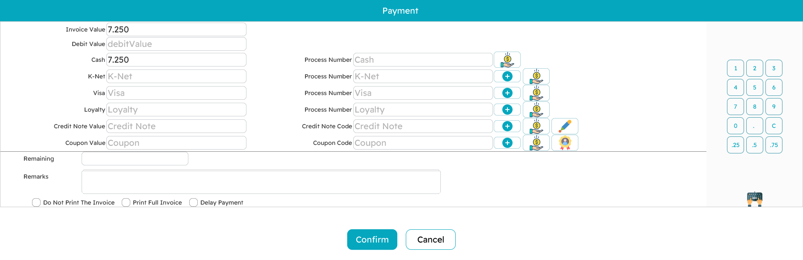

# Payment & Tender

Pressing `F5` on a finished invoice opens the **tender screen** — the moment of truth where money changes hands. This page covers how that screen works and every way a customer can pay.

## The tender screen

The layout is built for speed:

- The **invoice value** — what is owed — sits at the top.
- A row for each **payment method** the register accepts lets you type how much is being paid by that method. Card, credit-note and coupon rows also have a field for an authorization or reference number.
- The **remaining** figure at the bottom updates with every keystroke. Zero means the invoice is fully covered; a leftover means there is still money to collect; an overpayment in cash is simply the **change** to hand back.

You confirm to finish the sale, the receipt prints, and you are back on a clean sales screen for the next customer.

## Ways to pay

### Cash

Type the cash the customer handed over. If it is more than the total, the remaining goes negative and that figure is the **change** due. Cash can always overpay — that is the whole point of change.

### Card / payment terminal

Card payments go through an integrated **payment terminal**. Enter the amount on the card row and send it to the terminal (there is a dedicated button on the row). The terminal does its work and hands back the result — approval, card type, the masked card number — which the register records against that payment line. If a terminal response cannot be matched to a configured method, the cashier is told rather than left guessing.

### Split across several methods

A single invoice can be settled by more than one method — say half cash, half card. Enter each amount; the **remaining** keeps you honest, and the sale completes only when it reaches zero (or goes negative as change on cash). Methods can also be grouped into collapsible sections to keep a long list tidy.

### Deferred (pay later)

Sometimes the customer pays later — a credit account, a reserved order. Choosing the **deferred** option clears the amounts to zero and saves the invoice with the balance still outstanding, without opening the drawer or (by default) printing a receipt. Whether a cashier may defer at all is a permission.

### Credit notes and coupons

A customer can pay with a **credit note** (store credit, often issued from an earlier return) or a **discount coupon** (from a promotion). Enter its code; the register checks it is valid, has balance left, and belongs to the right customer where that applies, then applies its value against what is owed. Whatever is left is paid normally. The mechanics of issuing these are on the [Returns & replacements](./pos-returns-and-replacements.md) page.

### Reward / loyalty points

If the customer is on a loyalty programme, press `Alt+R` to redeem points toward the bill. The dialog shows their points balance and its cash value, and you enter how much to redeem (up to the invoice total). Where the programme requires it, a **one-time password** is requested and entered before the redemption is accepted; the system also supports the STC loyalty programme. The redeemed value comes off the bill and the rest is paid as usual.

## Money rules worth knowing

A few rules keep the till honest:

- **Change is cash.** Overpayment is expected on cash and becomes change. Card and other non-cash methods, by contrast, are normally not allowed to overpay — you cannot give change on a card.
- **Authorization numbers are required where they matter.** A card payment needs its approval code; a credit note or coupon needs its reference. The sale will not complete without them.
- **Amounts are rounded** to the currency's decimal places for display, while the maths underneath keeps full precision.
- **A payment-method discount** (for example "2% off for cash") recalculates the net automatically when that method is used, and is undone if the payment is cancelled.

## The receipt

Once payment is confirmed the **receipt prints**. There are options at the bottom of the tender screen for printing a fully itemized invoice, and — for those with permission — for suppressing the printout. Receipts can be reprinted later from the sales screen with `Alt+P`.

