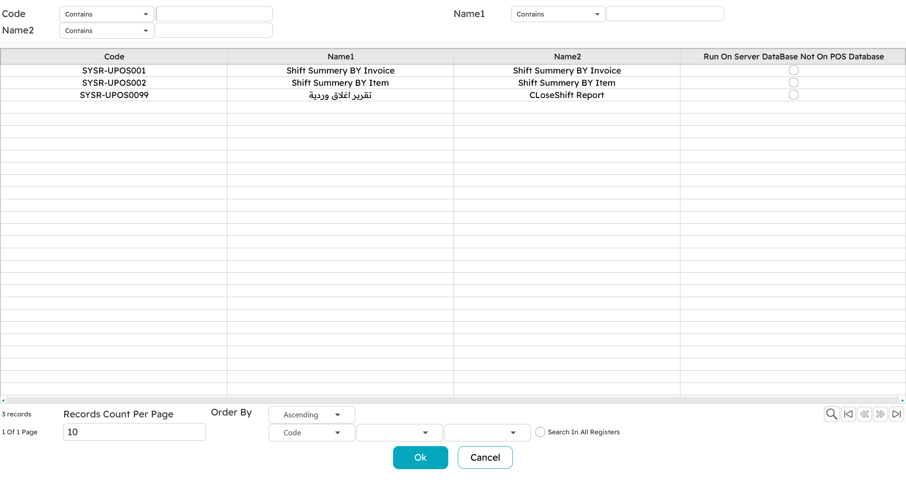
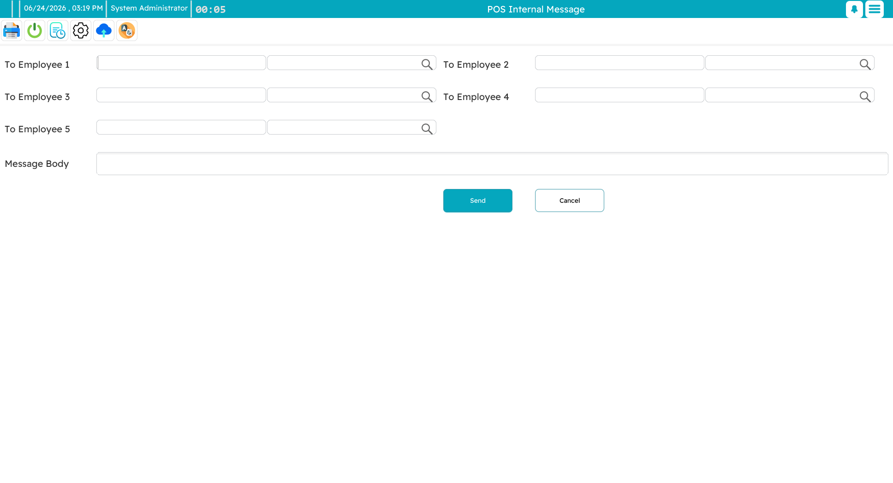
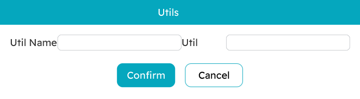

# Reports & Tools

Beyond selling, the register carries a handful of everyday tools: running reports, messaging other staff, checking a price without making a sale, and — for supervisors — running maintenance utilities.

## Reports

You can run reports right inside the POS. Open the reports screen, pick a report, fill in any prompts it asks for (a date range, a warehouse filter), and it opens in a viewer you can page through, print, or export to PDF, Excel or an image.

Which reports appear here is decided centrally — any report in the main Nama system can be made available to the POS. A report can run against the **local** register database (fast, and works offline, but only this register's data) or against the **server** database (a complete, up-to-date picture across all points). The [POS FAQ](./pos-faq.md) walks through making a report available in POS.

## Internal messages and notifications

Staff can send short **internal messages** to one another — to a few named employees at once — straight from the register. The recipient sees it as a pop-up on their machine, or it waits for them if they are offline.

Those pop-ups are part of a wider **notifications** stream — incoming messages, system alerts, order arrivals. Press `Ctrl+F11` to see them all in one place and clear them.

## The price checker

`Ctrl+F9` gives any cashier a quick **price inquiry** mid-sale, as covered on the [sales page](./pos-sales-invoice.md). On top of that, a register can run as a dedicated **price-checker station** — a full-screen kiosk, often at the shop floor, where customers scan an item themselves and see its name and price in large, clear type (with promotional images cycling alongside). Scanning the next item clears the last, and a button returns the machine to normal sales mode.

## Running utilities

Now and then a supervisor needs to run a one-off **utility** on a register — a maintenance or fix-up routine named by the support team. The utilities dialog takes the utility's name and any parameters, runs it, and reports the result.

You would normally only do this when asked to by support, with the exact name they give you. One common example appears in the [POS FAQ](./pos-faq.md): a utility that fixes a payment method whose cash/non-cash setting was changed after it had already been used.

::: warning
Utilities are maintenance tools — run one only when you know what it does (or have been told to by support) and with the parameters you were given. They act directly on the register's data.
:::
