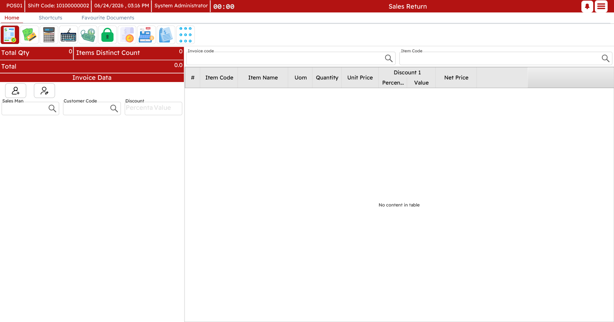

# Returns & Replacements

Goods come back. A customer changes their mind, an item is faulty, a size is wrong. Nama POS handles all of it — straight refunds, exchanges, store credit, and even a deduction for wear — and keeps each one tied to who did it and why.

## Returns

A return sends items back and gives the customer their money (or store credit) in exchange. Start one with `Ctrl+F1`.

### Against the original invoice

The usual case: you have the original receipt. Look up that invoice, and its lines appear for you to choose from. Pick the items and the quantities coming back — partial returns are fine, and any free items that came with a returned item are brought back with it. The register works out the refund.

### Without the original invoice

Sometimes there is no receipt — it was lost, or the sale is very old. You can still process the return by adding each item by hand: find the item, set the quantity, and enter the price the customer paid.

### Return reason

Returns ask for a **reason** — defective, wrong item, customer changed their mind, and so on. It is a small step that makes the difference at month-end when someone asks *why* goods are coming back.

### Deducting for wear (depreciation)

Not everything comes back in mint condition. A **depreciation reason** applies a preset deduction to the refunded value — "opened packaging −5%", "used a week −20%", and the like. Pick the reason and the deduction is calculated for you, so the customer is refunded the fair amount rather than the full price.

### The refund

How the money goes back mirrors how it came in. You can refund cash from the drawer, return it to the same payment method, or issue a **credit note** instead of cash (see below). If the original was paid by several methods, the refund can follow the same split.

::: tip Return windows
Businesses usually allow returns only within a set number of days. A return past that window is blocked for an ordinary cashier — but a supervisor can authorize it on the spot (`Ctrl+R`), the same way other restricted actions are approved.
:::

## Replacements (exchanges)

A replacement is the classic "I'll swap this for that". Rather than a refund followed by a separate sale, Nama POS does both in one document: start a replacement with `Shift+F1`.

On a replacement, the lines coming **back** are entered as returns and the lines going **out** as new sales. The register nets the two and tells you the difference:

- New items worth **more** than the returned ones → the customer pays the difference.
- New items worth **less** → the customer is refunded the difference.

You settle that single difference at the tender screen, in either direction.

> **Example.** A customer brings back a size-L shirt (50) and takes a size-M shirt (50) plus a pair of trousers (80). The return is 50, the new sale is 130, so the customer simply pays the 80 difference.

## Credit notes

A **credit note** is store credit. Instead of handing over cash on a return, you can issue a credit note for the value; the customer redeems it against a future purchase. Some promotions also generate credit notes automatically.

Each note carries a unique code, the amount, and (where set) the customer it belongs to and an expiry. Redeeming one is done at the tender screen, exactly like any other payment method — enter the code and its value comes off the bill, with the remaining balance tracked for next time.

## Discount coupons

**Coupons** are the promotional cousin of credit notes — "spend 100, get a 15 coupon for next time", or a gift card converted to a coupon. They are handed to the customer (printed) and redeemed later at the tender screen by entering the code, within their valid dates and balance.

The redemption side of both credit notes and coupons is also described on the [Payment & tender](./pos-payment-and-tender.md#Credit-notes-and-coupons) page, since that is where the customer actually uses them.
