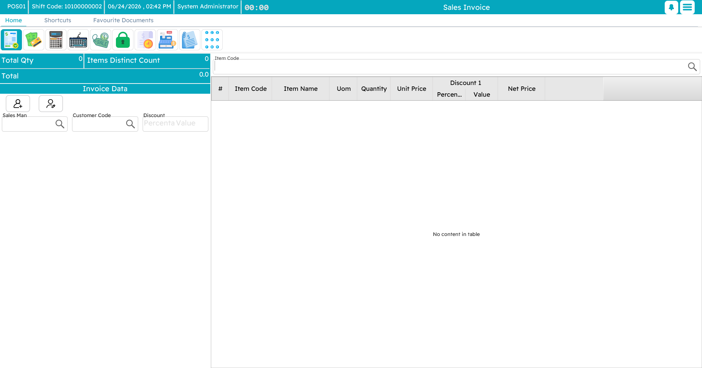
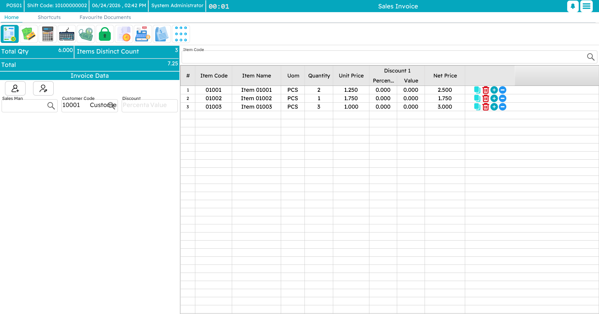
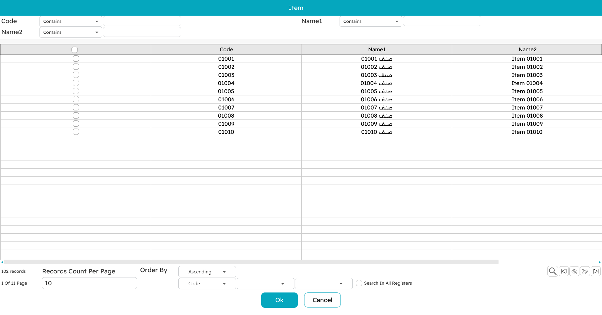
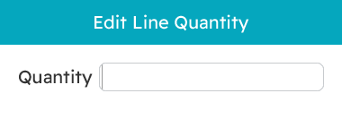
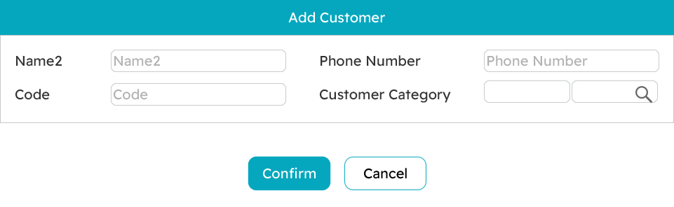
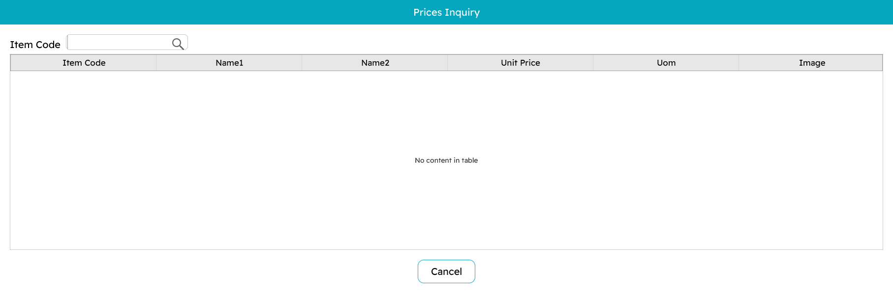
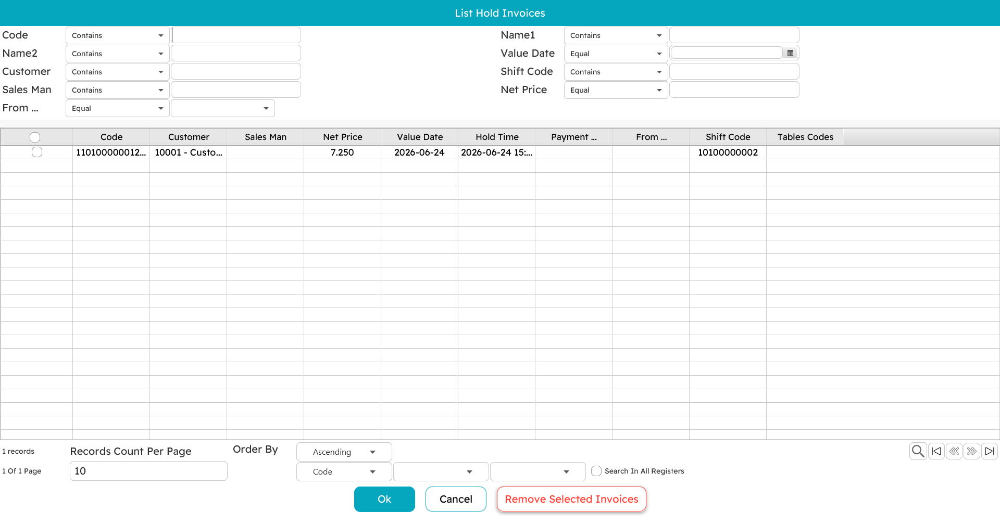

# The Sales Invoice

The sales screen is where a cashier spends almost the whole day. It is built to do one thing very fast: turn a basket of goods into a paid receipt. This page is a tour of that screen and the everyday flow of ringing up a sale.

## The layout

At first glance there is a lot on screen, but it settles into a few regions:

- **The header**, across the top, carries the invoice's own details — its code and date, the customer, the salesman, the warehouse, and any extra fields your business uses. A running summary (total quantity, number of distinct items, and the amount) updates as you go.
- **The favourites panel**, down one side, is a grid of quick buttons for the items you sell most. There is a small **quantity** box here and a search filter.
- **The item-entry field** is where you type or scan an item.
- **The line grid** fills the middle: one row per item, with its quantity, unit price, discounts, tax and line total.
- **The totals panel** sits to the side, showing the items value, the discounts, the tax, and the final **net** the customer pays.

A floating **numeric keypad** can be shown on top of all this for entering quantities and amounts without a hardware keyboard; drag it wherever suits you and its position is remembered.

## Ringing up a sale

### Start a new invoice

Press `Alt+F1` (or pick *New Sale* from the menu). You get a fresh invoice with the cursor already in the item field, ready for the first scan.

### Add items — four ways

Cashiers reach for whichever is fastest in the moment:

1. **Scan a barcode.** The item drops in with quantity 1 and the field clears for the next scan. This is the bread and butter of the counter.
2. **Type an item code** and press Enter — same result, for items without a barcode to hand.
3. **Search by name.** Type part of the name and pick from the list that appears. Handy when neither code nor barcode is at hand.
4. **Tap a favourite.** On the favourites panel, tap the item's button. Use the breadcrumb to drill into categories (say, *Drinks → Cold*). To add several at once, type the number in the **quantity** box first, then tap the button.

### Adjust a line

Click a line to select it, then:

- **Change the quantity** with `Ctrl+Q`, which opens a small editor (it copes with fractional and weight quantities).
- **Edit the line's details** — serial or lot numbers, expiry, a line remark, a reference — from the line's action buttons.
- **Duplicate the line** with `+` when you need another identical unit with the same details.
- **Delete the line** with `Ctrl+Del`.

If an item carries **add-ons** — sizes, colours, or extras like sugar and milk — the add-ons dialog opens when you add it. That whole topic has its own page: [Item add-ons](./pos-item-addons.md).

### Apply discounts

There are two levels, and they stack:

- **Line discounts.** Select a line and press `Alt+1` through `Alt+8` for up to eight discount levels, entering a percentage or a fixed amount. Whether a cashier may do this — and how deep — is governed by their permission.
- **Invoice discount.** Press `F10` to discount the whole invoice; `Ctrl+F10` removes it.

The totals panel recalculates the moment you change anything.

### Set the customer

For a quick cash sale you often need no named customer at all. When you do:

- Press `F7` to pick an existing customer by code or name.
- Press `Shift+F7` to register a **new** customer on the spot without leaving the sale.
- Press `Ctrl+F7` to clear the customer off the invoice.

The customer brings their own pricing, credit terms and any loyalty along with them.

## Handy tools while selling

**Favourites.** More than a convenience — for a fast counter they are the difference between keeping up with the queue and falling behind. Supervisors arrange them into categories so the common items are one tap away.

**Price inquiry (`Ctrl+F9`).** Check an item's price and units without disturbing the sale in progress — perfect for answering "how much is this?" over the counter or on the phone.

**Hold and recall (`F6` / `Ctrl+F6`).** If a customer dashes back for a forgotten item, **hold** the invoice with `F6`, serve the next person, then **recall** it with `Ctrl+F6` and carry on. Held invoices can even be picked up on another register — see [Tables & restaurant](./pos-tables-and-restaurant.md#Suspended-orders-and-the-call-center) for how that works across machines.

**Open an existing invoice (`Ctrl+F3`).** Pull up an earlier invoice to review it, reprint it, or use it as the basis for a return.

## Ready to pay

When every item and discount is in, the **net** in the totals panel is what the customer owes. Press `F5` to move to the tender screen and take the money — that is the next page, [Payment & tender](./pos-payment-and-tender.md).
