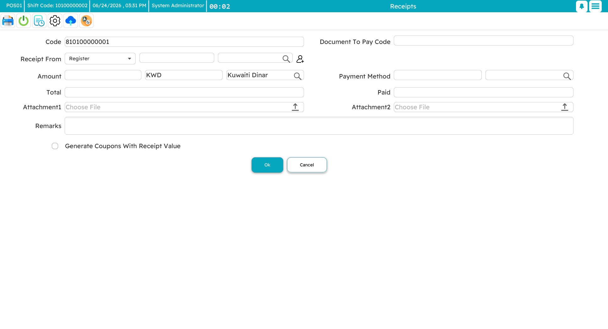
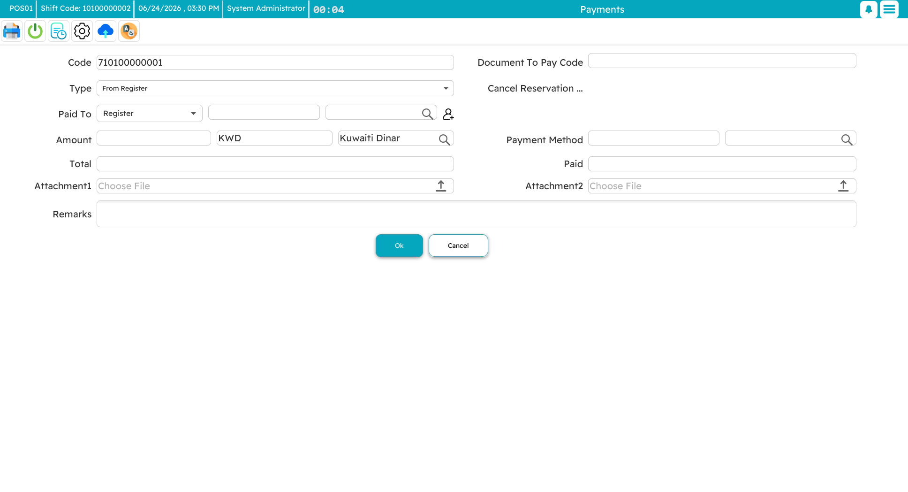
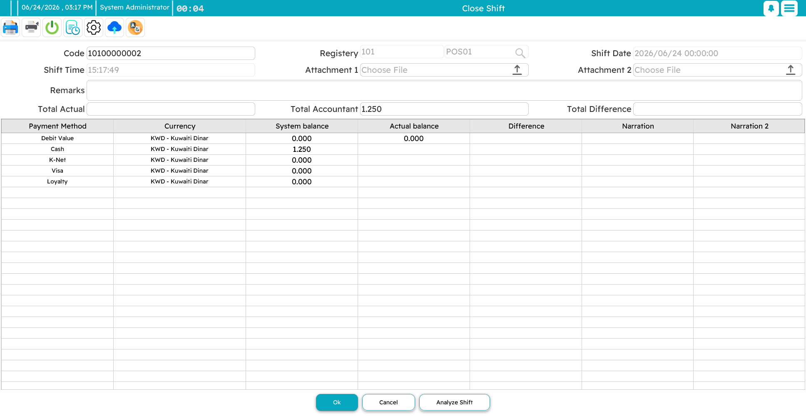

# Shifts & Cash

A **shift** is one work session on a register: it opens when a cashier starts, and closes when they count down the drawer and hand over. Getting the open and close right is what keeps the cash accountable. Reach the shift screen with `F2`.

## Opening a shift

You open a shift by recording what is in the drawer to begin with — the **opening balance**, entered per payment method and currency (so much cash, so much in each currency, and so on). The shift gets its own code, the date and time are stamped automatically, and the register it belongs to is known. You can add a remark or attach a count sheet.

That opening balance becomes the baseline the system expects. Everything that happens during the shift adds to or subtracts from it.

## During the shift

As the shift runs, every sale, return, pay-in and pay-out is tracked **by payment method**. You rarely think about it until closing time — but two deliberate cash movements are worth knowing about.

### Pay-in (receipt from register)

A **pay-in** adds cash to the drawer mid-shift — a supervisor tops up small change, or money comes in from the safe. You record the amount, currency, and where it came from. At close, the system expects to find this extra cash, so your count should include it.

### Pay-out (payment to register)

A **pay-out** takes cash out of the drawer — a drop to the safe, a deposit, a small disbursement. You record the amount, currency, and destination. At close, the system has already subtracted it, so it does not expect to see it in the drawer.

::: tip Drops to the safe
Rather than let the drawer fill up, a cashier can periodically drop bundles to a **safe deposit**. That cash still belongs to the shift — at close it is counted as part of the shift's total, just kept somewhere safer than the till.
:::

## Closing a shift

Closing is the reconciliation. The register lays out each payment method with what it **expects** to be there against what you **actually** counted, and the difference between them.

The flow is:

1. Open the close screen — the register knows which shift is open.
2. **Count the drawer** and enter the actual amount for each method. For cash, a **denominations box** lets you key in how many of each note and coin you have; it totals them for you and double-checks your arithmetic.
3. The register works out the **variance**: actual minus expected. Positive is an **overage** (more than expected), negative a **shortage** (less). Zero is a clean close.
4. Add a remark to explain any variance, and save.

Whether a cashier can even see the "expected" figure is a permission — some businesses prefer the cashier to count blind, so the count is honest rather than nudged toward the expected number.

## Analyzing a shift

The **shift analysis** view answers "where did the money come from and go?" for the session. It breaks the total down by payment method and by transaction type — invoices, returns, replacements, reservations, pay-ins, pay-outs, credit notes, coupons — and shows the net for each method, with the grand total at the bottom. It also separates the **current shift's** cash from any older cash still sitting in the drawer.

For managers, this is the one screen that tells the whole financial story of a shift at a glance — useful both for the nightly cash-up and for investigating a stubborn variance.

::: info A quick cash count
You do not always need a full close to check the drawer. A standalone cash count, reached from the inventory screen (`Ctrl+F2`), lets you reconcile cash mid-shift without ending it.
:::
