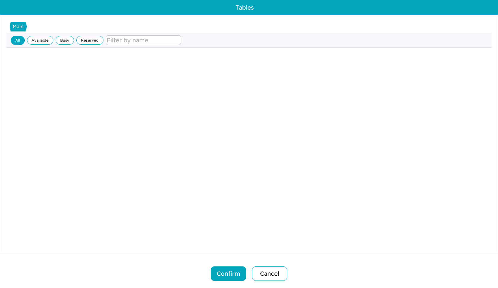
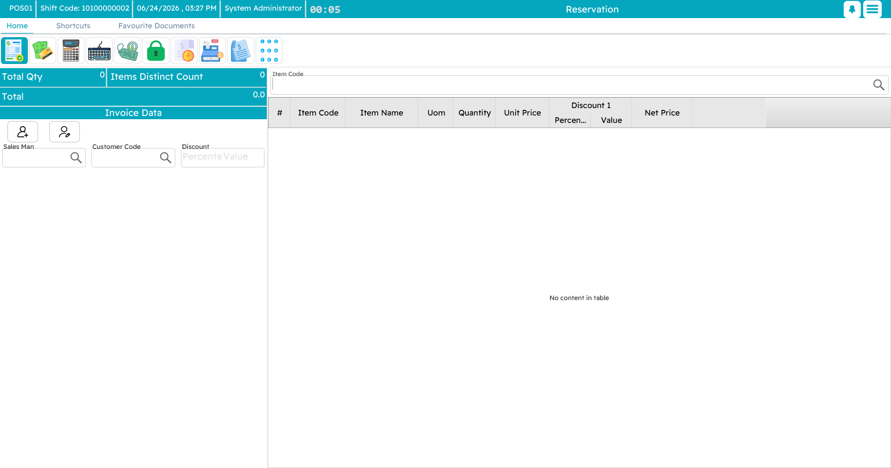
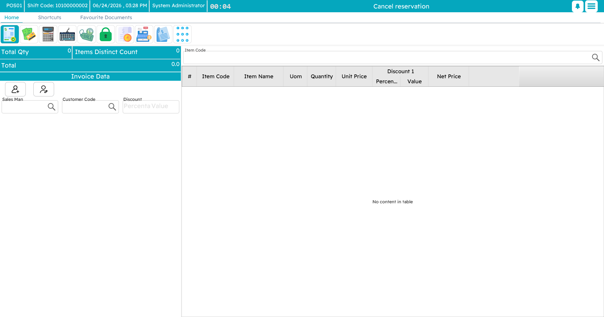
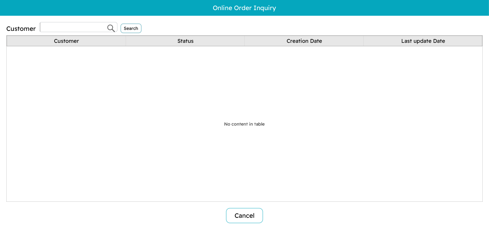

# Tables, Reservations & Captain Order

Restaurants and cafés sell differently from a shop counter: orders belong to **tables**, waiters take them away from the till, and some are booked in advance. This page covers table service, reservations, the suspended-order and call-center flow, and the **Captain Order** mobile app.

## Halls and tables

Seating is organised into **halls** (dining areas) and the **tables** within them. The table viewer shows every table as a button, coloured by status so a glance tells you the floor at a time:

- **Free** — open, ready to seat.
- **Busy** — already has an order; the button shows its invoice code.
- **Reserved** — held for a booking in a given time window.

To work a table, open it from the viewer; its order loads onto the sales screen and you add items exactly as in any [sales invoice](./pos-sales-invoice.md). Order another round and it joins the same table's running bill. When the guests are ready, you settle the table at the [tender screen](./pos-payment-and-tender.md) and it returns to free.

## Reservations

A **reservation** holds a table — and often takes a deposit — for a future booking. You record the customer, the date and time, the items if they are pre-ordered, and the deposit paid. While the booking stands, the table shows as reserved and cannot be given to a walk-in.

When the guests arrive, pull up the reservation, add anything extra they order, and settle — the deposit is credited against the final bill. If the booking falls through, a **cancellation** records the reason and handles any refund (a cancellation fee can apply), and the table is freed again.

## Suspended orders and the call center

**Suspending** an order is the same idea as holding an invoice on a shop counter — park it now, come back to it later — but it earns its own name here because of what it enables across machines.

### Holding and recalling

Hold the current order with `F6`; it is saved and your screen clears for the next customer. Recall it later from the held-orders list (`Ctrl+F6`). An order held on one register can be found and recalled on another, which is what makes the next part possible.

### The call-center flow

This turns a register into a **call-center station** that takes orders by phone and sends them to the branch that will actually prepare and deliver them.

It is built from two settings on the machine records:

- The taking machine runs in **customer-service mode**. The operator builds the order, picks the destination branch/machine, and instead of paying, **suspends** it — which sends it to that destination.
- The destination machine has **read orders from the customer-service center** switched on. It checks for incoming orders about once a minute, pops up a notification when one arrives, and the order shows up in its suspended-orders list (`Ctrl+Shift+F6`) ready to be opened and completed as a normal sale.

The whole order travels — items, quantities and prices, the customer details, notes, and any discounts — and the system retries if the network hiccups. It is ideal for delivery operations and centralized order intake across several branches.

## Online / remote orders

Orders can also arrive from online channels. The **online-order inquiry** (`Ctrl+O`) lets you look them up by customer and see their status — pending, processing, ready, delivered, cancelled — then open one to fulfil it and take payment if it is not already paid.

## Captain Order — the mobile app

**Captain Order** puts the order pad on a phone or tablet so waiters take orders at the table instead of walking back to the till. It shares the same items, favourites and tables as the register.

A waiter opens a table, adds items — tapping favourites for speed and picking [add-ons](./pos-item-addons.md) where an item has them — and **sends** the order. It lands at the register and the kitchen straight away. More rounds can be sent to the same table through the evening, all accumulating on its bill, which is settled at a register when the guests leave.

