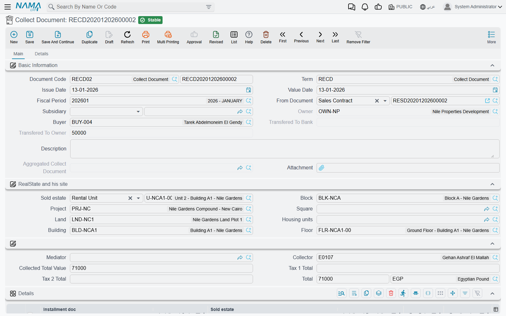
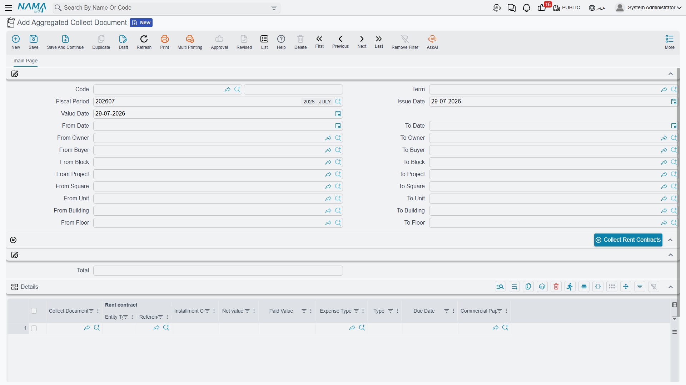

# Collect Documents and Bulk Collection

The collect document (سند تحصيل) is where the money side of the Real Estate module actually happens. Everything else in this folder is a variation on it: the request is a collect document with its effects switched off, the exemption is a collect document that collects no cash, and the aggregated document is a machine that produces collect documents by the dozen.

Before reading on, make sure you have the mechanic from [How Installment Collection Works](/modules/realestate/collections/realestate-collection-basics.md) — in particular the fact that the contract's paid columns are recomputed from collection documents, and that the term's *installment Effect* decides which column moves.

Our worked example for the second half of the page: a property manager who administers 120 shops and collects all of their rent on the first of every month.

## The Collect Document

Find it at **Real Estate and Property > Documents > Collect Document** (العقارات و الممتلكات > المستندات > سند تحصيل). It is available with the base `realestate` licence.

### Filling it in

1. **Pick the book, the term and the dates as usual.** The term matters more here than on most documents: it carries the accounts, the *installment Effect* and the payment-order rules. If the term names an installment type, the document's own *Type* is filled from it, and a document whose type disagrees with its term will not commit.
2. **Choose the contract in *Based On* (بناءا على).** Selecting it fills in the owner, the buyer, the debtor account, the estate and its location breadcrumb, and proposes an amount based on the installment matching the header due date and type. The owner field is filled for you and cannot be edited — it comes from the contract.
3. **Add a details line per installment.** The *Installment Code* column offers a suggestion list of the codes on the selected contract. Picking one copies the installment's due date, its value, its penalty and discount, its type and its tax percentages into the read-only "installment …" columns, and — this is the useful part — sets the **Collected Value** (القيمة المحصلة) to whatever is still outstanding on that installment.
4. **Overwrite the collected value for a partial payment.** Type 8,000 against a 10,000 installment and the taxes, the line net and the header total all follow immediately.
5. **Enter a collection discount** in the discount column that follows the collected value, if you are forgiving part of the balance to close the line. It shrinks what the installment owes rather than paying it — see the [basics page](/modules/realestate/collections/realestate-collection-basics.md).
6. **Save and commit.** The accounting effect is created as a business request and processed in the background; the installment entries are written and the contract's paid and remaining columns are rebuilt.

The details grid also lets you name the **cheque** (commercial paper) an installment is tied to, an **expense type** — which is what decides where the line's taxes are booked — and a free-text description that ends up on the printed document.

### Collecting several contracts in one document

The *Based On* field is not the only way to point at a contract. Each detail line has its own contract column, and a document whose lines each name their own contract needs no header contract at all. That is how you collect from one customer who holds three units, or sweep up a handful of unrelated installments into a single receipt.

The rule to remember is the precedence: **if the header *Based On* is filled, it wins** and is copied onto every line. So either work header-first with one contract, or leave the header empty and drive everything from the lines.

The contract picker on the lines is helpful about what it offers: rent contracts that have been cancelled are hidden, and once a buyer is on the header only that buyer's contracts are listed.

### Turning the collection into cash

Committing the collect document creates the receivable movement, not the receipt. Two buttons finish the job:

- **Create Receipt Voucher** (إنشاء سند قبض) opens a brand-new, unsaved receipt voucher for the document's total, addressed to the buyer, already carrying one installment line per collect line and one commercial-paper line for every line that named a cheque. You review it and save it yourself.
- **Create receipt voucher req** (إنشاء طلب قبض) does the same in a popup as a receipt request, for organisations that route incoming money through a request first. It copies the amount and the party only.

The document's second page, *Details*, lists the receipt vouchers, receipt requests and ownership transfer documents that ended up linked to it, so you can see from the collection whether the money was ever actually received.

### It is also an invoice

A collect document is a tax document in its own right: it can be validated against the tax authority, viewed on the e-invoicing site and uploaded for online payment. The tax plan it uses is looked up in order — the buyer's plan first, then the estate's, and the term's plan only as a last resort. The taxes themselves are computed from the plan onto each line, unless the term switches on *Editable Taxes*, in which case the percentages you type are left alone.

### A shortcut worth knowing

You do not have to start from the collect document at all. On a contract screen, tick the installment lines you want (there is a *Select all installment lines* action to help) and press **Create collect doc from selected line** (إنشاء سند تحصيل للاقساط المختارة). The collect document arrives pre-filled with those lines.

## The Collect Request

**Real Estate and Property > Documents > Collect Request** (طلب تحصيل) is the same screen, built by the same layout, minus a single system field. Same header, same details grid, same two voucher buttons.

What it is for is the instruction "please go and collect these installments" — a branch or a collections supervisor raises it, hands it to a collection officer, and the real collect document is raised when the money arrives.

Its defining property is that **it has no effects whatsoever**:

- it creates no accounting entry;
- it writes no installment payment entries, so no contract's paid or remaining figure changes;
- and it skips the collect-family validations entirely — no contract requirement, no installment-code check, no over-payment check, no payment-order check.

It also has no Real-Estate accounting configuration of its own; a collect-request term carries only the ordinary book-and-term options.

::: info Nothing converts automatically
There is no button that turns a collect request into a collect document. The collect document is entered separately, referring to the same contract and installment codes. Treat the request as a worklist, not as a draft.
:::

## The Aggregated Collect Document

Now the 120 shops. Typing 120 collect documents on the first of every month is not a plan, so the rent sub-module ships **Real Estate and Property > Documents > Aggregated Collect Document** (سند تحصيل مجمع). It needs the `realestate-rent` licence.

The screen is one page of range pairs — from/to date, from/to owner, from/to buyer, and from/to for each level of the property tree (project, square, block, building, floor, unit) — plus a details grid and one button.

### The monthly run

1. **Set the ranges.** Our property manager sets the date range to 1–31 March and leaves the owner and site ranges open, because she wants every shop.
2. **Press *Collect*.** The document must be saved first. The system reads every rent contract and opening rent contract that is not cancelled and matches the ranges, walks their installments, and adds one grid row per unpaid installment — carrying the contract, the installment code, its net value, its type, its due date, its cheque and its expense type, with the **Paid Value** column pre-filled with whatever is still outstanding on that installment.
3. **Review and adjust.** The button only fills the grid; it saves nothing. Delete the rows you do not want, reduce a paid value where a tenant is paying part, or add a row by hand — the installment code column offers the same suggestion list as the collect document.
4. **Commit.**

Two details of the sweep are worth knowing. Installments already marked paid are never pulled. And **if you leave both dates empty, only installments that are already due are collected** — the sweep compares the due date against the document's value date. Fill the date range and you get exactly that window instead.

If your process runs this every month, switch on the term option *Exclude Installments Previously Added To AggrCollectDoc* (استثناء الأقساط التي تم تجميعها سابقا في سند قبض مجمع). The sweep then asks the server whether each installment code has already been aggregated somewhere else and skips the ones that have, so a second run in the same month does not pull the same rent twice.

### What commit actually does

This is the point that decides how you configure the whole thing. The aggregated document **has no accounting effect of its own**. On commit it works down the grid and, for every line, **creates and commits one collect document**:

- stamped with the **book and term named on the aggregated document's own term** — the two required fields *Aggregated Collect Document Book* (دفتر سند تحصيل) and *Aggregated Collect Document Term* (توجيه سند تحصيل). If either is empty the commit fails and says so;
- carrying the same fiscal period, value date and issue date;
- based on the rent contract, with its rented estate, its owner, its buyer and the full site breadcrumb;
- with exactly one detail line: the installment code, the paid value from the aggregated row, the type, the due date, the cheque and the expense type.

So all of the real behaviour — the accounts, the *installment Effect*, the payment-order rules, the over-payment check — lives on that **generated** term, not on the aggregated one. The aggregated term is a driver with three settings; the generated term is where the accounting is. Configure it with the same care you would give a hand-typed collect document, and let the [terms page](/modules/realestate/document-terms/realestate-terms-other.md) walk you through it.

For our 120 shops that means: one aggregated document on the screen, 120 collect documents in the collect document list, 120 sets of installment entries, and 120 contracts whose remaining figures drop.

::: warning Editing or cancelling deletes the generated documents
Re-committing an aggregated document after an edit re-runs the whole generation: lines that are still there are rewritten, and **any collect document generated by a line you removed is deleted**. Cancelling the aggregated document deletes every collect document it produced. That is how the two stay in step — but it also means an aggregated document is not a safe place to make a small correction after the fact. If one tenant's figure is wrong, it is usually cleaner to fix that single generated collect document.
:::

Two limits round out the picture. The sweep reads **rent contracts only** — sales installments are not aggregated, and a sales collection is typed as an ordinary collect document. And **every line must name a contract**: a row whose contract cell is empty cannot generate anything and will fail the commit, so delete stray rows rather than leaving them blank.

The aggregated document performs no validation of its own; everything is checked inside the collect documents it generates. If one of them is invalid — an installment code that no longer exists, an over-payment, a contract that has been cancelled — that is where the error comes from, and the [rent contract page](/modules/realestate/rent/realestate-rent-contract.md) is the place to check what changed underneath.
