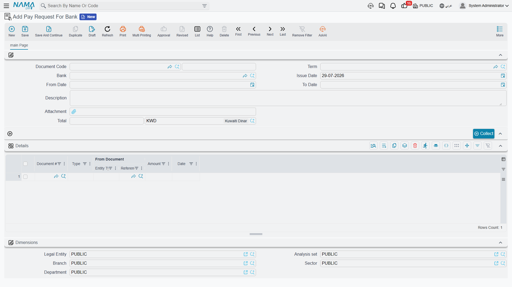
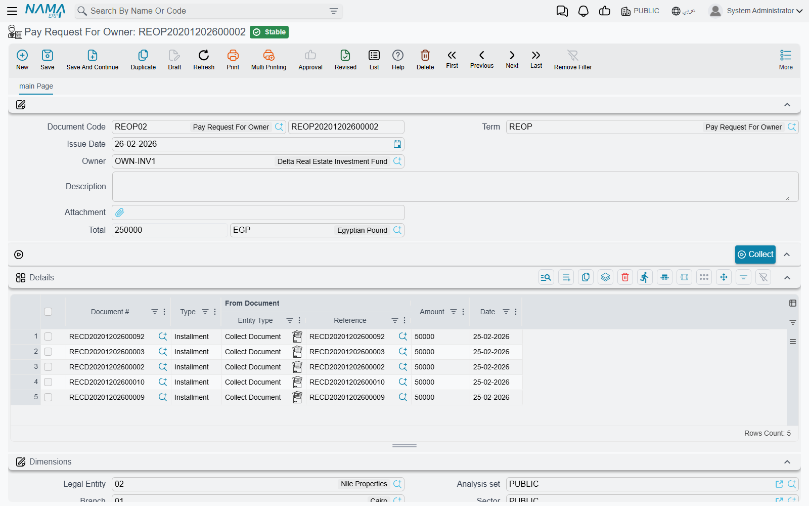

# Paying Collected Money to the Bank or the Owner

Collecting rent is only half of a property agency's day. The other half is getting that money out again: into the bank at the end of the week, and into the landlord's account at the end of the month. Two documents handle those two journeys, and they are deliberately similar — a range, a button that sweeps up collect documents, and a single accounting entry on the total.

Both of them keep a running figure on every collect document, which is what stops the same money being banked or paid out twice. Open any collect document and you will see two read-only fields on the header: *Transfered To Bank Amount* (المحول للبنك) and *Transfered To Owner Amount* (المسدد للمالك). They start at zero and grow as these two documents pick the collection up.

Our example: a small agency that collected 78,000 during the first week of March across a dozen collect documents, banks it on Thursday, and at the end of the month settles 42,000 to landlord Ahmed for the shops it manages on his behalf.

## Pay Request For Bank

**Real Estate and Property > Documents > Pay Request For Bank** (العقارات و الممتلكات > المستندات > طلب صرف للبنك), available with the base `realestate` licence.

The header is short: book and code, term, the **Bank** the money is going into, the issue date, a **From Date** / **To Date** pair, remarks, an attachment and the total. The total is calculated for you and cannot be typed.

### Banking a week's collections

1. Save the document, then set **From Date** to 1 March and **To Date** to 7 March. At least one of the two dates must be filled — pressing *Collect* with both of them empty stops with a "From Date and To Date Required" message, because an unbounded sweep would pull in every collection the company has ever made.
2. **Press *Collect*.** The system looks for collect documents whose collected amount is greater than the amount already banked, whose value date falls inside the range, and adds one detail row for each — with the amount set to **the part that has not yet been banked**, not the full collection. A collect document that was half-banked last week contributes only its remainder.
3. **Review the grid.** Each row shows the collect document, the installment type, the contract it was based on and the date; those are filled by the sweep and are not editable. The amount is left open, so you can reduce a line when you are only depositing part of it — the rest stays available for the next deposit.
4. **Commit.** The header total is the sum of the rows, and the accounting effect is one debit line and one credit line **on that total** — not one pair per row. It is processed in the background as a business request, so a failure is retried from the Business Requests list view rather than re-entered.

On commit each referenced collect document's *Transfered To Bank Amount* grows by the line amount; cancelling the document subtracts it again, and editing a committed document swaps the old set of rows for the new one. That is the whole bookkeeping: a collection stops being "sweepable" exactly when it has been fully banked.

The **Bank** field names the bank the deposit is going to and feeds the accounting side through the term's account source. The sweep itself is driven by the date range and by the un-banked remainder — pick the bank because the entry needs it, not as a filter.

For the agency in our example: one document dated Thursday, twelve rows, a total of 78,000, and twelve collect documents that will no longer appear in next week's sweep.

## Pay Request For Owner

**Real Estate and Property > Documents > Pay Request For Owner** (العقارات و الممتلكات > المستندات > طلب صرف للمالك), also on the base `realestate` licence.

This is the agency side of the business: the company has been collecting rent on behalf of a landlord and now has to hand his share over. The shape of the screen is the same, with two telling differences.

**It is built around an owner, not a period.** The header carries an **Owner** field — the picker lists only parties flagged as owners — and pressing *Collect* without one stops with "Owner Required". There is **no date range at all**. The sweep finds every collect document belonging to that owner whose collected amount is greater than the amount already paid to him, and adds it at its unpaid remainder. In other words it always asks the same question: *what do we still owe this landlord?*

**The details grid is entirely read-only.** Unlike the bank request, even the amount column is closed: an owner settlement is all-or-nothing per collection. If you need to pay a landlord only part of what you hold, the practical route is to settle the collect documents you want to release and leave the others for next month.

Commit posts one debit and one credit on the header total, exactly as the bank request does, and raises each collect document's *Transfered To Owner Amount*. Cancelling reverses it.

So Ahmed's settlement is: pick Ahmed, press *Collect*, get every unpaid collection against his shops, see 42,000 in the total, commit — and next month those collections are gone from the sweep while any new ones appear automatically.

## Where the two figures meet

Because the two documents maintain two independent figures on the same collect document, a collection can be fully banked and not yet paid to its owner, or the reverse. That is intentional: banking is about where the cash physically sits, owner settlement is about who it belongs to. Reading them together on the collect document screen tells you the whole story of a single collection at a glance.

Neither document touches contracts or installments. The receivable was settled when the collect document committed — see [How Installment Collection Works](/modules/realestate/collections/realestate-collection-basics.md) — and these two only move money that has already been recognised. The accounts they use come from their terms, each of which is a single effect page with one debit and one credit group; the [collection, maintenance, investment and cost terms page](/modules/realestate/document-terms/realestate-terms-other.md) describes them alongside the rest of the family.

Neither of them raises the actual bank transfer or the cheque to the landlord either. As everywhere else in this module, the voucher that moves cash is a separate step in the accounting module, based on the entry these documents create. And the collections they consume are the ones described on the [collect documents page](/modules/realestate/collections/realestate-collect-documents.md).
