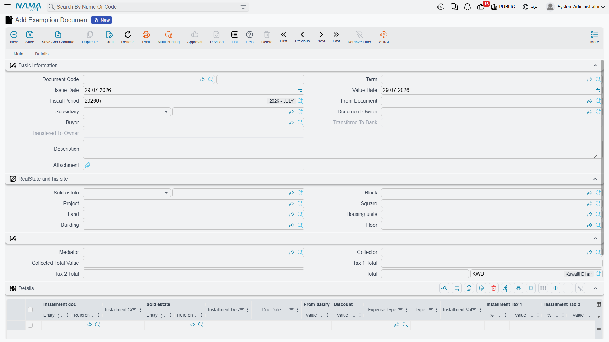
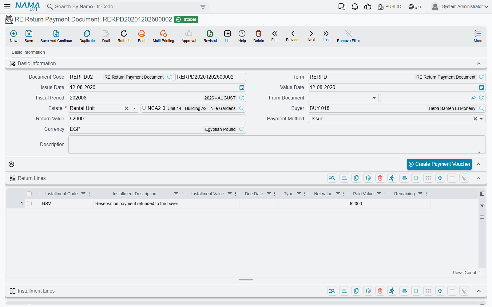

# Exemptions and Returning Money to the Buyer

Not every installment is closed by cash. Sometimes the company decides not to charge it at all — three rent-free months while a shop is being fitted out, a goodwill concession after a bad year. Sometimes the money flows the other way, and the company owes the buyer a rebate on fees it already charged.

Two documents cover those two cases, and they have almost nothing in common except that neither of them is an ordinary collection. Both assume you already know how collection works — the [basics page](/modules/realestate/collections/realestate-collection-basics.md) explains why a contract's paid columns are a recomputed summary rather than something you edit.

## The Exemption Document

**Real Estate and Property > Documents > Exemption Document** (العقارات و الممتلكات > المستندات > سند إعفاء إيجار). It belongs to the rent sub-module and needs the `realestate-rent` licence.

The first thing to notice is that the screen is the collect document, top to bottom: the same header, the same estate and location breadcrumb, the same details grid with its installment code suggestion list, the same second page of related records. **The only visible difference is the label of one column** — where a collect document says *Collected Value* (القيمة المحصلة), the exemption says **Exemption Value** (القيمة المعفاه).

That is not a cosmetic relabelling. Mechanically an exemption is a collection document that collects no cash:

- it validates like one — the installment codes must exist on the contract, over-payment is refused, payment order is enforced unless the term says otherwise, and a cancelled or waivered contract is closed to it;
- it writes the same installment payment entries, so the contract's paid and remaining columns move exactly as they would after a payment, through the term's *installment Effect*;
- and it creates the same shape of accounting effect, processed in the background as a business request — only the accounts on its term differ, typically pointing the waived amount at an expense or revenue-reduction account against the tenant's receivable.

### A three-month grace period

A tenant leases a shop at 10,000 a month and the contract grants three rent-free months while he fits it out. The schedule already contains those three installments — the accrual and the tax invoice for the period assume they exist — so deleting them is not an option.

1. Raise an exemption document with a term whose accounts point the waived rent where your accountant wants it.
2. Choose the lease in *Based On*. The header fills with the renter, the owner, the unit and its location.
3. Add three lines, picking the installment codes for the three months. Each line arrives with its full outstanding amount already in the **Exemption Value** column — which is exactly what you want when the whole installment is being waived.
4. Commit. 30,000 is booked as an exemption, the three installments stop showing as outstanding, and the contract's remaining figure drops by 30,000.

If only part of a month is being waived, type the smaller figure and the rest stays collectable in the ordinary way.

### Exemption or collection discount?

These two are constantly confused, and the difference is worth being precise about, because they produce different numbers on the same contract.

|  | Collection discount | Exemption document |
|---|---|---|
| Where you enter it | A column on a collect document line, next to the collected value | Its own document |
| What it does to the installment | **Shrinks** what the installment is considered to owe | **Settles** the installment, exactly as a payment does |
| Is it a payment? | No — it lowers the target so less cash closes the line | Yes, in every sense except that no cash arrived |
| Typical use | "Pay today and I will take 500 off" | "You owe nothing for these three months" |

Concretely: an installment of 10,000 met with 8,000 cash and a 500 collection discount is left with 1,500 outstanding — the debt became 9,500 and 8,000 of it was paid. The same installment met with a 10,000 exemption is left with nothing outstanding — the debt stayed 10,000 and the exemption consumed all of it.

Because an exemption consumes the balance, all the collection rules apply to it. In particular you cannot exempt more than the installment owes, and you cannot exempt a later installment while an earlier one is unpaid unless the term carries *Ignore Pay Installments In Order*.

::: tip Which one does your accountant want?
Ask where the forgiven money should land in the ledger and whether it should read as a reduction in what was ever billed or as a cost of doing business. A collection discount has its own debit and credit sides on the collect term; an exemption has a whole term of its own. The [collection, maintenance, investment and cost terms page](/modules/realestate/document-terms/realestate-terms-other.md) covers both.
:::

## The RE Return Payment Document

**Real Estate and Property > Documents > RE Return Payment Document** (العقارات و الممتلكات > المستندات > سند سداد عائد). This one belongs to the sales sub-module and needs the `realestate-sales` licence.

Here the money genuinely goes back to the buyer. The usual case is the commission-style *Fees* (قيمة السعي) installments that a sales contract owes **to** the buyer rather than from him — a rebate on a fee that was charged and is now being returned, in part or in full.

The header is short: book and term, dates, the contract in *Based On*, the estate (required), the buyer, the **Return Value** (قيمة العائد) which is calculated for you, the currency, and the **Payment Method** (طريقة الدفع) that governs everything else on the screen.

### Two grids, two questions

- **Returns** (العوائد) answers *what do we owe the buyer back?* Its installment code suggestion list offers **only installments of type Fees**, which is the module's way of keeping the document to its purpose. The sum of this grid is the document's return value.
- **Installment Lines** (الأقساط) answers *which of the buyer's outstanding installments do we net it against?* You do not usually fill this by hand — the payment method fills it.

### Issue, or discount from the contract?

**Issue** (صرف) means pay it out. Choosing it clears the installment grid, because nothing is being netted, and enables the **Create Payment Voucher** action: the document must be saved, and the button then builds a new payment voucher for the return value, addressed to the buyer, with one line per return row. As those vouchers are paid, the document's *Paid From Vouchers* (المدفوع بسندات) and *Remaining* (المتبقي) figures at the bottom of the screen keep score.

**Discount From Contract Installments** (خصم من أقساط العقد) means net it off instead. Choosing it fills the installment grid from the contract with every installment that still has something outstanding, and you trim that list down to the ones the rebate is being applied against. There is no payment voucher on this route — the button refuses, because no cash is leaving — and the voucher tracking figures stay untouched.

That second route carries one validation you will meet immediately: **the two grids must balance**. The total of the returns must equal the total of the installments being discounted, and a mismatch is named in the error with both figures. It is not a rounding tolerance — make the two sides equal.

### A 15,000 fee rebate

A buyer was charged 15,000 in fees on his villa contract and the company agrees to give it back. He still owes installments, so netting is simpler than cutting a cheque.

1. On the sales contract, tick the fee installment line and press **Create RE Return Payment Doc From Selected Line** (إنشاء سداد عائد للأقساط المختارة). The return document opens with that line already in the Returns grid at its outstanding value.
2. Set the payment method to *Discount From Contract Installments*. The Installment Lines grid fills with the buyer's open installments.
3. Keep the lines that add up to 15,000 — say two installments of 7,500 — and remove the rest.
4. Commit.

The result: the buyer's fee entitlement is settled, and 15,000 of his future installments are settled at the same time. Both grids feed the contract's installment tracking, so both sides of the swap show up on the contract's paid columns; when the term leaves *installment Effect* empty this document falls back to the *System Paid* column rather than doing nothing.

The accounting effect is one debit and one credit **per return line**, taken from the term's single pair of return-value sides. One detail to plan around: the entry is posted in the **legal entity's main ledger currency**, whatever currency the document itself carries. On a single-currency installation this never comes up; on a multi-currency one it decides how the rebate is measured.

Everything else about the document behaves the way the rest of the family does — the effect is a business request processed in the background, and a failure is retried from the Business Requests list view rather than re-entered. The [collect documents page](/modules/realestate/collections/realestate-collect-documents.md) covers the ordinary, money-in direction.
