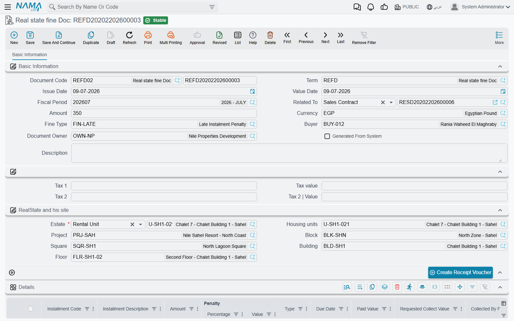

# Late-Payment Fines

A customer who is three months late on a 50,000 installment still owes 50,000. What he *also* owes — if the contract says so — is a penalty, and that penalty is not part of the installment. It is a new charge, raised on its own document, billed on its own invoice and collected with its own receipt voucher.

That separation is the whole design of the fine document, and it is the thing to hold on to while reading this page: **a fine is a second receivable standing next to the contract, not an adjustment to it**.

## The Fine Document

**Real Estate and Property > Fines > Real state fine Doc** (العقارات و الممتلكات > الغرامات > سند غرامة), available with the base `realestate` licence.

The header says who is being fined and for what:

- **Related To** (يرتبط بـ) — the document the fine belongs to. It accepts a sales contract, an opening sales contract, a rent contract, an opening rent contract, or a waiver document.
- **Estate** — required, and it can be any level from a unit or land plot up to a block, building, floor or unit group.
- **Fine Value** and its currency, the **Fine Type**, the **buyer** and the **owner**, and the location breadcrumb underneath.
- Two tax lines, each with a percentage and a value, and a *Generated From System* marker that tells you at a glance whether a fine was typed by a person or produced by the scheduled run described below.

The details grid lists the installments the fine is being raised over. Each line carries the installment code and description, the installment's own amount, a **penalty percentage** (الغرامة|نسبة) and a **penalty value** (الغرامة|قيمة), the type and due date — and then a block of columns showing what has been paid and what remains on that installment.

### Setting the amount

You can work from either end. Type a percentage and the value is worked out from the installment's amount; type a value and the percentage is worked back. They stay in step as you edit, and **on save the percentage wins**: whenever a line carries a non-zero percentage, its value is re-derived from it.

The header **Fine Value is then overwritten with the sum of the line penalties** whenever there is at least one detail line. A hand-typed header amount only survives on a fine that has no lines at all — which is a perfectly good way to raise a flat penalty that is not tied to any particular installment. Once a line exists, the lines decide.

Picking an installment code (the suggestion list comes from the document named in *Related To*) copies that installment's amount, type, net value, due date, taxes and current paid and remaining figures onto the line. Every code you use must exist on the related document, or the commit fails naming the code.

Header taxes follow the fine value: leave a tax value at zero and it is computed from its percentage, or type a value and the percentage is derived from it instead.

::: warning A fine does not change what the contract shows as owing
The paid, requested, collected-by-paper, system-paid and remaining columns on the fine's detail lines are **read-only mirrors** of the contract's installment lines, refreshed from the live contract every time the fine is saved. They are there so you can see the state of the installment you are fining — nothing more.

Committing a fine writes no installment payment entries and does not move the contract's paid or remaining figures by a single unit. The fine is collected as its own document, and the contract's schedule is unaffected either way.
:::

### Billing and collecting it

The fine is an invoice-grade document: it can be validated against the tax authority, viewed on the e-invoicing site and uploaded for online payment, with its tax plan taken from the buyer first and the estate second.

To collect it, press **Create Receipt Voucher** (إنشاء سند قبض). That opens a new receipt voucher for the fine value in the fine's currency, addressed to the buyer. It deliberately carries no installment lines — there is no contract installment to settle, only the penalty itself.

Fines raised against a contract are also listed back on that contract's own screen, so a collections officer looking at a late customer can see the penalties without leaving the contract.

### Raising a fine from the contract

Two buttons on the contract screens save you from re-typing everything:

- **Create Fine Document** (إنشاء سند غرامة) opens a fine in a popup, pre-filled with the owner, buyer, estate and location, related to that contract, and carrying **all** of the contract's installment lines. If that is more than you want, switch on the fine term's option *Do Not Copy Installments With Related To* (عدم نسخ الأقساط مع اختيار يرتبط بـ) and the fine arrives with an empty grid instead.
- **Create Fine Document From Selected Line** (إنشاء سند غرامة للأقساط المختارة) does the same for the installment lines you have ticked — and only those that still have something outstanding. Tick a fully paid line and it refuses, asking you to select an installment with a remaining value.

## Fine Types

**Real Estate and Property > Fines > Fine doc type** (العقارات و الممتلكات > الغرامات > تصنيف الغرامة) is a plain master file: a code, an Arabic name, an English name, attachments and dimensions.

It is worth being explicit about what it is *not*. A fine type carries **no rate, no value and no account**. It classifies fines — "late rent", "contract breach", "parking violation" — so that you can filter and report on them. The money and the accounts come from the fine document and its term; nothing is defaulted from the type.

## Generating Fines Automatically

Chasing late payers by hand does not scale, so the module ships an entity flow (مسار كيان) that raises fines on a schedule. You attach it to a task schedule, give it the parameters below, and let it run — monthly is the usual rhythm.

The parameters, in the order they appear:

| Parameter | What it does |
|---|---|
| Fields Map | Required. The values to stamp on every generated fine — at minimum the document book and the term it must use. |
| Grace Period | How many days late an installment must be before it is fined at all. |
| Add Grace Period To Fine | Whether the grace days themselves count towards the number of late days being charged. |
| Fine Is Value Not Percent | Switches the next field from a percentage to a flat amount. |
| Fine Percent/Value Per | Whether the rate is charged per **day**, per **month** or per **year**. |
| Fine Percent/Value | The rate itself. |
| Fine Calculation Query | Optional. When filled, its result replaces the built-in calculation entirely, for companies whose penalty formula does not fit a simple rate. |
| Contracts To Search In | Which contract types to scan. By default: sales contracts, opening sales contracts, rent contracts and opening rent contracts. |

### What a run does

The run takes today's date, steps back by the grace period, and looks for committed contracts of the listed types that have at least one installment with something still outstanding and a due date earlier than that cut-off. For each such contract it creates a fine — or reuses the fine it created earlier in the same month, since the run marks everything it produces as *Generated From System* and looks for its own earlier output before making a new one.

The amount is a rate multiplied by how late the money is. The late days are counted from the installment's due date (plus the grace period, unless you asked for the grace days to be charged) or from the start of the month, whichever is later, up to today. That day count is then converted to the unit you chose — a per-month rate divides the late days by 30, a per-year rate by 360 — and multiplied by the basis: either the flat value you configured, or your percentage applied to what the installment still owes.

**Take our 50,000 installment at 0.5% per month, 90 days overdue.** The basis is 0.5% × 50,000 = 250. The repetition rate is 90 ÷ 30 = 3. The fine is 750.

Two things about the result are worth planning around. Each run produces **one fine document per contract per month** — the automatic route is a per-contract charge, so use the manual buttons above when you need a penalty itemised installment by installment. And **system-generated fines from an earlier run that no longer match any overdue contract are deleted**, which is how a customer who pays up stops being chased; a fine you want to keep permanently should not be left in the automatic run's hands.

## Where the Money Goes

The fine's term is a single effect page with one debit group and one credit group, and the entry it produces is exactly that: one debit line and one credit line for the fine value, with the buyer as the customer and the owner as the supplier on the sides. As with every document in this module the effect is created as a business request and processed in the background, and a failure is retried from the Business Requests list view (More menu → Reprocess / Recommit) rather than re-entered.

The term itself is covered with the rest of the family on the [collection, maintenance, investment and cost terms page](/modules/realestate/document-terms/realestate-terms-other.md). For how ordinary installments — the ones being fined — are collected and tracked, see [How Installment Collection Works](/modules/realestate/collections/realestate-collection-basics.md), and for the contracts the fines hang off, the [sales contract](/modules/realestate/sales/realestate-sales-contract.md) and the [rent contract](/modules/realestate/rent/realestate-rent-contract.md).
