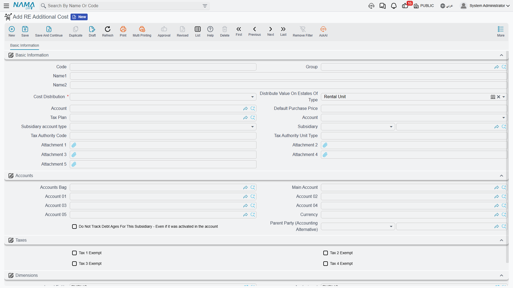
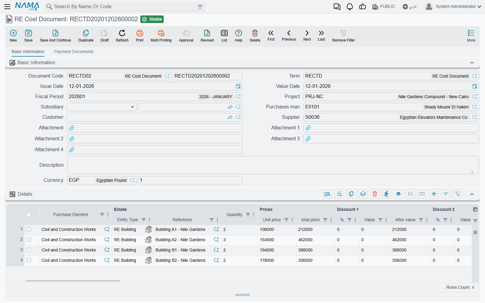

# Distributing Project Costs Over Properties

A developer never buys a lift for flat 12. He signs one contract for the lifts of Building B3, pays
one supplier 300,000 on one invoice, and files it away. The same is true of the land, the main
construction contract, the electricity network, the building permit, the marketing campaign and the
consultancy fees: cost arrives at the level of a project, a block or a building.

The accounting department, however, is asked a completely different question — *what did flat 12
cost us, and what did we make on it?* Answering that means taking every lump sum the project ever
absorbed and pushing it down onto the individual units, each unit taking the share that is fair for
it. That push-down is what the Real Estate cost area exists to do.

## Three pieces, and what each one is for

The mechanism is deliberately split in three, so that the rule is written once and the money is
entered many times.

1. **RE Additional Cost / بند تكلفة استثمار عقاري** — the catalogue of cost elements. "Lift
   installation", "Electricity network", "Land purchase", "Marketing campaign". Each element carries
   the **distribution rule**: what to spread on, and how far down the estate tree to spread.
2. **RE Cost Document / سند تكلفة استثمار عقاري** — the voucher. Each of its lines pairs a cost
   element with an estate and an amount. This is where the money is entered.
3. **The per-estate cost rows** the system writes on commit — one row per estate per document,
   shown read-only on the cost document itself and accumulated into each estate's **Assigned Cost /
   التكلفة المخصصة**.

Both live under **Real Estate and Property > Cost**, alongside the third document in that menu,
[the opening cost voucher](/modules/realestate/opening/realestate-opening-balances), which writes
into exactly the same place so that legacy cost and newly incurred cost sit together.

## The cost element carries the rule

A cost element is a small master file, but two of its fields do all the work.

### Cost Distribution / توزيع التكلفة

This is the basis — the number the system reads off each target estate and uses as that estate's
weight in the split. It is required, and there are seven choices:

| Option | What the system reads on each estate |
|---|---|
| Distribute On Area / توزيع على المساحة | the estate's area |
| Distribute On Price / توزيع على السعر | the estate's unit price |
| Distribute On N1 / توزيع على N1 | the estate's free numeric field 1 |
| Distribute On N2 / توزيع على N2 | free numeric field 2 |
| Distribute On N3 / توزيع على N3 | free numeric field 3 |
| Distribute On N4 / توزيع على N4 | free numeric field 4 |
| Distribute On N5 / توزيع على N5 | free numeric field 5 |

Area and price cover most of what a developer needs — construction and finishing follow area,
marketing and land value follow price. The five numeric fields are the escape hatch: every estate
record in the module (unit, land, block, building, floor and unit group) carries five free numbers,
and you can put whatever weight you like in them — number of bedrooms, share of the common area, an
engineering weight, a view premium — and then distribute on that.

::: info There is no "split equally" option
The list above is the whole list. If you want a lift cost divided evenly across 40 flats, you do it
by putting the **same number in the same numeric field on every one of those 40 flats** — write `1`
into N1 on each of them and distribute on N1. The result is an equal split, but you have to set it
up deliberately; the system will not do it for you.
:::

A related habit worth building: **the basis field has to be filled on the estates you are spreading
onto.** If you distribute on N3 and nobody ever filled N3, every weight is zero, there is nothing to
split in proportion to, and the whole line amount ends up on the last estate the engine touched.
Check the basis before you commit a large distribution.

### Distribute Value On Estates Of Type / توزيع التكلفة على العقارات من نوع

The second field decides **how far down the tree the amount travels**. It accepts three levels:
housing unit, building, or land plot.

- Leave it empty, or book the line against an estate that is already of that type, and the amount
  stays where you put it — no spreading at all.
- Fill it, and the line's estate is exploded into **all of its descendants of that type**, and the
  amount is spread over them.

So a "Lift installation" element set to *Distribute On Area* + *Housing Unit* lets you book one line
against **Building B3** and have the system find every flat under B3 by itself. You never enumerate
the units.

The rest of the element is defaults it pushes onto the cost document line when you pick it —
**Default Purchase Price / سعر الشراء الأفتراضي**, **Account / حساب**, **Credit side / الجانب
الدائن**, **Subsidiary / الذمة**, **Subsidiary account type / نوع الحافظة** and a **Tax Plan /
سياسة الضريبة** — plus a full Accounts block, so a cost element can itself be used as an accounting
subsidiary when you want the payable to sit against the element rather than a supplier.

## The cost voucher

The cost document is shaped like a miscellaneous purchase invoice, and it behaves like one. The
header carries the book and code, the **Document Term / توجيه المستند**, the issue and value dates,
the fiscal period, the **Project / المشروع**, a **Subsidiary / الذمة**, **Purchases Man / مندوب
المشتريات**, **Customer / العميل**, **Supplier / مورد**, the currency and its rate.

The **Details / التفاصيل** grid is where the cost is described:

| Column | What it is for |
|---|---|
| Purchase Element / بند شراء | the cost element — **required**, and the source of the distribution rule |
| Estate / العقار | the estate the cost was incurred on: a housing unit, land plot, block, building, floor or unit group |
| Quantity / الكمية | required |
| Unit price, price, eight discount levels, four taxes | the ordinary invoice money block |
| **Net value / الصافي** | **this is the figure that gets distributed** — after line discounts and taxes, not the gross |
| Account / حساب, Credit side / الجانب الدائن, Subsidiary / الذمة | where the credit lands |

Picking a cost element fills the line for you: the unit price from the element's default purchase
price (only when the price is still empty), the credit side always, the account or the subsidiary
when the chosen credit side calls for it and the column is still empty, the subsidiary account type
when empty, and the tax 1 and tax 2 percentages resolved from the element's tax plan for the current
legal entity.

The **Credit side / الجانب الدائن** column is what decides who is owed the money: the supplier's
account (حساب المورد), a specific account (حساب محدد), the current user's subsidiary (ذمة المستخدم
الحالي) or a specific subsidiary (ذمة محددة).

The second page, **Payment Documents / سندات الدفع**, is the payment side: a **Payment Template /
نموذج الدفع**, the **Generate Payments / إنشاء الدفعات** button that turns it into a schedule, the
schedule grid itself, and a list of external payment documents. The action block carries the usual
invoice buttons — **Pay Invoice / ادفع الفاتورة**, **Pay Part Of Invoice / دفع جزء من الفاتورة**,
**Generate payment voucher / إنشاء سند صرف**, **Collect Payment Vouchers / تجميع سندات الصرف** —
together with **Collect Items / تجميع الأصناف** and the tax buttons **Restore Taxes / احتساب
الضرائب** and **Remove Taxes / حذف الضرائب**.

## The worked example, line by line

Building B3 has 40 flats totalling 4,800 m². The lift contractor invoices 300,000.

1. Create a cost element **Lift installation**, Cost Distribution = *Distribute On Area*, Distribute
   Value On Estates Of Type = *housing unit*.
2. Enter one cost document line: Purchase Element = Lift installation, Estate = **Building B3**,
   quantity 1, price 300,000. Net value comes out at 300,000.
3. Commit. The document is processed in the background, and the distribution appears in the
   read-only **Estate Cost Distribution / توزيع تكلفة العقار** list on page 0.

For each flat the system computes

> flat share = line net value × flat area ÷ total area of all 40 flats

so a 180 m² flat is charged `300,000 × 180 ÷ 4,800 = 11,250`, and a 96 m² flat is charged 6,000.
The **last** flat in the list absorbs whatever the rounding left over, so the 40 shares always add
back up to exactly 300,000 — never 299,999.97.

Two more behaviours matter once documents get bigger:

- Distribution is computed **per detail line**, and each line is spread independently. Ten lines on
  one document produce ten separate spreads.
- If the same estate is hit by more than one line, its shares are **merged into a single row** for
  that document rather than listed several times.

## Where the number finally lives

Every time a cost document is committed, updated or cancelled, the system rewrites that document's
rows and then recalculates, for **every estate it touched**, the total of all cost rows from all
documents. That total is the estate's **Assigned Cost / التكلفة المخصصة**.

Assigned Cost is read-only — you never type it — and it is available as a column on the housing-unit
list screen next to Purchase Value and Current Value, which makes it the fastest way to see the cost
basis of a whole floor or building at a glance. Un-commit the document and the rows disappear and
Assigned Cost drops back down again.

You can read more about the other values an estate carries on
[How Properties Are Modelled](/modules/realestate/properties/realestate-estate-model).

## The journal entry, and the part that surprises people

Here is the point that catches almost everyone the first time.

**The distribution does not produce a journal entry.** It produces the per-estate rows and the
Assigned Cost figure, and nothing else.

The cost document *does* have an accounting effect, but it is the ordinary invoice effect: the debit
and credit sides configured on the [document term](/modules/realestate/document-terms/realestate-terms-other),
booked **per document line** — one cost element, one account, one supplier — exactly the way a
purchase invoice books. It is not booked per estate.

So after committing our 300,000 lift invoice, the ledger shows 300,000 of project cost against the
contractor. It does **not** show 11,250 against flat 12. The per-unit breakdown lives in the
distribution rows and in Assigned Cost.

That is usually fine — most customers want the ledger at project level and the unit-level costing in
the Real Estate screens and reports. When you genuinely need a per-unit journal entry as well, you
add one with an entity flow that reads the distribution rows and books a line for each of them.
[The Real Estate Investment FAQ](/modules/realestate/real-estate-fq) walks through exactly that
setup, and it is worth reading with this page in front of you: it explains *how* to get the entry,
this page explains *what* is being booked.

## The parallel cost table fed by Contracting

If the Contracting module is deployed, construction cost reaches the estates by a second, entirely
separate route, and it keeps its own table. It is worth knowing it exists so that the two are not
confused.

By default the mapping comes from the **project contract**: each of its term lines names an estate,
and the cost of that term is assigned there. Turn on the Contracting setting **Calculate Estate Cost
From Term Analysis Card / حساب تكلفة العقارات الفعلية من الكارت التحليلى** and the mapping comes
from the **term analysis card** instead — and the estate column on the project contract's terms grid
must then be left empty; filling both is refused, and the message names the option that caused it.
Either way, the parent estate's cost is pushed down to its children by area, or by contracting
estimated cost when the companion option asks for that.

The one place the two worlds meet is the sale itself: the contracting cost accumulated on a unit
*before* it was delivered is available to the sales contract, which can book it as a pre-handover
cost, and the cost that arrives *after* delivery is swept in by its own document — see
[Handing the Unit Over](/modules/realestate/sales/realestate-handover).

For the catalogues that feed the fee, commission and expense grids elsewhere in the module, see
[Fee, Commission, Broker and Expense Catalogues](/modules/realestate/costs/realestate-fee-commission-and-expense-types).
