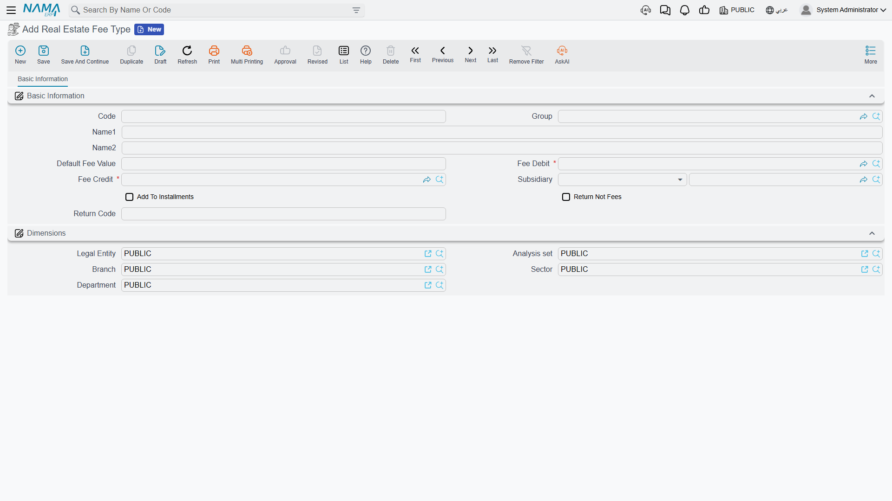
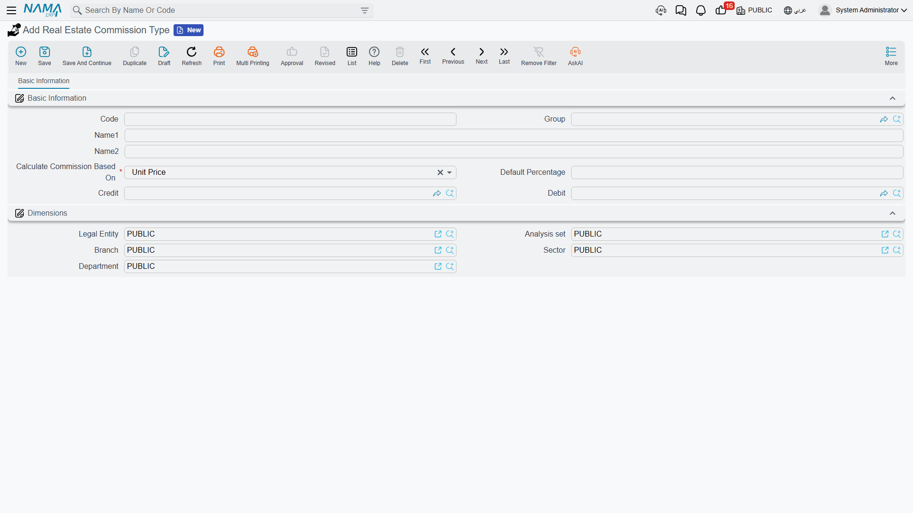
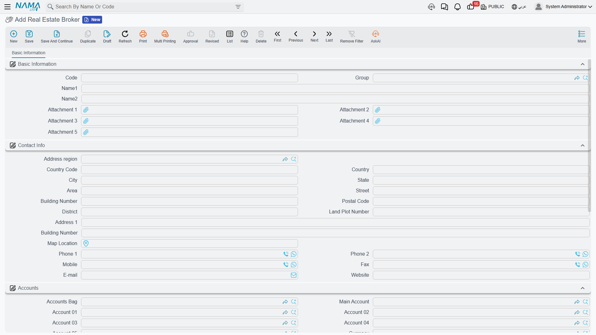
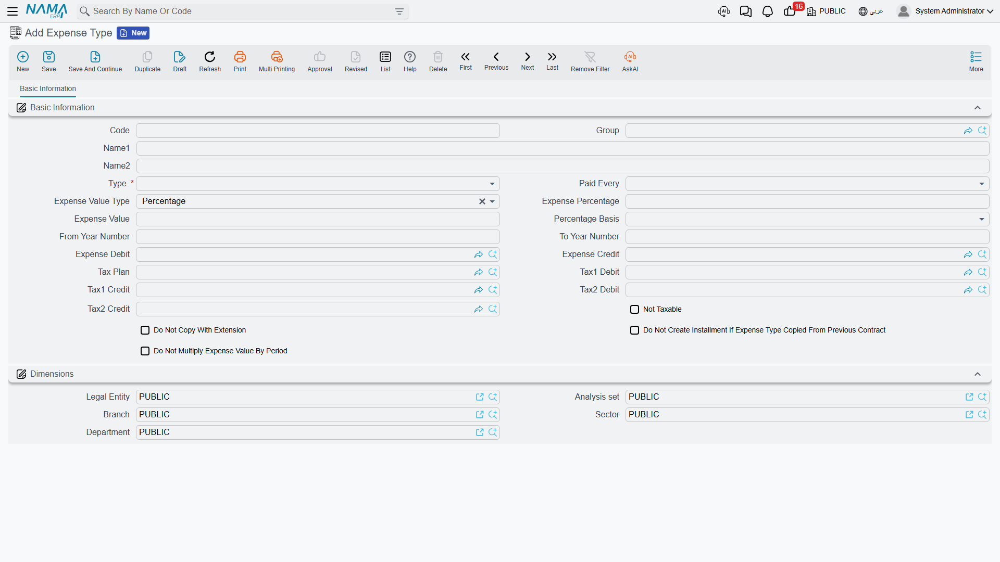
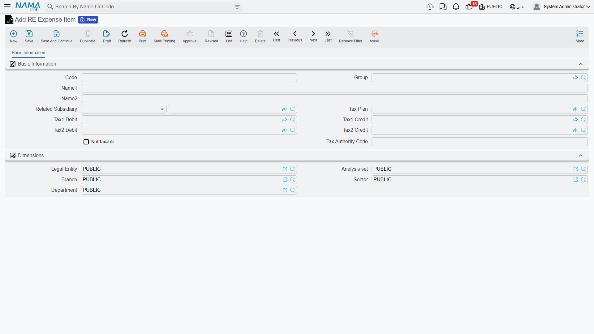

# Fee, Commission, Broker and Expense Catalogues

Five small master files under **Real Estate and Property > Master Files** never appear on a screen
of their own during day-to-day work. They appear as dropdowns — in the fees grid of a sales
contract, in the commissions grid, in the expenses grid of a lease, in the details of a maintenance
invoice. Each of them exists so that a value, an account or a rule is typed once by the person who
knows it and picked afterwards by the person who does not.

They are easy to confuse with one another because three of them contain the word "expense" or "fee"
in some language. The quickest way to keep them apart is by where you meet them:

| Catalogue | Where you meet it |
|---|---|
| Real Estate Fee Type / نوع رسم استثمار عقاري | the *Other Fees Lines* grid on sales and rent contracts |
| Real Estate Commission Type / نوع عمولة استثمار عقاري | the *Commissions* grid on the sales contract |
| Real Estate Broker / وسيط عقاري | the party who receives a commission |
| Expense Type / نوع المصروف | the recurring charges grid on a **rent** contract |
| RE Expense Item / بند مصروف استثمار عقاري | the details of a **maintenance** expense |

And a sixth one that is documented elsewhere because it behaves quite differently: the cost element
catalogue that carries a distribution rule, described in
[Distributing Project Costs Over Properties](/modules/realestate/costs/realestate-cost-distribution).

## Real Estate Fee Type — the one-off charge

A fee type is a charge that rides along with a contract: a registration fee, a title-deed fee, a
utility connection charge, an administrative fee. Say you always charge buyers a 5,000 registration
fee. You create it once:

| Field | What it does |
|---|---|
| Default Fee Value / قيمة الرسم الافتراضية | pushed into the fee line the moment the type is picked |
| **Fee Debit / مدين الرسم** and **Fee Credit / دائن الرسم** | **required** — the accounts this fee books to |
| Subsidiary / الذمة | the default recipient, a third party or an employee |
| Add To Installments / إضافة إلى الأقساط | fold the fee into the generated installment schedule instead of leaving it standing alone |
| Return Not Fees / عائد وليس رسوم | this is money going back **to** the client, not charged to him |
| Return Code / كود العائد | a grouping code for returns |

The accounts are the interesting part. Almost everywhere else in Real Estate the accounts come from
the document term; here they come from **the master file itself**. Each fee line on a contract is
booked with its own fee type's debit and credit sides, which is why one contract can send a
registration fee to one account and a connection charge to another without touching the term at all.
(The contract's term can suppress the whole fee block if a customer wants those lines documentary
only.)

You will meet a fee type in three places: the **Other Fees Lines / رسوم أخري** grid on the
[sales contract](/modules/realestate/sales/realestate-sales-contract), the opening sales contract,
the waiver and the rent contracts; as a **Real Estate Fee Type / نوع رسم استثمار عقاري** column on
every installment grid, marking which fee generated a given installment; and in the fee-schedule
generator on the sales contract, which spreads a fee over several dated installments.

**Return Not Fees / عائد وليس رسوم** deserves a sentence of its own. Ticking it flips the sign
semantics of the line: a negative remaining amount becomes legitimate rather than an error, and the
line's value is tracked as an absolute figure. That is what makes refundable deposits and rebates
work — see
[Exemptions and Returning Money to the Buyer](/modules/realestate/collections/realestate-exemptions-and-returns).

## Real Estate Commission Type — how much, on what, and to which account

A commission type answers three questions at once: what percentage is normal, what number the
percentage applies to, and which accounts the commission books to. Create "Sales commission" with a
**Default Percentage / النسبة الافتراضية** of 2 and a **Debit / مدين** and **Credit / دائن** pair,
and the salesperson filling a contract types almost nothing.

The **Calculate Commission Based On** field is the one that shapes the arithmetic. It offers twelve
bases:

| Basis | The number the percentage is applied to |
|---|---|
| Unit Price / سعر الوحدة *(default)* | the contract's total price |
| Net Value / الصافي | the remaining value on the contract |
| Unit N1 … Unit N5 / رقم 1..5 من الوحدة | one of the five free numbers on the sold estate |
| Contract N1 … Contract N5 / رقم 1..5 من العقد | one of the five free numbers on the contract header |

The free-number bases exist for the deals where nobody pays on the sticker price — a commission on
built-up area, on a negotiated valuation, or on a fixed per-unit tariff you store on the estate.

On the contract, each commission line names a commission type, a recipient (an employee, a broker or
a third party), a percentage and a value, and a checkbox **Calculate Percentage From Value /
احتساب النسبة من القيمة** that decides which of those two you type. Left unticked, you type the
percentage and the system computes the value. Ticked, you type the agreed lump sum and the system
back-computes the percentage it represents. Picking the type fills the percentage from its default
and computes the value immediately.

The timing catches people out: **commissions are booked when the sales contract is committed, not
when the broker is paid.** The debit and credit come from the commission type's own accounts, the
recipient becomes the subsidiary, and paying the broker later is an ordinary payment voucher against
his account. If the sale is subsequently given up, the
[waiver](/modules/realestate/sales/realestate-waiver-and-cancellation) can be configured to book the
same commission types with the sides reversed.

Two boundaries worth knowing. Commission types belong to the **sales** family — the sales contract
and the waiver. The opening sales contract has no commissions grid at all, so a migrated historic
sale carries no commission. And rent contracts do not use commission types either; a lease's
commission is a value on the contract itself, handled through the rent term — see
[Generating the Rent Schedule](/modules/realestate/rent/realestate-rent-schedule).

## Real Estate Broker — a party with an account

A broker record is mostly contact details — address, telephones, mobile, fax, e-mail, website — plus
two blocks that make him more than an address book entry: a full **Accounts / الحسابات** block, so a
broker is a genuine accounting subsidiary and his commission can be credited straight to his account
and settled by payment voucher; and a **Tax Information / معلومات الضرائب** block for the commercial
registration and tax numbers when sales tax is in use.

There is one thing about brokers that is easy to assume wrongly. Sales and rent contracts carry a
header field **Broker / وسيط**, and it is informational: it is copied along when one document is
created from another — offer to contract, reservation to sales document — and that is all it does.
It creates no commission line and books nothing. **The commission lines are entered in the
commissions grid by hand**, and it is on the line that you name who receives the money.

## Expense Type — the recurring charge on a lease

An expense type is a charge that recurs through the life of a **rent** contract: a cleaning charge,
a security charge, a common-area electricity contribution. It is the only one of these catalogues
that carries a schedule rather than a single value.

| Field | What it does |
|---|---|
| Type / النوع | **required** — the installment type the generated lines carry |
| Paid Every / يستحق كل | **required** — the recurrence |
| Expense Value Type / نوع قيمة المصروف | *Percentage / نسبة* (the default) or *Value / قيمة* |
| Expense Percentage / نسبة المصروف, Expense Value / قيمة المصروف | whichever the value type calls for |
| Percentage Basis / اساس النسبة | *First Year Rent / قيمة الايجار لأول سنة* or *The Same Year Rent / قيمة الايجار لنفس السنة* |
| From Year Number / من السنة رقم, To Year Number / الى السنة رقم | limit the charge to certain contract years |
| Expense Debit / مدين المصروف, Expense Credit / دائن المصروف | the accounts, plus a tax plan and tax 1/2 sides and a *Not Taxable / غير خاضع للضريبة* flag |
| Do Not Copy With Extension / عدم النسخ مع التمديد | drop this expense when the lease is renewed |
| Do Not Create Installment If Expense Type Copied From Previous Contract / عدم إنشاء قسط إذا كان المصروف منسوخ من العقد السابق | do not re-charge it on a carried-over lease |
| Do Not Multiply Expense Value By Period / عدم ضرب قيمة المصروف في الفترة | charge the value once per period instead of once per month in it |

**Paid Every** offers *Yearly / سنوية*, *Half Year / نصف سنوي*, *Quarterly / ربع سنوية*, *Monthly /
شهرية*, *Year Third / ثلث سنوي*, *Two Years / سنتين*, *Three Years / ثلاث سنوات*, *Five Years /
خمس سنوات*, *Once / مرة واحدة* and *With Every Installment / مع كل قسط*.

The arithmetic that turns those settings into money is worth understanding once, because it explains
why the same expense type produces different amounts on two leases:

- Percentage on **First Year Rent** is fixed the moment the contract is created — the monthly rent
  amount times the percentage — and never moves again even if the rent escalates.
- Percentage on **The Same Year Rent** is recomputed for each generated installment against that
  year's rent, so it rises with the annual increase.
- A flat **Value** is simply used as typed.
- Then, unless the recurrence is empty, *Once* or *Yearly*, the amount is multiplied by the number
  of contract months in the period — which is exactly what *Do Not Multiply Expense Value By Period*
  switches off.

Picking an expense type on a lease copies its type, recurrence, value type, value, percentage,
basis, year range and the do-not-multiply flag onto the grid line, where they can still be adjusted
for that one contract. The lines the generator produces then flow onwards: every installment records
the expense type that created it, and so does the collection document that settles it.

## RE Expense Item — the maintenance cost catalogue

The last one is the shortest. An expense item is a line in a maintenance invoice: "lift maintenance",
"generator diesel", "cleaning contract", "pool chemicals". It carries a **Related Subsidiary /
الذمة المتعلق** — the owner, supplier, third party or account this expense is normally owed to — a
**Tax Plan / سياسة الضريبة**, tax 1 and tax 2 debit and credit sides, a **Not Taxable / غير خاضع
للضريبة** flag and a tax authority code.

Note what it does *not* carry: a main debit and credit pair. The accounts for the maintenance cost
itself, and for the split between the company's share and the customer's share, come from the
maintenance document's own term; the item only overrides the tax sides. Where the item is used, and
how that split works, is covered in
[Maintenance Requests and Expenses](/modules/realestate/maintenance/realestate-maintenance-expenses).

::: tip Three catalogues, three worlds
A **fee type** is a one-off charge on a contract with its own accounts. An **expense type** is a
recurring charge on a lease with a schedule. An **expense item** is a line on a maintenance invoice.
None of them can substitute for another, and none of them is the project **cost element** that
carries a distribution rule.
:::
