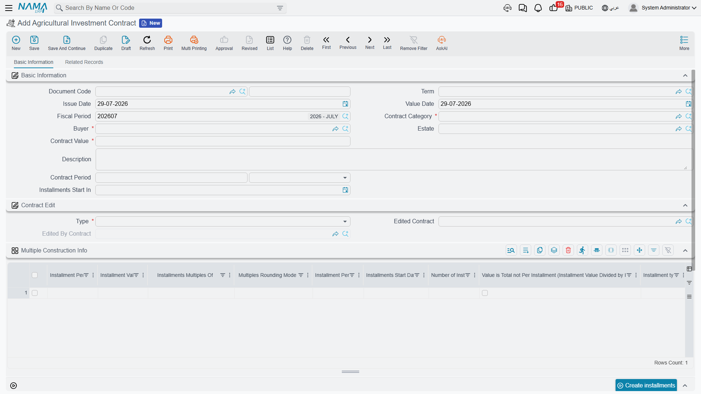
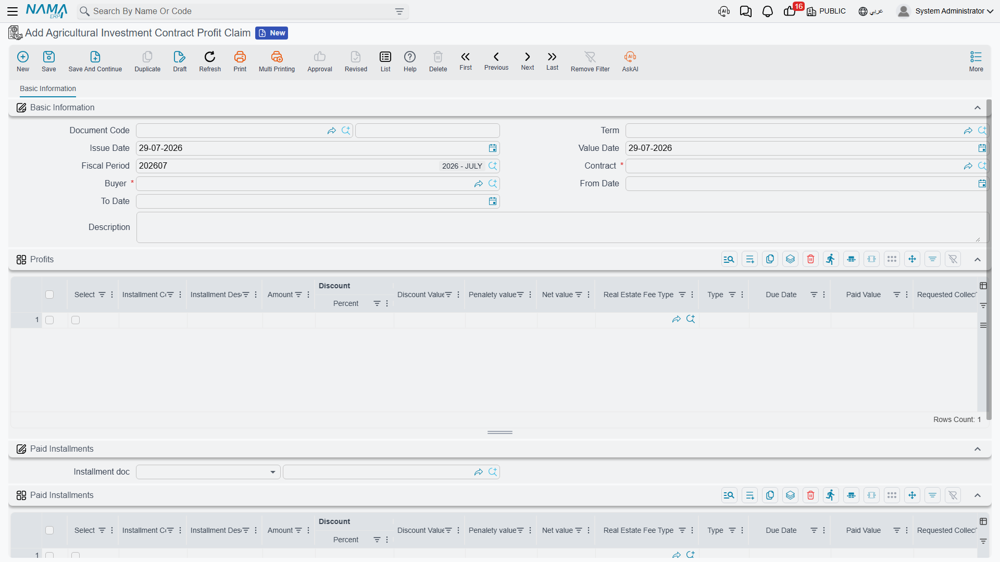

# Agricultural Investment Contracts

Start with what this is **not**, because the menu actively misleads.

The Investment menu holds two products side by side. One is the pooled
[investment fund](/modules/realestate/investment/realestate-investment-funds), where several
investors put money into a shared pot, the pot buys property, and their return comes from revaluing
that property upward. The other is the **agricultural investment contract**, and it has nothing to
do with any of that.

Here a single investor signs a contract with the company: he pays a lump sum, and in exchange the
company promises him a **schedule of profit installments** over a fixed period, normally against a
specific plot of agricultural land. No pot, no other investors, no revaluation, no share of
anything. It is closer to a fixed-return instrument than to a fund.

Two more things separate them:

- **A different licence.** Everything on this page needs `realestate-agri-investmnent` — quoted
  exactly as it ships, typo included. The fund needs plain `realestate`. Without the agricultural
  licence these screens do not appear at all.
- **A different meaning of "Agr".** The screens and entity names are prefixed *Agr* for
  **Agricultural**, not "aggregated". It is a contract about farmland.

## The worked example

An investor puts **500,000** into a five-year agricultural investment contract. The agreed return is
10% of the contract value per year, paid quarterly — **20 profit installments of 25,000 each**,
starting 01/01/2026.

Later, the same investor buys a villa from the company, and rather than paying him one quarter's
profit in cash, both sides agree to net that 25,000 off what he owes on the villa.

## The contract category

Before any contract can be written you need at least one **Agricultural Investment Contract
Category** (**Real Estate and Property > Investment > Agricultural Investment Contract Category**).

It is a very small master file — a code, a name, and one business decision: **Work With Estates**.

That tick is not decoration. It is checked on every contract commit:

- **ticked** → the contract's *Estate* field becomes **required**;
- **unticked** → the contract's *Estate* field must be **empty**, and the save is refused with an
  error naming the category if anything is in it.

So the category is how you separate "contracts tied to a named plot" from "contracts against the
business generally". Create one of each if you sell both, and the system will keep them honest.

## The contract

**Real Estate and Property > Investment > Agricultural Investment Contract** is the deal itself.
The header is short:

| Field | For our example |
|---|---|
| Contract Category | "Land-backed, 5 year" |
| Buyer | the investor |
| Estate | the plot — required or forbidden by the category |
| Contract Value | 500,000 |
| Contract Period | 5 years |
| Installments Start In | 01/01/2026 |

::: info Only land plots
The Estate field accepts **land plots only** — not buildings, not floors, not rental units. That is
consistent with what the product is, and it is enforced by the picker itself.
:::

### Generating the profit schedule

Below the header sit two grids that are easy to confuse, so it is worth naming them clearly.

The first, **Multiple Construction Info**, is not the schedule. It is the **recipe** for building the
schedule — one row per block of installments, saying how many there are, how far apart, what each is
worth, and where the block starts. Its columns are the same ones used on sales contracts, described
in [Building the Installment Plan](/modules/realestate/sales/realestate-installment-plans): a
percentage or a value, a period, a number of installments, a rounding rule, a switch saying whether
the value you typed is the **total** rather than the per-installment amount, and an offset that
pushes this block's start date forward before it begins.

For our contract, one row does it: 10% of the value, quarterly, 20 installments, with the value
treated as a total.

The second grid, titled **Profits**, is the actual schedule — the individual profit installments
with their codes, amounts, due dates and payment columns. It is filled by the **Create
installments** button between the two grids.

Pressing it walks the recipe rows in order, working out where each block starts from the contract's
*Installments Start In* date and each row's offset and period, then hands off to the same
installment engine the sales contracts use, with the contract value as the base. Our single row
produces 20 lines of 25,000 each, dated quarterly from 01/01/2026.

::: warning Create installments replaces the whole Profits grid
The button rebuilds the schedule from scratch, so anything already in the Profits grid is replaced.
Run it once, at the beginning, before any profit has been claimed against the contract.
:::

The validations that catch most mistakes are worth knowing in advance: the Profits grid may not be
left empty, installment codes must be unique and valid, a recipe row may not carry **both** a value
and a percentage, you may not change the code of an installment that already exists, and you may not
touch a line that already has payments against it.

### Amending a contract

Contracts change. The system does not let you edit a live one in place; instead it uses a
supersession mechanism that leaves a clean audit trail.

To amend, create a **new** contract and set its type to **Edit For Existing Contract**, then point
its *Edited Contract* field at the old one. Doing so:

1. copies the buyer, category, contract value, estate and period across;
2. copies over **only the unpaid** installment lines, with their matching recipe rows — so the new
   contract starts life carrying exactly the old one's outstanding schedule;
3. on commit, marks the old contract as edited, **closes out its entire remaining schedule** by
   marking those installments paid, and **locks it permanently**.

::: warning A superseded contract is locked forever
Once a contract has been edited by another, it can no longer be edited or deleted, and neither can
any profit claim raised against it. If you need to undo an amendment, cancel the *editing* contract
first — that reverses the supersession and unlocks the original.
:::

The rules around this are strict by design: a contract can be edited only **once**, the contract
being edited must be **older** than the one editing it, a *New Contract* may not name an edited
contract at all, and the picker for *Edited Contract* only offers contracts belonging to the same
buyer and the same category that have not already been superseded.

One more restriction: you may not move the contract's value date backwards past a committed profit
claim. If a claim already exists at or before your new date, the save is refused and names the
claim.

::: info The contract books nothing
The agricultural investment contract has **no accounting effect** of its own. It creates the profit
schedule and nothing else. The money is recognised by the profit claims raised against it.
:::

## Claiming the profit

Every quarter, the company raises an **Agricultural Investment Contract Profit Claim**
(**Real Estate and Property > Investment > Agricultural Investment Contract Profit Claim**) to
recognise the profit that has fallen due.

Fill in the buyer, the contract, and a **From Date** and **To Date** — 01/01/2026 to 31/03/2026 for
our first quarter. Choosing the contract loads the **Profits** grid with the contract's installments
that are not yet paid and whose due date falls inside that range. One line, 25,000. Each loaded line
is claimed at its **full outstanding value**, so there is no partial-claim arithmetic to do.

### Netting it against what the investor owes

This is the part that makes the document more than an accrual. The investor who is owed 25,000 of
profit may also owe the company money on a property he is buying. Rather than moving cash both ways,
the claim can settle one against the other.

In the **Paid Installments** group, pick an **Installment doc** — a
[sales contract](/modules/realestate/sales/realestate-sales-contract) or an
[opening sales document](/modules/realestate/opening/realestate-opening-sales); nothing else is
accepted. The system then takes the total of the claim's profits and walks that document's
not-fully-paid installments **in order**, allocating to each until the money runs out, and builds
the **Paid Installments** grid from the result.

Our 25,000 lands on the oldest unpaid installments of the investor's villa contract.

::: tip You may claim more profit than you offset, never less
The document enforces that the profits total is **greater than or equal to** the paid-installments
total. Claiming 25,000 and offsetting 25,000 is fine. Claiming 25,000 and offsetting 30,000 is
refused, and the message tells you both figures.
:::

Committing the claim marks the money as **system-collected** on **both** sides — the contract's
profit installments and the sales document's installments both have their system-collected value
raised and their remaining value reduced, through payment entries the system writes and removes
with the document. Cancelling the claim removes them again.

### What it posts

The claim carries **two completely independent ledger blocks**, and each one fires only if both of
its account sides are configured on the term:

| Block | One debit and one credit line per… | Valued at |
|---|---|---|
| Profits | each line of the **Profits** grid | that line's amount |
| Paid Installments | each line of the **Paid Installments** grid | that line's amount |

The usual arrangement books the profits block as a cost against the investor's payable, and the
paid-installments block as that payable being settled against the sales receivable — which is
exactly the netting the document describes. But you can configure the profits block alone, which
turns the document into a pure profit accrual with no offset.

Amounts post in the legal entity's ledger main currency, and processing happens as a background
business request — retry a failure from the Business Requests list view with **More menu →
Reprocess / Recommit**. The term itself is documented in
[Collection, Maintenance, Investment and Cost Document Terms](/modules/realestate/document-terms/realestate-terms-other).

::: info The claim moves no cash
It creates an accrual, an offset, or both. If the investor is actually to be paid his 25,000, that
is a separate payment document. The claim only says the profit is due and, optionally, that some of
it has been consumed against a debt.
:::

Every claim raised against a contract is listed back on the contract's **Related Records** tab, so
the contract itself is the place to see how much of its schedule has been claimed.

## The example end to end

1. A category "Land-backed, 5 year" is created with **Work With Estates** ticked.
2. A contract is written for the investor: 500,000, five years, starting 01/01/2026, against a named
   plot. One recipe row — 10%, quarterly, 20 installments, value is total — and **Create
   installments** produces 20 lines of 25,000.
3. On 31/03/2026 a profit claim for 01/01–31/03 loads one 25,000 installment.
4. The investor's villa contract is picked as the installment document, so the 25,000 is allocated
   against his oldest unpaid villa installments.
5. Committing marks both sets of installments as system-collected, and the term posts the profit and
   the settlement as two separate blocks.
6. Nineteen quarters later the schedule is exhausted; if the terms had changed on the way, an
   *Edit For Existing Contract* would have carried the unpaid remainder into a fresh contract and
   locked this one.
