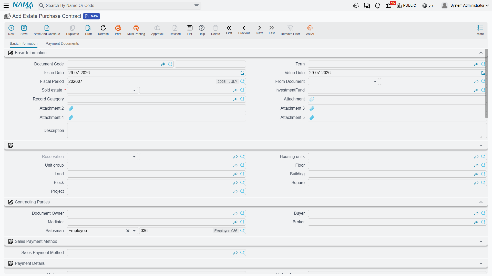
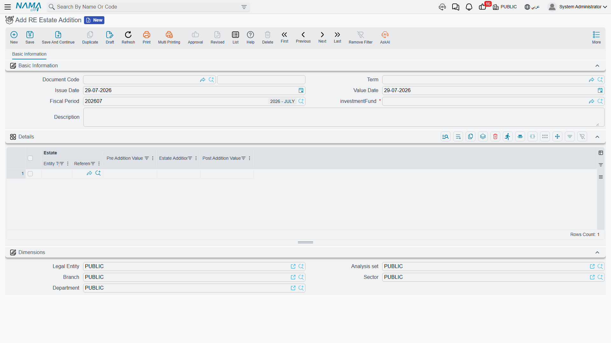
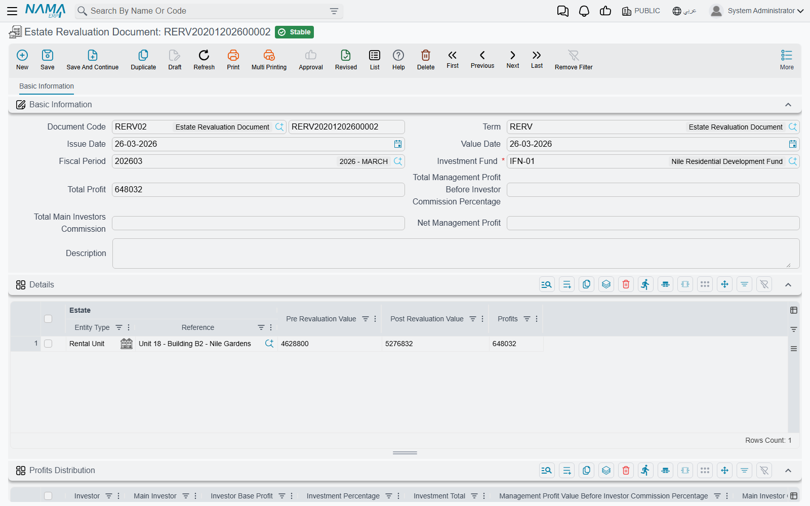

# Estate Values, Additions and Revaluation

Every property held by an investment fund carries a **carrying value** — what the books say it is
worth today. That value is not a field somebody types on the estate. It is the last link in a chain
of value entries, and each link is written by a document.

There are four documents in the chain, and the order they may appear in is **validated**. That
validation is the thing people trip over most in this part of the module, so it comes first.

## The value chain and its sequence rules

Behind every fund-owned estate the system keeps a chronological list of value entries. Four
documents write into it:

| Document | What it records |
|---|---|
| Estate Purchase Contract | the fund bought the property, at this value |
| Estate Addition | an improvement was capitalised onto it |
| Estate Revaluation | it was marked to market, up or down |
| Sales contract (or opening sales) | it left the fund |

Whenever any of them is committed, cancelled or changed, the whole chain for that estate is re-read,
sorted by value date and then creation date, and re-linked so that each entry's "previous value"
and "difference" agree with the entry before it. The estate's **current value** is simply the last
entry's value, and its **purchase value** is the value on the last purchase entry.

That re-chaining is why the order is policed. Committing a document runs these four checks:

1. **The first document for an estate must be a purchase contract.** You cannot revalue or sell
   something the fund never bought.
2. **A revaluation may only follow a purchase or another revaluation.** You cannot revalue an
   estate that has already been sold.
3. **A purchase may only follow a sale.** Buying the same estate twice in a row is refused — it has
   to have left the fund in between.
4. **A sale may only follow a revaluation, and that revaluation's value must equal the sale value.**

::: tip Rule 4 is the one that bites
Selling a fund-owned estate is a two-document operation. You revalue it to the agreed sale price
first, then sell it at exactly that price. Sell at a price the last revaluation does not match and
the contract is refused, naming the estate, the document and the value it expected. This is not an
obstacle to work around — it is what guarantees the gain is recognised and distributed to the
investors *before* the property leaves the fund.
:::

Cancelling any of these documents removes its entries and re-chains what is left, so an accidental
purchase can be backed out cleanly.

## Buying — the Estate Purchase Contract



The purchase contract is the **mirror image of the sales contract**. It is built on the same base,
uses the same price block, the same installment-construction grid and the same *Create Installments*
button described in
[Building the Installment Plan](/modules/realestate/sales/realestate-installment-plans).

The difference is direction. Here the company is the buyer, so the installments are amounts the
company **pays** — and the action block reflects that: instead of receipt vouchers it offers
**Create Payment Voucher From Selected Line**. A second tab, *Payment Documents*, records payments
made outside that mechanism, each with its date, its value, and a switch that keeps a payment from
reducing the remaining balance when it should not.

You find it at **Real Estate and Property > Investment > Estate Purchase Contract**, under the
`realestate` licence. The header carries the **Investment Fund** that is doing the buying — this is
what ties the estate to the fund for everything that follows.

The contract is simpler than its sales counterpart in one respect: there are no standard terms and
conditions, no clause lines and no fees grid.

### Which figure becomes the carrying value

Every purchase contract writes a value entry, without exception. Which number it writes is a term
decision: the purchase contract's term carries an **Estate Value Field** option naming the field to
read, and if it is not set the contract's price is used. Set it when your capitalised value is
meant to include something the plain price does not — see
[Sales Document Terms](/modules/realestate/document-terms/realestate-terms-sales), which covers the
purchase contract's term alongside the rest of the sales family.

For our example: the fund buys a plot for **1,000,000**. That is now the estate's carrying value,
and the first link in its chain.

## Improving — the Estate Addition



*تعلية* literally means raising a building by another storey, and that is exactly the case this
document was named for: the fund owns a four-storey building, a fifth storey is built, and the cost
of building it belongs in the property's value rather than in this year's expenses.

More generally, the **Estate Addition** (**Real Estate and Property > Investment > RE Estate
Addition**) capitalises an improvement onto an estate the fund already holds. Name the fund, then
list the estates and how much value each one gained:

| Estate | Pre Addition Value | Estate Addition Value | Post Addition Value |
|---|---|---|---|
| Building 4 | 6,000,000 | 800,000 | 6,800,000 |

You only type the middle column. The pre-addition value is filled from the estate's last value entry
before this document's date, and the post-addition value is the sum of the two.

::: info No accounting effect
The estate addition changes the property's carrying value and nothing else — it produces no ledger
entry. The cost of the fifth storey is booked wherever you actually recorded it (a cost document, a
supplier invoice); this document is what tells the fund the property is now worth more. It still
needs a book and a term like any document, but the term has no Real Estate account sides of its own.
:::

## Revaluing — where the fund's profit is made



The **Estate Revaluation Document** (**Real Estate and Property > Investment > Estate Revaluation
Document**) does two jobs at once, and the second is the reason this document matters more than any
other in the investment area.

The first job is obvious: restate what the fund's properties are worth.

The second is that **this is the only way a fund earns anything.** There is no interest, no rent
roll-up, no coupon. A fund investor's return comes entirely from revaluation gains, which the
document computes and splits across the investors then and there. Understanding the split is
understanding the whole product.

### Step 1 — restate the estates

The first grid lists the estates being revalued:

| Estate | Pre Revaluation Value | Post Revaluation Value | Profits |
|---|---|---|---|
| Plot A-7 | 1,000,000 | 1,200,000 | 200,000 |

You type the post-revaluation value; the profit is the difference. The pre-revaluation value is
filled by the system from the estate's last value entry — plus any purchase installments already
paid on it before this date, so a property still being paid for is measured against what has
actually gone into it.

For the whole document, **Total Profit** is the sum of the line profits: 200,000.

### Step 2 — split it across the investors

The second grid is regenerated by the system every time the document is saved. It reads every fund
transaction dated **before** this document's value date, rolls them up per investor, drops anyone
whose balance is zero, and then works through the following chain for each investor in turn.

Using our fund — Ali 600,000, Sara 400,000, management profit percentage 10%, and Ali introduced by
a main investor on a 25% commission:

**a. Investment percentage.** Ali holds 600,000 of the 1,000,000 → 60%. Sara → 40%.

**b. Investor base profit** = the investor's balance × total profit ÷ all investors' balances.

```
Ali:  600,000 × 200,000 ÷ 1,000,000 = 120,000
Sara: 400,000 × 200,000 ÷ 1,000,000 =  80,000
```

**c. Management value before the investor commission** = base profit × the fund's management profit
percentage.

```
Ali:  10% of 120,000 = 12,000
Sara: 10% of  80,000 =  8,000
```

**d. Main investor commission** = that management value × the investor's main-investor commission
percentage. This comes out of the management fee, not out of the investor's pocket.

```
Ali:  25% of 12,000 = 3,000
Sara: no main investor → 0
```

**e. Management profit value** = the management value less the main-investor commission — **or zero**
if the investor's row carries *Do Not Deduct Management Percentage*.

```
Ali:  12,000 − 3,000 = 9,000
Sara:  8,000 − 0     = 8,000
```

**f. Net profit** = base profit − management profit value − main-investor commission.

```
Ali:  120,000 − 9,000 − 3,000 = 108,000
Sara:  80,000 − 8,000 − 0     =  72,000
```

**g. Distributed and reinvested.** This is the only column on the grid you fill in. Type how much
of the net profit is actually being paid out as **Distributed Profits**; the rest becomes
**Reinvested Profits** automatically.

```
Ali:  distributed 50,000  →  reinvested 58,000
```

That reinvested 58,000 is written back into the fund as a transaction on Ali's row, so his current
investment rises from 600,000 to **658,000** — and his percentage in the next revaluation rises
with it. Reinvestment is how a fund investor compounds.

The header totals follow from the lines: total management profit, total main-investor commission,
and net management profit as the difference between them.

::: warning The distribution grid is rebuilt on every save
The whole profit-distribution grid is regenerated each time the document is saved, so anything you
type into its computed columns is overwritten. The single exception is **Distributed Profits** — it
survives, and the reinvested figure is derived from it. If you need a different split, change the
management percentage on the fund or the investor's settings on a finance addition; do not hand-edit
the grid.
:::

### What gets posted

The revaluation is the one document in this chain with a full accounting effect, and it posts **per
investor line**, not per estate. Its term offers four pairs:

| Value posted | Pair |
|---|---|
| management profit value | the management-profit pair |
| main investor commission value | the main-investor-commission pair |
| distributed profit | the distributed-profit pair |
| reinvested profit | the reinvested-profit pair |

Each pair fires only when both of its sides are configured, and if all four pairs are left empty the
document posts nothing at all. Amounts are in the legal entity's ledger main currency, and the
investor on the line is the subsidiary on both sides of the entry.

The term is described in
[Collection, Maintenance, Investment and Cost Document Terms](/modules/realestate/document-terms/realestate-terms-other);
the shared mechanics of any accounting side in
[How Real Estate Document Terms Work](/modules/realestate/document-terms/realestate-terms-basics).
Processing happens as a background business request, retried from the Business Requests list view
with **More menu → Reprocess / Recommit**.

## Selling out of the fund

When the plot is finally sold, the sale is an ordinary
[sales contract](/modules/realestate/sales/realestate-sales-contract) — or an
[opening sales document](/modules/realestate/opening/realestate-opening-sales) if you are loading
history. What makes it different is only that it is the last link in the value chain, and rule 4
applies: the last revaluation must already carry the exact sale value.

So the full life of the plot reads:

1. **Purchase contract**, 1,000,000 — the fund buys it, and the chain begins.
2. **Estate addition** where relevant — an improvement is capitalised.
3. **Revaluation** to 1,200,000 — the 200,000 gain is split across Ali and Sara, the management fee
   and the main investor's commission come out of it, and each investor's reinvested share goes
   back into their balance.
4. **Sales contract** at 1,200,000 — the estate leaves the fund at exactly the revalued figure.

The fund and the investor balances that feed step 3 are the subject of
[Real Estate Investment Funds](/modules/realestate/investment/realestate-investment-funds); how an
estate carries a value at all, alongside its status and its area, is covered in
[How Properties Are Modelled](/modules/realestate/properties/realestate-estate-model).
