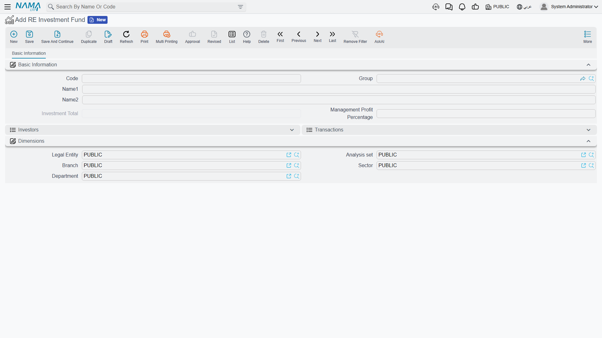
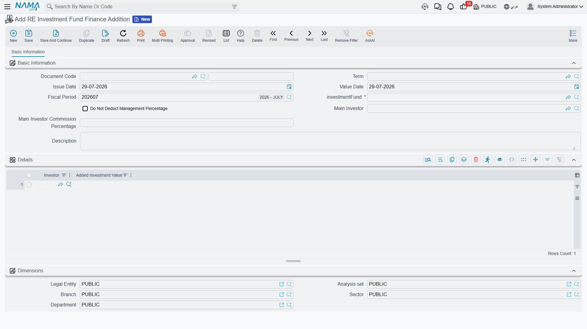
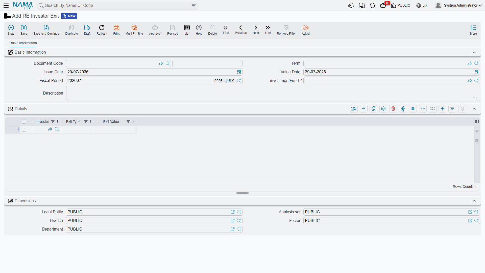

# Real Estate Investment Funds

A fund is a simple idea. Several people put money into a pot, the pot buys property, the property
gains value, and the gain comes back to them in proportion to what each of them put in.

The important word in that sentence is **money**. A Nama investment fund does not issue shares or
units — there is no share count anywhere in the system. Each investor holds a **money balance** in
the fund, and every calculation the fund performs works from that balance and its share of the
total. Ali's 600,000 out of a 1,000,000 fund makes him a 60% investor because of the ratio of the
amounts, not because he holds sixty of a hundred certificates.

Keep that in mind through this page. Everything the fund does is arithmetic on balances.

## The worked example

Two investors start a fund:

- **Ali** puts in **600,000**
- **Sara** puts in **400,000**

The fund total is 1,000,000; Ali is 60%, Sara 40%. Later Ali takes 200,000 back out. We will follow
those three movements through the three documents that produce them.

## The fund itself is deliberately thin

The fund master file lives at **Real Estate and Property > Master Files > RE Investment Fund**
under the `realestate` licence, and when you open it for the first time you may wonder where the
rest of the screen went. There is a code and a name, two lists, and exactly **one** number you are
allowed to type.

That number is **Management Profit Percentage** — the cut the fund manager takes from each
investor's profit. It is the only user-entered figure on the record, and it is read in exactly one
place: the revaluation document's profit distribution. Nothing else on the fund is typed.

There is no bank account here, no currency, no capital target and no closing date. If you were
expecting a fund to be a container of settings, it is not. It is a name that documents attach
themselves to.

### The two lists are built, not filled

Below the header sit two collapsible lists, and neither of them is a grid you edit:

**Transactions** is the raw log — one row for every document line that ever moved money in or out
of this fund. Each row records the investor, the source document, the signed **Investment Change**,
the type of movement, and the value date.

**Investors** is the roll-up — one row per investor, holding their **Current Investment**, their
**Join Date**, their **Full Exit Date** if they have one, and the main-investor settings attached to
them.

The Investors list is rebuilt by replaying the Transactions list in order: reset the row, then add
each transaction's change to the running balance. A joining transaction stamps the join date, a
full-exit transaction stamps the full-exit date, and the most recently seen main-investor settings
win.

**Investment Total** on the header is then the sum of the investors' current investments. It is
displayed, never typed, and it is recalculated whenever any investment document is committed,
updated or cancelled. Cancel a finance addition and the total drops the moment the cancellation is
processed — the fund's figure is always derived from documents, so it can never drift away from
them.

## Money in — the Finance Addition

**Real Estate and Property > Investment > RE Investment Fund Finance Addition** is how money enters
a fund, and it is worth being blunt about this: it is the **only** way an investor joins. There is
no "add investor" button on the fund. If somebody's name is not on a finance addition, they are not
in the fund.

The document is short. Name the fund it belongs to, then list the investors and how much each one
is adding:

| Investor | Added Investment Value |
|---|---|
| Ali | 600,000 |
| Sara | 400,000 |

Commit it and two transactions of type *Join* are written, +600,000 and +400,000, the investor rows
are rebuilt, and the fund total reads 1,000,000.

::: tip Only owners flagged as investors can be picked
Both the line's investor picker and the main-investor picker are restricted to owner records that
carry the **investor** flag. If someone is missing from the list, the fix is on their owner record —
see [Owners and Contract Clauses](/modules/realestate/properties/realestate-owners-and-contract-clauses).
:::

### The three header settings that follow the investor around

Above the grid sit three settings that are **not** about this document's money at all. They are
copied onto every transaction row the document writes, and therefore onto each investor's roll-up
row, where they stay until another finance addition overwrites them:

- **Main Investor** — the introducer or lead investor this money came in behind.
- **Main Investor Commission Percentage** — the slice of the management fee that gets passed to
  that main investor.
- **Do Not Deduct Management Percentage** — exempts this investor from the management cut
  altogether.

All three are consumed later, by the revaluation document, when profit is distributed. They are
explained where they actually bite, in
[Estate Values, Additions and Revaluation](/modules/realestate/investment/realestate-estate-values-and-revaluation).

::: info The most recent finance addition wins
Because the roll-up replays transactions in order and keeps the last non-empty value it sees, an
investor's main-investor and management settings come from their **latest** finance addition, not
their first. Raise a second addition for Ali with a different main investor and Ali's row changes,
retroactively, for every future distribution. If you want to top up an investor's money without
changing their terms, copy the settings from the previous document onto the new one.
:::

### What it posts

The finance addition does have an accounting effect: one debit/credit pair **per detail line**,
valued at that line's added investment value, in the legal entity's ledger main currency, from the
two account sides on the document's term. The usual setup debits cash or bank and credits the
investor's partners-capital account. Leave both sides empty and nothing is posted.

One point to get right when configuring the term: for account sides that resolve from the customer,
the customer used is the header's **Main Investor** — not the investor on the line. If your accounts
are meant to be picked up per investor, drive them from the line's subsidiary rather than from the
customer side, and remember that a blank Main Investor leaves the customer side with nothing to
resolve. The term itself is documented in
[Collection, Maintenance, Investment and Cost Document Terms](/modules/realestate/document-terms/realestate-terms-other).

Processing happens in the background as a business request; a failure is retried from the Business
Requests list view with **More menu → Reprocess / Recommit**.

## Money out — the Investor Exit

**Real Estate and Property > Investment > RE Investor Exit** does the reverse. Name the fund, then
list who is leaving and with how much:

| Investor | Exit Type | Exit Value |
|---|---|---|
| Ali | Partial Exit | 200,000 |

The exit is stored as a **negative** investment change, so Ali's current investment drops by 200,000
the moment the document is committed. **Full Exit** does the same thing and additionally stamps the
full-exit date on his investor row.

Two things about this document differ sharply from the finance addition, and both matter:

**It has no accounting effect.** None at all — no term, no ledger lines. It adjusts the fund's
investor balances and nothing else. The cash actually leaving the company has to be recorded
separately, normally with a payment voucher.

**The exit value is typed by hand and is not checked against the balance.** The system does not
look up what the investor is holding and does not object if you type more or less than that.

::: tip Read the Investors list before committing an exit
Because nothing validates the amount, a *Full Exit* for less than the investor's balance will leave
a residual balance sitting on a row that is stamped as fully exited — it will look closed while
still holding money. Open the fund, read the investor's **Current Investment**, and type that exact
figure for a full exit.
:::

### Dates matter more than you would expect

Profit distribution counts only the fund transactions dated **before** the revaluation's own value
date. An exit dated on or after a revaluation therefore does not reduce that revaluation's share
for the leaving investor — he is still treated as holding the money on the revaluation date. If an
investor is supposed to miss out on a gain, his exit has to be dated before it.

## Where the profit comes from

Nothing on this page makes money. A fund with investors and a bank of cash sitting in it earns
nothing at all until it buys property and that property is revalued upward — the revaluation
document is the fund's **only** profit engine, and it is also what pushes reinvested profit back
into each investor's balance.

That, plus the purchase and improvement documents that build an estate's carrying value in the
first place, is the subject of
[Estate Values, Additions and Revaluation](/modules/realestate/investment/realestate-estate-values-and-revaluation).

::: info Not the same thing as an agricultural investment contract
The Investment menu also holds *Agricultural Investment Contract*, which despite the neighbouring
menu entry has nothing to do with the pooled fund on this page — different licence, different
product, different money. See
[Agricultural Investment Contracts](/modules/realestate/investment/realestate-agricultural-investment).
:::
