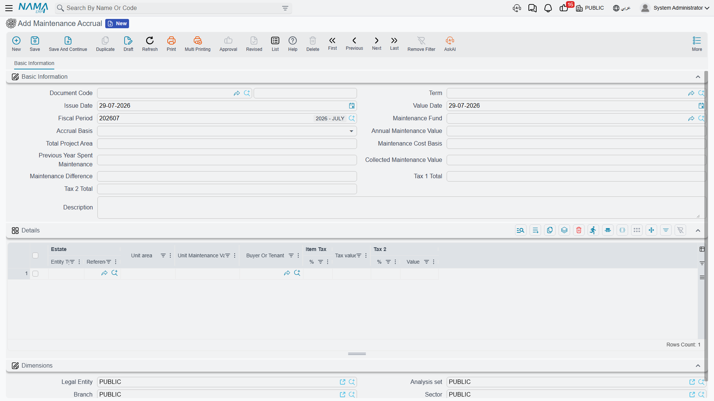

# Accruing the Annual Maintenance Charge

A compound has to be run. Lifts need servicing contracts, the gardens need water, the guards need
paying, and the pool needs chemicals every week. Somebody adds all of that up at the start of the
year, arrives at a budget, and then faces the only interesting question: **how much of it does each
flat owe?**

The Maintenance Accrual document (`إثبات استحقاق الصيانة`) answers exactly that question, and it
answers it in one specific way — **pro-rata by unit area**. Not a flat charge per unit, and not a
percentage of what the unit is worth. A 180 m² apartment pays twice what a 90 m² apartment pays,
regardless of which floor it is on or what it sold for.

This is the second of the two maintenance money streams described in
[Maintenance Deposits and Maintenance Funds](/modules/realestate/maintenance/realestate-maintenance-deposits-and-funds).
It has nothing to do with the deposit collected at sale, and the deposit is not drawn down to pay
for it.



You raise it from **Real Estate and Property > Documents > Maintenance Accrual**, and it needs the
`realestate` licence.

## The worked example

Nakheel Compound's 2026 maintenance budget is **1,250,000**. Its maintainable area is **12,500 m²**
across 70 units. So:

```
1,250,000 ÷ 12,500 m²  =  100 per m²
```

A 180 m² apartment is therefore accrued **18,000** for the year, charged to whoever holds it — the
buyer if it has been sold, the tenant if it is leased. A 90 m² studio is accrued 9,000. Carry
those numbers through the rest of this page.

## Filling the document

### 1. Pick the fund

The Maintenance Fund is the first thing you choose, and choosing it does the heavy lifting. The
system collects every rental unit that points at that fund **and** is flagged as subject to
maintenance, then:

- totals their areas into **Total Project Area** — 12,500 m² in our example;
- generates **one detail line per unit**, pre-filled with the unit, its area, and the buyer or
  tenant it will be charged to.

::: tip Lines are generated once, into an empty grid
The lines only appear if the details grid is still **empty**. Changing the fund on a document that
already has lines re-totals the area but does not rebuild the lines. If you picked the wrong fund,
clear the grid before picking again.
:::

::: info Two different lists of units
The fund's own screen lists the units of its **project**. The accrual lists the units whose
**Maintenance Fund** field points at that fund. They are two different criteria, and on tidy data
they give the same answer. If a unit appears in one list and not the other, it is because its
project and its fund reference disagree — fix it on the unit, in the status group where the fund
reference and the *Subject To Maintenance* tick sit together.
:::

### 2. Type the annual value

**Annual Maintenance Value** is the budget: 1,250,000. As soon as it is in, the system divides it
by the total area and writes the result into **Maintenance Cost Basis** — 100 per m², carried to
five decimal places so that awkward areas still add up.

The cost basis is not locked. You can overwrite it, and the lines recalculate from whatever you
typed. That is how you charge a rounded rate — set the basis to 100 flat instead of 99.87342 and
let the total land where it lands.

### 3. Read the lines

Every line now carries its unit's area multiplied by the cost basis:

| Estate | Unit area | Unit Maintenance Value | Buyer Or Tenant |
|---|---|---|---|
| Flat B-302 | 180 | 18,000 | the flat's buyer |
| Studio C-104 | 90 | 9,000 | the studio's tenant |

The buyer-or-tenant column is filled from the unit's buyer, falling back to the buyer on the unit's
contract. It matters more than it looks: it is the party the receivable is posted against, so a
unit with nobody in that column will accrue against nothing.

If sales tax is switched on for your installation, two tax percentage/value column pairs appear as
well. The percentages come from the tax plan named on the document term, and the tax is calculated
on the unit's maintenance value.

## The three accrual bases

The **Accrual Basis** field decides what the document is *for*:

**Year Maintenance** (صيانة السنة) is the ordinary annual run described above. The line value is
`unit area × maintenance cost basis`.

The other two — **Debit Maintenance Difference** (فروقات صيانة مدينة) and **Credit Maintenance
Difference** (فروقات صيانة دائنة) — are for settling up afterwards. At the end of the year you know
what you actually spent (the total of the year's
[maintenance expenses](/modules/realestate/maintenance/realestate-maintenance-expenses)) and what
you accrued. If they differ, you work out the difference **per square metre**, type it into the
**Maintenance Difference** field, and raise a difference document. The line value then becomes
`unit area × maintenance difference` instead of using the annual value at all.

Say the year's real spending came to 1,325,000 against 1,250,000 accrued — 75,000 short over
12,500 m², or 6 per m². A difference accrual with a maintenance difference of 6 charges our 180 m²
apartment a further 1,080.

::: info The direction comes from the term, not from the basis
Both difference bases compute the amount the same way. What separates "debit difference" from
"credit difference" in practice is **which document term you choose** — and therefore which accounts
the amount is debited to and credited from. Set up two terms, one for each direction, and pick the
matching basis so the document reads correctly to the next person who opens it.
:::

## What the document does when it is processed

Saving the accrual creates its accounting effect as a business request processed in the background.
Each detail line produces:

- the **unit maintenance value** on one debit/credit pair — the receivable on the buyer or tenant
  against maintenance revenue or a maintenance-fund liability, depending on how your term is set up;
- the **tax values** on their own two pairs, one per tax.

Every line's entry is stamped with the unit as its source, so a unit that carries its own subsidiary
accounts can drive the account selection, and with the buyer or tenant as the line's subsidiary.
The amounts post in the legal entity's ledger main currency — the accrual has no currency field of
its own.

As with any pair on a Real Estate term, **a pair only fires when both its debit and its credit side
are configured**; a half-filled pair is skipped in silence. The accrual's term and its account
pairs are described in
[Collection, Maintenance, Investment and Cost Document Terms](/modules/realestate/document-terms/realestate-terms-other),
and the shared mechanics of any accounting side in
[How Real Estate Document Terms Work](/modules/realestate/document-terms/realestate-terms-basics).

If the processing fails, retry it from the Business Requests list view: filter to the failed rows,
select them, and use **More menu → Reprocess / Recommit**.

## Where it sits in the year

There is no scheduler behind this document — nobody generates it for you. In practice the rhythm is:

1. **Start of the year** — set the budget, raise one Year Maintenance accrual per fund. Every unit
   now carries a receivable.
2. **Through the year** — collect those receivables from the buyers and tenants like any other
   money owed, using receipt vouchers or
   [collect documents](/modules/realestate/collections/realestate-collect-documents).
3. **Through the year** — spend against the budget with
   [maintenance expense documents](/modules/realestate/maintenance/realestate-maintenance-expenses).
4. **End of the year** — compare accrued against spent, work out the per-square-metre difference,
   and raise a difference accrual in the appropriate direction.

Before any of that works, the fund must exist and its units must be linked to it — see
[Maintenance Deposits and Maintenance Funds](/modules/realestate/maintenance/realestate-maintenance-deposits-and-funds).
