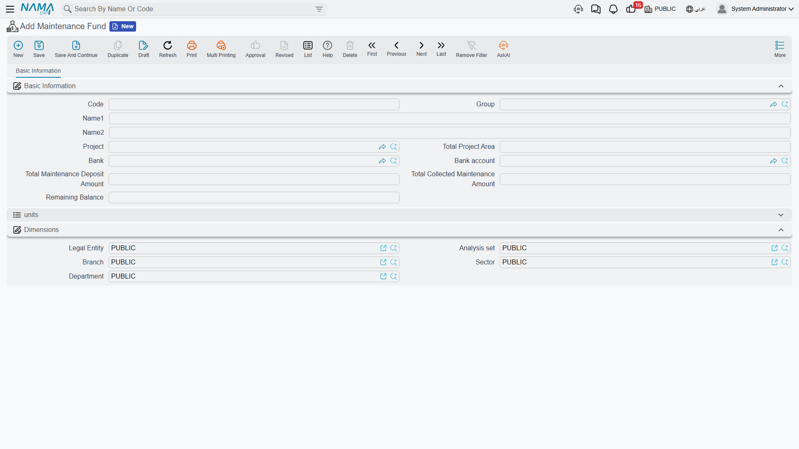
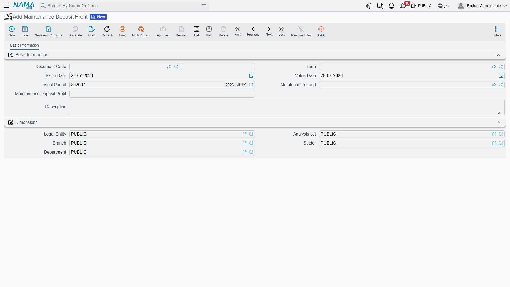

# Maintenance Deposits and Maintenance Funds

Before anything else, one correction that saves a lot of confusion: the Real Estate module runs
**two separate maintenance money streams**, not one cycle.

The first is the **maintenance deposit** — a one-off amount agreed at the moment of sale, collected
from the buyer alongside the price, and parked in a bank account until it is needed. The second is
the **annual maintenance charge** — the yearly service-charge budget that is accrued onto every
unit and then spent on real repairs.

They look like they should meet in the middle, and they do not. The deposit is booked by the
**sales** document term. The annual charge is accrued by its own document and spent by another.
Nothing automatically draws the annual spending down against the deposit, and no screen shows one
netted against the other. Treat them as two ledgers that happen to share the word "maintenance".

This page owns the first stream. The second is covered in
[Accruing the Annual Maintenance Charge](/modules/realestate/maintenance/realestate-maintenance-accrual)
and [Maintenance Requests and Expenses](/modules/realestate/maintenance/realestate-maintenance-expenses).

## The deposit starts on the sales contract

Take a villa selling for 1,200,000 with a 2% maintenance deposit. That 2% lives in the price block
of the sales contract, right beside the price itself, as a pair of fields: *Maintenance Deposit
Percentage* and *Maintenance Deposit Value*. Type 2 in the percentage and the value fills itself
with 24,000.

Two more fields sit next to them and decide **how** the buyer pays it:

- **One Installment** — the whole 24,000 falls due on a single date, which you type in the deposit
  payment date field.
- **Distributed To Installments** — the deposit is carried into the payment plan and collected
  alongside the ordinary installments.

For our villa we will use *Distributed To Installments*, so the 24,000 rides along with the 60
monthly payments instead of landing as one lump on the buyer's first month.

### Which of the two fields is the master

By default the **percentage** is the master field: on every recalculation of the contract the system
multiplies the percentage by the price and overwrites the value. That is right for a business that
quotes "2% of the unit price".

Some businesses quote the opposite way — "the maintenance deposit on this project is 25,000, full
stop". For them there is a switch in the Real Estate module configuration record that **reverses
the direction**: the value becomes the master field and the percentage is derived from whatever
amount you typed. Turn it on when you quote a fixed deposit amount; leave it off when you quote a
percentage. See [Real Estate Module Configuration](/modules/realestate/realestate-configuration)
for where the setting lives.

There is also a switch on the price block itself that decides whether the deposit is calculated
from the full price or from the price **after** the header discount has been taken off. On a
1,200,000 villa sold with a 50,000 header discount, that is the difference between a 24,000 deposit
and a 23,000 one.

::: tip Where the number actually comes from
Both switches only affect how the *value* and the *percentage* are kept in step with each other.
The deposit that gets collected is always the value — so if a figure ever looks wrong, look at the
value field, not the percentage.
:::

## The deposit becomes installment lines

The deposit is not a separate document and it has no schedule of its own. When the contract is
saved, the system writes it into the ordinary installment grid as one or more lines of installment
type **Maintance Cost** (تكاليف صيانة) — the type is what marks them as deposit money rather than
price money.

From that point on they behave like every other installment line. The buyer pays them with receipt
vouchers or collect documents, they show up in the same grids, they age the same way, and the
column that matters for reporting is the system-collected value — the amount the system itself has
applied against the line, not a figure anyone typed. How those lines are built and paid is the
subject of [Building the Installment Plan](/modules/realestate/sales/realestate-installment-plans)
and [The Sales Contract](/modules/realestate/sales/realestate-sales-contract).

The same mechanism serves leases: a rent contract carries its own maintenance percentage and value
plus a *treat maintenance costs as installments* switch, and produces the same **Maintance Cost**
line type on the rent schedule.

## Which accounts the deposit hits

This is the point people most often get wrong, so it is worth stating flatly: **the maintenance
deposit is booked by the sales document term, not by any of the maintenance document terms.**

The sales term carries a dedicated debit/credit pair for the maintenance deposit, and it is that
pair — configured once per sales term — which decides where the money lands. Typically it debits
the buyer's receivable and credits a maintenance-deposit liability account, because the money is
being held on behalf of the owners' community rather than earned. The same pair is reused in
reverse when a contract is cancelled or a reservation is cancelled, so the reversal is automatically
consistent with the original.

The three maintenance document terms — the accrual, the expense and the deposit-profit terms —
have nothing to do with this pair. They are documented in
[Collection, Maintenance, Investment and Cost Document Terms](/modules/realestate/document-terms/realestate-terms-other),
and the sales pair itself in
[Sales Document Terms](/modules/realestate/document-terms/realestate-terms-sales).

## The maintenance fund record

Once deposits are being collected, somebody has to say **where the money is parked**. That is the
job of the Maintenance Fund master file: one record per project, naming the bank and bank account
that holds the project's deposit money.

You find it under **Real Estate and Property > Master Files > Maintenance Fund**, and it needs the
`realestate` licence.

There is genuinely only one input that matters — the **Project**. Pick it and the rest of the
screen fills itself:

| What you see | Where it comes from |
|---|---|
| Total Project Area | the sum of the areas of the project's units that are flagged as subject to maintenance |
| Total Collected Maintenance Amount | the maintenance-cost installment money the system has actually applied across the project's sales contracts |
| the units list | those same maintainable units, with their area, price and buyer |
| Bank / Bank account | typed by you — this is the account the deposits are held in |

For our example project, "Nakheel Compound", the area total comes out at 12,500 m² across 70 units,
and the collected total grows every time a buyer pays one of those **Maintance Cost** lines.

Two things about this record are worth internalising. First, the fund itself **holds no ledger
balance** — it is a reference record and a reading, not an account. The cash lives in the bank
account you named, and the liability lives in whatever account the sales term credits. Second, the
computed figures are **snapshots**: they refresh when you pick the project and again when you save.
Reopening and re-saving the fund is what brings the numbers up to date.

### How units join a fund

A unit joins a fund on the unit's own screen, not on the fund's. In the status group of the rental
unit there are two fields side by side: a **Maintenance Fund** reference and a **Subject To
Maintenance** tick. A unit needs both — the tick is what puts it in the area total and the fund
reference is what the annual accrual reads. Setting one without the other is the single most common
reason a unit goes missing from a maintenance run. See
[Buildings, Floors and Rental Units](/modules/realestate/properties/realestate-buildings-floors-and-units).

## Booking the return the parked money earns

Deposit money sitting in a bank account earns something. Because the money belongs to the owners'
community rather than to the company, that return usually has to be credited back to the
maintenance-deposit liability rather than taken as company income — but that is a decision for your
chart of accounts, not for the system.

The **Maintenance Deposit Profit** document (**Real Estate and Property > Documents > Maintenance
Deposit Profit**) exists for exactly this. It is the leanest document in the module: pick the fund,
type the amount, save.

When the document is processed it produces exactly **one** ledger line pair for the whole amount,
in the legal entity's ledger main currency, from the debit and credit sides configured on its
document term. If the fund's account earned 12,500 in the first quarter, you raise one document for
12,500 and the term decides that it debits the bank and credits the maintenance-deposit liability.

::: info No allocation, no write-back
The document does not break the profit down per unit or per owner, and it does not change anything
on the fund record. It is a pure accounting entry. If your project needs a per-owner allocation of
deposit interest, that has to be worked out outside the document.
:::

## Putting the stream end to end

1. The salesperson agrees a 2% deposit on the 1,200,000 villa; the price block shows 24,000.
2. The contract is committed; 24,000 of **Maintance Cost** installments appear in the payment plan
   and the sales term books the deposit to the deposit-liability account.
3. The buyer pays those lines over the life of the plan; the collected total on the project's
   Maintenance Fund grows as each payment is applied.
4. The cash sits in the bank account named on the fund; each quarter its return is recorded with a
   Maintenance Deposit Profit document.

Note what is **not** in that list: nothing here pays for a broken lift. That is the other stream,
and it starts at [Accruing the Annual Maintenance Charge](/modules/realestate/maintenance/realestate-maintenance-accrual).
