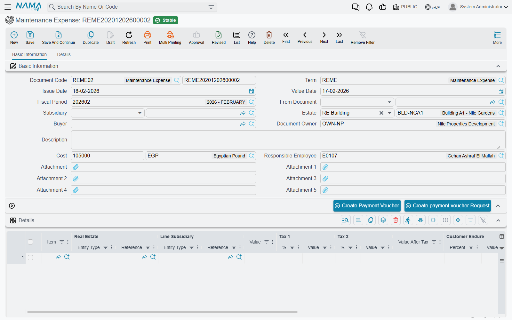
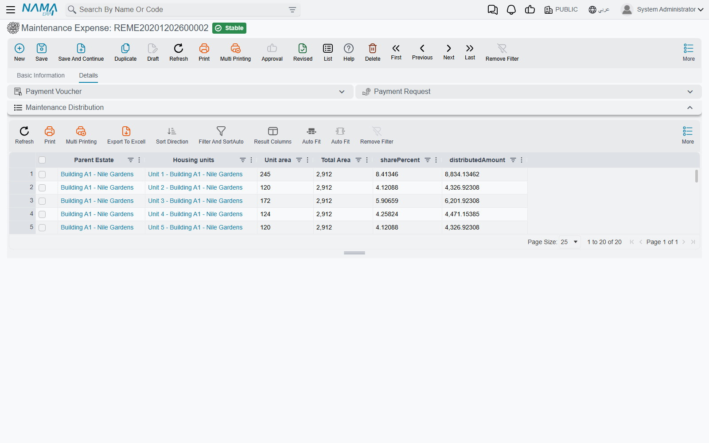

# Maintenance Requests and Expenses

Accruing the annual charge tells you what the community owes. This page is about the other half —
actually spending the money, deciding who bears each line of it, and pushing the cost out over the
units it belongs to.

Two documents do the work. The **Maintenance Expense Request** (طلب مصروف صيانة) is the "we need to
spend this" record. The **Maintenance Expense** (مصروف صيانة) is the "we did spend this" record. The
first has no financial effect at all; the second books everything.

Carry one job through the page: **the lift controller in Building C has failed. The replacement
quote from the lift company is 4,200. The building's 40 flats all use the lift, and the company is
bearing the whole cost this time rather than recharging it.**

## The request — authorising the spend

The site manager who finds the broken lift raises a request, not an expense. It is a plain
document: pick the estate, itemise the work, attach the quotes and the photographs of the failure,
and name the responsible employee who will chase it.

You raise it from **Real Estate and Property > Documents > RE Maintenance Expense Request** with
the `realestate` licence.

What it deliberately does **not** have is just as important:

- **no document term and no accounting effect** — nothing is posted, no ledger line exists, nothing
  is committed to a supplier;
- **no payment voucher buttons** — you cannot pay from a request;
- **no distribution** — nothing is spread over units yet.

::: info There is no status field on the request
A request does not move through "submitted → approved → rejected" states of its own. Approval is
Nama's generic approval mechanism, applied to this document as it is to any other document in the
system — you define an approval rule and use the standard approval actions. In many installations
the practical approval is simpler still: somebody with authority creates the expense document from
the request, and that act *is* the approval.
:::

### The lines

Both documents share exactly the same header and exactly the same grid, so learning one teaches you
the other. Each line carries:

| Column | What it is for |
|---|---|
| Item | the expense item from the maintenance catalogue — "lift controller card" |
| Real Estate | which estate this line is against |
| Line Subsidiary | who is on the other side of the entry — the contractor, a supplier, an owner |
| Value | the pre-tax amount |
| Tax 1 / Tax 2 (% and value) | filled from the item's tax plan |
| Value After Tax | the line total |
| Customer Endure (% and value) | the share recharged to the customer |
| Company Endure (% and value) | the share the company absorbs |

::: tip Always pick an Item on every line
The Item is what supplies the line's tax plan and its default subsidiary, and the calculation runs
through it on every save. Leave a line without an item and the document will not recalculate
cleanly. Make "no line without an item" a house rule — see
[Fee, Commission, Broker and Expense Catalogues](/modules/realestate/costs/realestate-fee-commission-and-expense-types)
for how the catalogue is built.
:::

For the lift: one line, item "lift controller card", real estate Building C, line subsidiary the
lift company, value 4,200, company endure 100%, customer endure 0%.

## The expense — booking the spend

Once the quote is accepted, create the Maintenance Expense from the request using the *From
Document* field. That single choice copies **everything** across: the amount and currency, the
buyer, the estate, the owner, the subsidiary, the remarks, and every detail line with its item,
value, taxes, endurance percentages and values. Nothing is retyped.



The expense lives at **Real Estate and Property > Documents > Maintenance Expense**, and unlike the
request it carries a document term.

You can also start an expense from a rent contract or a sales contract instead of from a request.
Doing so brings across the estate and the parties; a rent contract also brings its maintenance
value as the cost, while a sales contract brings the parties and estate but leaves the cost at
zero for you to fill.

### Three behaviours to know before you type

**The header estate overwrites every line.** If the header *Estate* is filled, that estate is
copied onto each line's Real Estate on every recalculation. So you cannot mix estates across the
lines while a header estate is set — either clear the header estate and set each line, or accept
one estate for the whole document.

**The header cost is recalculated.** *Cost* is always re-derived as the sum of the line values as
soon as there is at least one line. A cost typed by hand only survives on a document with no lines
at all.

**Every line must add up to 100%.** Company Endure Percent plus Customer Endure Percent must equal
exactly 100 on **every** line, or the commit is blocked with an error on the company-endurance
column. Type one and the other follows; the two value columns are then derived from the line value.
Our lift line is 100 / 0.

### Recharging the customer's share

The endurance split is the heart of the document. A line where the company bears 100% is a cost the
company swallows. A line where the customer bears 60% is a cost the company pays out and then
recharges — and the term has a **separate account pair for each share**, so the company-borne
portion and the customer-borne portion land in different accounts from the same line.

That matters because the expense is also treated as a **tax invoice toward the buyer**. When the
document is pushed to the tax authority or offered for online payment, the amount billed is
**only the customer's share** — the company's share never appears on the invoice. Set the split
before you send anything.

## What gets posted

When the expense is saved, its accounting effect is created as a business request processed in the
background. Working from each **detail line**, five independent debit/credit pairs are available:

| The value posted | Comes from |
|---|---|
| the line value | the main debit and credit pair on the term |
| tax 1 value | the tax 1 pair |
| tax 2 value | the tax 2 pair |
| the company-borne value | the company-share pair |
| the customer-borne value | the customer-share pair |

Each pair fires only when **both** of its sides are configured; a half-configured pair is skipped
without a message. That is the universal rule for Real Estate terms, explained in
[How Real Estate Document Terms Work](/modules/realestate/document-terms/realestate-terms-basics),
and this document's own term page — the one where you set the accounts for the cost, the taxes and
the two endurance shares — is covered in
[Collection, Maintenance, Investment and Cost Document Terms](/modules/realestate/document-terms/realestate-terms-other).

One refinement worth knowing: the **tax accounts are taken from the expense item first**, and only
fall back to the term. An item that carries its own tax accounts overrides the term for the lines
that use it, which is how you route the VAT on, say, contracted services differently from the VAT
on parts.

Each ledger line is stamped with the line's estate as its source and the line's subsidiary as its
subsidiary, in the document's own currency, with the line remarks as the narration (falling back to
the header remarks). Failed processing is retried from the Business Requests list view via **More
menu → Reprocess / Recommit**.

### Paying the contractor

Two buttons on the document's action block turn the expense into money out: **Create Payment
Voucher** and **Create Payment Voucher Request**. Both build the voucher from the document's amount
and currency, with the **buyer** as the subsidiary, and open it as a new record for you to complete
and commit. The generated vouchers are listed back on the document's Details tab, so you can always
see what has been paid against this expense.

## Distributing the cost over the units

Booking 4,200 against Building C is accurate but not very useful. Somebody eventually needs to know
what flat B-302's share of that lift repair was — for a service-charge statement, for a dispute,
or for next year's difference accrual.

That is what the maintenance distribution does, automatically, when the document is processed.



The rule is:

- if the **header estate** is set and the cost is not empty, the whole cost is distributed under
  that estate;
- otherwise, each **line's** estate distributes that line's own value.

"Distribute under an estate" means: collect every rental unit beneath it in the estate tree — or
the estate itself if it already is a unit — and split the amount **by area**:

```
share %          = unit area × 100 ÷ total area
distributed amount = amount × unit area ÷ total area
```

Building C's 40 flats total 4,000 m². A 120 m² flat is 3% of that, so its share of the 4,200 repair
is 126. The rows are written with the parent estate, the unit, its area, the total area, the share
percentage and the distributed amount, and they appear on the document's **Details** tab.

Two details that make the arithmetic honest:

- **Rounding residue goes on the last row**, so the rows always sum exactly to the amount rather
  than leaving a stray fraction.
- **If the total area is zero** — because nobody filled the unit areas — the split falls back to an
  **equal split**, one equal share per unit. That is a reasonable fallback, but it is not what you
  asked for, so fill the unit areas.

::: info The distribution uses the gross amount
The split ignores the company/customer endurance percentages entirely — it distributes the whole
line or header value. The endurance split decides *who pays*; the distribution decides *which unit
the cost belongs to*. They answer different questions and are not combined.
:::

## The lift, end to end

1. The site manager raises a request against Building C: one line, lift controller card, 4,200,
   quotes attached, company endure 100%. Nothing is posted.
2. The request is approved and the property manager creates the Maintenance Expense from it — every
   line copies across.
3. Committing books 4,200 to the maintenance-cost account against the lift company, and the
   company-share pair carries the whole 4,200 as a company-borne cost. Nothing is invoiced to the
   buyers, because the customer share is zero.
4. Forty distribution rows are written under Building C; the 120 m² flat shows 126, and the shares
   sum exactly to 4,200.
5. **Create Payment Voucher** raises the payment to the lift company.
6. At year end, this 4,200 is one of the numbers that goes into comparing spending against the
   [annual accrual](/modules/realestate/maintenance/realestate-maintenance-accrual).
