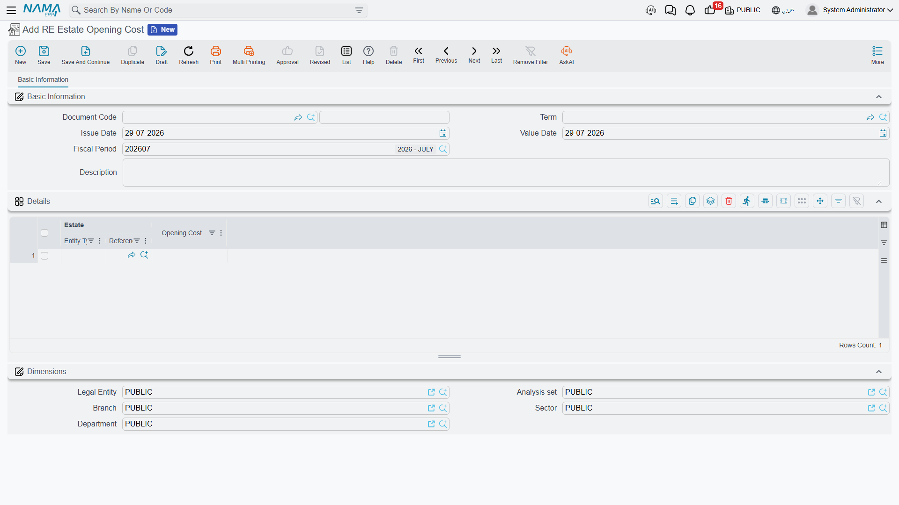

# Going Live: Opening Balances in Real Estate

The day a developer switches to Nama, nothing about his portfolio is new. The compound was built
three years ago, 120 of its 300 units are already sold and half-paid, 40 shops are on running
leases, and every unit carries a cost that was accumulated in the old system across hundreds of
supplier invoices nobody wants to re-enter.

Opening balances are how that history walks in through the front door: a small number of documents
that state where things stand on go-live day, without pretending the past happened inside Nama.

## Build the tree first, then load the balances

The order matters, because every opening document points at something that must already exist.

1. **The estate tree.** Projects, squares, blocks, land plots, buildings, floors and units — with
   their areas and prices, because those are the numbers the module calculates on ever after. The
   generate buttons on each level make this far less painful than it sounds; see
   [How Properties Are Modelled](/modules/realestate/properties/realestate-estate-model).
2. **The owners and buyers.** One party master file covers landlords, buyers and tenants, and the
   opening documents will not let you name a buyer who does not exist yet.
3. **The books and document terms** for the opening documents themselves, so that the accounts the
   opening entries hit are decided before the first commit rather than after the hundredth.
4. **The module settings**, in particular the cut-off date described below — see
   [Real Estate Module Configuration](/modules/realestate/realestate-configuration).
5. **Then** the three opening documents.

## The three opening documents

| Document | What it carries in |
|---|---|
| **Opening sales doc / عقد بيع افتتاحي** | a unit that was already sold: the buyer, the price, the installment schedule, and which installments were already settled — see [Opening Sales Contracts](/modules/realestate/opening/realestate-opening-sales) |
| **Opening rent contract / عقد ايجار افتتاحي** | a lease that was already running: the tenant, the term, the schedule, and the periods already collected — see [Opening Rent Contracts](/modules/realestate/opening/realestate-opening-rent-contracts) |
| **RE Estate Opening Cost / سند افتتاحي تكلفة عقار** | the historical cost sitting on each estate |

They are independent of one another. A unit that was sold and whose cost you also want to load takes
one of each; a unit that was neither sold nor leased takes only the cost document.

## Two rules that govern the whole exercise

### They belong in the opening fiscal period

Both contract-shaped opening documents normally refuse to commit outside an **opening fiscal
period**, and the message says so plainly: *Fiscal period must be openning*. This is deliberate —
opening entries are supposed to land in the period that carries the rest of the migration, not in
the first live month, where they would distort it.

So create the opening fiscal period before you start, and select it on the documents. There is one
escape hatch, on the opening sales contract only: its term carries **Allow Non Opening Fiscal Period
In Opening Sales / السماح بفترات محاسبيه غير افتتاحيه في عقد البيع الإفتتاحي**, which lifts the
restriction for the books using that term. Use it for the late arrivals — the contract nobody
mentioned until three months after go-live — rather than as the normal setting.

### Turning off the status timeline for migrated history

The module keeps a chronological chain of status entries for every estate: reserved, then rented,
then cancelled, then rented again. It polices that chain, and it will refuse a document whose place
in the sequence does not make sense — a cancellation with nothing before it, a lease on a unit the
records say is already leased.

That is exactly what you want for documents entered in Nama, and exactly what you do not want for a
decade of imported history, where the earlier links in the chain were never entered at all. The
module settings therefore carry a cut-off date, shown on screen with the English caption **Do Not
Validate Estate Before**. Set it to your go-live date and the validator stops checking any pair of
entries whose earlier half is dated before it, so migrated contracts commit without being asked to
justify a past that was never loaded.

::: warning Treat the cut-off date as a one-time decision
The field is marked as a critical setting: changing or clearing it after it has been used raises a
dangerous-change warning, because moving it retroactively changes which documents the validator is
willing to police. Set it once, at go-live, to the go-live date.
:::

## Loading historical cost

**RE Estate Opening Cost / سند افتتاحي تكلفة عقار** lives at **Real Estate and Property > Cost**,
next to the ordinary cost document, and it is the plainest document in the module. One page, a
header with the book and code, the **Document Term / توجيه المستند**, the issue and value dates,
the fiscal period and remarks, and a details grid with exactly two columns:

- **Estate / العقار** — a housing unit, land plot, block, building, floor or unit group
- **Opening Cost / التكلفة الافتتاحية** — the figure

No project, no supplier, no quantities, no taxes. You state a number per estate and that is all.

What makes it useful is where the number lands. The opening cost writes into **the same per-estate
cost rows** as the ordinary cost document, so an estate's **Assigned Cost / التكلفة المخصصة** ends
up being its legacy cost plus everything distributed onto it afterwards, in one figure and one
place. Read
[Distributing Project Costs Over Properties](/modules/realestate/costs/realestate-cost-distribution)
for what happens to that figure from then on.

Three things behave differently from the ordinary cost document:

- **There is no distribution.** The amount you type lands on the estate you named, verbatim. To load
  an opening cost for a whole building you either enter the building itself as one figure, or you
  enumerate its units and give each its own line. Nothing explodes downwards.
- **One opening document per estate.** If an estate already appears on another opening cost document
  the commit is refused, and the message names the conflicting document so you can open it. Ordinary
  cost documents have no such restriction — an estate can be hit by as many of those as you like.
- **The accounting effect is one debit and one credit line per detail line**, at the opening cost
  value, with the estate itself carried as the line's subsidiary so the accounts can be resolved
  from the estate record. The two sides come from the document term's single page, **Opening Cost
  Debit / مدين التكلفة الافتتاحية** and **Opening Cost Credit / دائن التكلفة الافتتاحية** — usually
  a real-estate work-in-progress or inventory asset account against an opening-balances clearing
  account. Leave either side empty and no journal entry is produced at all; the cost rows are still
  written and Assigned Cost still updates.

Un-committing the document removes its rows and lowers Assigned Cost again, which makes a
mis-keyed migration batch straightforward to undo.

## The migration, end to end

Take our compound: 300 units, 120 already sold, 40 shops on running leases, and a cost history per
unit.

1. Create the project and generate the buildings, floors and units, with areas and prices on each.
2. Create the owners: the seller, and the 120 buyers and 40 tenants.
3. Open the opening fiscal period, and set the cut-off date in the module settings to go-live day.
4. **Cost.** Enter the opening cost documents — one line per unit, 300 lines, split across as many
   documents as is comfortable, as long as no unit appears on two of them. Commit, and check the
   Assigned Cost column on the unit list screen: 300 units, 300 figures.
5. **Sales.** Enter the 120 opening sales contracts. Each carries the full historic installment
   schedule, with the already-settled installments ticked as fully paid so only the genuinely open
   ones remain collectable.
6. **Leases.** Enter the 40 opening rent contracts, generate their schedules, and tick the periods
   already collected.
7. Reconcile: the units marked sold should be 120, the units marked rented 40, and the total of the
   outstanding installments across both families should match the receivable you migrated into the
   ledger.

From the next day onwards nothing is "opening" any more. Collections run against the migrated
contracts exactly as they would against a contract signed yesterday, new cost documents distribute
onto the same estates, and the first renewal of an opening lease produces an ordinary rent contract.
