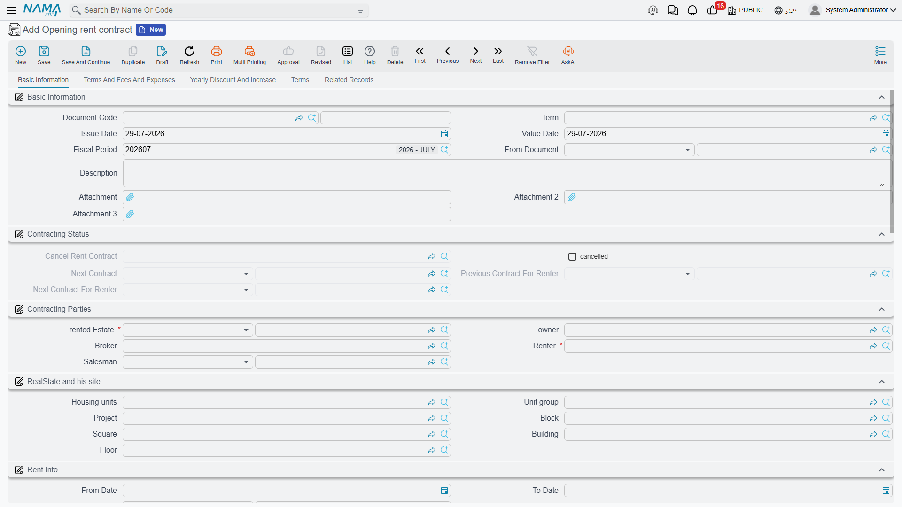

# Opening Rent Contracts

A shop in Al-Nakheel Tower has been leased since early 2024: three years at 120,000 a year, paid
quarterly, and the whole first year has already been collected. On go-live day that lease still has
eight quarters to run, and the property manager needs to see them, accrue them and collect them —
without Nama accruing revenue for four quarters that were earned and banked before it existed.

**Opening rent contract / عقد ايجار افتتاحي**, under **Real Estate and Property > Rents**, is the
document for exactly that.

## Identical to the rent contract, on purpose

There is very little to learn here, because the opening contract *is* the rent contract. Same five
pages — Basic Information, Terms And Fees And Expenses, Yearly Discount And Increase, Terms, Related
Records. Same contract values block, same expenses grid, same yearly increase and discount, same
standard clauses. **Create Rents / إنشاء الايجارات** builds the schedule with the same engine and
the same rules, the accrual ledgers are generated the same way, and the **Extend Contract** and
**Cancel Rent Contract** buttons are both there.

So read the ordinary pages for the substance:

- [The Rent Contract](/modules/realestate/rent/realestate-rent-contract) for the screen, the values
  block and what commit does.
- [Generating the Rent Schedule](/modules/realestate/rent/realestate-rent-schedule) for how
  *Create Rents* turns a lease into dated installments.
- [Rent Installment Accrual Ledgers](/modules/realestate/rent/realestate-rent-accrual-ledger) for
  the documents the contract generates to recognise revenue period by period.
- [Renewing and Ending a Lease](/modules/realestate/rent/realestate-rent-renewal-and-termination)
  for extension and termination.

Three things are different, and all three exist because the lease started before Nama did.

## 1. It commits only in the opening fiscal period

The opening rent contract requires an **opening fiscal period** and says so when it does not have
one: *Fiscal period must be openning*. Unlike the opening sales contract, there is no term option
here that lifts the restriction — so create the opening period before you start entering leases, and
plan to have all of them in before you close it. The wider go-live order is in
[Going Live: Opening Balances in Real Estate](/modules/realestate/opening/realestate-opening-balances).

## 2. A prepaid figure for rent collected before go-live

The header carries a **Prepaid / المدفوع مسبقا** amount: the rent the tenant had already handed over
before the migration, sitting on the books as an obligation to give him occupancy rather than as
revenue still to come. The document's term has a page of its own for the accounting effect of that
figure — *Pre paid effects / تأثيرات المدفوع مسبقا* — so the opening entry can put the prepaid money
where your chart of accounts expects it. The rest of the term is the ordinary rent-contract term,
described in [Rent Document Terms](/modules/realestate/document-terms/realestate-terms-rent).

## 3. Fully Paid, and what it does to the accruals

The installments grid carries the same **Fully Paid / مدفوع بالكامل** checkbox as the opening sales
contract, and it behaves the same way: tick it on an installment and the system closes the line on
save — paid value cleared, remaining recomputed, then paid set equal to remaining — so nothing on
that line is outstanding.

On a lease it does something extra and important. **Fully paid installments are left out of the
generated accrual ledgers.** A period that was earned *and* collected before go-live should not
produce a revenue accrual inside Nama; if it did, the first year of our shop lease would be
recognised twice — once in the old system and once here.

So the migration of that lease looks like this:

1. Enter the contract: three years from January 2024, 120,000 a year, quarterly.
2. Press *Create Rents*. Twelve quarterly installments of 30,000 appear, running to the end of 2026.
3. Tick **Fully Paid** on the four 2024 quarters.
4. Commit. The unit is marked rented, the schedule is live, eight quarters totalling 240,000 remain
   collectable, and the accrual ledgers are generated only for those eight.

Two columns on the grid help you check the result afterwards: **Ledger Installment Value Date /
التاريخ الفعلي لقيد الاستحقاق**, which lets one installment accrue on a date other than its due
date, and a column showing the accrual document that was generated for the line — empty on every
line you ticked.

::: tip Collection still happens on the contract
As with any lease, money is collected against the contract's installments, not against the accrual
ledger documents. See
[How Installment Collection Works](/modules/realestate/collections/realestate-collection-basics).
:::

## The renewal is where it turns into an ordinary lease

This is the part that makes the whole design click. Press **Extend Contract** on an opening rent
contract and what comes out is a **normal rent contract** — the duplicate is converted on the way
out — with every date shifted forward by one contract period and the paid values cleared.

That gives migration a clean shape: **one opening contract per lease covering the historic term, and
ordinary rent contracts from the first renewal onwards.** Our shop keeps its opening contract for
2024–2026, and when it is renewed in 2027 it becomes an ordinary lease like any other, with no trace
of the migration left in the chain except the link back to the contract it replaced.

Extension also forces the previous contract to be cancelled automatically, which means the term must
name a book and term for the cancellation document or the save will fail — the mechanics are in
[Renewing and Ending a Lease](/modules/realestate/rent/realestate-rent-renewal-and-termination).
