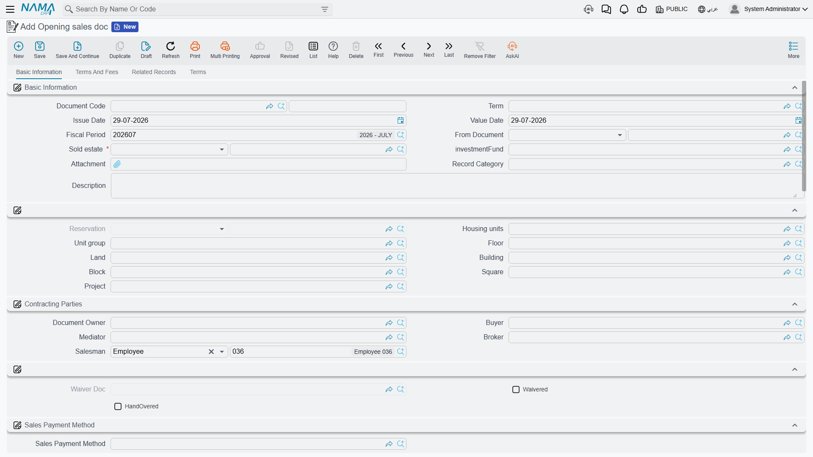

# Opening Sales Contracts

A villa was sold in 2023. The buyer paid 20% down and has been paying 96,000 a year since; four
installments are behind him and six are still to come. None of that happened in Nama, and yet from
next Sunday the collections clerk has to be able to open that contract, see the six outstanding
installments and take money against them.

**Opening sales doc / عقد بيع افتتاحي**, under **Real Estate and Property > Sales**, is the document
that makes that possible. It states an already-completed sale as of go-live: who bought the unit, at
what price, what has been paid and what is still owed.

## It is the sales contract, with a different job

The screen is the sales contract's screen. Page 0 carries the header, the read-only estate
breadcrumb, the **Contracting Parties / اطراف التعاقد** (owner, buyer, mediator, broker,
salesman), the **Sales Payment Method / نموذج الدفع**, the whole **Payment Details / تفاصيل الدفع**
price block, the installment-construction block and the multiple-construction grid, the action block
and the **Installments / الدفعات** grid. Page 1 is *Terms And Fees / الشروط و المصاريف* with the
**Other Fees Lines / رسوم أخري** grid, page 2 lists the related collect documents, installment
payments, fines and annexes, and page 3 holds the standard contract clauses.

Everything you know about that screen applies here unchanged, and rather than repeat it this page
sends you to the two that own it:

- [The Sales Contract](/modules/realestate/sales/realestate-sales-contract) for the header, the
  parties and what commit does.
- [Building the Installment Plan](/modules/realestate/sales/realestate-installment-plans) for the
  price block, the construction rules and **Create Installments**, which overwrites the whole grid
  exactly as it does on a live contract.

What follows is only what is different.

## The Fully Paid column

The single most useful thing on this document is one checkbox per installment line: **Fully Paid /
مدفوع بالكامل**.

You type the *entire* historic schedule — all ten installments of our villa, with their real dates
and amounts — and then tick Fully Paid on the four that the buyer already settled. On save the
system closes those lines for you: it clears the paid value, recomputes the remaining, and then sets
the paid value equal to the remaining, so each ticked line ends up showing nothing outstanding.

The result is a contract that looks exactly like the truth. The full 1,200,000 history is visible,
the four settled installments are visibly settled, and only the six open ones — 576,000 — are
collectable. Nobody has to reconstruct the past out of receipt vouchers, and nobody can accidentally
collect an installment that was paid two years ago.

::: tip Enter the schedule before you tick
*Create Installments* rebuilds the grid from scratch, and rebuilding it clears the ticks along with
everything else. Generate or type the schedule first, then go through it marking what was paid.
:::

## The opening fiscal period

Like the other opening documents, this one refuses to commit outside an **opening fiscal period** —
the message reads *Fiscal period must be openning*. Create the opening period first and select it on
the document.

The one exception in the whole opening family lives here: the term option **Allow Non Opening Fiscal
Period In Opening Sales / السماح بفترات محاسبيه غير افتتاحيه في عقد البيع الإفتتاحي**. Books using a
term with that option ticked will accept an ordinary period, which is how you handle the contract
that surfaces months after the migration was closed. See
[Going Live: Opening Balances in Real Estate](/modules/realestate/opening/realestate-opening-balances)
for the rest of the go-live sequence.

## No commissions

An ordinary sales contract carries a commissions grid, and commissions are booked when it commits.
The opening contract has **no commissions grid at all**. That is the right behaviour for migration —
the broker on a 2023 sale was paid in 2023, through the old system — but it does mean that if a
commission is genuinely still outstanding on a historic sale, it does not come across on this
document and has to be carried in as an ordinary payable.

The fees grid, on the other hand, is present: **Other Fees Lines / رسوم أخري** works exactly as it
does on a live contract, with each fee booking to its own fee type's accounts.

## Licensing, and what commit does

The opening sales contract is gated on the **`realestate-sales`** licence, not on the base
`realestate` licence that the opening cost document uses. A customer licensed for leasing only
cannot use it.

On commit the document does what the sale it represents would have done: the estate is marked
**sold** and stamped with the buyer, the installment schedule becomes live, and an opening journal
entry is created from the accounts configured on the term — the price, the installment schedule, the
owner and buyer fees, the maintenance deposit, discounts and penalties. The accounting pages of the
term are described in
[Sales Document Terms](/modules/realestate/document-terms/realestate-terms-sales).

One validation is worth knowing before you enter a hundred of these: unless the term switches it
off, the schedule total must equal the contract's remaining value, within the rounding tolerance set
in [the module settings](/modules/realestate/realestate-configuration). Migrated schedules that were
rounded differently in the old system are the usual reason a batch of opening contracts refuses to
save.

From the moment it is committed there is nothing special about the contract. Collect documents,
receipt vouchers, fines and return payments all work against it exactly as they work against a
contract signed this morning — see
[How Installment Collection Works](/modules/realestate/collections/realestate-collection-basics).
