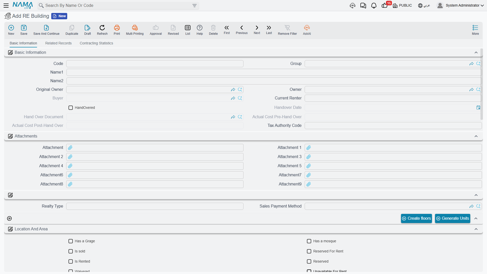
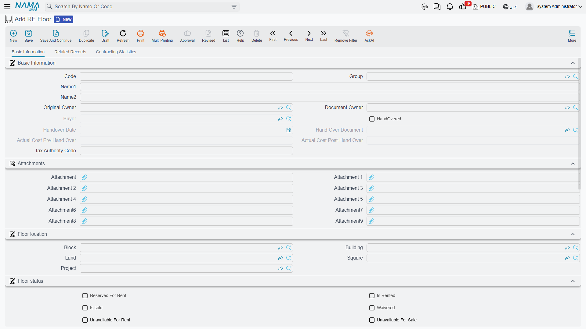
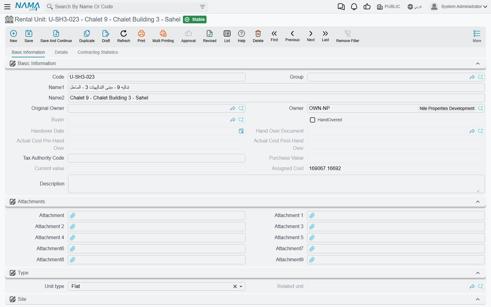
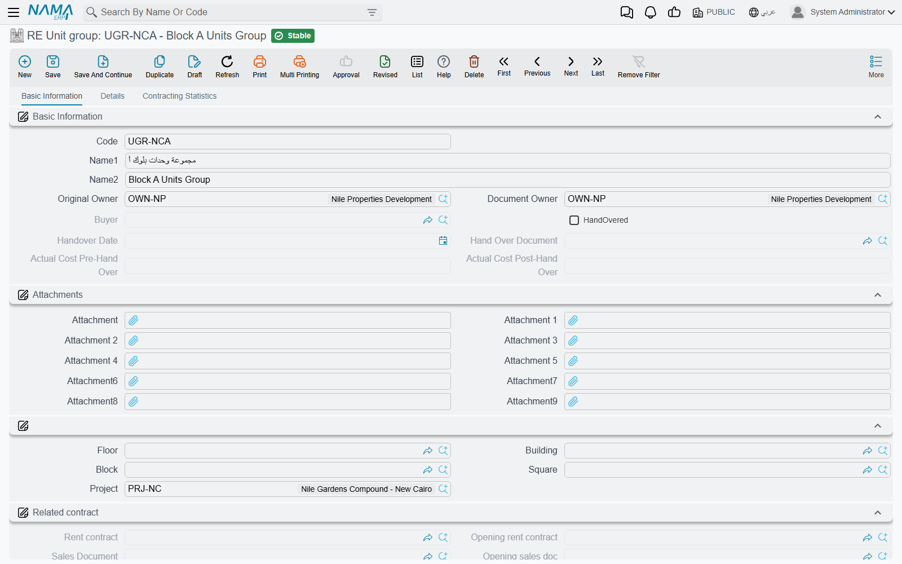
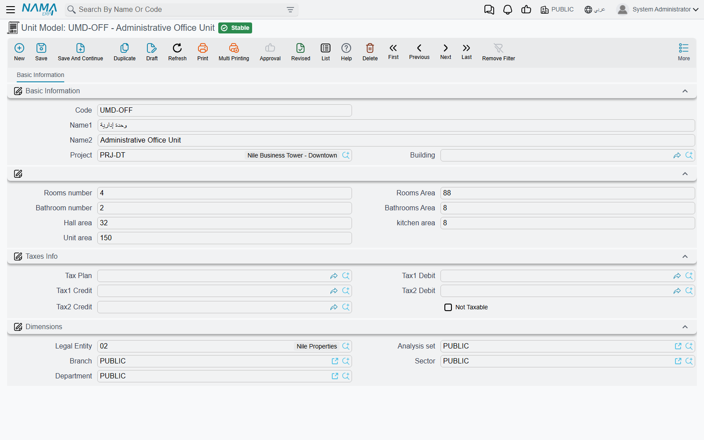

# Buildings, Floors and Rental Units

The other half of the estate tree goes upwards instead of sideways. Where a land developer cuts
ground into plots, a property developer stacks floors into a building and flats onto a floor — and
because those flats are usually *identical*, this half of the module is built around not typing the
same layout two hundred times.

The worked example for this page: **Al-Nakheel Tower**, a building of 20 floors with 10 flats each,
where 200 of those flats are the same layout — **Type A: 3 rooms, 2 bathrooms, 145 m²**. We will
define that layout once and let the system create all 200 units from it.

If you have not yet read [How Properties Are Modelled](/modules/realestate/properties/realestate-estate-model.md),
start there: buildings, floors, units and unit groups are all estates, and the availability markers
and cascade rules described on that page apply to every one of them.

## RE Building — the property and its paperwork

*Real Estate and Property > Master Files > RE Building* (العقارات و الممتلكات > الملفات > مبنى
استثمار عقاري)

A building sits inside a block. It can be rented or sold as a whole to one party, or subdivided into
floors and units and sold flat by flat. What makes the building screen different from every other
estate is that it is the level where the *legal* record of the property lives.

### The licences group

Five legal documents are held on the building, each with its own number, issue and expiry dates and
its own attachment slot:

- municipal licence
- building licence
- civil-defence licence
- construction opening
- construction completion

Next to them sit the **title deed** number (صك الملكيه) and its attachment. Between them these seven
fields are the compliance file of the property: the thing an auditor or a municipality inspector
asks for, kept on the record rather than in a drawer.

### The commercial header

A second group records what the company paid and what the building earns as a whole: **Purchase
Price** (سعر الشراء) and purchase date, **Annual Rent Amount** (قيمة الايجار السنوي) with a rent
start and end date, the number of installments, a free-text **Realty Type** (نوع العقار) for your
own classification, and the **Current Renter** (المستاجر الحالى).

There is also an occupancy marker with two values, *Free* (شاغر) and *Occupied* (مشغول). It is a
field you set by hand for your own reporting; the system's own view of whether the building is let
or sold is the *Is Rented* and *Sold* markers described on the estate-model page, and those two are
what the availability gates read.

### The two generators

| Button | What it does |
|---|---|
| **Create floors** (إنشاء طوابق) | count, prefix, suffix length and first number → creates that many floors under the building, each already carrying the building, block, square and project |
| **Generate Units** (إنشاء وحدات) | the same four questions **plus a unit model**; creates rental units directly under the *building*, with the model's room counts and areas copied onto every one of them |

The second one is the labour-saver, and it has a subtlety: units generated from the *building* are
attached to the building with no floor. That is right for a villa compound or a row of shops, where
there are no floors to speak of. For Al-Nakheel Tower you want floors first — so run **Create
floors** with count 20, then generate the units from each floor.

Selling or leasing a building cascades to its floors and to all of its units, including the units
that have no floor. Reserving one reserves all of its units and registers against the parent block.

## RE Floor — a level of the building

*Real Estate and Property > Master Files > RE Floor* (… > الملفات > طابق استثمار عقاري)

A floor is a thin record: it exists so that a whole floor can be let to one tenant, and so that
units can be generated in the right place. Almost every field on it comes from the estate model —
the *Floor location* group holds the pointers up the tree, the *Floor status* group holds the
availability markers, and the *Related contract* group collects whatever documents have touched it.

The floor carries the same **Generate Units** (إنشاء وحدات) action as the building, with one extra
guard: it refuses to run on a floor that is already rented ("The floor is rented") or sold ("The
floor is sold"). Units generated here get the floor, the building, the block and the project filled
in for them.

For the worked example that is 20 runs of ten units each — or, if the floors were generated with
codes `F-01` … `F-20`, ten units per floor coded `F-03-01`, `F-03-02` and so on, using the prefix
question to keep the flat codes self-describing.

## Rental Unit — the thing customers buy

*Real Estate and Property > Master Files > Rental Unit* (… > الملفات > وحدة استثمار عقاري)

This is the leaf of the tree and the most-referenced record in the whole module: a flat, an office,
a shop, a hall, a garage. Almost every document in Real Estate ends up pointing at one.

### Two kinds of "type", and only one of them does anything

The unit carries both a **Unit type** (نوع الوحدة) and a **Type** (النوع), and the difference
catches everyone once.

- **Unit type** is the one that drives behaviour. Its values are *Unit* (وحدة), *Garage* (جراج),
  *Shop* (محل تجاري), *Hall* (صالة), *Exhibition* (معرض), *Extension* (ملحق), *Room* (غرفة),
  *Flat* (شقة), *Office* (مكتب), *Kitchen* (مطبخ) and five spare "other" slots. A new unit is
  created as *Unit*.
- **Type** offers a nearly identical list and is purely descriptive — a second classification for
  your own reporting.

### Garages and the unit they belong to

Setting *Unit type* to **Garage** enables the **Related Unit** field, and that field is how a garage
is tied to the flat it serves. Its picker deliberately narrows what you can choose: only units that
are ordinary units (or have no unit type at all) **and** that have the *Has Garage* switch turned
on. In other words, you mark the flat as having a garage, and only then can a garage record point at
it. Change the unit type away from *Garage* and the related-unit link is cleared for you.

### Meters and the physical detail

Three fields hold the utility meter numbers — water (رقم عداد المياة), electricity (رقم عداد
الكهرباء) and gas (رقم عداد الغاز). They matter more than they look: at handover and at the end of a
lease, the meter reading is what the tenant is settled against.

The *Unit details* group holds the areas and the meter prices, and the unit price is derived from
them as described on the [estate-model page](/modules/realestate/properties/realestate-estate-model.md).

### The unit model — where the areas come from

Rather than type the layout on each flat, you pick a **unit model** and its room count, bathroom
count, hall area, kitchen area and unit area are copied onto the unit. The model picker only offers
models whose project and building match the unit's (or that are left generic), so on a large site you
are not scrolling through other projects' layouts.

### Maintenance markers

Two fields connect the unit to the maintenance side of the module: **subject to maintenance**
(تخضع للصيانة), which decides whether the unit is picked up when the annual maintenance charge is
accrued, and **Maintenance Fund** (صندوق الصيانة العقاري), which names the fund the unit belongs to.
Both are explained in
[Maintenance Deposits and Maintenance Funds](/modules/realestate/maintenance/realestate-maintenance-deposits-and-funds.md).

There is also **allow sold unit for rent** (إتاحة الوحدة المباعة للإيجار) on the status group. It
works together with the equivalent option on the rent contract's
[document term](/modules/realestate/document-terms/realestate-terms-rent.md) to decide whether a
unit that has already been sold may still be leased out — the normal arrangement when an agency
manages units on behalf of the people who bought them.

### The four buttons

The action block at the bottom of the first page is how a unit goes to market without opening any
other screen. Each one opens the relevant document with the unit, its owner and its location already
filled in:

| Button | Opens | Refuses when |
|---|---|---|
| *(rent)* | a new rent contract, with the previous contract on the unit already linked as its predecessor | — |
| **Sell** (بيع) | a new sales contract | the unit is already sold ("it is sold before !!") |
| **Reserve** (حجز) | a new reservation document, in a pop-up | the unit is sold or already reserved |
| **Initial Sale** (بيع مبدئي) | a new initial sales contract | the unit is already sold |

The unit's second page collects everything that ever happened to it: its rent contracts, sales
contracts, reservations, its garages, the price lists that mention it, its rent offers, the unit
groups it belongs to, and its rent and sales transactions.

## RE Unit group — selling several units as one

*Real Estate and Property > Master Files > RE Unit group* (… > الملفات > وحدة مجمعة)

Sometimes the thing being sold is not one unit. A tenant takes two adjacent flats and the garage
between them on a single lease; a company buys a whole side of a floor. A unit group is a package of
rental units treated as **one estate** — it has its own owner, its own location, its own tax
settings and its own accounting subsidiary, and it is what the contract points at.

The *Units details* grid is the whole point of the record: one row per member unit. Picking a unit on
a row fills that row's floor, building, block, square and project from the unit itself, and the
pickers cascade from project down to unit so you narrow the list as you go.

::: warning The unit list freezes once a contract exists
As soon as the group has been used on a rent contract, an opening rent contract, a sales contract, an
opening sales contract or a waiver, the units grid can no longer be changed — any edit to the list is
rejected on save. This is deliberate: the contract was signed against a specific set of units, and
allowing the set to change afterwards would silently rewrite what was sold. If the package genuinely
changes, that is a new group and a new contract.
:::

Selling or leasing the group cascades to its member units in the usual way.

## Unit Model — the layout you define once

*Real Estate and Property > Master Files > Unit Model* (… > الملفات > نموذج وحدة)

A unit model is a reusable template of a layout: rooms, bathrooms, hall, kitchen and the areas of
each. It is not an estate — it owns no owner, no status and no price. It exists to be copied.

Type the rooms area, hall area, kitchen area and bathrooms area and the **unit area** is added up for
you. Optionally scope the model to a project and a building so that it only offers itself where it
belongs.

::: info The worked example
Create one model, **Type A**: 3 rooms, 2 bathrooms, rooms area 78, hall area 32, kitchen area 14,
bathrooms area 21 — unit area comes out at 145 m².

Now open floor `F-03` of Al-Nakheel Tower and press **Generate Units** with count 10, prefix
`F-03-`, suffix length 2, first number 1 and unit model **Type A**. Ten units appear, coded
`F-03-01` … `F-03-10`, each already 145 m² with 3 rooms and 2 bathrooms, each pointing at floor 3,
Al-Nakheel Tower, its block and its project. Repeat on the other 19 floors and the 200 flats exist
with the layout typed exactly once.

Later, when maintenance is accrued across the tower, each of those flats is charged on its 145 m² —
which is why getting the model right matters more than it looks.
:::

Models are also used to key the tax fallback rules in the module's own configuration, so a "Type A"
and a "Type B" can carry different tax treatment without touching each unit.

## Where to Go Next

- [Projects, Squares, Blocks and Land Plots](/modules/realestate/properties/realestate-projects-blocks-lands.md)
  — the levels above the building.
- [Owners, Buyers and Standard Contract Clauses](/modules/realestate/properties/realestate-owners-and-contract-clauses.md)
  — the parties every unit points at.
- [The Property Sales Cycle](/modules/realestate/sales/realestate-sales-cycle.md) and
  [The Leasing Cycle](/modules/realestate/rent/realestate-rent-cycle.md) — taking a unit to market.
