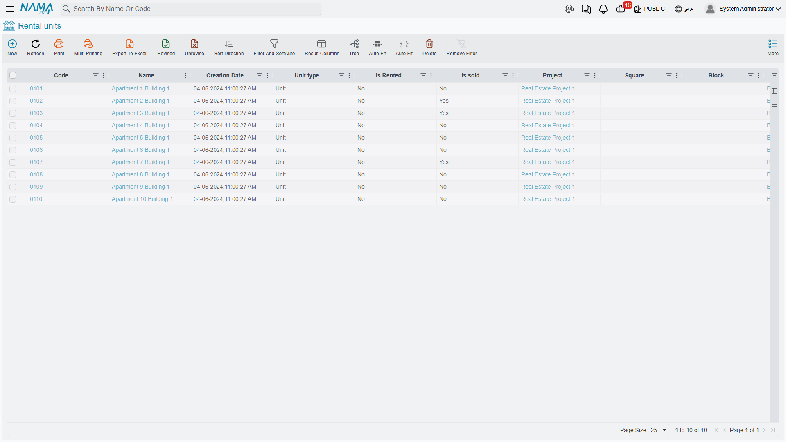

# How Properties Are Modelled

Everything the Real Estate module does — selling, leasing, collecting, maintaining, revaluing —
starts from one question: *what exactly is being sold?* Nama answers that question with a single
idea repeated at eight levels of detail, and almost every surprise users hit later comes from not
having understood that idea first. This page is that foundation. It is worth ten minutes before
you touch any document screen.

Every master file and document described here is unlocked by the `realestate` licence.

## One Word for Eight Things

In this module the word **estate** (عقار) does not mean "an apartment". It means *any* of the
levels the portfolio is built from:

| Level | Screen name | What it usually is |
|---|---|---|
| Project | *RE Project* | a compound, a tower complex, a land development |
| Square | *Square* | a sector of a project that groups blocks |
| Block | *Block* | a self-nesting subdivision — either child blocks or land plots |
| Land | *RE Land* | one land plot for sale |
| Building | *RE Building* | one physical building with its licences and title deed |
| Floor | *RE Floor* | one floor, rentable or sellable as a whole |
| Rental unit | *Rental Unit* | the leaf — a flat, office, shop, garage, hall |
| Unit group | *RE Unit group* | several units bundled and sold or leased as one thing |

All eight share the same underlying shape. A project has an owner, a buyer, a price, a set of
availability markers, tax settings, attachments and its own accounting subsidiary — exactly like
a flat does. That is why a project can be sold on a contract just as a flat can, and why the same
fields appear again and again as you move up and down the tree.

The practical consequence: **a project is an estate exactly as much as a flat is.** When a screen
or a document says "estate", read it as "whichever of the eight levels you picked". The documents
that sell, revalue, capitalise or cost an estate accept the six levels from **block downwards** —
block, land, building, floor, rental unit and unit group. Projects and squares exist to organise
and to roll figures up.

## A Unit's Address Is a Set of Pointers, Not a Parent Link

This is the second idea, and it is the one that catches people out when they build filters or
wonder why a field is filled in twice.

An estate does **not** carry a link to "its parent". It carries a small block of location fields —
project, square, block, building, floor, land, unit — and it fills in *all of the ones that apply
at once*. Flat 12 on floor 3 of building B does not point at floor 3 and stop there. It points at
the project, the block, the building **and** the floor, all in the same record.

You rarely type all of them. When you pick the building on a unit, the system immediately fills the
project and the block from that building; when you pick a block on a land plot, the square and the
project arrive with it. Anything still empty when you save is filled from the parent you did pick.
The address itself (country, city, street, map location) and the analytic dimensions (legal entity,
branch, sector, department, analysis set) are copied down from the parent in the same way, so you
maintain them once at the top and inherit them everywhere below.

::: tip Why this matters day to day
Because the pointers are flat, you can filter or report at any level without walking a tree —
"every unit in Palm Compound" is a single criterion on the project field, no matter how many
blocks, buildings and floors sit in between.
:::

Each estate also records its four boundaries — *Eastern Neighbor* / الحد الشرقي, *Western Neighbor*
/ الحد الغربي, *Northern Neighbor* / الحد الشمالي, *Southern Neighbor* / الحد الجنوبي — with a
length and a width for each on the levels where that detail is needed. That is what goes on the
title deed and on the printed contract.

## There Is No Status Field on an Estate

Read that heading twice, because it is where most availability questions come from.

If you go looking for a drop-down that says "Available / Reserved / Sold / Rented" on an apartment,
you will not find one. Availability is instead recorded as a handful of **independent markers**,
each of which is switched on or off by whichever document did the deed:

| Marker | Set by |
|---|---|
| *Sold* (مباع) | a sales contract, an opening sales contract |
| *Reserved* (محجوز) | a confirmed reservation document |
| *Is Rented* (مؤجرة) | a rent contract |
| *Reserved For Rent* (محجوزة للإيجار) | a rent offer that reserves |
| *Waivered* (تنازل) | a waiver document |
| *partially Sold* (مباع جزئيا) | a descendant being sold |
| *partially Rented* (مؤجر جزئيا) | a descendant being leased |

Alongside them sit two markers you set by hand, *Unavailable For Sale* (غير متاحة للبيع) and
*Unavailable For Rent* (غير متاحة للإيجار), which are how you take a unit off the market without
any document at all — a flat kept for the site engineer, a shop under renovation.

Because they are independent, combinations that would be impossible in a single status field are
perfectly normal here. A unit can be sold **and** rented at the same time (the buyer lets it out
through you). A block can be *partially Sold* while still being available itself. Nothing forces
them into one line.

### The one derived status — and it only exists on lands and blocks

Land plots and blocks are the exception. Because a land-subdivision business needs a single word to
print on a plot map, those two levels carry a real status field, filled by the system:

| Value | Arabic | When |
|---|---|---|
| *Avaliable* | متاح | free to reserve or sell |
| *Reserved* | محجوز | a reservation holds it |
| *Sold* | مباعة | a sales document sold it |
| *Un Avaliable* | غير متاح | at least one child of it is sold, rented or reserved |

(The spelling *Avaliable* is what the screen shows — look for it exactly like that.)

The order matters: sold wins over reserved, and reserved wins over "a child of mine is taken". So a
block that has sold ten of its forty plots shows *Un Avaliable* — the block as a whole can no longer
be sold in one piece, because parts of it are gone. Next to each of them is a user override,
*User Land Status* / *User Block Status*; whatever you put there wins over the value the system
derived. Use it sparingly, and use it deliberately.

## Selling Cascades Down; "Partially Sold" Rolls Up

These two movements run in opposite directions at the same moment, and understanding them explains
practically every "why can't I sell this?" question.

**Downwards — the sale takes everything under it.** Sell a block and the block is not the only
thing marked sold: every land plot in it, every building in it, every floor of those buildings and
every unit on those floors is marked sold too. Reserve a block and the same wave of reservations
runs down. Lease a building and its floors and all of its units become rented. It is the only
behaviour that makes sense — you cannot sell a building to one buyer and its third floor to
another — but it does mean a single click can change hundreds of records.

**Upwards — the ancestors learn that part of them is gone.** The moment one child is sold, every
level above it is marked *partially Sold*: the floor, the building, the block, the square and the
project. The same happens with *partially Rented* on a lease. Blocks additionally keep three
counters of how many of their descendants are sold, rented and reserved, which is exactly what
feeds the derived *Un Avaliable* status described above.

::: info The worked example
Palm Compound → Square A → Block 3, a leaf block holding 40 land plots of 400 m² each.

- **Sell plot LX-04.** The plot's status becomes *Sold*. Block 3's sold-children counter goes to 1,
  so Block 3 now reads *Un Avaliable* — it cannot be sold as one piece any more. Square A and
  Palm Compound are both marked *partially Sold*. The other 39 plots are untouched and still
  *Avaliable*.
- **Now reserve the whole of Block 3 instead.** The block reads *Reserved*, and the reservation
  runs down to all 40 plots at once — every one of them is marked reserved, and none of them can be
  sold or reserved individually until the reservation is released.
:::

Un-committing or cancelling the contract runs exactly the same machinery in reverse, so a mistaken
sale is undone at every level it touched, not just at the top.

## What Blocks a Sale, a Lease or a Reservation

The markers are not decoration; three gates read them before a document is allowed through.

1. **Before a sales contract.** The estate is refused if it — *or any estate underneath it* — is
   already sold, reserved, or flagged unavailable for sale. This is the recursive one, and it is why
   selling a whole building fails once a single flat in it has been reserved.
2. **Before a rent contract.** The estate is refused if it is already rented. If it is *sold*, the
   lease is refused too — unless the contract's [document term](/modules/realestate/document-terms/realestate-terms-rent.md)
   is set to allow leasing a sold estate, which is how an agency manages units on behalf of the
   people who bought them.
3. **Before a reservation.** Lands and blocks refuse to be reserved when they are *Reserved*,
   *Sold* or *Un Avaliable* ("It is reserved before", "It is sold before", "It is unavailable").
   Rental units refuse when they are reserved or sold, naming the unit in the message.

If a commit fails on availability, the answer is almost never on the record you are looking at —
it is on a child of it. Open the estate's Related Records page and work downwards.

## Areas

Two different things are called "area", and they are filled in two different ways.

On the land side — project, square, block, land — you type a **length** and a **width**, and the
**area** is calculated for you the moment you leave either field. Blocks and squares additionally
carry a **Calculated Area** (المساحة المحسوبة), which is not typed at all: it is the sum of the
areas of the land plots underneath, recalculated every time one of those plots is saved. So a
block's own area is "what the block measures on the map" while its calculated area is "what its
plots actually add up to" — and comparing the two is a quick sanity check on a subdivision.

On the building side, area is a property of the unit's layout: rooms area, bathrooms area, kitchen
area, hall area, and the **unit area** that is their sum. These are usually not typed either — they
arrive from the [unit model](/modules/realestate/properties/realestate-buildings-floors-and-units.md)
applied to the unit. The unit area is the number that later drives maintenance accruals and
area-based cost distribution, so it is worth getting right at the model.

## Prices

An estate can arrive at a price three ways, and they do not compete — they apply at different
levels.

- **Typed.** Projects, squares, blocks and land plots carry a plain price with its currency.
- **Calculated from the layout.** A rental unit's *Unit Price* is derived as
  `unit area × unit meter price` plus `garden area × garden meter price`, recalculated as you type
  either meter price. Enter 145 m² at 6,000 per metre and the unit price becomes 870,000 without
  you touching it.
- **Accumulated from children.** A block carries a *Price Is Calculated* (احتساب سعر البلوك
  تلقائياً) switch. Turn it on and every land plot saved under the block adds its own price into
  the block's price — and removes it again if the plot moves to another block or changes value. It
  is how you keep "what is this block worth" true without maintaining it.

Separately from all three, every estate shows a read-only **Current Price From Price Lists**
(السعر من قوائم الأسعار). That figure is not stored — it is looked up live from the active
[price list](/modules/realestate/sales/realestate-price-lists-and-payment-methods.md) for that
estate on today's date, which is what the salesperson should actually be quoting.

## Every Estate Is Also an Account

Each of the eight levels carries its own accounting subsidiary (ذمة) and its own tax settings —
tax plan, the two tax debit/credit pairs, a not-taxable flag and a tax-authority code. This is what
lets a journal entry be recorded *against the flat* rather than against a generic revenue account,
and it is why an estate can appear as a dimension on almost any accounting effect in the module.

One detail worth knowing when a tax comes out unexpectedly: when the system needs a tax plan for a
transaction on an estate, it prefers the **buyer's** tax plan over the estate's own. The estate's
plan is the fallback, not the ruler.

Estates also link out to the Fixed Assets module through a fixed-asset reference and cost, for the
property a company holds rather than sells.

## An Estate Also Has a Carrying Value and an Assigned Cost

Two more system-maintained figures sit on every estate, and they belong to stories told elsewhere:

- **Purchase Value** (قيمة الشراء) and **Current Value** (القيمة الحالية) are the carrying-value
  chain of a fund-owned property. They are written by a chronological chain of documents — a
  purchase contract, then improvements, then revaluations, then the sale — and that chain is
  validated in sequence, so the order the documents are entered in genuinely matters. All of it,
  including how a revaluation splits profit across a fund's investors, is on
  [Estate Values, Additions and Revaluation](/modules/realestate/investment/realestate-estate-values-and-revaluation.md).
- **Assigned Cost** (التكلفة المخصصة) is the developer's side of the same coin: the total project
  cost that has been distributed down onto this particular estate. See
  [Distributing Project Costs Over Properties](/modules/realestate/costs/realestate-cost-distribution.md).

Both are read-only on the estate screen. If either looks wrong, the document that wrote it is what
you fix, never the field.

## Where to Go Next

- [Projects, Squares, Blocks and Land Plots](/modules/realestate/properties/realestate-projects-blocks-lands.md)
  — building the land side of the tree top-down.
- [Buildings, Floors and Rental Units](/modules/realestate/properties/realestate-buildings-floors-and-units.md)
  — the building side, unit models and unit groups.
- [Owners, Buyers and Standard Contract Clauses](/modules/realestate/properties/realestate-owners-and-contract-clauses.md)
  — the party master file every document points at.
- [The Property Sales Cycle](/modules/realestate/sales/realestate-sales-cycle.md) and
  [The Leasing Cycle](/modules/realestate/rent/realestate-rent-cycle.md) — what happens once the
  portfolio exists.
